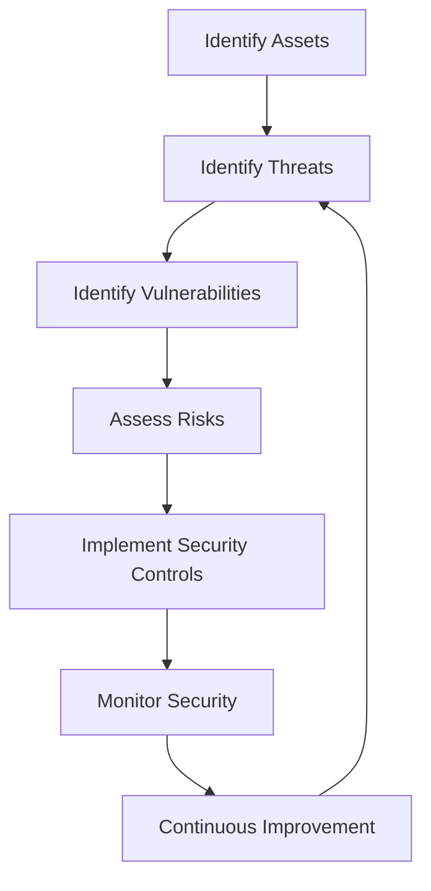
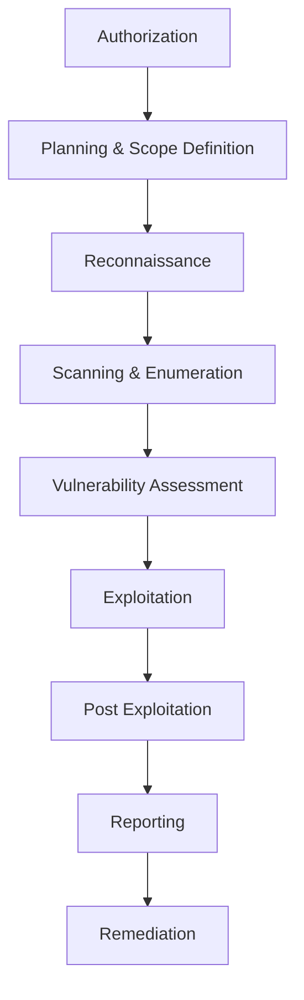
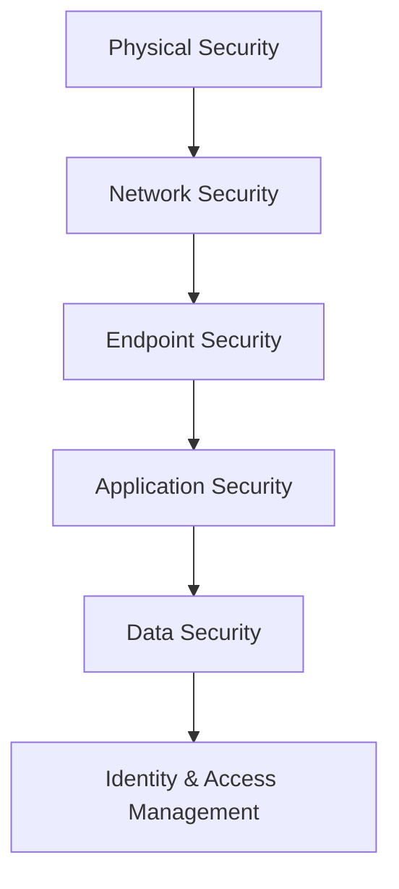

# Module 01: Ethical Hacking Foundations

> **Status:** ✅ Completed
>
> **Difficulty:** ⭐⭐☆☆☆
>
> **Module Type:** Theory Foundation
>
> **Labs Completed:** N/A
>
> **Tools Covered:** None

---

# Module Summary

This module establishes the theoretical foundation of ethical hacking by introducing the core principles of information security, cybersecurity, and ethical hacking methodologies. It explains the importance of protecting digital assets, understanding threats and vulnerabilities, and following legal and ethical guidelines while performing security assessments.

Rather than focusing on practical exploitation, this module develops the mindset required for penetration testing by explaining how attackers operate, how organizations defend against cyber threats, and how ethical hackers identify and mitigate security risks. These concepts form the basis for all subsequent CEH practical modules.

---

# Overview

Ethical hacking is the authorized practice of identifying, assessing, and reporting security vulnerabilities before malicious attackers can exploit them. Modern organizations rely heavily on information systems, making cybersecurity an essential component of business continuity, privacy, and trust.

This module introduces the fundamental concepts of information security, hacker classifications, security controls, ethical hacking methodologies, and globally recognized security standards. Understanding these concepts provides the knowledge required to perform responsible penetration testing throughout the remaining CEH modules.

---

# Learning Objectives

After completing this module, I was able to:

- Understand the importance of information security.
- Explain the principles of Confidentiality, Integrity, and Availability (CIA Triad).
- Differentiate between threats, vulnerabilities, risks, and exploits.
- Understand different categories of hackers and threat actors.
- Explain the purpose and responsibilities of ethical hackers.
- Understand the ethical hacking lifecycle.
- Identify different information security controls.
- Recognize common cybersecurity frameworks and methodologies.
- Understand major information security laws, standards, and compliance requirements.
- Build a strong theoretical foundation for subsequent CEH practical modules.

---

# Information Security Concepts

Information Security (InfoSec) refers to protecting information and information systems against unauthorized access, disclosure, modification, destruction, or disruption. The primary objective is to ensure that information remains secure while being accessible to authorized users.

Information security revolves around protecting digital assets from cyber threats through appropriate policies, technologies, and security controls.

---

## CIA Triad

The CIA Triad is the fundamental model used to design and evaluate secure information systems.

| Principle | Description | Example |
|-----------|-------------|---------|
| **Confidentiality** | Ensures that information is accessible only to authorized users. | Encryption, Access Control, MFA |
| **Integrity** | Ensures that information remains accurate and unaltered. | Hashing, Digital Signatures |
| **Availability** | Ensures that systems and data remain accessible whenever required. | Redundant Servers, Backups, Load Balancing |

---

## Core Information Security Terms

| Term | Description |
|------|-------------|
| **Asset** | Any valuable resource that requires protection. |
| **Threat** | Anything capable of causing harm to an asset. |
| **Vulnerability** | A weakness that can be exploited. |
| **Exploit** | A method or code used to take advantage of a vulnerability. |
| **Risk** | The likelihood and impact of a threat exploiting a vulnerability. |
| **Attack Surface** | The total number of possible entry points into a system. |
| **Countermeasure** | A safeguard implemented to reduce security risks. |

---

## Security Principles

A secure information system should provide:

- Confidentiality
- Integrity
- Availability
- Authentication
- Authorization
- Accountability
- Non-Repudiation
- Privacy

---

### Authentication

Authentication verifies the identity of a user before granting access.

Examples:

- Username & Password
- Multi-Factor Authentication (MFA)
- Biometrics
- Smart Cards

---

### Authorization

Authorization determines what an authenticated user is allowed to access or perform.

Examples:

- Role-Based Access Control (RBAC)
- Access Control Lists (ACLs)
- Permission Policies

---

### Accountability

Accountability ensures that every user action can be traced through audit logs and monitoring systems.

Examples:

- Audit Logs
- SIEM Platforms
- Security Monitoring

---

### Non-Repudiation

Non-repudiation prevents users from denying actions they have previously performed.

Examples:

- Digital Signatures
- Cryptographic Hashes
- Public Key Infrastructure (PKI)

---

## Information Security Lifecycle

---

## Why Information Security Matters

Organizations depend on secure information systems to:

- Protect customer information.
- Maintain business continuity.
- Prevent financial losses.
- Preserve organizational reputation.
- Meet regulatory compliance requirements.
- Defend against evolving cyber threats.

Information security is not solely a technical responsibility; it is a continuous organizational process involving people, processes, and technology.

---

# Hacking Concepts

Hacking is the process of identifying weaknesses in computer systems, networks, applications, or devices to gain access to resources. Depending on the intent and authorization, hacking can be either ethical or malicious.

Ethical hackers perform security assessments with proper authorization to identify and remediate vulnerabilities before they can be exploited by attackers.

---

## Common Hacking Terminology

| Term | Description |
|------|-------------|
| **Hacker** | An individual with technical knowledge who identifies or exploits vulnerabilities in computer systems. |
| **Threat Actor** | Any individual or group capable of causing harm to an organization's assets. |
| **Target** | The system, network, or application selected for assessment or attack. |
| **Attack Vector** | The path or technique used to compromise a target system. |
| **Vulnerability** | A weakness that can be exploited by an attacker. |
| **Exploit** | Code or a technique that leverages a vulnerability to perform unauthorized actions. |
| **Payload** | The component delivered after successful exploitation to achieve the attacker's objective. |
| **Zero-Day Vulnerability** | A vulnerability unknown to the vendor and for which no security patch exists. |
| **Patch** | A software update released to fix security vulnerabilities or software defects. |

---

## Types of Hackers

| Hacker Type | Description | Motivation |
|-------------|-------------|------------|
| **White Hat** | Authorized security professional who legally performs security assessments. | Improve Security |
| **Black Hat** | Malicious attacker who illegally exploits systems for personal gain or disruption. | Financial Gain, Sabotage |
| **Gray Hat** | Operates between ethical and unethical boundaries, often without authorization but without malicious intent. | Curiosity, Recognition |
| **Script Kiddie** | Individual with limited technical knowledge who relies on publicly available tools and exploits. | Experimentation |
| **Hacktivist** | Performs attacks to promote political or social causes. | Ideology |
| **State-Sponsored Hacker** | Works on behalf of governments to conduct cyber espionage or cyber warfare. | National Interest |
| **Cyber Terrorist** | Uses cyber attacks to create fear, disrupt infrastructure, or damage critical services. | Terrorism |

---

## Common Attack Vectors

Attackers use multiple techniques to compromise systems, including:

- Phishing Emails
- Social Engineering
- Weak Passwords
- Unpatched Software
- SQL Injection
- Cross-Site Scripting (XSS)
- Malware
- Wireless Network Attacks
- Misconfigured Services
- Insider Threats

---

## Vulnerability Assessment vs Penetration Testing

| Vulnerability Assessment | Penetration Testing |
|---------------------------|---------------------|
| Identifies vulnerabilities. | Exploits vulnerabilities safely to validate risk. |
| Broad coverage. | Focused assessment. |
| Usually automated. | Combination of manual and automated testing. |
| Reports weaknesses. | Demonstrates real-world impact. |
| Lower risk. | Requires strict authorization and planning. |

---

# Ethical Hacking Concepts

Ethical hacking is the authorized process of assessing the security posture of systems, applications, and networks by simulating real-world cyber attacks. The objective is to discover vulnerabilities before malicious actors can exploit them.

Ethical hackers operate under clearly defined rules of engagement and provide recommendations to improve an organization's overall security posture.

---

## Principles of Ethical Hacking

An ethical hacker should always:

- Obtain written authorization before testing.
- Clearly define the assessment scope.
- Protect sensitive information discovered during testing.
- Avoid causing unnecessary disruption to production systems.
- Maintain confidentiality of client data.
- Document findings accurately.
- Report vulnerabilities responsibly.

---

## Ethical Hacking Process

---

## Rules of Engagement

Before beginning any penetration test, the following should be established:

- Testing Scope
- Target Systems
- Testing Schedule
- Approved Techniques
- Communication Plan
- Emergency Contacts
- Reporting Requirements
- Legal Authorization

---

## Benefits of Ethical Hacking

Ethical hacking helps organizations to:

- Discover vulnerabilities before attackers.
- Reduce cyber security risks.
- Improve regulatory compliance.
- Strengthen security controls.
- Validate incident response capabilities.
- Increase customer trust.
- Reduce financial losses caused by cyber attacks.

---

## Responsibilities of an Ethical Hacker

An ethical hacker is expected to:

- Follow legal and ethical guidelines.
- Protect confidential information.
- Respect client privacy.
- Document findings clearly.
- Recommend practical remediation strategies.
- Continuously update technical knowledge and skills.

---

# Hacking Methodologies and Frameworks

Ethical hacking follows a structured methodology that ensures security assessments are performed systematically, legally, and efficiently. Standardized methodologies help penetration testers identify vulnerabilities, validate risks, and provide actionable recommendations while minimizing operational impact.

---

## Ethical Hacking Phases

Ethical hacking typically follows six major phases.

| Phase | Description |
|--------|-------------|
| **Reconnaissance** | Gather publicly available and target-specific information. |
| **Scanning** | Identify live hosts, open ports, services, and vulnerabilities. |
| **Enumeration** | Extract detailed information about users, shares, services, and resources. |
| **Exploitation (Gaining Access)** | Exploit identified vulnerabilities to gain authorized access. |
| **Maintaining Access** | Demonstrate persistence mechanisms (when permitted). |
| **Covering Tracks** | Understand how attackers remove evidence to avoid detection (studied for defensive awareness). |

---

## Ethical Hacking Lifecycle

---

## Penetration Testing Execution Standard (PTES)

PTES provides a standardized approach for conducting penetration tests.

### PTES Phases

| Phase | Purpose |
|--------|----------|
| Pre-Engagement | Define scope, authorization, and objectives. |
| Intelligence Gathering | Collect target information. |
| Threat Modeling | Identify attack paths. |
| Vulnerability Analysis | Discover weaknesses. |
| Exploitation | Validate vulnerabilities. |
| Post Exploitation | Assess business impact. |
| Reporting | Document findings and remediation. |

---

## NIST Cybersecurity Framework

The NIST Cybersecurity Framework helps organizations improve cybersecurity risk management.

### Core Functions

| Function | Description |
|----------|-------------|
| **Identify** | Understand assets, risks, and business environment. |
| **Protect** | Implement safeguards to reduce risk. |
| **Detect** | Identify security incidents quickly. |
| **Respond** | Take action during security incidents. |
| **Recover** | Restore systems and improve resilience. |

---

## Cyber Kill Chain

The Cyber Kill Chain explains how attackers progress through an attack.

Understanding this model helps defenders stop attacks before they progress further.

---

## MITRE ATT&CK Framework

MITRE ATT&CK is a globally recognized knowledge base documenting real-world attacker techniques.

Rather than describing an attack as a single event, MITRE categorizes attacker behavior into tactics and techniques observed during actual cyber incidents.

Common tactics include:

- Initial Access
- Execution
- Persistence
- Privilege Escalation
- Defense Evasion
- Credential Access
- Discovery
- Lateral Movement
- Collection
- Exfiltration
- Impact

---

# Information Security Controls

Security controls are safeguards implemented to reduce risks and protect organizational assets.

They help prevent, detect, respond to, and recover from cyber attacks.

---

## Types of Security Controls

| Control Type | Description | Examples |
|--------------|-------------|----------|
| **Administrative Controls** | Policies and procedures governing security. | Security Policies, Employee Training, Risk Assessments |
| **Technical Controls** | Technology-based protection mechanisms. | Firewalls, Antivirus, MFA, IDS/IPS |
| **Physical Controls** | Protect physical assets and facilities. | CCTV, Security Guards, Biometric Access, Locks |

---

## Functional Categories of Controls

| Category | Purpose |
|----------|---------|
| Preventive | Prevent attacks before they occur. |
| Detective | Detect malicious activity. |
| Corrective | Restore systems after incidents. |
| Deterrent | Discourage attackers. |
| Recovery | Restore operations after disruption. |
| Compensating | Alternative controls when primary controls cannot be implemented. |

---

## Defense-in-Depth

Defense-in-Depth is a layered security strategy where multiple independent security controls work together to reduce overall risk.

Even if one layer fails, additional security layers continue protecting the organization.

---

# Information Security Laws and Standards

Cybersecurity professionals must understand legal responsibilities and industry standards while performing security assessments.

Ethical hacking should always be conducted with proper authorization and within legal boundaries.

---

## Common Security Standards

| Standard | Purpose |
|-----------|---------|
| **ISO/IEC 27001** | Information Security Management System (ISMS). |
| **ISO/IEC 27002** | Best practices for implementing security controls. |
| **NIST Cybersecurity Framework** | Risk management framework for cybersecurity. |
| **PCI DSS** | Protects payment card information. |
| **GDPR** | Protects personal data and privacy within the European Union. |
| **HIPAA** | Protects healthcare information in the United States. |

---

## Legal Responsibilities of Ethical Hackers

Ethical hackers should always:

- Obtain written authorization.
- Follow the agreed testing scope.
- Maintain confidentiality.
- Protect sensitive information.
- Report findings responsibly.
- Avoid unauthorized exploitation.
- Comply with applicable laws and regulations.

---

## Importance of Compliance

Organizations implement security standards to:

- Protect sensitive information.
- Meet legal obligations.
- Reduce organizational risk.
- Improve customer trust.
- Support business continuity.
- Demonstrate security maturity.

---

# Key Takeaways

- Information security protects the confidentiality, integrity, and availability of organizational assets.
- The CIA Triad forms the foundation of cybersecurity.
- Ethical hacking is a legal and authorized process used to identify and remediate vulnerabilities.
- Cybersecurity relies on people, processes, and technology working together.
- Understanding threats, vulnerabilities, risks, and exploits is essential before performing penetration testing.
- Ethical hackers must always operate within the approved scope and follow legal guidelines.
- Security controls should be implemented using a layered Defense-in-Depth strategy.
- Security frameworks such as PTES, NIST, and MITRE ATT&CK provide structured approaches to penetration testing and cybersecurity.
- Compliance with international standards improves organizational security and regulatory readiness.
- This module provides the theoretical foundation required for all subsequent CEH practical modules.

---

# Quick Revision

| Topic | Remember |
|--------|----------|
| CIA Triad | Confidentiality, Integrity, Availability |
| Authentication | Verifies identity |
| Authorization | Determines permissions |
| Accountability | Tracks user activities |
| Non-Repudiation | Prevents denial of performed actions |
| Threat | Potential cause of harm |
| Vulnerability | Weakness in a system |
| Exploit | Method used to leverage a vulnerability |
| Risk | Probability and impact of exploitation |
| White Hat | Authorized ethical hacker |
| Black Hat | Malicious attacker |
| Gray Hat | Operates without authorization but not always with malicious intent |
| PTES | Penetration Testing Execution Standard |
| NIST CSF | Identify, Protect, Detect, Respond, Recover |
| Defense-in-Depth | Multiple layers of security |
| ISO 27001 | Information Security Management System |
| PCI DSS | Payment Card Industry Data Security Standard |
| GDPR | European data protection regulation |
| HIPAA | Healthcare information protection |

---

# Interview & CEH Theory Questions

### Basic Concepts

1. What is ethical hacking?
2. What is the difference between cybersecurity and information security?
3. Explain the CIA Triad.
4. What is the difference between authentication and authorization?
5. Define confidentiality, integrity, and availability.

### Security Concepts

6. What is a vulnerability?
7. What is an exploit?
8. What is a threat?
9. What is risk?
10. What is an attack surface?

### Ethical Hacking

11. Differentiate between White Hat, Black Hat, and Gray Hat hackers.
12. What are the responsibilities of an ethical hacker?
13. Why is written authorization required before penetration testing?
14. Explain the ethical hacking lifecycle.

### Security Controls

15. What are Administrative, Technical, and Physical controls?
16. Explain preventive, detective, and corrective controls.
17. What is Defense-in-Depth?

### Frameworks & Standards

18. What is PTES?
19. What is the NIST Cybersecurity Framework?
20. What is the Cyber Kill Chain?
21. What is the MITRE ATT&CK Framework?
22. What is ISO/IEC 27001?
23. What is PCI DSS?
24. Why is GDPR important?
25. Why are cybersecurity standards important for organizations?

---

# Module Reflection

This module established the theoretical foundation required for ethical hacking and penetration testing. I gained an understanding of core information security principles, ethical responsibilities, cybersecurity terminology, security controls, and industry-recognized frameworks. Rather than focusing on technical attacks, this module emphasized the importance of understanding how organizations protect information assets and how ethical hackers responsibly identify and assess security risks. These concepts form the basis for all practical activities performed throughout the remaining CEH modules.

---

# References

- EC-Council Certified Ethical Hacker (CEH v13) Official Courseware
- NIST Cybersecurity Framework
- MITRE ATT&CK Framework
- ISO/IEC 27001 Information Security Management
- OWASP Foundation
- CIS Controls v8

