# Module 02: Footprinting and Reconnaissance

> **Status:** ✅ Completed
>
> **Difficulty:** ⭐⭐⭐☆☆
>
> **Labs Completed:** 9
>
> **Tools Covered:** Google Search, Netcraft, DNSDumpster, Sherlock, DomainTools, nslookup, tracert, traceroute, eMailTrackerPro, Recon-ng, ShellGPT

---

# Module Summary

This module introduces Footprinting and Reconnaissance, the first phase of the ethical hacking methodology, where publicly available information about a target organization is collected to build a comprehensive security profile. Throughout this module, I learned how attackers and ethical hackers gather information from search engines, internet research services, social networking platforms, DNS records, WHOIS databases, network paths, email infrastructure, automated reconnaissance tools, and AI-assisted technologies.

The practical labs covered passive and active footprinting techniques using Google Search, Netcraft, DNSDumpster, Sherlock, DomainTools, nslookup, traceroute utilities, eMailTrackerPro, Recon-ng, and ShellGPT to identify organizational, network, and system-related information that could assist in subsequent penetration testing activities.

Rather than focusing only on individual commands and tools, this documentation explains the reconnaissance methodology, information gathering techniques, attack workflow, and the importance of footprinting during security assessments.

---

# Overview

Footprinting and Reconnaissance involve systematically collecting information about a target organization's infrastructure, employees, technologies, domains, and publicly exposed resources before conducting a security assessment. The information gathered during this phase helps ethical hackers understand the target environment, identify potential attack vectors, and define the scope of further testing activities.

This module demonstrates how publicly available information can be collected through passive and active reconnaissance techniques using search engines, internet research services, DNS analysis, WHOIS lookups, social media intelligence, network footprinting, and automated reconnaissance tools. It also introduces AI-assisted footprinting to improve efficiency during information gathering.

Throughout the practical labs, I learned not only how to gather information about a target organization, but also why reconnaissance is considered one of the most critical phases of ethical hacking and how publicly available information can significantly influence the success of a security assessment.

---

# Learning Objectives

After completing this module, I was able to:

- Understand the purpose of footprinting and reconnaissance during ethical hacking.
- Differentiate between passive and active footprinting techniques.
- Gather publicly available information using advanced Google search operators.
- Perform internet-based reconnaissance using Netcraft and DNSDumpster.
- Collect publicly available information from social networking platforms.
- Perform WHOIS lookups to identify domain registration information.
- Gather DNS information using command-line utilities and online services.
- Perform network footprinting using traceroute utilities.
- Trace email sources to gather information about target infrastructure.
- Perform automated reconnaissance using Recon-ng.
- Utilize AI-assisted tools such as ShellGPT during footprinting activities.
- Understand the importance of reconnaissance in planning effective security assessments.

---

# Key Concepts

- Footprinting
- Reconnaissance
- Passive Footprinting
- Active Footprinting
- Open Source Intelligence (OSINT)
- Google Dorking
- Internet Research Services
- WHOIS
- DNS Enumeration
- Network Footprinting
- Email Footprinting
- Social Media Intelligence (SOCMINT)
- Domain Enumeration
- Recon-ng
- Artificial Intelligence in Reconnaissance

---

# Tools Used

- [Google Search](../../Tools/Google-Search.md)
- [Netcraft](../../Tools/Netcraft.md)
- [DNSDumpster](../../Tools/DNSDumpster.md)
- [Sherlock](../../Tools/Sherlock.md)
- [DomainTools](../../Tools/DomainTools.md)
- [nslookup](../../Tools/nslookup.md)
- [tracert](../../Tools/traceroute.md)
- [traceroute](../../Tools/traceroute.md)
- [eMailTrackerPro](../../Tools/eMailTrackerPro.md)
- [Recon-ng](../../Tools/Recon-ng.md)
- [ShellGPT](../../Tools/ShellGPT.md)

---

# Labs Covered

| Lab | Description |
|------|-------------|
| Lab 1 | Perform Footprinting Through Search Engines |
| Lab 2 | Perform Footprinting Through Internet Research Services |
| Lab 3 | Perform Footprinting Through Social Networking Sites |
| Lab 4 | Perform Whois Footprinting |
| Lab 5 | Perform DNS Footprinting |
| Lab 6 | Perform Network Footprinting |
| Lab 7 | Perform Email Footprinting |
| Lab 8 | Perform Footprinting using Various Footprinting Tools |
| Lab 9 | Perform Footprinting using AI |

---

# Lab 1 - Perform Footprinting Through Search Engines

## Objective

To understand how advanced Google search operators can be used to gather publicly available information about a target organization and identify potential reconnaissance opportunities during the footprinting phase of a security assessment.

---

## Background

Search engines index vast amounts of publicly accessible information, making them valuable sources of intelligence during reconnaissance. Advanced Google search operators, commonly known as Google Dorks, enable security professionals to refine search queries and discover specific information that may not be easily accessible through conventional searches.

This lab demonstrates how advanced Google search techniques can be used to identify login portals, publicly available documents, and other indexed resources that may reveal valuable information about a target organization's infrastructure and assist in planning further security assessments.

---

## Task 1 - Gather Information using Advanced Google Hacking Techniques

### Tools Used

- [Google Search](../../Tools/Google-Search.md)

---

### Activity Performed

Advanced Google search operators were used to perform passive reconnaissance against the target organization's publicly available web resources. Search queries utilizing operators such as `intitle`, `site`, and `filetype` were executed to identify login pages and publicly accessible PDF documents associated with the organization's domain.

The discovered resources were analyzed to understand how search engine indexing can unintentionally expose information that may assist ethical hackers in identifying potential attack surfaces and planning subsequent penetration testing activities.

---

### Observations

- Advanced Google search operators successfully refined search results.
- Login pages associated with the target organization's domain were identified.
- Publicly accessible PDF documents related to the organization were discovered.
- Search engine indexing exposed information useful for passive reconnaissance.
- Publicly available documents may reveal organizational and technical information valuable during security assessments.

---

### Login Page Discovery

*Figure 1.1 – Advanced Google search identifying login pages associated with the target organization's domain.*

---

### Public Document Search

*Figure 1.2 – Google search results identifying publicly accessible PDF documents related to the target organization.*

---

### Publicly Accessible PDF Document

*Figure 1.3 – Publicly accessible PDF document demonstrating how indexed files may reveal useful organizational information.*

---

### Learning Outcome

This task demonstrated how advanced Google search operators can be leveraged during passive reconnaissance to gather publicly available information about a target organization. I understood how search engine indexing may expose login portals and documents that assist ethical hackers in building a comprehensive reconnaissance profile.

---

### Attack Flow

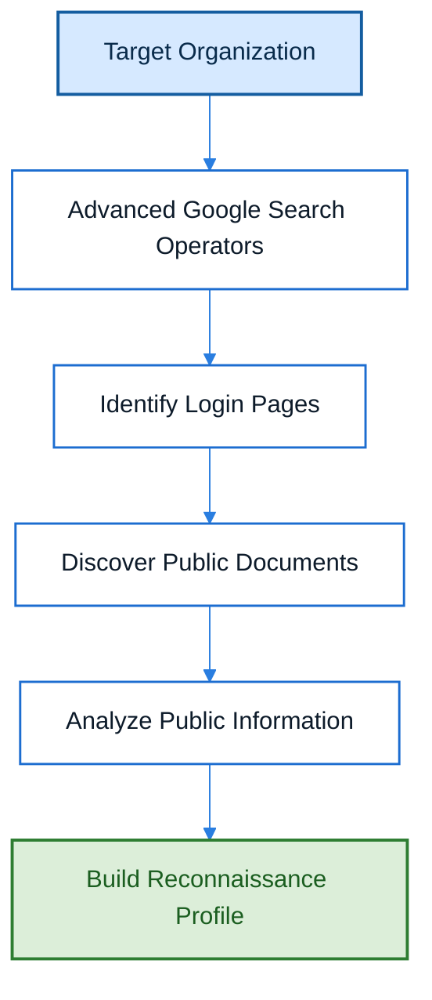
```mermaid
%%{init: {'theme': 'base', 'themeVariables': {'primaryColor': '#D0E8FF', 'primaryTextColor': '#092B4B', 'primaryBorderColor': '#1C6DD0', 'lineColor': '#2A7EE0', 'secondaryColor': '#EBF5FF', 'tertiaryColor': '#BBDFFF'}}}%%
flowchart TD
    A["Target Organization"] --> B["Advanced Google Search Operators"]
    B --> C["Identify Login Pages"]
    C --> D["Discover Public Documents"]
    D --> E["Analyze Public Information"]
    E --> F["Build Reconnaissance Profile"]

    classDef start fill:#D6E9FF,stroke:#145DA0,stroke-width:2px,color:#092B4B;
    classDef process fill:#FFFFFF,stroke:#1C6DD0,stroke-width:1.5px,color:#0D1B2A;
    classDef endNode fill:#DCEED9,stroke:#2E7D32,stroke-width:2px,color:#1B5E20;

    class A start;
    class B,C,D,E process;
    class F endNode;
```

## Overall Learning Outcome

This lab demonstrated how publicly available information indexed by search engines can be leveraged during passive footprinting to gather valuable intelligence about a target organization. I learned how advanced Google search operators improve reconnaissance efficiency by identifying exposed resources that contribute to effective security assessments.

# Lab 2 - Perform Footprinting Through Internet Research Services

## Objective

To understand how internet research services such as Netcraft and DNSDumpster can be used to gather publicly available information about a target organization's domains, subdomains, DNS infrastructure, and network hosts during the footprinting phase of a security assessment.

---

## Background

Internet research services aggregate publicly available information from multiple sources, enabling security professionals to collect valuable intelligence about an organization's online presence without directly interacting with the target infrastructure. These services provide insights into domain ownership, hosting infrastructure, DNS records, subdomains, technologies, and network topology.

This lab demonstrates how Netcraft and DNSDumpster can be used to identify organizational domains, discover subdomains, analyze DNS infrastructure, and visualize network relationships that may support further reconnaissance and penetration testing activities.

---

## Task 1 - Find the Company's Domains, Subdomains and Hosts using Netcraft and DNSDumpster

## Tools Used

- [Netcraft](../../Tools/Netcraft.md)
- [DNSDumpster](../../Tools/DNSDumpster.md)

---

### Activity Performed

Internet-based reconnaissance was performed using Netcraft and DNSDumpster to gather publicly available information about the target organization's domain infrastructure. Netcraft was used to generate a comprehensive site report containing information related to the target's hosting environment, network infrastructure, and discovered subdomains.

DNSDumpster was then used to enumerate DNS records, identify mail servers, host records, GeoIP information, and generate a visual domain map illustrating the relationship between the organization's publicly accessible systems. The exported host information was further reviewed to identify network assets that could support subsequent reconnaissance activities.

---

## Observations

- Netcraft successfully identified infrastructure and hosting information for the target domain.
- Multiple subdomains associated with the target organization were discovered.
- DNS records including Name Servers, MX Records, and Host (A) Records were successfully enumerated.
- GeoIP information revealed the geographical location of publicly accessible hosts.
- Domain mapping provided a visual representation of the organization's network infrastructure.
- Exported host information contained valuable reconnaissance data such as IP addresses, Reverse DNS records, and Netblock ownership.

---

### Netcraft Site Report

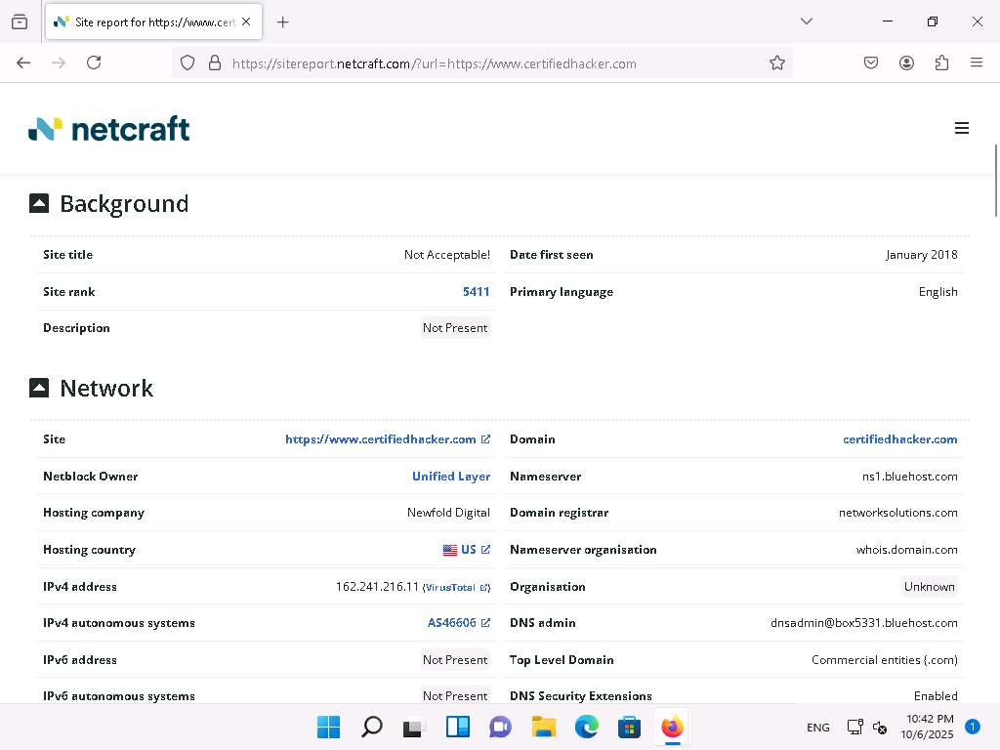

*Figure 2.1 – Netcraft site report displaying infrastructure and hosting information for the target domain.*

---

### Subdomain Enumeration

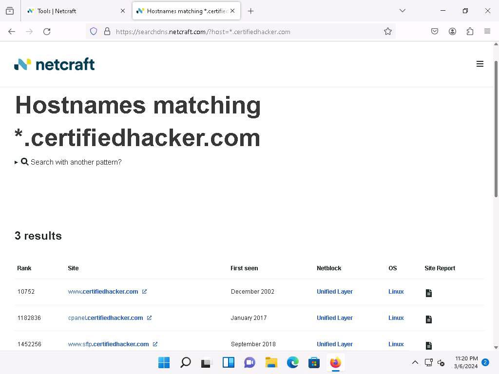

*Figure 2.2 – Netcraft identifying subdomains associated with the target organization.*

---

## GeoIP Information

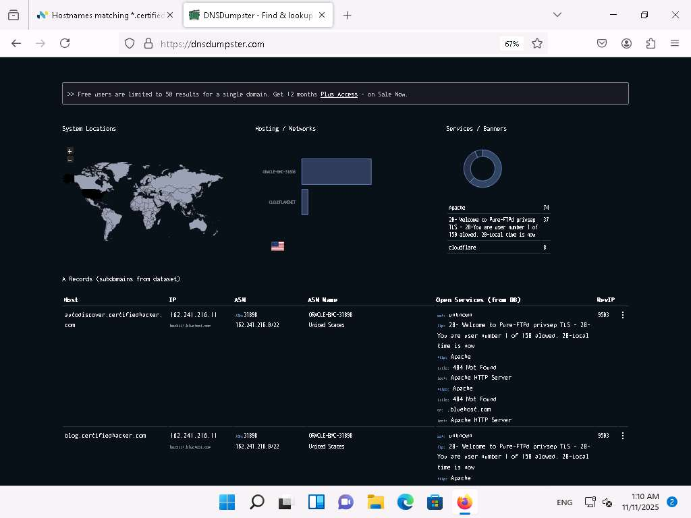

*Figure 2.3 – DNSDumpster displaying the geographical locations of publicly accessible hosts.*

---

### DNS Infrastructure

*Figure 2.4 – DNSDumpster enumerating DNS servers, mail servers, and host records associated with the target domain.*

---

### Domain Mapping

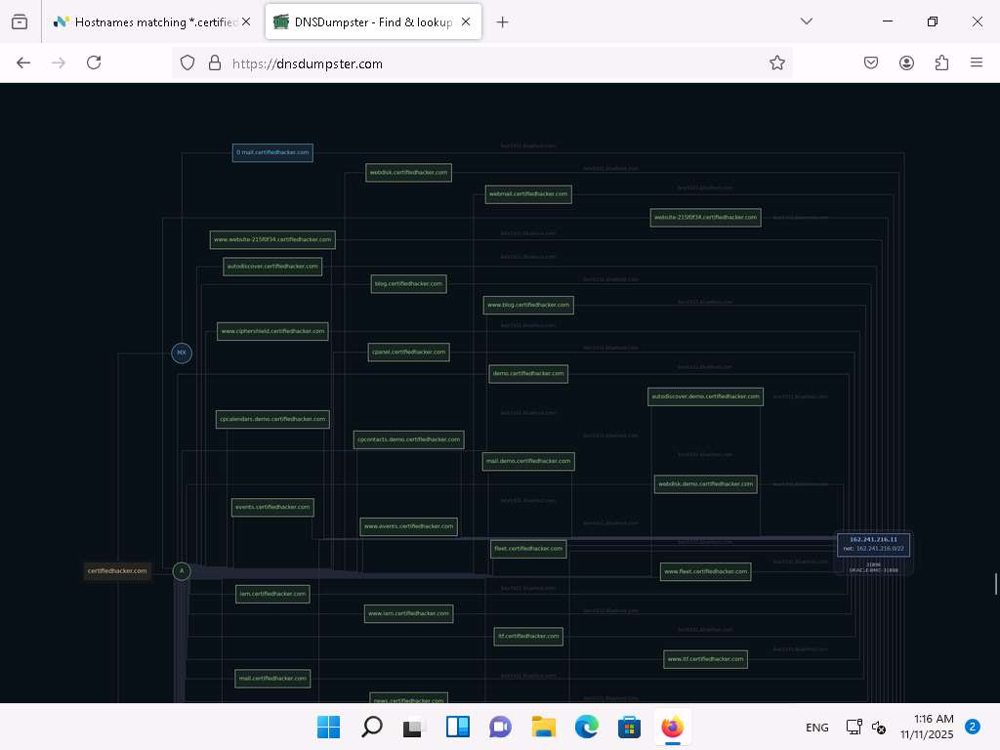

*Figure 2.5 – Visual representation of the target organization's domain relationships and network infrastructure.*

---

### Exported Host Information

*Figure 2.6 – Exported host information containing hostnames, IP addresses, Reverse DNS records, and network ownership details.*

---

### Learning Outcome

This task demonstrated how internet research services can be used to collect detailed information about an organization's publicly accessible infrastructure without directly interacting with the target systems. I understood how Netcraft and DNSDumpster assist ethical hackers in identifying domains, subdomains, DNS records, network hosts, and infrastructure components that contribute to an effective reconnaissance process.

---

### Attack Flow

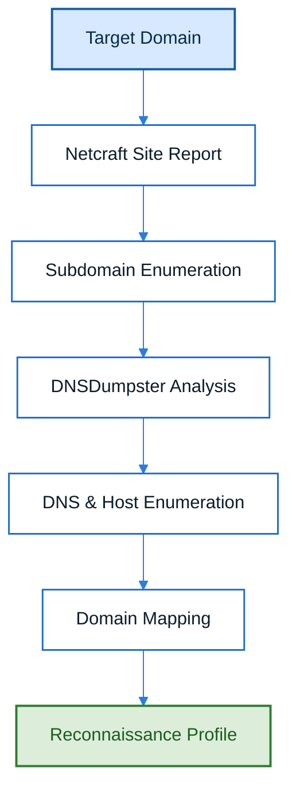
```mermaid
%%{init: {'theme': 'base', 'themeVariables': {'primaryColor': '#D0E8FF', 'primaryTextColor': '#092B4B', 'primaryBorderColor': '#1C6DD0', 'lineColor': '#2A7EE0', 'secondaryColor': '#EBF5FF', 'tertiaryColor': '#BBDFFF'}}}%%
flowchart TD
    A["Target Domain"] --> B["Netcraft Site Report"]
    B --> C["Subdomain Enumeration"]
    C --> D["DNSDumpster Analysis"]
    D --> E["DNS & Host Enumeration"]
    E --> F["Domain Mapping"]
    F --> G["Reconnaissance Profile"]

    classDef start fill:#D6E9FF,stroke:#145DA0,stroke-width:2px,color:#092B4B;
    classDef process fill:#FFFFFF,stroke:#1C6DD0,stroke-width:1.5px,color:#0D1B2A;
    classDef endNode fill:#DCEED9,stroke:#2E7D32,stroke-width:2px,color:#1B5E20;

    class A start;
    class B,C,D,E,F process;
    class G endNode;
```

---

## Overall Learning Outcome

This lab demonstrated how internet research services simplify the collection of publicly available information during passive reconnaissance. By analyzing domain infrastructure, DNS records, subdomains, and network relationships, I learned how ethical hackers build comprehensive reconnaissance profiles that support subsequent penetration testing activities.

---
# Lab 3 - Perform Footprinting Through Social Networking Sites

## Objective

To understand how publicly available information from social networking platforms can be collected using Sherlock to identify a target individual's online presence during the reconnaissance phase of a security assessment.

---

## Background

Social networking platforms contain a significant amount of publicly available information that can be leveraged during Open Source Intelligence (OSINT) gathering. Attackers and ethical hackers often analyze social media profiles to identify personal details, employment information, organizational affiliations, and other publicly shared data that may contribute to further reconnaissance activities.

This lab demonstrates how Sherlock automates the process of searching multiple social networking platforms to identify publicly available profiles associated with a target individual.

---

## Task 1 - Gather Personal Information from Various Social Networking Sites using Sherlock

### Tools Used

- [Sherlock](../../Tools/Sherlock.md)

---

### Activity Performed

Sherlock was used to perform social media reconnaissance by searching multiple online platforms for profiles associated with the specified target individual. The tool automatically queried numerous social networking websites and returned the URLs of publicly available profiles matching the supplied name.

The discovered profile links were reviewed to understand how publicly accessible information can assist ethical hackers in gathering intelligence about individuals and organizations during the footprinting phase.

---

### Observations

- Sherlock successfully searched multiple social networking platforms.
- Publicly available profile URLs associated with the target were identified.
- The collected information can support further Open Source Intelligence (OSINT) activities.
- Social networking platforms may expose personal and organizational information useful during reconnaissance.

---

### Social Media Profile Enumeration

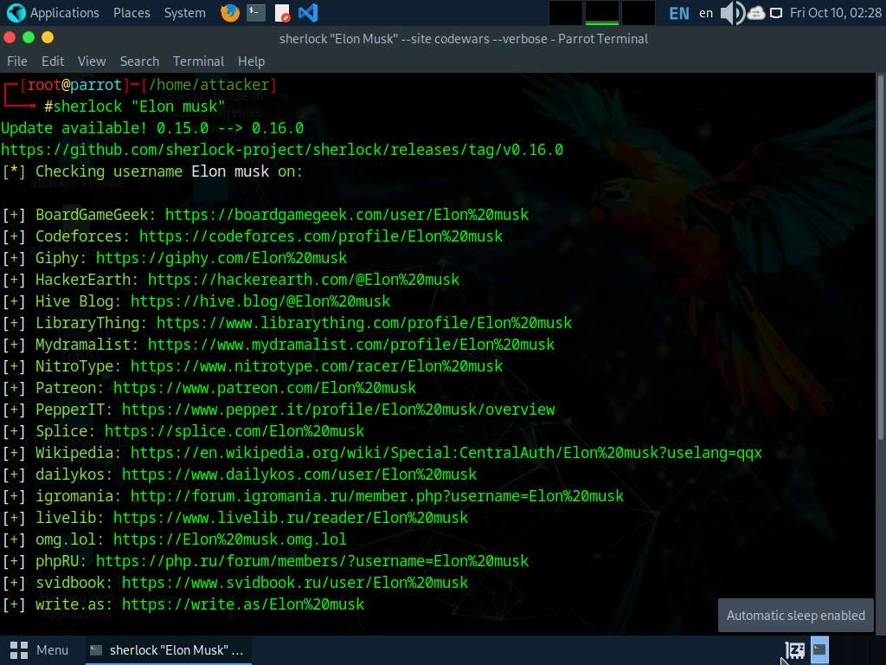

*Figure 3.1 – Sherlock identifying publicly available social media profiles associated with the target individual.*

---

### Learning Outcome

This task demonstrated how automated OSINT tools simplify the collection of publicly available information from social networking platforms. I understood how Sherlock assists ethical hackers by efficiently identifying online profiles that may reveal valuable intelligence during reconnaissance.

---

### Attack Flow

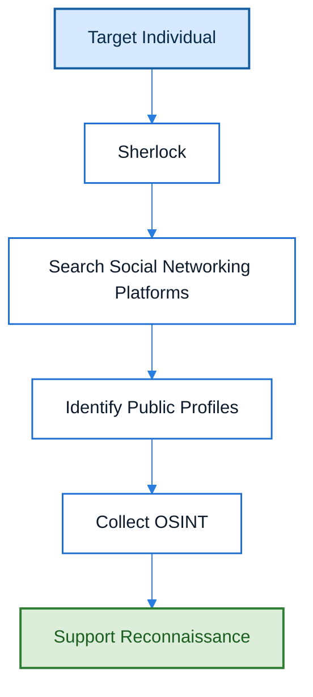
```mermaid
%%{init: {'theme': 'base', 'themeVariables': {'primaryColor': '#D0E8FF', 'primaryTextColor': '#092B4B', 'primaryBorderColor': '#1C6DD0', 'lineColor': '#2A7EE0', 'secondaryColor': '#EBF5FF', 'tertiaryColor': '#BBDFFF'}}}%%
flowchart TD
    A["Target Individual"] --> B["Sherlock"]
    B --> C["Search Social Networking Platforms"]
    C --> D["Identify Public Profiles"]
    D --> E["Collect OSINT"]
    E --> F["Support Reconnaissance"]

    classDef start fill:#D6E9FF,stroke:#145DA0,stroke-width:2px,color:#092B4B;
    classDef process fill:#FFFFFF,stroke:#1C6DD0,stroke-width:1.5px,color:#0D1B2A;
    classDef endNode fill:#DCEED9,stroke:#2E7D32,stroke-width:2px,color:#1B5E20;

    class A start;
    class B,C,D,E process;
    class F endNode;
```

---

## Overall Learning Outcome

This lab demonstrated how social networking platforms serve as valuable sources of publicly available intelligence during footprinting. By using Sherlock, I learned how ethical hackers efficiently identify online profiles that contribute to comprehensive Open Source Intelligence gathering and support subsequent security assessments.

---

# Lab 4 - Perform Whois Footprinting

## Objective

To understand how Whois lookup services can be used to gather publicly available domain registration information and identify infrastructure details about a target organization during the reconnaissance phase of a security assessment.

---

## Background

Whois is an Internet protocol that provides publicly accessible registration information for domain names. Ethical hackers use Whois lookup services to obtain details such as domain ownership, registrar information, registration dates, name servers, IP addresses, and geographical location. This information helps build an initial profile of the target organization's infrastructure and supports further reconnaissance activities.

This lab demonstrates how DomainTools can be used to perform Whois lookups and analyze publicly available domain registration records.

---

## Task 1 - Perform Whois Lookup using DomainTools

### Tools Used

- [DomainTools](../../Tools/DomainTools.md)

---

### Activity Performed

A Whois lookup was performed using DomainTools to collect publicly available registration information associated with the target domain. The returned Whois records were analyzed to identify domain ownership details, registration information, authoritative name servers, IP address information, and other infrastructure-related data.

The collected information was reviewed to understand how publicly available registration records contribute to the footprinting process and support further reconnaissance activities.

---

### Observations

- Whois records for the target domain were successfully retrieved.
- Domain registration information was identified.
- Name server details associated with the domain were discovered.
- IP address and hosting-related information were available.
- Public registration records provided valuable intelligence for reconnaissance.

---

### Whois Lookup Results

*Figure 4.1 – DomainTools displaying publicly available Whois registration information for the target domain.*

---

### Learning Outcome

This task demonstrated how publicly available Whois records can be used to gather valuable information about a target organization's domain infrastructure. I understood how domain registration details, name servers, and hosting information contribute to effective footprinting and support subsequent security assessments.

---

### Attack Flow

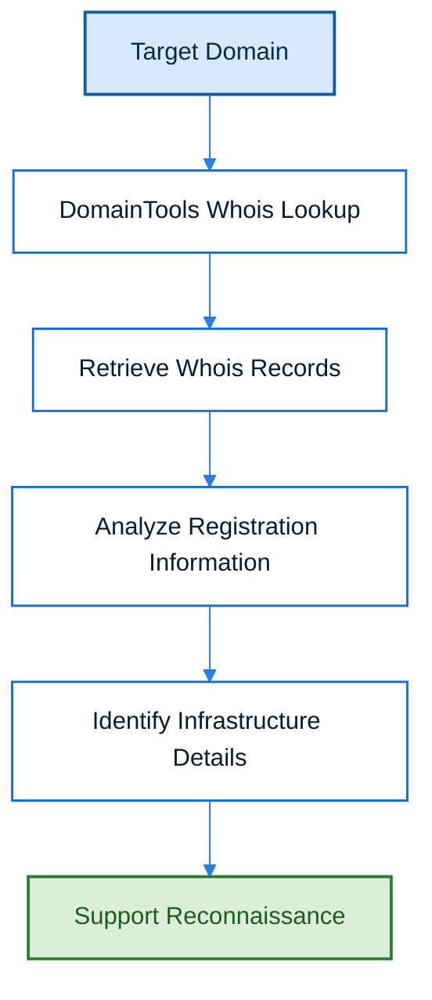
```mermaid
%%{init: {'theme': 'base', 'themeVariables': {'primaryColor': '#D0E8FF', 'primaryTextColor': '#092B4B', 'primaryBorderColor': '#1C6DD0', 'lineColor': '#2A7EE0', 'secondaryColor': '#EBF5FF', 'tertiaryColor': '#BBDFFF'}}}%%
flowchart TD
    A["Target Domain"] --> B["DomainTools Whois Lookup"]
    B --> C["Retrieve Whois Records"]
    C --> D["Analyze Registration Information"]
    D --> E["Identify Infrastructure Details"]
    E --> F["Support Reconnaissance"]

    classDef start fill:#D6E9FF,stroke:#145DA0,stroke-width:2px,color:#092B4B;
    classDef process fill:#FFFFFF,stroke:#1C6DD0,stroke-width:1.5px,color:#0D1B2A;
    classDef endNode fill:#DCEED9,stroke:#2E7D32,stroke-width:2px,color:#1B5E20;

    class A start;
    class B,C,D,E process;
    class F endNode;
```

---

## Overall Learning Outcome

This lab demonstrated how Whois services provide valuable domain registration intelligence during the footprinting phase of ethical hacking. By analyzing publicly available registration records, I learned how ethical hackers identify infrastructure details that contribute to building a comprehensive reconnaissance profile.

---

 Lab 5 - Perform DNS Footprinting

## Objective

To understand how DNS information can be gathered using the `nslookup` command-line utility and online DNS lookup services to identify domain records, IP address mappings, and authoritative name servers during the footprinting phase of a security assessment.

---

## Background

The Domain Name System (DNS) translates human-readable domain names into IP addresses and maintains various resource records that describe domain infrastructure. Ethical hackers perform DNS footprinting to identify publicly available information such as IP addresses, canonical names (CNAME), mail servers, and authoritative name servers that support further reconnaissance activities.

This lab demonstrates how the `nslookup` utility and an online DNS lookup service can be used to enumerate DNS records and analyze domain infrastructure without directly interacting with the target systems.

---

## Task 1 - Gather DNS Information using nslookup Command Line Utility and Online Tool

### Tools Used

- [nslookup](../../Tools/nslookup.md)
- [NSLOOKUP Online Tool](../../Tools/NSLOOKUP-Online.md)

---

### Activity Performed

DNS footprinting was performed using the `nslookup` command-line utility to query resource records associated with the target domain. Different query types were used to resolve the domain's IPv4 address, identify the authoritative name server, and gather additional DNS information relevant to the target infrastructure.

The collected DNS information was then validated using an online NSLOOKUP service, allowing the retrieved records to be compared and further analyzed. The results demonstrated how publicly available DNS records provide valuable intelligence during the reconnaissance phase of penetration testing.

---

### Observations

- DNS records associated with the target domain were successfully retrieved.
- The target domain's IPv4 address was resolved.
- The authoritative name server for the target domain was identified.
- Online DNS lookup services provided additional DNS information for verification.
- Public DNS records reveal infrastructure details that support further reconnaissance activities.

---

### A Record Lookup

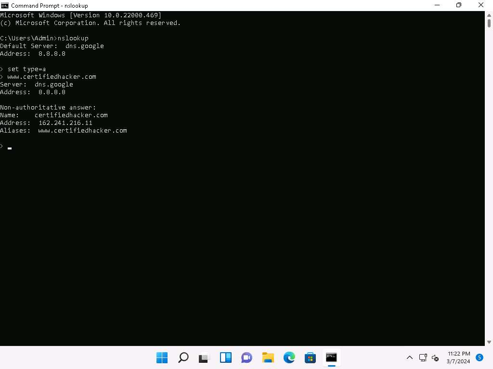

*Figure 5.1 – Using the `nslookup` utility to resolve the IPv4 address associated with the target domain.*

---

### Authoritative Name Server

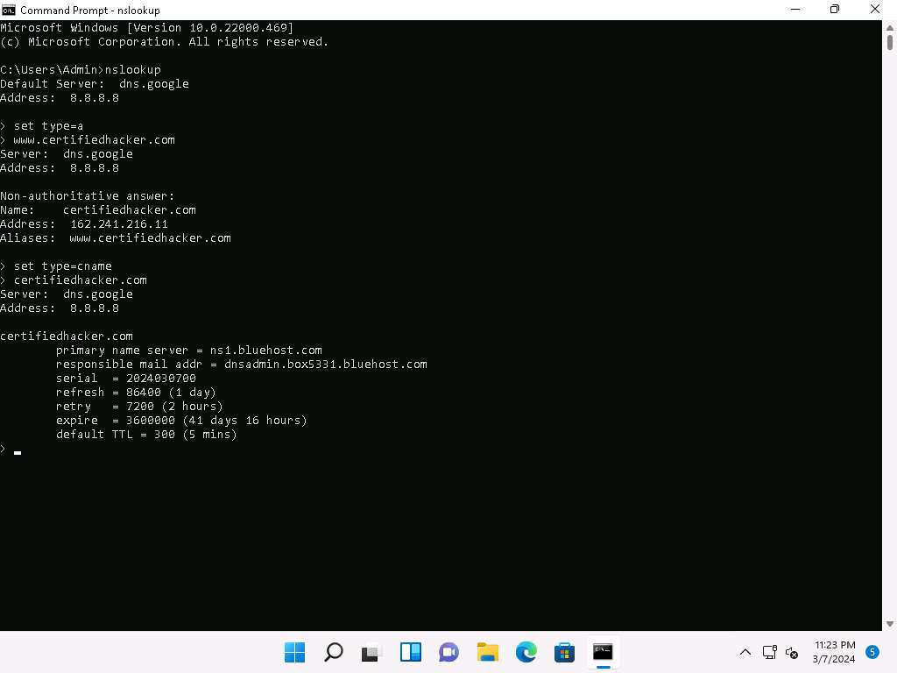

*Figure 5.2 – Identifying the authoritative name server responsible for the target domain.*

---

### Online DNS Lookup

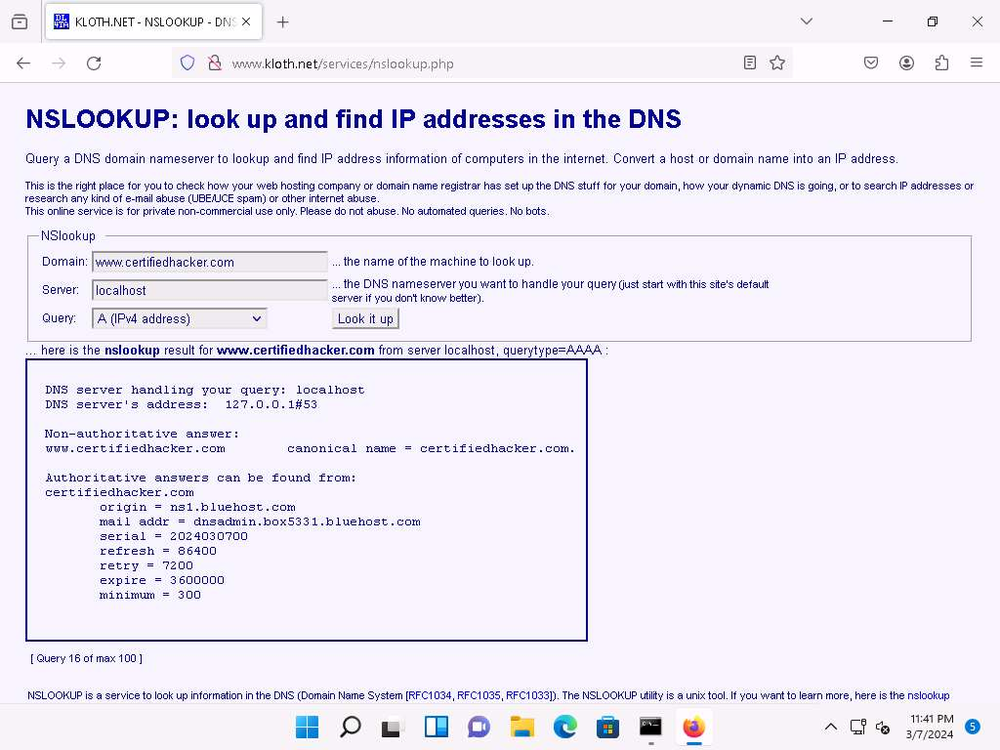

*Figure 5.3 – Online NSLOOKUP service displaying DNS records associated with the target domain.*

---

### Learning Outcome

This task demonstrated how DNS footprinting can be performed using both command-line and web-based tools to collect publicly available DNS information. I understood how resource records such as A records and authoritative name servers contribute to building an accurate reconnaissance profile of a target organization's infrastructure.

---

### Attack Flow

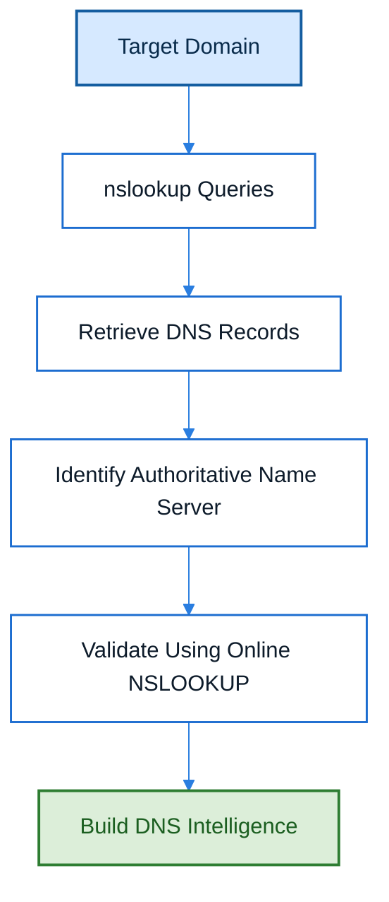
```mermaid
%%{init: {'theme': 'base', 'themeVariables': {'primaryColor': '#D0E8FF', 'primaryTextColor': '#092B4B', 'primaryBorderColor': '#1C6DD0', 'lineColor': '#2A7EE0', 'secondaryColor': '#EBF5FF', 'tertiaryColor': '#BBDFFF'}}}%%
flowchart TD
    A["Target Domain"] --> B["nslookup Queries"]
    B --> C["Retrieve DNS Records"]
    C --> D["Identify Authoritative Name Server"]
    D --> E["Validate Using Online NSLOOKUP"]
    E --> F["Build DNS Intelligence"]

    classDef start fill:#D6E9FF,stroke:#145DA0,stroke-width:2px,color:#092B4B;
    classDef process fill:#FFFFFF,stroke:#1C6DD0,stroke-width:1.5px,color:#0D1B2A;
    classDef endNode fill:#DCEED9,stroke:#2E7D32,stroke-width:2px,color:#1B5E20;

    class A start;
    class B,C,D,E process;
    class F endNode;
```

---

## Overall Learning Outcome

This lab demonstrated how publicly available DNS records provide valuable intelligence during the footprinting phase of ethical hacking. By querying DNS information using command-line and online tools, I learned how ethical hackers identify domain infrastructure, authoritative name servers, and IP address mappings that support comprehensive reconnaissance activities.

---

# Lab 6 - Perform Network Footprinting

## Objective

To understand how network tracerouting utilities can be used to identify the communication path between a source and destination host, enabling ethical hackers to analyze network topology and supporting infrastructure during reconnaissance.

---

## Background

Network tracerouting is a reconnaissance technique used to identify the sequence of intermediate devices through which network packets travel before reaching a target system. By analyzing each hop, ethical hackers can gain valuable insights into network topology, routing paths, trusted routers, and other infrastructure components that may support further security assessments.

This lab demonstrates how tracerouting can be performed using both Windows (`tracert`) and Linux (`traceroute`) utilities to analyze the route taken by packets to reach a target domain.

---

## Task 1 - Perform Network Tracerouting in Windows and Linux Machines

#### Tools Used

- [tracert](../../Tools/tracert.md)
- [traceroute](../../Tools/traceroute.md)

---

### Activity Performed

Network tracerouting was performed using the Windows `tracert` utility and the Linux `traceroute` command to identify the path taken by network packets to reach the target domain. The returned hop information was analyzed to observe the intermediate network devices involved in the communication path.

The results demonstrated how tracerouting utilities reveal network routing paths and provide valuable information about the target organization's network infrastructure without directly interacting with internal systems.

---

### Observations

- Network hops between the source and destination were successfully identified.
- Intermediate routing devices were displayed during the traceroute process.
- Windows and Linux utilities produced comparable routing information.
- Tracerouting provided insights into the target network's communication path.
- Network path analysis supports further reconnaissance and infrastructure mapping.

---

### Windows Traceroute

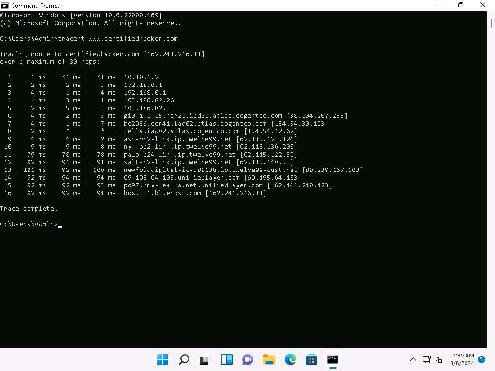

*Figure 6.1 – Windows `tracert` utility identifying the network path to the target domain.*

---

### Linux Traceroute

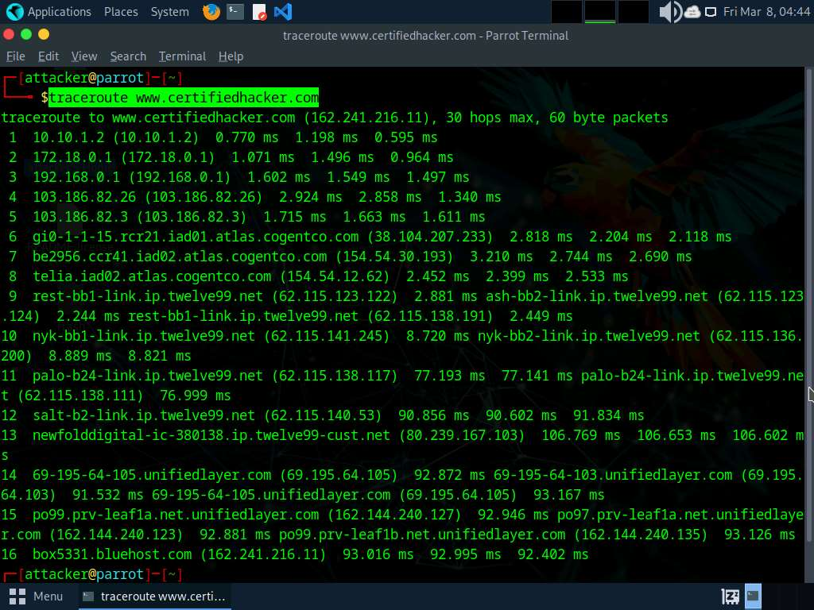

*Figure 6.2 – Linux `traceroute` utility displaying the sequence of network hops to the target domain.*

---

### Learning Outcome

This task demonstrated how tracerouting utilities can be used to analyze communication paths and identify intermediate network devices during reconnaissance. I understood how routing information assists ethical hackers in mapping network infrastructure and planning subsequent security assessments.

---

### Attack Flow

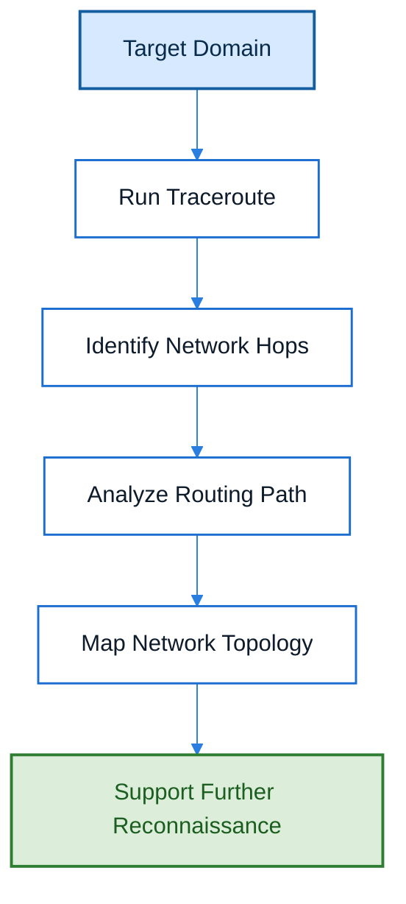
```mermaid
%%{init: {'theme': 'base', 'themeVariables': {'primaryColor': '#D0E8FF', 'primaryTextColor': '#092B4B', 'primaryBorderColor': '#1C6DD0', 'lineColor': '#2A7EE0', 'secondaryColor': '#EBF5FF', 'tertiaryColor': '#BBDFFF'}}}%%
flowchart TD
    A["Target Domain"] --> B["Run Traceroute"]
    B --> C["Identify Network Hops"]
    C --> D["Analyze Routing Path"]
    D --> E["Map Network Topology"]
    E --> F["Support Further Reconnaissance"]

    classDef start fill:#D6E9FF,stroke:#145DA0,stroke-width:2px,color:#092B4B;
    classDef process fill:#FFFFFF,stroke:#1C6DD0,stroke-width:1.5px,color:#0D1B2A;
    classDef endNode fill:#DCEED9,stroke:#2E7D32,stroke-width:2px,color:#1B5E20;

    class A start;
    class B,C,D,E process;
    class F endNode;
```

## Overall Learning Outcome

This lab demonstrated how tracerouting utilities reveal network routing paths and intermediate infrastructure during the footprinting phase of ethical hacking. By analyzing network hops from both Windows and Linux environments, I learned how ethical hackers gather valuable network topology information that supports comprehensive reconnaissance.

---

# Lab 7 - Perform Email Footprinting

## Objective

To understand how email header analysis can be used to gather information about a target by tracing the routing path of an email and identifying sender infrastructure using eMailTrackerPro.

---

## Background

Email headers contain valuable metadata about the origin, routing path, mail servers, and delivery process of an email. Ethical hackers analyze email headers to identify sender information, trace the path taken by an email across multiple mail servers, and gather intelligence about the infrastructure supporting email communications.

This lab demonstrates how eMailTrackerPro can analyze email headers to visualize email routing, identify intermediate mail servers, and retrieve Network Whois information associated with the traced infrastructure.

---

## Task 1 - Gather Information about a Target by Tracing Emails using eMailTrackerPro

### Tools Used

- [eMailTrackerPro](../../Tools/eMailTrackerPro.md)

---

### Activity Performed

Email footprinting was performed by importing an email header into eMailTrackerPro for analysis. The application processed the header information to reconstruct the routing path taken by the email and identify the intermediate mail servers involved during message delivery.

The traced route, geographical information, email summary, and Network Whois records were analyzed to understand how email metadata can provide valuable intelligence during reconnaissance and incident investigations.

---

### Observations

- Email routing information was successfully reconstructed from the email header.
- Intermediate mail servers involved in message delivery were identified.
- Geographic locations associated with the routing path were visualized.
- Network Whois information provided additional infrastructure details.
- Email headers revealed valuable intelligence useful during footprinting and forensic investigations.

---

### Email Trace Results

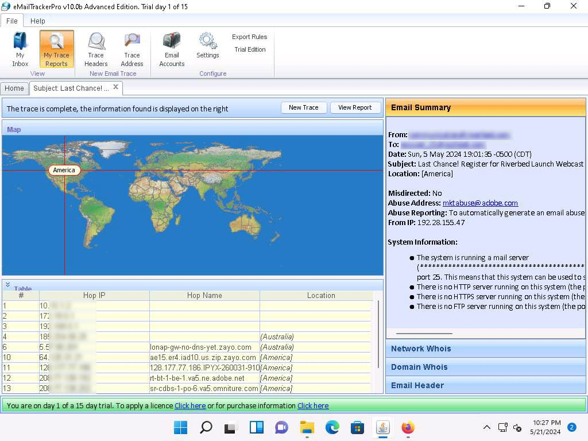

*Figure 7.1 – eMailTrackerPro visualizing the email routing path and summarizing information extracted from the email header.*

---

### Network Whois Information

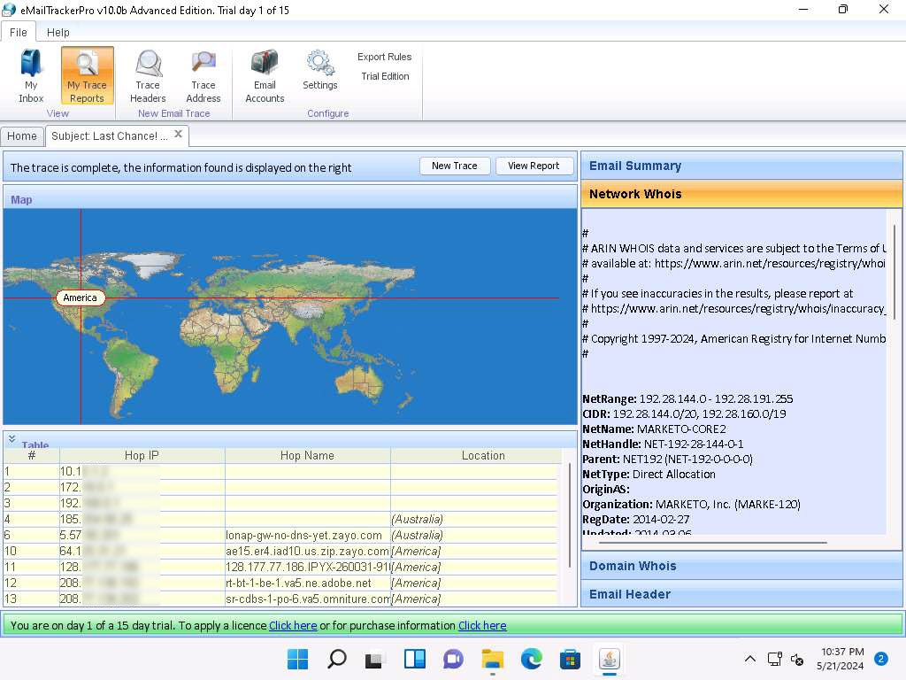

*Figure 7.2 – Network Whois information associated with the traced email infrastructure.*

---

### Learning Outcome

This task demonstrated how email headers can be analyzed to identify sender infrastructure, trace email routing paths, and gather publicly available intelligence about email communications. I understood how eMailTrackerPro assists ethical hackers in performing email footprinting and supports security investigations through metadata analysis.

---

### Attack Flow

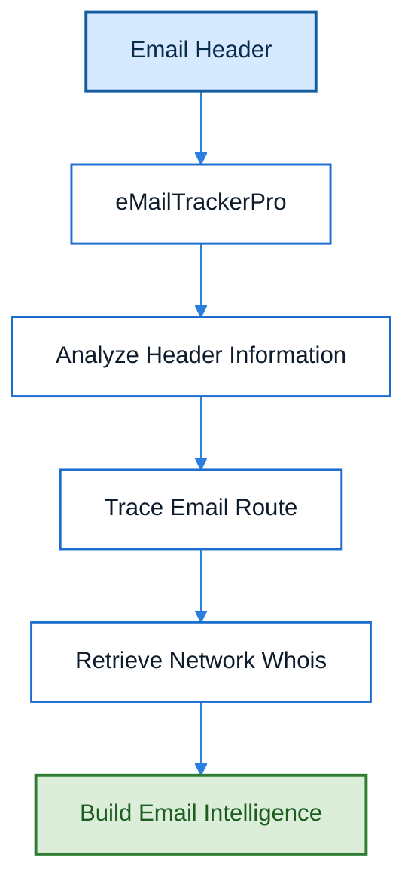
```mermaid
%%{init: {'theme': 'base', 'themeVariables': {'primaryColor': '#D0E8FF', 'primaryTextColor': '#092B4B', 'primaryBorderColor': '#1C6DD0', 'lineColor': '#2A7EE0', 'secondaryColor': '#EBF5FF', 'tertiaryColor': '#BBDFFF'}}}%%
flowchart TD
    A["Email Header"] --> B["eMailTrackerPro"]
    B --> C["Analyze Header Information"]
    C --> D["Trace Email Route"]
    D --> E["Retrieve Network Whois"]
    E --> F["Build Email Intelligence"]

    classDef start fill:#D6E9FF,stroke:#145DA0,stroke-width:2px,color:#092B4B;
    classDef process fill:#FFFFFF,stroke:#1C6DD0,stroke-width:1.5px,color:#0D1B2A;
    classDef endNode fill:#DCEED9,stroke:#2E7D32,stroke-width:2px,color:#1B5E20;

    class A start;
    class B,C,D,E process;
    class F endNode;
```

---

## Overall Learning Outcome

This lab demonstrated how email headers provide valuable intelligence during the footprinting phase of ethical hacking. By analyzing routing information, mail servers, and Network Whois records, I learned how ethical hackers trace email communications and gather infrastructure details that support comprehensive reconnaissance and security investigations.

---

# Lab 8 - Perform Footprinting using Various Footprinting Tools

## Objective

To understand how Recon-ng can be used to automate reconnaissance by collecting host information, gathering publicly available contact details, and generating reconnaissance reports during the footprinting phase of a security assessment.

---

## Background

Recon-ng is an Open Source Intelligence (OSINT) framework designed to automate web-based reconnaissance through a collection of independent modules. It integrates data gathering, workspace management, and reporting capabilities into a single environment, enabling ethical hackers to efficiently collect information from multiple public sources.

This lab demonstrates how Recon-ng modules can be used to enumerate hosts, gather personnel information, and generate reconnaissance reports that assist in building a comprehensive profile of a target organization.

---

## Task 1 - Footprinting a Target using Recon-ng

### Tools Used

- [Recon-ng](../../Tools/Recon-ng.md)

---

### Activity Performed

Recon-ng was used to perform automated reconnaissance against the target domain by leveraging multiple reconnaissance modules. The framework collected publicly available host information, gathered contact details associated with the target organization, and generated a structured HTML report summarizing the reconnaissance findings.

The collected intelligence was analyzed to understand how automated reconnaissance frameworks simplify information gathering and improve the efficiency of footprinting activities.

---

### Observations

- Recon-ng successfully automated multiple reconnaissance tasks.
- Publicly available host information associated with the target domain was identified.
- Personnel and contact information related to the target organization was gathered.
- The generated HTML report summarized the collected reconnaissance data.
- Automated reconnaissance frameworks improve efficiency by consolidating information from multiple public sources.

---

### Host Discovery Results

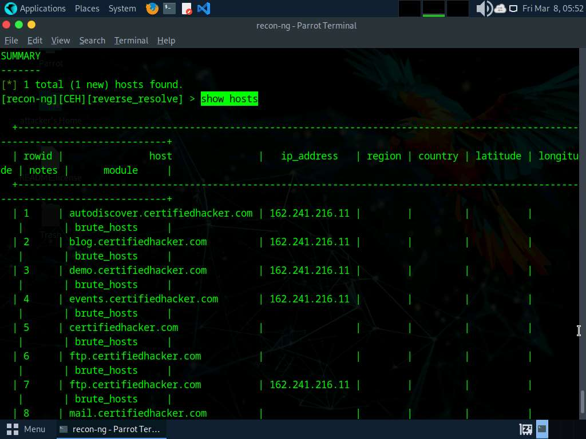

*Figure 8.1 – Recon-ng identifying publicly available hosts associated with the target domain.*

---

### Contact Enumeration

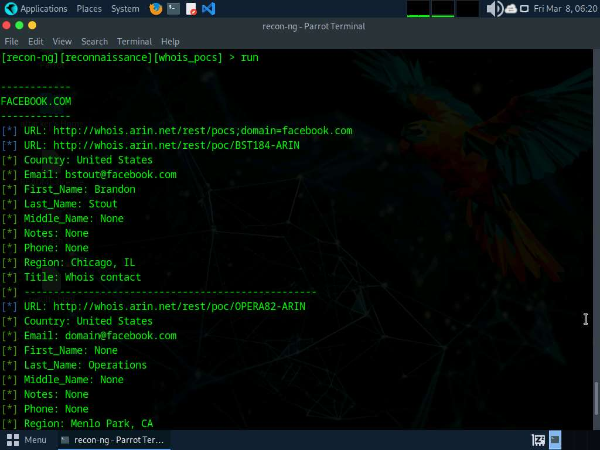

*Figure 8.2 – Recon-ng gathering publicly available contact information related to the target organization.*

---

### HTML Reconnaissance Report

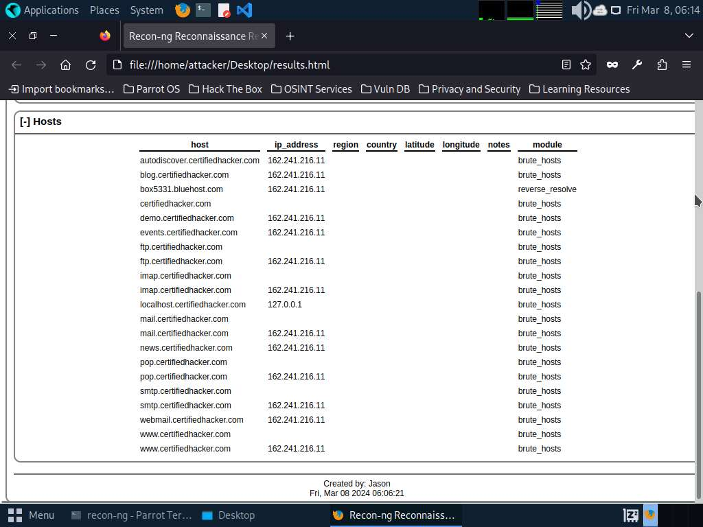

*Figure 8.3 – HTML report generated by Recon-ng summarizing the collected reconnaissance results.*

---

### Learning Outcome

This task demonstrated how automated reconnaissance frameworks streamline the footprinting process by consolidating multiple information-gathering techniques into a single platform. I understood how Recon-ng assists ethical hackers in collecting, organizing, and reporting publicly available intelligence during security assessments.

---

### Attack Flow

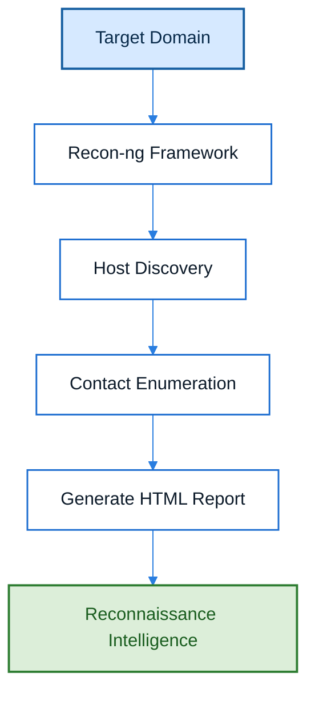
```mermaid
%%{init: {'theme': 'base', 'themeVariables': {'primaryColor': '#D0E8FF', 'primaryTextColor': '#092B4B', 'primaryBorderColor': '#1C6DD0', 'lineColor': '#2A7EE0', 'secondaryColor': '#EBF5FF', 'tertiaryColor': '#BBDFFF'}}}%%
flowchart TD
    A["Target Domain"] --> B["Recon-ng Framework"]
    B --> C["Host Discovery"]
    C --> D["Contact Enumeration"]
    D --> E["Generate HTML Report"]
    E --> F["Reconnaissance Intelligence"]

    classDef start fill:#D6E9FF,stroke:#145DA0,stroke-width:2px,color:#092B4B;
    classDef process fill:#FFFFFF,stroke:#1C6DD0,stroke-width:1.5px,color:#0D1B2A;
    classDef endNode fill:#DCEED9,stroke:#2E7D32,stroke-width:2px,color:#1B5E20;

    class A start;
    class B,C,D,E process;
    class F endNode;
```

---

## Overall Learning Outcome

This lab demonstrated how Recon-ng automates Open Source Intelligence gathering by integrating host enumeration, personnel information collection, and reporting into a unified reconnaissance framework. I learned how automated reconnaissance tools improve the efficiency and organization of footprinting activities while supporting comprehensive security assessments.

---

# Lab 9 - Perform Footprinting using AI

## Objective

To understand how ShellGPT can assist ethical hackers by generating and executing reconnaissance commands, automating footprinting tasks, and improving the efficiency of Open Source Intelligence (OSINT) gathering.

---

## Background

Artificial Intelligence is increasingly being integrated into cybersecurity workflows to automate repetitive tasks and simplify complex command-line operations. ShellGPT combines natural language processing with shell command generation, enabling security professionals to describe reconnaissance objectives in plain language and receive executable commands for various security tools.

This lab demonstrates how ShellGPT can automate multiple footprinting activities, including email harvesting, social media reconnaissance, DNS enumeration, network tracing, and reconnaissance scripting.

---

## Task 1 - Footprinting a Target using ShellGPT

### Tools Used

- [ShellGPT](../../Tools/ShellGPT.md)

---

### Activity Performed

ShellGPT was used to automate multiple footprinting activities through natural language prompts. AI-generated commands were executed to perform email harvesting, social media reconnaissance, DNS enumeration, network tracerouting, and automated reconnaissance scripting using industry-standard security tools.

The generated outputs were analyzed to understand how AI can reduce manual effort, streamline reconnaissance workflows, and improve the efficiency of information gathering while still requiring human validation of the results.

---

### Observations

- ShellGPT successfully generated security commands from natural language prompts.
- AI-assisted email harvesting identified publicly available email addresses and hosts.
- Social media reconnaissance was automated using Sherlock.
- ShellGPT generated commands for DNS enumeration and network tracing.
- AI-assisted scripting simplified the automation of multiple footprinting tasks.
- Human validation remains essential when using AI-generated security commands.

---

### AI-Assisted Email Harvesting

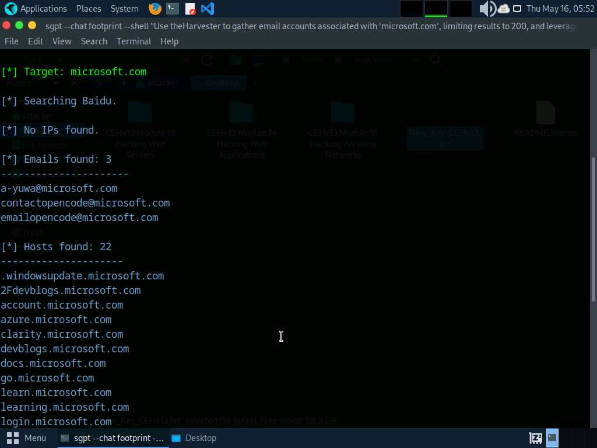

*Figure 9.1 – ShellGPT generating and executing reconnaissance commands to harvest publicly available email addresses associated with the target organization.*

---

### AI-Assisted Social Media Reconnaissance

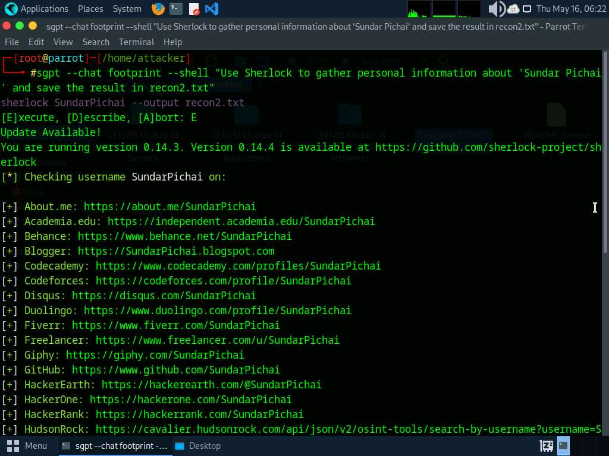

*Figure 9.2 – ShellGPT automating social media reconnaissance by generating Sherlock commands from natural language prompts.*

---

### AI-Assisted Footprinting Automation

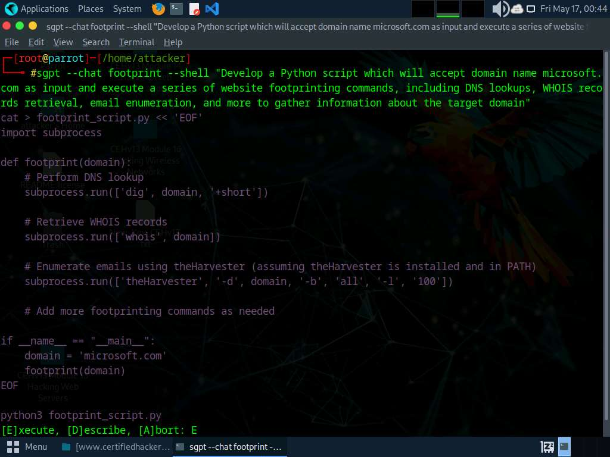

*Figure 9.3 – ShellGPT generating a Python script to automate multiple footprinting activities against the target domain.*

---

### Learning Outcome

This task demonstrated how Artificial Intelligence can enhance the footprinting process by generating security commands, automating reconnaissance tasks, and simplifying complex workflows. I understood how ShellGPT complements traditional security tools by improving productivity while still requiring ethical hackers to validate generated commands and analyze the results.

---

### Attack Flow

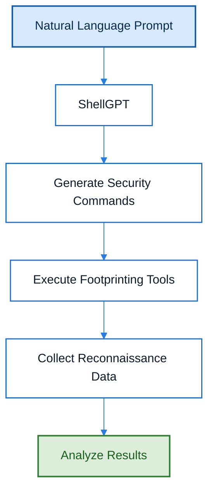
```mermaid
%%{init: {'theme': 'base', 'themeVariables': {'primaryColor': '#D0E8FF', 'primaryTextColor': '#092B4B', 'primaryBorderColor': '#1C6DD0', 'lineColor': '#2A7EE0', 'secondaryColor': '#EBF5FF', 'tertiaryColor': '#BBDFFF'}}}%%
flowchart TD
    A["Natural Language Prompt"] --> B["ShellGPT"]
    B --> C["Generate Security Commands"]
    C --> D["Execute Footprinting Tools"]
    D --> E["Collect Reconnaissance Data"]
    E --> F["Analyze Results"]

    classDef start fill:#D6E9FF,stroke:#145DA0,stroke-width:2px,color:#092B4B;
    classDef process fill:#FFFFFF,stroke:#1C6DD0,stroke-width:1.5px,color:#0D1B2A;
    classDef endNode fill:#DCEED9,stroke:#2E7D32,stroke-width:2px,color:#1B5E20;

    class A start;
    class B,C,D,E process;
    class F endNode;
```

---

## Overall Learning Outcome

This lab demonstrated how AI-powered assistants can improve the efficiency of footprinting by automating command generation and reconnaissance workflows. I learned that ShellGPT enhances traditional Open Source Intelligence techniques by simplifying interactions with multiple security tools while emphasizing the importance of human expertise to validate results and make informed security decisions.

---

# Key Takeaways

- Understood the importance of footprinting and reconnaissance as the first phase of the ethical hacking methodology.
- Learned the difference between passive and active footprinting techniques.
- Performed advanced search engine reconnaissance using Google Dorking to identify publicly accessible resources.
- Gathered domain, subdomain, DNS, and hosting information using internet research services such as Netcraft and DNSDumpster.
- Explored social media footprinting using Sherlock to identify publicly available user profiles.
- Performed Whois lookups to obtain domain registration and infrastructure information.
- Gathered DNS intelligence using both the `nslookup` command-line utility and online DNS lookup services.
- Analyzed network paths and intermediate devices using Windows `tracert` and Linux `traceroute`.
- Performed email footprinting by analyzing email headers and tracing email routing information using eMailTrackerPro.
- Used Recon-ng to automate host discovery, contact enumeration, and reconnaissance reporting.
- Explored AI-assisted footprinting using ShellGPT to automate reconnaissance tasks and generate security commands from natural language prompts.
- Recognized how publicly available information can significantly assist attackers if proper security controls are not implemented.

---

# Defensive Perspective

Organizations should minimize publicly exposed information that could assist attackers during the reconnaissance phase. Sensitive documents, DNS records, email addresses, employee details, and infrastructure information should be carefully managed and periodically reviewed. Security teams should implement domain privacy where appropriate, regularly audit public-facing assets, educate employees about information shared on social networking platforms, and continuously monitor their digital footprint using OSINT techniques. Conducting regular reconnaissance against the organization's own infrastructure helps identify exposed information before it can be exploited by attackers.

---

# Interview Questions

1. What is footprinting, and why is it considered the first phase of ethical hacking?
2. Differentiate between passive and active footprinting with suitable examples.
3. How do Google Dorks assist during reconnaissance?
4. What information can be obtained using Whois lookup services?
5. Why are DNS records and authoritative name servers valuable during reconnaissance?
6. What information can be gathered through network tracerouting?
7. How can email headers be used during footprinting and security investigations?
8. What are the advantages of using automated reconnaissance frameworks such as Recon-ng?
9. How can Artificial Intelligence improve the footprinting process?
10. What security measures should organizations implement to reduce information exposure during reconnaissance?

---

# My Reflection

This module provided a strong foundation for understanding the reconnaissance phase of ethical hacking. I learned that successful penetration testing begins with collecting accurate and relevant information rather than immediately attempting exploitation. Through practical exercises, I explored multiple footprinting techniques, including search engine reconnaissance, internet research services, DNS analysis, Whois lookups, social media intelligence, network tracing, email analysis, automated reconnaissance frameworks, and AI-assisted footprinting. The module reinforced the importance of Open Source Intelligence (OSINT) and demonstrated how seemingly harmless public information can reveal valuable insights about an organization's infrastructure. Overall, this module strengthened my understanding of reconnaissance methodologies and highlighted the importance of limiting public information exposure as a key defensive security practice.

---