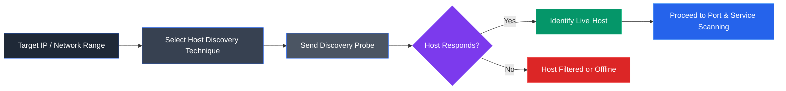

# Module 03: Scanning Networks

> **Status:** ✅ Completed
>
> **Difficulty:** ⭐⭐⭐☆☆
>
> **Labs Completed:** 6
>
> **Tools Covered:** Nmap, Metasploit, ShellGPT

---

# Module Summary

This module focused on active network reconnaissance by performing host discovery, port scanning, service enumeration, operating system fingerprinting, and network scanning against target systems. Using tools such as Nmap, Metasploit, and ShellGPT, the labs demonstrated how ethical hackers identify live hosts, discover exposed services, analyze network attack surfaces, and gather intelligence required for the subsequent phases of penetration testing.

---

# Overview

After completing the footprinting and reconnaissance phase, the next step in a penetration test is to actively validate the collected information through network scanning. Unlike passive reconnaissance, scanning directly interacts with target systems to determine which hosts are online, identify open ports, detect running services, fingerprint operating systems, and uncover potential vulnerabilities.

This module explored a variety of network scanning techniques using industry-standard tools. It also covered firewall and IDS evasion methods, demonstrating how different scanning approaches can bypass security controls while emphasizing the importance of defensive monitoring. Additionally, the module introduced AI-assisted scanning with ShellGPT, illustrating how artificial intelligence can simplify command generation and improve the efficiency of reconnaissance activities.

---

# Learning Objectives

After completing this module, I was able to:

- Perform host discovery to identify active systems on a network.
- Discover open TCP and UDP ports on target hosts.
- Enumerate services running on discovered ports.
- Perform operating system fingerprinting using Nmap.
- Understand the capabilities of the Nmap Scripting Engine (NSE).
- Apply firewall and IDS evasion techniques during network scanning.
- Scan target networks using Metasploit.
- Generate network scanning commands using ShellGPT.
- Analyze scanning results to identify potential attack surfaces.

---

# Key Concepts

- Active Reconnaissance
- Host Discovery
- Port Scanning
- Service Discovery
- Network Scanning
- Operating System Fingerprinting
- Banner Grabbing
- Nmap Scan Types
- Nmap Scripting Engine (NSE)
- Firewall Evasion
- IDS Evasion
- AI-Assisted Network Scanning

---

# Tools Used

- [Nmap](../../Tools/Nmap.md)
- [Metasploit](../../Tools/Metasploit.md)
- [ShellGPT](../../Tools/ShellGPT.md)

---

# Labs Covered

| Lab | Description |
|------|-------------|
| **Lab 1** | Perform Host Discovery |
| **Lab 2** | Perform Port and Service Discovery |
| **Lab 3** | Perform OS Discovery |
| **Lab 4** | Scan Beyond IDS and Firewall |
| **Lab 5** | Perform Network Scanning using Various Scanning Tools |
| **Lab 6** | Perform Network Scanning using AI |

---

# Lab 1: Perform Host Discovery

## Objective

To identify active hosts within a target network using multiple Nmap host discovery techniques and understand how different discovery methods determine host availability before subsequent network scanning activities.

---

## Background

Host discovery is the first stage of active network scanning. After gathering target information during reconnaissance, penetration testers must identify which systems are currently online before performing port scanning or service enumeration. Nmap provides several host discovery techniques that leverage different network protocols, allowing live hosts to be detected even when certain packet types are restricted by firewalls or security devices.

By comparing multiple discovery methods, ethical hackers can improve reconnaissance accuracy, validate target availability, and identify responsive systems under various network conditions before conducting deeper security assessments.

---

## Task 1: Perform Host Discovery using Nmap

### Tools Used

- [Nmap](../../Tools/Nmap.md)

---

### Activity Performed

Nmap was used to perform host discovery against the target network using multiple scanning techniques, including ARP Ping Scan, UDP Ping Scan, ICMP Echo Ping Scan, ICMP Echo Ping Sweep, and ICMP Timestamp Ping Scan. Each technique transmitted a different type of probe packet to determine whether the target system was active and reachable.

The ARP Ping Scan successfully identified the target host within the local network by sending ARP requests. ICMP-based discovery techniques verified host availability through Echo and Timestamp requests, while the ICMP Echo Ping Sweep discovered multiple active systems across the specified IP address range. These techniques demonstrated how different network protocols can be leveraged to identify live hosts depending on network topology, protocol support, and security configurations.

The host discovery results established the foundation for subsequent port scanning, service detection, operating system fingerprinting, and vulnerability assessment activities performed in later stages of the network scanning process.

---

### Observations

- Successfully identified the Windows Server 2022 target host (10.10.1.22) as active within the target network.
- Verified host availability using multiple Nmap host discovery techniques.
- Discovered multiple live systems within the specified IP address range using an ICMP Echo Ping Sweep.
- Observed that different host discovery techniques rely on different network protocols and response types.
- Demonstrated that alternative discovery methods can be used when specific probe packets are filtered or restricted by firewalls and network security devices.

---

### ARP Ping Scan

*Figure 1.1 – ARP Ping Scan successfully identified the target host by sending ARP requests and receiving ARP responses, confirming that the system was active on the local network.*

---

### ICMP Echo Ping Sweep

*Figure 1.2 – ICMP Echo Ping Sweep discovered multiple active hosts within the target IP address range, demonstrating how Nmap efficiently identifies live systems across a subnet before further network scanning.*

---

### ICMP Timestamp Ping Scan

*Figure 1.3 – ICMP Timestamp Ping Scan verified host availability by requesting timestamp information from the target, illustrating an alternative host discovery technique when standard ICMP Echo requests are unavailable or filtered.*

---

### Learning Outcome

This task demonstrated how Nmap employs multiple host discovery techniques to accurately identify reachable systems within a network. Understanding the strengths and limitations of different discovery methods establishes the foundation for subsequent port scanning, service enumeration, operating system fingerprinting, and vulnerability assessment activities.

---

### Attack Flow

---

## Overall Learning Outcome

This lab demonstrated how multiple Nmap host discovery techniques can be used to accurately identify active systems within a target network using different network protocols. By comparing ARP, UDP, and ICMP-based discovery methods, it reinforced the importance of host discovery as the foundation for effective network scanning, service enumeration, and subsequent penetration testing activities.

---

# Lab 2: Perform Port and Service Discovery

## Objective

To identify open ports, running services, service versions, and operating system information on target hosts using various Nmap scanning techniques. This lab demonstrated how different scan types provide unique insights into a target's attack surface while also highlighting the effects of firewall filtering on scan results.

---

## Background

After identifying active hosts, the next phase of network scanning is to enumerate the services exposed by those systems. Port and service discovery helps penetration testers determine which applications are accessible over the network, identify their versions, and gather operating system information that may reveal potential vulnerabilities. Nmap offers multiple scanning techniques that vary in stealth, accuracy, and interaction with security devices, making it one of the most versatile tools for network enumeration.

Understanding the strengths and limitations of each scan type enables ethical hackers to select the most appropriate technique based on the target environment while minimizing detection.

---

## Task 1: Explore Various Network Scanning Techniques using Nmap

### Tools Used

- [Nmap](../../Tools/Nmap.md)

---

### Activity Performed

Nmap was used to perform multiple port and service discovery techniques against the target Windows Server 2022 system. The assessment began with a TCP Connect Scan to identify open TCP ports and the services listening on them. Additional scan types, including TCP SYN (Stealth) Scan, Xmas Scan, TCP Maimon Scan, ACK Scan, and UDP Scan, were performed to observe how different packet types interact with the target system and its firewall.

Service Version Detection was then used to enumerate the versions of services running on the discovered ports, providing valuable information for vulnerability assessment. Finally, an Aggressive Scan was executed to combine operating system detection, version detection, default script scanning, and traceroute into a single comprehensive scan, producing a detailed profile of the target host.

Throughout the exercise, the impact of Windows Defender Firewall on scan results was observed, illustrating how firewall configurations influence port states and scan responses.

---

## Observations

- Successfully identified open TCP and UDP ports on the target host.
- Enumerated the services associated with the discovered open ports.
- Observed how different Nmap scan types generate different responses depending on firewall behavior.
- Identified ports reported as **Open**, **Filtered**, and **Open|Filtered** under various scanning techniques.
- Detected service versions running on exposed ports.
- Gathered operating system details, device information, and network characteristics through the Aggressive Scan.
- Understood how comprehensive scan results assist in identifying potential attack vectors during penetration testing.

---

### TCP Connect Scan

*Figure 2.1 – TCP Connect Scan identified open TCP ports and the services running on the target host by completing the TCP three-way handshake.*

---

### Xmas Scan

*Figure 2.2 – Xmas Scan demonstrated the effect of firewall filtering by reporting ports as **Open|Filtered**, illustrating how specialized scan types can be used to infer firewall behavior.*

---

### Service Version Detection

*Figure 2.3 – Service Version Detection enumerated the applications and versions running on the discovered ports, providing valuable information for vulnerability assessment and exploit selection.*

---

### Aggressive Scan Host Details

*Figure 2.4 – Aggressive Scan consolidated operating system detection, service enumeration, default script execution, and host information into a comprehensive network profile of the target system.*

---

### Learning Outcome

This task demonstrated how different Nmap scanning techniques provide varying levels of information about a target system, from basic port discovery to comprehensive operating system and service enumeration. It also reinforced the importance of selecting appropriate scanning methods based on network conditions, firewall configurations, and assessment objectives.

---

### Attack Flow

---

## Overall Learning Outcome

This lab demonstrated how Nmap can be used to perform comprehensive port and service discovery using multiple scanning techniques. By comparing different scan types and analyzing their results, the lab highlighted how penetration testers gather detailed information about target systems, identify exposed services, detect operating systems, and evaluate firewall behavior to build an accurate attack surface for subsequent security assessments.

---

# Lab 3: Perform OS Discovery

## Objective

To identify the operating system and host information of a target machine using Nmap's operating system detection capabilities and the Nmap Scripting Engine (NSE). This lab demonstrated how OS fingerprinting and NSE scripts can be used to gather detailed system information for reconnaissance and vulnerability assessment.

---

## Background

Operating system discovery is an essential phase of network reconnaissance that enables penetration testers to identify the platform running on a target system. Accurate OS fingerprinting helps determine the target's attack surface, narrow down applicable vulnerabilities, and select suitable exploitation techniques. Nmap provides both native OS detection capabilities and the Nmap Scripting Engine (NSE), which extends its functionality through specialized scripts capable of extracting detailed host information.

By combining aggressive scanning, OS fingerprinting, and NSE scripts, security professionals can build a comprehensive profile of the target without requiring authenticated access.

---

## Task 1: Perform OS Discovery using Nmap Script Engine (NSE)

### Tools Used

- [Nmap](../../Tools/Nmap.md)

---

### Activity Performed

Nmap was used to identify the operating system and system information of the target Windows Server 2022 machine using multiple discovery techniques. An Aggressive Scan was first performed to collect open ports, running services, service versions, operating system details, and host script results in a single scan. A dedicated OS Detection scan was then executed to fingerprint the target operating system based on network characteristics and protocol behavior.

Finally, the Nmap Scripting Engine (NSE) was used with the `smb-os-discovery.nse` script to retrieve additional information over the SMB protocol, including the operating system, computer name, NetBIOS name, domain, workgroup, and system time. These techniques demonstrated how Nmap combines active fingerprinting with protocol-specific scripts to produce detailed reconnaissance results.

---

### Observations

- Successfully identified the operating system running on the target host.
- Enumerated open ports, running services, and their associated versions.
- Retrieved host information including computer name and NetBIOS name.
- Collected SMB-related system information using the Nmap Scripting Engine.
- Observed that NSE scripts extend Nmap's capabilities by extracting detailed host information through supported network services.
- Verified that operating system fingerprinting provides valuable intelligence for vulnerability analysis and exploitation planning.

---

### Aggressive Scan

*Figure 3.1 – Aggressive Scan combined operating system detection, service enumeration, version detection, and host script execution to generate a comprehensive profile of the target system.*

---

### Operating System Detection

*Figure 3.2 – Nmap OS Detection fingerprinted the target operating system by analyzing responses to specially crafted network probes.*

---

### NSE SMB OS Discovery

*Figure 3.3 – The `smb-os-discovery.nse` script extracted detailed host information, including the operating system, computer name, NetBIOS information, and domain details through the SMB service.*

---

### Learning Outcome

This task demonstrated how Nmap combines operating system fingerprinting with the Nmap Scripting Engine to collect detailed host information during network reconnaissance. The ability to accurately identify operating systems and system attributes provides valuable intelligence for vulnerability assessment and subsequent penetration testing activities.

---

### Attack Flow

---

## Overall Learning Outcome

This lab demonstrated how Nmap and the Nmap Scripting Engine can be used to identify operating systems and gather detailed host information through active fingerprinting and protocol-specific scripts. The collected intelligence enhances situational awareness, supports vulnerability assessment, and helps penetration testers build an accurate profile of the target environment before attempting further exploitation.

---

# Lab 4: Scan beyond IDS and Firewall

## Objective

To perform network scanning while bypassing intrusion detection systems (IDS) and firewall mechanisms using various Nmap evasion techniques. This lab demonstrated how packet fragmentation, source port manipulation, MTU modification, and IP address decoys can reduce the effectiveness of network filtering and detection.

---

## Background

Modern networks commonly deploy firewalls and intrusion detection systems to monitor, filter, and block suspicious network traffic. Traditional port scanning techniques may be detected or restricted by these security controls, making reconnaissance more difficult. Nmap provides several evasion mechanisms that alter packet characteristics or disguise the source of scanning traffic to reduce the likelihood of detection.

Understanding these techniques enables penetration testers to evaluate the effectiveness of defensive controls while helping security professionals identify weaknesses in firewall and IDS configurations.

---

## Task 1: Scan beyond IDS/Firewall using Various Evasion Techniques

### Tools Used

- [Nmap](../../Tools/Nmap.md)
- [Wireshark](../../Tools/Wireshark.md)

---

### Activity Performed

Nmap was used to perform network scans against the target Windows 11 system while applying multiple IDS and firewall evasion techniques. Packet fragmentation was used to divide probe packets into smaller fragments, reducing the likelihood of inspection by poorly configured security devices. Source port manipulation was then performed by sending scan traffic from a trusted source port commonly permitted by firewall rules.

Additional evasion methods included modifying the Maximum Transmission Unit (MTU) to transmit smaller packets and using IP address decoys to conceal the true origin of the scan among multiple spoofed addresses. Throughout the assessment, Wireshark captured the network traffic on the target system, allowing each evasion technique to be analyzed and verified.

These techniques demonstrated how changes to packet structure and source information can influence the effectiveness of network security controls while still allowing reconnaissance activities to succeed.

---

### Observations

- Successfully performed network scanning despite Windows Defender Firewall being enabled.
- Verified that fragmented packets reached the target system.
- Observed packet fragmentation within captured network traffic using Wireshark.
- Confirmed that source port manipulation used TCP port 80 during scanning.
- Observed multiple spoofed source IP addresses generated during the decoy scan.
- Understood how various Nmap evasion techniques attempt to reduce IDS and firewall visibility.

---

### Packet Fragmentation Scan

*Figure 4.1 – Packet Fragmentation Scan successfully discovered open ports while transmitting fragmented probe packets, demonstrating an effective firewall evasion technique.*

---

### Fragmented Packets in Wireshark

*Figure 4.2 – Wireshark captured fragmented IP packets generated during the scan, confirming that packet fragmentation was successfully applied.*

---

### Source Port Manipulation

*Figure 4.3 – Source Port Manipulation performed network scanning using TCP source port 80, illustrating how trusted ports may be used to bypass restrictive firewall rules.*

---

### IP Address Decoy

*Figure 4.4 – Wireshark captured multiple spoofed source IP addresses generated during the decoy scan, demonstrating how Nmap conceals the actual scanning host among randomly generated decoys.*

---

### Learning Outcome

This task demonstrated how Nmap's evasion capabilities can modify packet characteristics and source information to reduce the effectiveness of intrusion detection systems and firewall filtering. Understanding these techniques provides valuable insight into both offensive reconnaissance strategies and the defensive measures required to detect sophisticated network scans.

---

### Attack Flow

---

## Overall Learning Outcome

This lab demonstrated how Nmap employs multiple packet manipulation and traffic obfuscation techniques to evade firewall and intrusion detection mechanisms during network scanning. By combining packet fragmentation, source port manipulation, MTU modification, and IP address decoys, the assessment highlighted both the offensive value of scan evasion techniques and the importance of properly configured security controls for detecting advanced reconnaissance activities.

---

# Lab 5: Perform Network Scanning using Various Scanning Tools

## Objective

To perform network scanning using the Metasploit Framework in order to identify active hosts, open ports, running services, and operating system information within a target network. This lab demonstrated how Metasploit integrates scanning modules to automate network reconnaissance and collect intelligence for subsequent security assessments.

---

## Background

The Metasploit Framework is widely recognized as an exploitation platform, but it also provides powerful auxiliary modules for reconnaissance and network scanning. These modules enable penetration testers to discover hosts, enumerate open ports, identify running services, and determine operating system details without directly exploiting the target systems.

By combining Nmap with Metasploit's auxiliary scanners, security professionals can efficiently gather detailed information about a target environment while preparing for vulnerability assessment and penetration testing.

---

## Task 1: Scan a Target Network using Metasploit

### Tools Used

- [Metasploit](../../Tools/Metasploit.md)
- [Nmap](../../Tools/Nmap.md)

---

### Activity Performed

The Metasploit Framework was used to perform network reconnaissance against the target subnet. Initially, an Nmap scan was executed from within the Metasploit console to discover active hosts, enumerate open ports, identify running services, and detect operating systems across the network. The scan results were exported in XML format for future analysis.

Metasploit's auxiliary scanning modules were then used to perform specialized reconnaissance activities. The SYN Port Scanner identified hosts exposing TCP port 80, while the TCP Port Scanner enumerated open TCP ports on the target Windows Server 2022 system. Finally, the SMB Version Scanner queried systems exposing SMB services to determine their operating system and SMB implementation details.

These activities demonstrated how Metasploit extends traditional network scanning by providing modular reconnaissance capabilities that integrate seamlessly with penetration testing workflows.

---

### Observations

- Successfully identified active hosts across the target subnet.
- Enumerated open TCP ports and associated network services.
- Verified the availability of web services through SYN port scanning.
- Identified open TCP ports on the Windows Server 2022 target.
- Retrieved operating system and SMB version information from hosts exposing SMB services.
- Observed that Metasploit auxiliary modules provide targeted scanning capabilities for specific reconnaissance objectives.

---

### Nmap Network Scan

*Figure 5.1 – Nmap executed within the Metasploit Framework identified active hosts, open ports, services, and operating system information across the target subnet.*

---

### SYN Port Scan

*Figure 5.2 – The Metasploit SYN Port Scanner identified hosts exposing TCP port 80, demonstrating efficient reconnaissance using auxiliary scanning modules.*

---

### TCP Port Scan

*Figure 5.3 – The TCP Port Scanner enumerated open TCP ports on the target system, providing detailed information about exposed network services.*

---

### SMB Version Scan

*Figure 5.4 – The SMB Version Scanner identified the operating system and SMB implementation of target hosts by querying exposed SMB services.*

---

### Learning Outcome

This task demonstrated how Metasploit can be used as a reconnaissance platform by combining Nmap with specialized auxiliary scanning modules. The collected information provides valuable intelligence for vulnerability assessment, exploit selection, and subsequent penetration testing activities.

---

### Attack Flow

---

## Overall Learning Outcome

This lab demonstrated how the Metasploit Framework can be used beyond exploitation to perform comprehensive network reconnaissance. By leveraging Nmap and Metasploit's auxiliary scanning modules, detailed information about hosts, open ports, services, and operating systems was collected, providing a strong foundation for vulnerability analysis and subsequent penetration testing activities.

---

# Lab 6: Perform Network Scanning using AI

## Objective

To perform network scanning and reconnaissance using ShellGPT by generating AI-assisted commands for host discovery, port scanning, service enumeration, operating system detection, and scan automation. This lab demonstrated how artificial intelligence can simplify network reconnaissance while leveraging traditional security tools such as Nmap, hping3, and Metasploit.

---

## Background

Artificial intelligence is increasingly being integrated into cybersecurity workflows to improve efficiency and reduce manual effort. Rather than replacing established security tools, AI assistants such as ShellGPT generate context-aware commands, automate repetitive tasks, and assist analysts in performing complex security operations more quickly. By combining natural language prompts with command-line tools, security professionals can accelerate reconnaissance while maintaining flexibility and accuracy.

This approach enables penetration testers to focus on interpreting results rather than manually constructing commands for every scanning activity.

---

## Task 1: Scan a Target using ShellGPT

### Tools Used

- [ShellGPT](../../Tools/ShellGPT.md)
- [Nmap](../../Tools/Nmap.md)
- [Metasploit](../../Tools/Metasploit.md)

---

### Activity Performed

ShellGPT was configured to generate shell commands for performing various network scanning activities using natural language prompts. AI-generated commands were used to perform host discovery, ICMP scanning, ACK scanning, port scanning, stealth scanning, XMAS scanning, operating system detection, service enumeration, and Metasploit-based reconnaissance.

ShellGPT also automated multi-stage reconnaissance workflows by generating commands that stored discovered hosts in text files, scanned those hosts using Nmap, extracted service information, and performed operating system discovery through the Nmap Scripting Engine. Finally, ShellGPT generated a Python automation script capable of performing comprehensive network scanning and vulnerability assessment against multiple hosts.

Throughout the exercise, ShellGPT acted as an intelligent command-generation assistant while Nmap, Metasploit, and other security tools performed the actual reconnaissance tasks.

---

### Observations

- Successfully generated network scanning commands using natural language prompts.
- Automated host discovery and network enumeration tasks.
- Performed port scanning, service discovery, and operating system detection through AI-generated commands.
- Automated multi-stage reconnaissance workflows using generated scripts.
- Observed that ShellGPT significantly reduced manual command construction while maintaining compatibility with standard penetration testing tools.
- Demonstrated how AI can improve efficiency without replacing established cybersecurity tools.

---

### ShellGPT Network Scan

*Figure 6.1 – ShellGPT generated and executed Nmap commands to perform automated network reconnaissance, producing consolidated scan results for the target network.*

---

### ShellGPT OS Discovery

*Figure 6.2 – AI-generated Nmap NSE commands successfully identified operating system information for the discovered hosts, demonstrating intelligent command generation for advanced reconnaissance tasks.*

---

### ShellGPT Python Automation

*Figure 6.3 – ShellGPT generated a Python automation script capable of performing comprehensive network scanning and vulnerability assessment, illustrating the use of AI for cybersecurity workflow automation.*

### Learning Outcome

This task demonstrated how ShellGPT enhances penetration testing by generating accurate security commands through natural language interaction. Rather than replacing traditional security tools, AI improved productivity by automating command generation, repetitive reconnaissance tasks, and multi-stage scanning workflows.

---

### Attack Flow

---

## Overall Learning Outcome

This lab demonstrated how artificial intelligence can streamline network reconnaissance by generating accurate commands for host discovery, port scanning, operating system detection, and automation. By integrating ShellGPT with traditional penetration testing tools, the assessment highlighted how AI enhances efficiency, reduces repetitive manual effort, and supports modern cybersecurity workflows without replacing established security methodologies.

---

# Key Takeaways

- Understood the role of network scanning as the transition from passive reconnaissance to active information gathering during a penetration test.
- Performed host discovery using multiple Nmap techniques, including ARP, UDP, and ICMP-based scans, to identify active systems within a target network.
- Explored various TCP and UDP port scanning methods to enumerate open ports, running services, and service versions.
- Learned how operating system fingerprinting and the Nmap Scripting Engine (NSE) reveal valuable host information such as operating system details, NetBIOS names, workgroups, and system information.
- Examined firewall and IDS evasion techniques, including packet fragmentation, source port manipulation, MTU modification, and IP address decoys, to understand how different scanning strategies interact with network security controls.
- Used Metasploit auxiliary modules to perform network reconnaissance, including host discovery, port scanning, and SMB version enumeration.
- Explored AI-assisted network scanning using ShellGPT to automate command generation and streamline reconnaissance workflows.
- Reinforced the importance of correlating host, port, service, and operating system information to build an accurate attack surface before proceeding to vulnerability assessment and exploitation.

---

# Defensive Perspective

Network scanning is one of the earliest indicators of reconnaissance activity against an organization's infrastructure. Detecting and responding to unauthorized scanning attempts allows defenders to identify potential attackers before exploitation begins. Firewalls, intrusion detection systems (IDS), intrusion prevention systems (IPS), and network monitoring solutions should be configured to detect abnormal scanning patterns, fragmented packets, spoofed source addresses, and unusual protocol usage.

Organizations should also minimize their attack surface by disabling unnecessary services, restricting access to sensitive ports, applying appropriate firewall rules, and regularly auditing exposed systems. Continuous network monitoring, vulnerability management, and timely patching significantly reduce the risk of attackers successfully leveraging information gathered during the scanning phase.

---

# Interview Questions

1. What is the purpose of network scanning in the penetration testing lifecycle?
2. Differentiate between host discovery, port scanning, and service enumeration.
3. Explain the differences between a TCP Connect Scan and a TCP SYN (Stealth) Scan.
4. Why is UDP scanning generally slower and more challenging than TCP scanning?
5. What information can be obtained using Service Version Detection (`-sV`)?
6. What capabilities are included in an Aggressive Scan (`-A`)?
7. How does Nmap perform operating system fingerprinting?
8. What is the Nmap Scripting Engine (NSE), and what advantages does it provide?
9. Explain how packet fragmentation can be used to evade certain firewall and IDS configurations.
10. What is an IP address decoy scan, and how does it assist in scan evasion?
11. Describe some common IDS and firewall evasion techniques supported by Nmap.
12. How can the Metasploit Framework be used for network reconnaissance?
13. What are the advantages of using AI tools such as ShellGPT during penetration testing?
14. Why is accurate network reconnaissance essential before vulnerability assessment and exploitation?
15. What defensive measures can organizations implement to detect and mitigate network scanning activities?

---

# My Reflection

This module demonstrated that effective penetration testing begins with thorough reconnaissance rather than immediate exploitation. Through the various Nmap scanning techniques, I learned how different scan types contribute unique information about a target environment, ranging from identifying live hosts and open ports to discovering running services, operating systems, and firewall behavior. Comparing these techniques also highlighted how network security controls influence scan results and why multiple scanning methods are often required to build a complete picture of the target.

The Metasploit and ShellGPT labs further demonstrated how modern penetration testing combines traditional security tools with automation and AI-assisted workflows to improve efficiency while maintaining analytical decision-making. Overall, this module reinforced the importance of accurate network reconnaissance as the foundation for vulnerability assessment, exploitation, and every subsequent phase of a penetration test.

---