# Module 04: Enumeration

> **Status:** ✅ Completed
>
> **Difficulty:** ⭐⭐⭐⭐☆
>
> **Labs Completed:** 8
>
> **Tools Covered:** Windows Command-Line Utilities, SnmpWalk, AD Explorer, RPCScan, SuperEnum, Nmap, Global Network Inventory, ShellGPT

---

## Overview

Enumeration is the process of actively extracting detailed information from target systems after identifying live hosts, open ports, services, and operating systems during the reconnaissance and scanning phases. Unlike passive information gathering, enumeration establishes active connections with target services to retrieve valuable information such as usernames, user groups, machine names, shared resources, domain details, SNMP information, and service configurations. The information gathered during enumeration enables penetration testers to identify potential attack vectors, privilege escalation opportunities, and security weaknesses that may be exploited during later stages of a penetration test.

---

## Learning Objectives

By completing this module, you will learn how to:

- Perform NetBIOS enumeration using Windows command-line utilities.
- Enumerate SNMP information using SnmpWalk.
- Perform LDAP enumeration using Active Directory Explorer (AD Explorer).
- Enumerate NFS services using RPCScan and SuperEnum.
- Perform DNS enumeration through zone transfer techniques.
- Enumerate SMTP services using Nmap.
- Gather detailed network information using Global Network Inventory.
- Automate enumeration tasks using ShellGPT.

---

## Tools Used

- [Windows Command-Line Utilities](../../Tools/Windows-Command-Line-Utilities.md)
- [SnmpWalk](../../Tools/SnmpWalk.md)
- [AD Explorer](../../Tools/AD-Explorer.md)
- [RPCScan](../../Tools/RPCScan.md)
- [SuperEnum](../../Tools/SuperEnum.md)
- [Nmap](../../Tools/Nmap.md)
- [Global Network Inventory](../../Tools/Global-Network-Inventory.md)
- [ShellGPT](../../Tools/ShellGPT.md)

---

## Labs Covered

| Lab | Description |
|------|-------------|
| Lab 1 | Perform NetBIOS Enumeration |
| Lab 2 | Perform SNMP Enumeration |
| Lab 3 | Perform LDAP Enumeration |
| Lab 4 | Perform NFS Enumeration |
| Lab 5 | Perform DNS Enumeration |
| Lab 6 | Perform SMTP Enumeration |
| Lab 7 | Perform Enumeration using Various Enumeration Tools |
| Lab 8 | Perform Enumeration using AI |

---

# Lab 1: Perform NetBIOS Enumeration

## Objective

To perform NetBIOS enumeration using Windows command-line utilities and extract information such as NetBIOS names, machine details, and shared network resources from a remote Windows system.

## Background

NetBIOS (Network Basic Input/Output System) is a legacy networking protocol that enables communication between computers on a local network. Although modern Windows environments primarily rely on DNS and Active Directory, NetBIOS is still enabled in many systems for compatibility purposes. Enumerating NetBIOS information can reveal computer names, registered services, shared resources, and other network details that assist penetration testers in understanding the target environment.

Windows provides built-in command-line utilities such as **nbtstat** and **net use** to query NetBIOS information and enumerate shared network resources without requiring additional software.

---

## Task 1: Perform NetBIOS Enumeration using Windows Command-Line Utilities

### Tools Used

- [Windows Command-Line Utilities](../../Tools/Windows-Command-Line-Utilities.md)

### Activity Performed

Windows command-line utilities were used to enumerate NetBIOS information from the target Windows 11 system. The `nbtstat -a` command queried the remote host and displayed its NetBIOS name table, revealing the computer name, registered NetBIOS services, and MAC address. The `net use` command was then executed to display existing network connections and shared resources available on the system.

These built-in utilities demonstrated how valuable reconnaissance information can be gathered without installing third-party enumeration tools.

### Observations

- Successfully enumerated the NetBIOS name table of the target system.
- Identified the target computer name and registered NetBIOS services.
- Enumerated existing network connections and shared resources.
- Observed that Windows built-in utilities provide valuable enumeration capabilities during reconnaissance.

### Figures

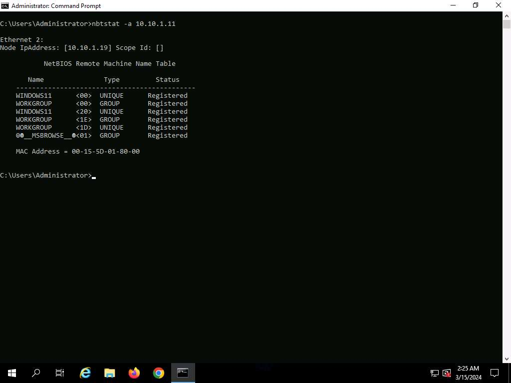

**Figure 1.1:** The `nbtstat -a` command enumerated the remote system's NetBIOS name table, revealing registered NetBIOS names, services, and host information.

---

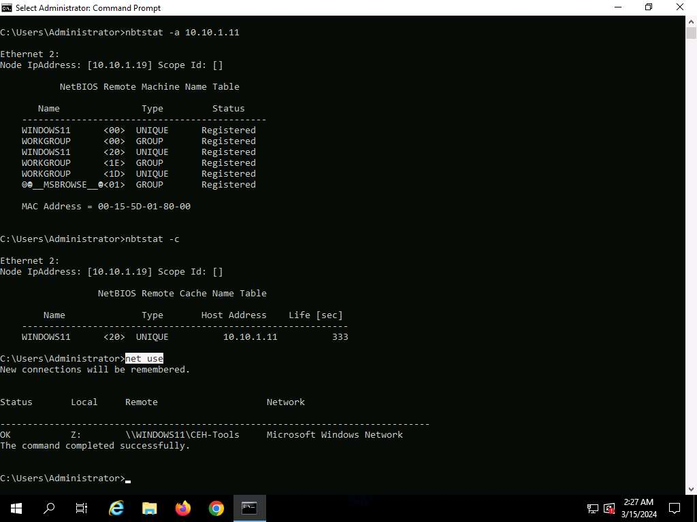

**Figure 1.2:** The `net use` command displayed existing network connections and shared resources that may be useful during network enumeration.

### Learning Outcome

This task demonstrated how Windows command-line utilities can be used to perform NetBIOS enumeration and identify valuable information about target systems, including NetBIOS names and shared network resources. Such information assists penetration testers in building an accurate profile of the target environment.

### Attack Flow

```mermaid
flowchart LR
    A[Target Windows System] --> B[Enumerate NetBIOS Names]
    B --> C[Identify Host Information]
    C --> D[Enumerate Shared Resources]
    D --> E[Build Target Profile]

    style A fill:#1f2937,color:#fff,stroke:#2563eb
    style B fill:#374151,color:#fff,stroke:#2563eb
    style C fill:#4b5563,color:#fff,stroke:#2563eb
    style D fill:#7c3aed,color:#fff,stroke:#8b5cf6
    style E fill:#059669,color:#fff,stroke:#10b981
```

### Overall Learning Outcome

This lab demonstrated how built-in Windows command-line utilities can be used to enumerate NetBIOS information and shared network resources during the reconnaissance phase of a penetration test. The information gathered provides valuable insight into the target environment and supports subsequent enumeration and exploitation activities.

# Lab 2: Perform SNMP Enumeration

## Objective

To perform SNMP enumeration using SnmpWalk and retrieve management information, system details, and network configuration data from a target system.

## Background

Simple Network Management Protocol (SNMP) is widely used to monitor and manage network devices such as routers, switches, servers, and printers. Devices running SNMP expose management information through a hierarchical structure of Object Identifiers (OIDs). If weak or default community strings are configured, attackers can enumerate sensitive information including system details, network interfaces, running services, routing information, and device configurations.

SnmpWalk is a command-line utility that queries SNMP-enabled devices by traversing the Management Information Base (MIB) tree and retrieving all accessible OIDs.

---

## Task 1: Perform SNMP Enumeration using SnmpWalk

### Tools Used

- [SnmpWalk](../../Tools/SnmpWalk.md)

### Activity Performed

SnmpWalk was used to enumerate SNMP information from the target Windows Server 2022 system. Enumeration was performed using both SNMPv1 and SNMPv2c with the default **public** community string. The tool queried the Management Information Base (MIB) and retrieved accessible Object Identifiers (OIDs), exposing valuable information about the target system, including device configuration, system information, network parameters, and management data.

The results demonstrated how improperly secured SNMP services can disclose sensitive information that may assist attackers during reconnaissance.

### Observations

- Successfully connected to the target using the default SNMP community string.
- Retrieved numerous Object Identifiers (OIDs) from the target system.
- Enumerated system information and network management data.
- Observed that misconfigured SNMP services can expose sensitive information useful during reconnaissance.

### Figures

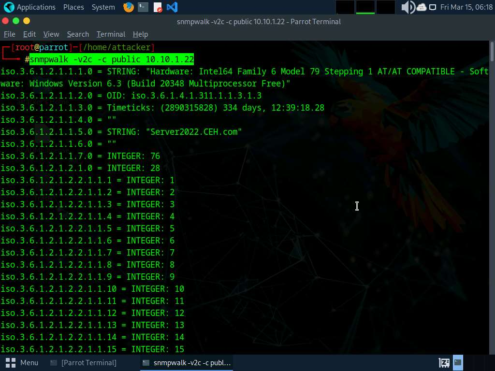

**Figure 2.1:** SnmpWalk enumerated the target system by traversing the Management Information Base (MIB), revealing accessible Object Identifiers (OIDs) and associated system information.

### Learning Outcome

This task demonstrated how SNMP enumeration can reveal valuable management information from network devices when default or weak community strings are configured. Properly securing SNMP services is essential to prevent unauthorized disclosure of sensitive network information.

### Attack Flow

```mermaid
flowchart LR
    A[Target SNMP Service] --> B[Connect using Community String]
    B --> C[Traverse MIB Tree]
    C --> D[Retrieve OIDs]
    D --> E[Enumerate System Information]

    style A fill:#1f2937,color:#fff,stroke:#2563eb
    style B fill:#374151,color:#fff,stroke:#2563eb
    style C fill:#4b5563,color:#fff,stroke:#2563eb
    style D fill:#7c3aed,color:#fff,stroke:#8b5cf6
    style E fill:#059669,color:#fff,stroke:#10b981
```

### Overall Learning Outcome

This lab demonstrated how SnmpWalk can enumerate information exposed by SNMP-enabled systems through accessible Object Identifiers. The retrieved management information provides valuable intelligence during reconnaissance and highlights the importance of securing SNMP services by using strong community strings and restricting unauthorized access.

# Lab 3: Perform LDAP Enumeration

## Objective

To perform LDAP enumeration using Active Directory Explorer (AD Explorer) and retrieve information about the Active Directory structure, domain objects, and user account attributes.

## Background

Lightweight Directory Access Protocol (LDAP) is an application protocol used to access and manage directory services such as Microsoft Active Directory. LDAP stores information about users, groups, computers, organizational units, and other network resources in a hierarchical directory structure. Enumerating LDAP provides penetration testers with valuable information about the domain environment, including user accounts, group memberships, computer objects, and directory configurations.

Active Directory Explorer (AD Explorer) is a graphical tool that enables administrators and security professionals to browse, search, and inspect Active Directory objects without using native Windows administration consoles.

---

## Task 1: Perform LDAP Enumeration using Active Directory Explorer (AD Explorer)

### Tools Used

- [AD Explorer](../../Tools/AD-Explorer.md)

### Activity Performed

Active Directory Explorer was connected to the target Active Directory domain to enumerate LDAP information. The directory hierarchy was explored to identify domain components, organizational units, and user objects. User accounts were inspected to view their associated attributes and properties stored within Active Directory.

The exercise demonstrated how LDAP enumeration provides detailed information about domain users and directory objects that may assist attackers during the reconnaissance phase of a penetration test.

### Observations

- Successfully connected to the target Active Directory domain.
- Enumerated the hierarchical structure of the Active Directory database.
- Retrieved information about domain user accounts.
- Viewed user object attributes and associated directory information.
- Observed that LDAP contains extensive information about the domain environment.

### Figures

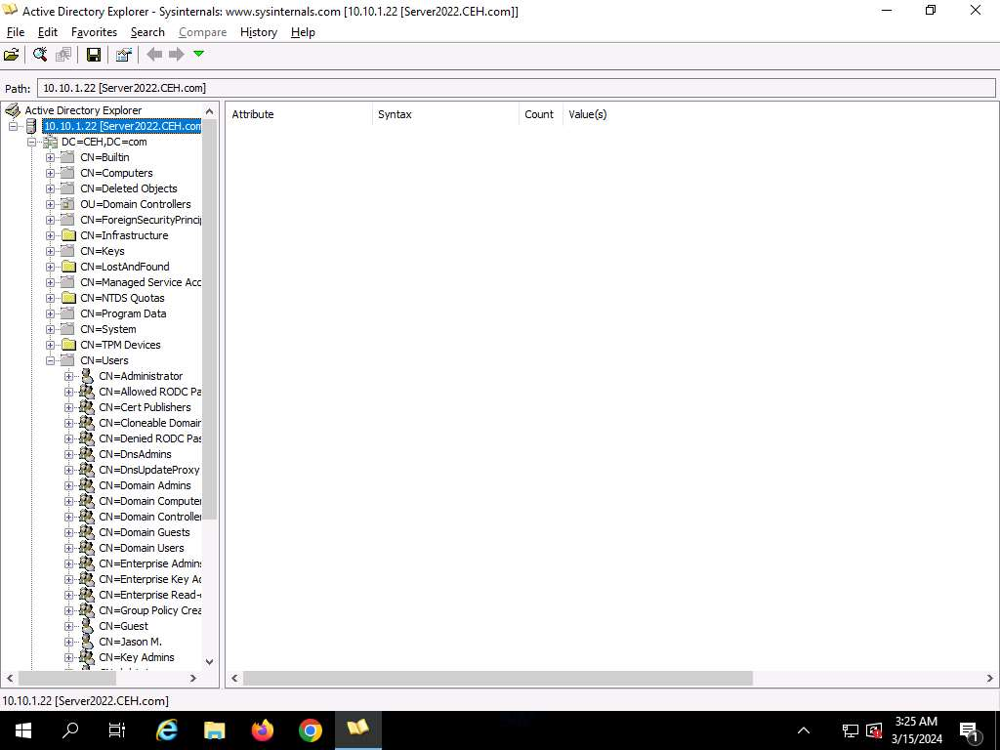

**Figure 3.1:** AD Explorer successfully connected to the target Active Directory domain and displayed the hierarchical LDAP directory structure.

---

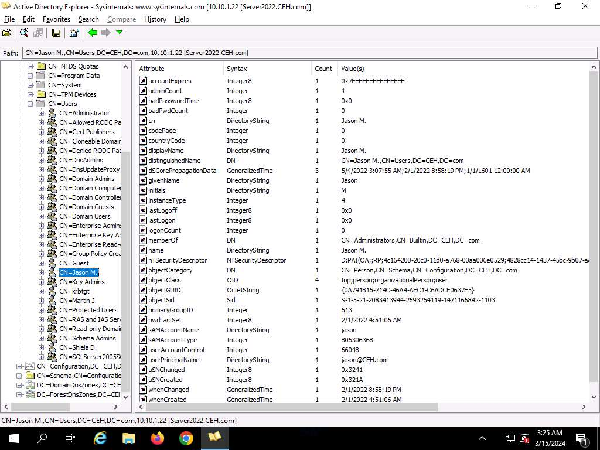

**Figure 3.2:** AD Explorer displayed detailed LDAP attributes associated with a selected domain user account.

### Learning Outcome

This task demonstrated how LDAP enumeration can reveal detailed information about Active Directory domains, including directory objects, user accounts, and associated attributes. Such information is valuable during reconnaissance and can assist penetration testers in understanding the target environment.

### Attack Flow

```mermaid
flowchart LR
    A[Target Active Directory] --> B[Connect via LDAP]
    B --> C[Enumerate Directory Structure]
    C --> D[Enumerate User Objects]
    D --> E[Collect Domain Information]

    style A fill:#1f2937,color:#fff,stroke:#2563eb
    style B fill:#374151,color:#fff,stroke:#2563eb
    style C fill:#4b5563,color:#fff,stroke:#2563eb
    style D fill:#7c3aed,color:#fff,stroke:#8b5cf6
    style E fill:#059669,color:#fff,stroke:#10b981
```

### Overall Learning Outcome

This lab demonstrated how LDAP enumeration using AD Explorer provides insight into the structure and contents of an Active Directory environment. Enumerating directory objects and user attributes enables penetration testers to better understand the domain architecture and identify information that may support subsequent attack phases.

# Lab 4: Perform NFS Enumeration

## Objective

To perform Network File System (NFS) enumeration using SuperEnum and RPCScan to identify RPC services, NFS shares, and network resources exposed by the target system.

## Background

Network File System (NFS) enables systems to share files and directories across a network. Before accessing shared resources, attackers often enumerate NFS services to identify exported directories, RPC services, mount points, and file-sharing configurations. Since NFS relies on Remote Procedure Call (RPC) services, both RPC enumeration and NFS enumeration are commonly performed together to identify accessible network resources.

SuperEnum automates the enumeration of common network services, while RPCScan focuses specifically on discovering RPC services and NFS-related information.

---

## Task 1: Perform NFS Enumeration using RPCScan and SuperEnum

### Tools Used

- [SuperEnum](../../Tools/SuperEnum.md)
- [RPCScan](../../Tools/RPCScan.md)

### Activity Performed

NFS enumeration was performed against the target Windows Server 2019 system after confirming that the NFS service was available. SuperEnum was used to scan the target host and identify open services, including the NFS service running on TCP port 2049. The enumeration results confirmed that the NFS service was accessible along with other exposed network services.

RPCScan was then used to enumerate Remote Procedure Call (RPC) services associated with the target. The tool identified the RPC portmapper information and verified that the NFS service was active, providing additional insight into the services exposed by the target system.

### Observations

- Successfully identified the NFS service running on TCP port 2049.
- Enumerated exposed network services using SuperEnum.
- Retrieved RPC information associated with the target host.
- Verified that the NFS service was accessible through RPC enumeration.
- Observed that exposed NFS services can disclose valuable information during reconnaissance.

### Figures

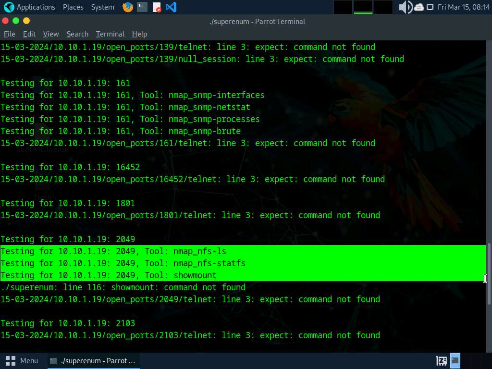

**Figure 4.1:** SuperEnum enumerated the target host and identified the NFS service along with other accessible network services.

---

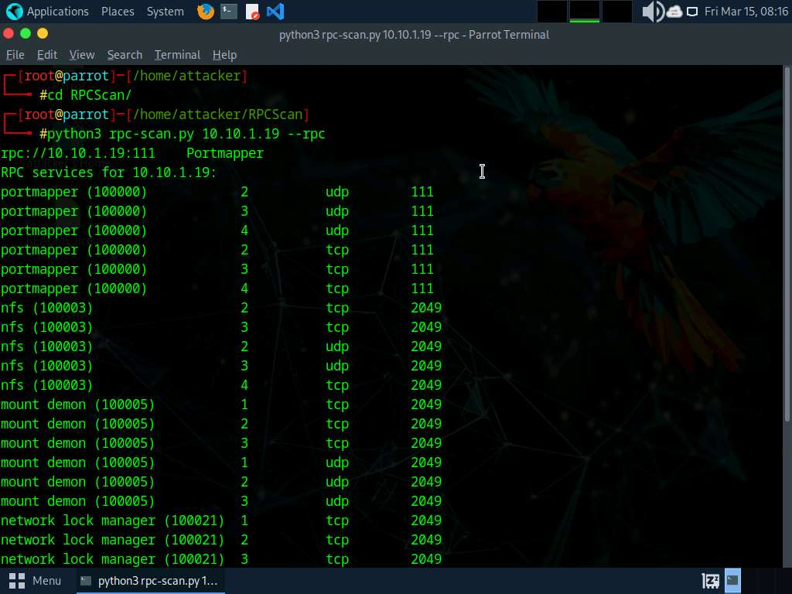

**Figure 4.2:** RPCScan enumerated the target's RPC services and verified the availability of the NFS service on the target system.

### Learning Outcome

This task demonstrated how SuperEnum and RPCScan can be used to enumerate NFS and RPC services, allowing penetration testers to identify shared resources and exposed services that may be leveraged during subsequent attack phases.

### Attack Flow

```mermaid
flowchart LR
    A[Target NFS Server] --> B[Enumerate Services]
    B --> C[Identify NFS Port 2049]
    C --> D[Enumerate RPC Services]
    D --> E[Identify Exposed Resources]

    style A fill:#1f2937,color:#fff,stroke:#2563eb
    style B fill:#374151,color:#fff,stroke:#2563eb
    style C fill:#4b5563,color:#fff,stroke:#2563eb
    style D fill:#7c3aed,color:#fff,stroke:#8b5cf6
    style E fill:#059669,color:#fff,stroke:#10b981
```

### Overall Learning Outcome

This lab demonstrated how NFS and RPC enumeration reveal information about shared services and network resources exposed by a target system. Identifying accessible NFS services enables penetration testers to evaluate potential file-sharing weaknesses and better understand the attack surface presented by network storage services.

# Lab 5: Perform DNS Enumeration

## Objective

To perform DNS enumeration using Windows and Linux command-line utilities to retrieve DNS information and assess whether the target DNS server permits zone transfers.

## Background

The Domain Name System (DNS) translates human-readable domain names into IP addresses and stores important information about network infrastructure. DNS enumeration enables penetration testers to identify authoritative name servers, mail servers, Start of Authority (SOA) records, and other DNS information that helps map a target's network.

A DNS zone transfer (AXFR) is used to replicate DNS records between primary and secondary DNS servers. If improperly configured, attackers may retrieve the entire DNS zone database, exposing internal hosts and network information that can assist in further attacks.

---

## Task 1: Perform DNS Enumeration using Zone Transfer

### Tools Used

- [Windows Command-Line Utilities](../../Tools/Windows-Command-Line-Utilities.md)

### Activity Performed

Windows and Linux command-line utilities were used to perform DNS enumeration on the target domain. The **`dig`** utility on the Parrot Security machine was used to identify the authoritative DNS name servers and attempt a DNS zone transfer (AXFR). On the Windows system, the **`nslookup`** utility was used to retrieve the Start of Authority (SOA) record and verify whether the target DNS server permitted zone transfers.

The enumeration successfully retrieved DNS server information, while the zone transfer request was refused by the target DNS server, demonstrating that unauthorized zone transfers were disabled.

### Observations

- Successfully identified the authoritative DNS name servers for the target domain.
- Retrieved Start of Authority (SOA) information for the target domain.
- Attempted a DNS zone transfer (AXFR) against the target DNS server.
- Observed that the target server refused unauthorized zone transfer requests.
- Confirmed that properly configured DNS servers restrict zone transfers to authorized secondary servers.

### Figures

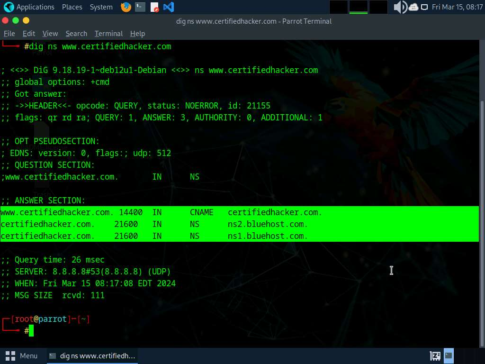

**Figure 5.1:** The `dig` utility enumerated the target domain's authoritative DNS name servers by querying DNS records.

---

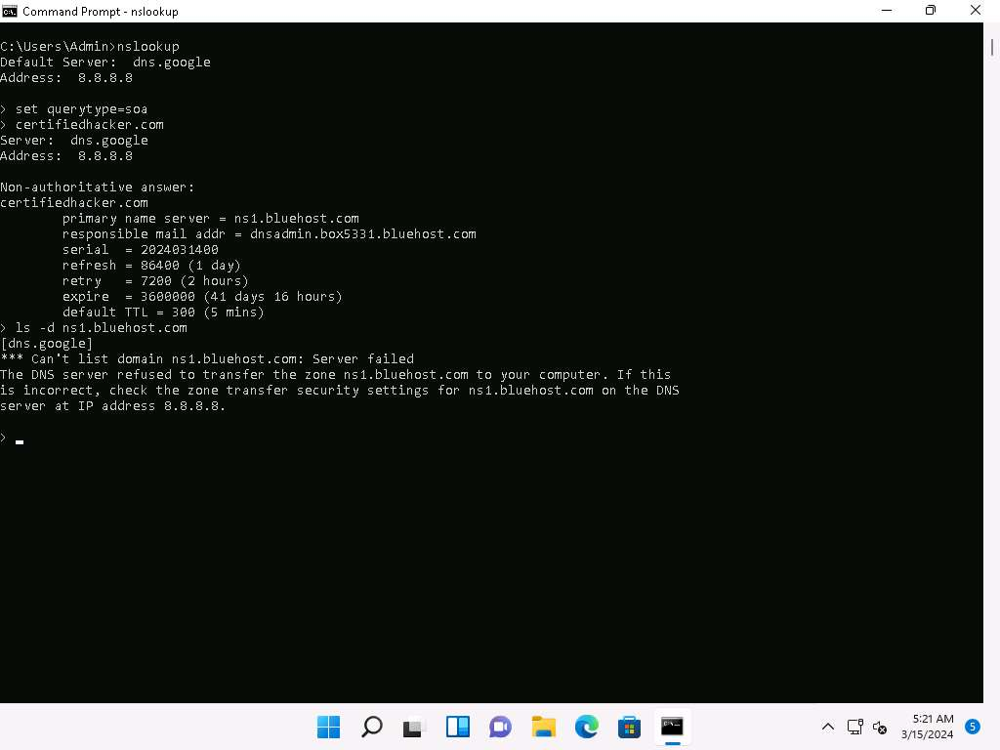

**Figure 5.2:** A DNS zone transfer request was attempted using command-line utilities. The target DNS server refused the request, preventing unauthorized disclosure of DNS zone information.

### Learning Outcome

This task demonstrated how DNS enumeration reveals valuable information about a target's DNS infrastructure, while zone transfer testing verifies whether sensitive DNS records can be retrieved. Properly configured DNS servers should restrict zone transfers to authorized secondary servers only.

### Attack Flow

```mermaid
flowchart LR
    A[Target Domain] --> B[Enumerate DNS Records]
    B --> C[Identify Name Servers]
    C --> D[Attempt AXFR Zone Transfer]
    D --> E[Assess DNS Security]

    style A fill:#1f2937,color:#fff,stroke:#2563eb
    style B fill:#374151,color:#fff,stroke:#2563eb
    style C fill:#4b5563,color:#fff,stroke:#2563eb
    style D fill:#7c3aed,color:#fff,stroke:#8b5cf6
    style E fill:#059669,color:#fff,stroke:#10b981
```

### Overall Learning Outcome

This lab demonstrated how DNS enumeration provides insight into a target organization's DNS infrastructure and how DNS zone transfer testing helps determine whether sensitive DNS records are exposed. Restricting zone transfers is an important defensive measure that prevents attackers from obtaining a complete map of an organization's network.

# Lab 6: Perform SMTP Enumeration

## Objective

To perform SMTP enumeration using the Nmap Scripting Engine (NSE) and identify valid mail users, SMTP relay configurations, and supported SMTP service information on the target system.

## Background

Simple Mail Transfer Protocol (SMTP) is responsible for sending email across networks. Misconfigured SMTP servers may disclose valid user accounts, allow unauthorized mail relaying, or reveal supported SMTP commands that attackers can leverage during subsequent attacks. Enumerating SMTP services enables penetration testers to identify potential weaknesses that may facilitate password spraying, phishing, or unauthorized mail delivery.

Nmap's Scripting Engine (NSE) provides specialized SMTP scripts that automate the enumeration of mail users, relay configurations, and supported SMTP functionality.

---

## Task 1: Perform SMTP Enumeration using Nmap

### Tools Used

- [Nmap](../../Tools/Nmap.md)

### Activity Performed

Nmap NSE scripts were used to enumerate the SMTP service running on the target system. The `smtp-enum-users` script identified potential mail user accounts configured on the SMTP server, while the `smtp-open-relay` script tested whether the server permitted unauthorized mail relaying. Additional SMTP scripts were explored to identify supported SMTP commands and further understand the capabilities of the target mail server.

The enumeration demonstrated how SMTP services can expose valuable information that may assist attackers during user enumeration and password-based attacks.

### Observations

- Successfully enumerated potential SMTP user accounts.
- Verified the SMTP relay configuration of the target server.
- Identified supported SMTP functionality using Nmap NSE scripts.
- Observed that improperly configured SMTP services may expose valuable reconnaissance information.
- Recognized the risk of password spraying attacks using enumerated mail accounts.

### Figures

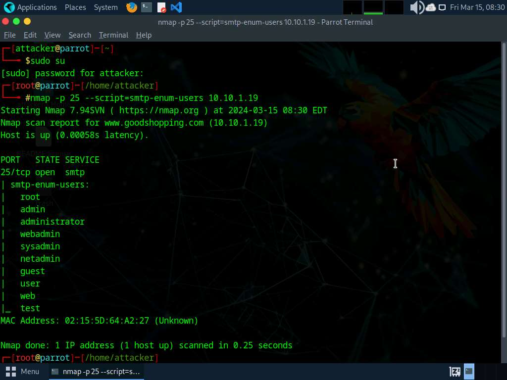

**Figure 6.1:** The `smtp-enum-users` NSE script enumerated potential mail user accounts configured on the target SMTP server.

---

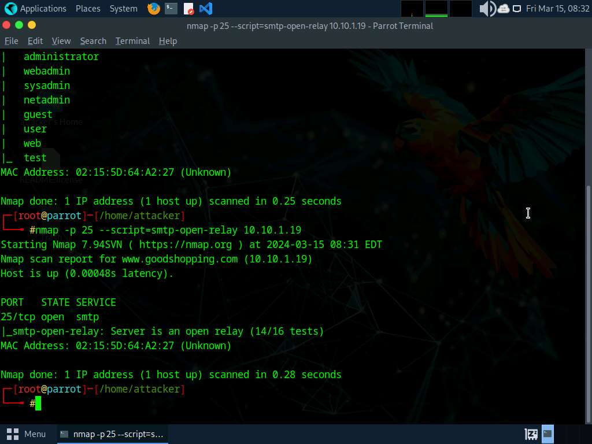

**Figure 6.2:** The `smtp-open-relay` NSE script assessed whether the target SMTP server permitted unauthorized mail relaying.

### Learning Outcome

This task demonstrated how Nmap NSE scripts can enumerate SMTP services to identify valid mail users and assess mail relay security. Proper SMTP configuration is essential to prevent information disclosure and unauthorized email relay attacks.

### Attack Flow

```mermaid
flowchart LR
    A[Target SMTP Server] --> B[Enumerate Mail Users]
    B --> C[Test SMTP Relay]
    C --> D[Identify SMTP Capabilities]
    D --> E[Assess Security Posture]

    style A fill:#1f2937,color:#fff,stroke:#2563eb
    style B fill:#374151,color:#fff,stroke:#2563eb
    style C fill:#4b5563,color:#fff,stroke:#2563eb
    style D fill:#7c3aed,color:#fff,stroke:#8b5cf6
    style E fill:#059669,color:#fff,stroke:#10b981
```

### Overall Learning Outcome

This lab demonstrated how SMTP enumeration using Nmap's Scripting Engine can identify valid mail users and evaluate SMTP relay security. The information gathered highlights potential weaknesses in mail server configurations and emphasizes the importance of securing SMTP services against unauthorized enumeration and abuse.

# Lab 7: Perform Enumeration using Various Enumeration Tools

## Objective

To perform comprehensive system enumeration using Global Network Inventory and collect detailed information about the target system, including operating system details, installed software, hardware information, users, services, and shared resources.

## Background

Global Network Inventory (GNI) is an agentless network auditing and inventory tool that scans systems across a network to collect hardware, software, and configuration information. Unlike individual enumeration utilities that focus on specific services, GNI performs comprehensive host enumeration by gathering information from multiple system components through a single audit process. Such information assists administrators in asset management while also providing valuable reconnaissance data during authorized penetration testing.

---

## Task 1: Enumerate Information using Global Network Inventory

### Tools Used

- [Global Network Inventory](../../Tools/Global-Network-Inventory.md)

### Activity Performed

Global Network Inventory was configured to perform a single-host audit against the target Windows Server 2022 system. After authenticating to the target, the tool conducted a comprehensive inventory scan and collected information about the operating system, hardware configuration, installed software, services, users, NetBIOS information, shared resources, and other system details.

The audit results were presented through categorized views, enabling detailed inspection of different aspects of the target system from a single interface.

### Observations

- Successfully completed a comprehensive audit of the target system.
- Retrieved detailed operating system information.
- Enumerated installed software and system components.
- Collected user, service, NetBIOS, and hardware information.
- Observed that centralized inventory tools provide extensive reconnaissance information through a single audit.

### Figures

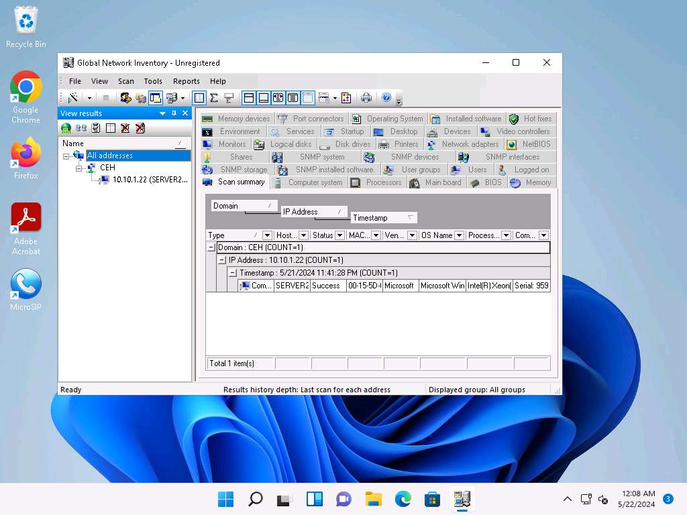

**Figure 7.1:** Global Network Inventory completed the audit and displayed a summary of the collected information for the target system.

---

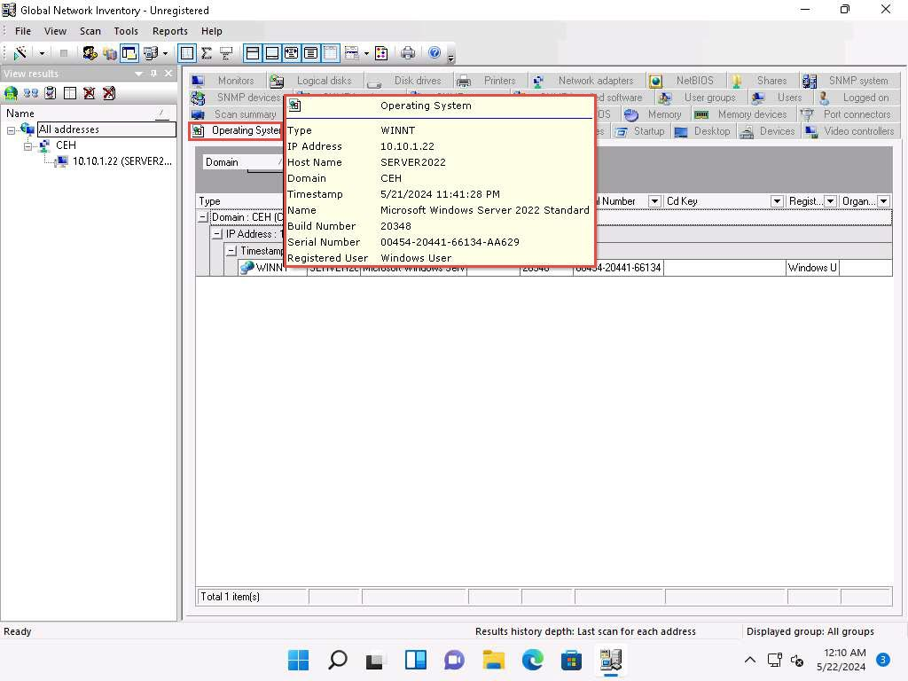

**Figure 7.2:** The Operating System view displayed detailed information about the target machine's operating system and configuration.

---

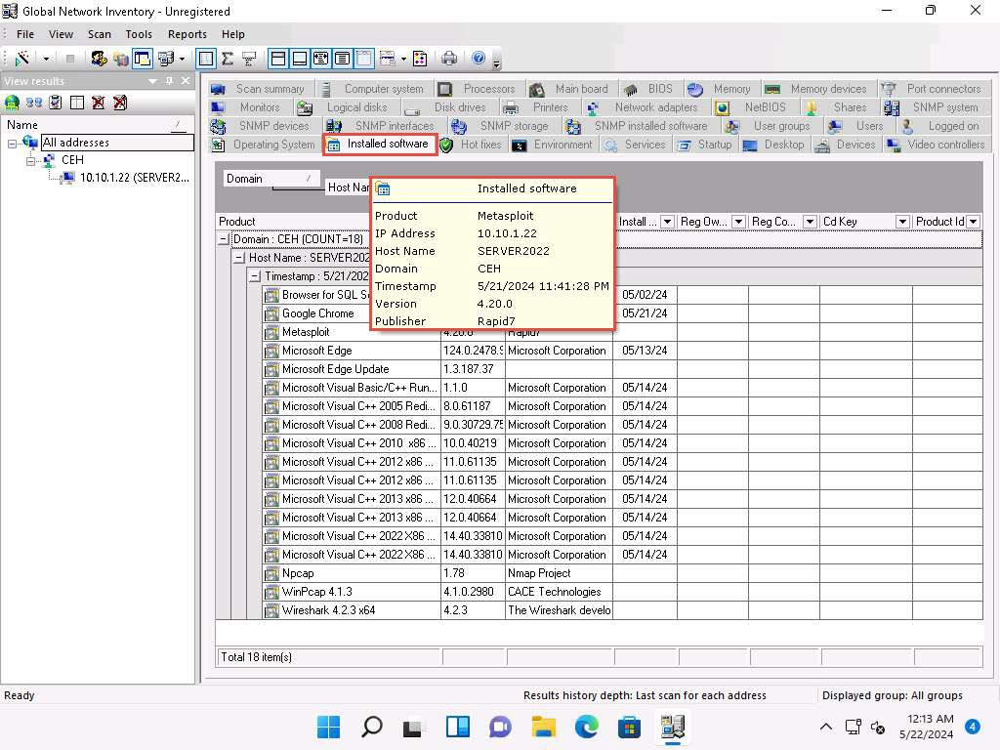

**Figure 7.3:** Global Network Inventory enumerated the software installed on the target system, providing valuable asset and application information.

### Learning Outcome

This task demonstrated how Global Network Inventory performs centralized host enumeration by collecting operating system, software, hardware, user, and service information from target systems. Such comprehensive inventories assist both system administrators and penetration testers in understanding the target environment.

### Attack Flow

```mermaid
flowchart LR
    A[Target System] --> B[Authenticate]
    B --> C[Perform Inventory Scan]
    C --> D[Collect System Information]
    D --> E[Generate Audit Report]

    style A fill:#1f2937,color:#fff,stroke:#2563eb
    style B fill:#374151,color:#fff,stroke:#2563eb
    style C fill:#4b5563,color:#fff,stroke:#2563eb
    style D fill:#7c3aed,color:#fff,stroke:#8b5cf6
    style E fill:#059669,color:#fff,stroke:#10b981
```

### Overall Learning Outcome

This lab demonstrated how Global Network Inventory provides comprehensive system enumeration by consolidating hardware, software, network, and user information into a single audit. Such tools enable rapid asset discovery and provide valuable intelligence during security assessments and infrastructure management.

# Lab 8: Perform Enumeration using AI

## Objective

To perform AI-assisted network enumeration using ShellGPT by generating and executing enumeration commands for various network services and automating common reconnaissance tasks.

## Background

ShellGPT integrates OpenAI's language models with the command line, enabling users to generate shell commands through natural language prompts. During penetration testing, ShellGPT can simplify enumeration by producing commands for tools such as Nmap and SnmpWalk, automating repetitive tasks, and generating scripts that accelerate reconnaissance activities while reducing manual effort.

---

## Task 1: Perform Enumeration using ShellGPT

### Tools Used

- [ShellGPT](../../Tools/ShellGPT.md)

### Activity Performed

ShellGPT was configured on the Parrot Security machine and used to generate shell commands for performing enumeration against target systems. Natural language prompts were supplied to enumerate NetBIOS, SNMP, SMTP, DNS, LDAP, SMB, IPsec, and FTP services using established security tools such as Nmap and SnmpWalk.

In addition to generating individual enumeration commands, ShellGPT was used to create an automation script capable of performing multiple enumeration tasks against a target network. This demonstrated how AI can accelerate reconnaissance by translating high-level instructions into executable security commands.

### Observations

- Successfully generated enumeration commands using natural language prompts.
- Performed NetBIOS, SNMP, SMTP, DNS, LDAP, SMB, IPsec, and FTP enumeration through AI-generated commands.
- Automated multiple enumeration tasks using a generated script.
- Reduced manual effort required to construct complex command-line syntax.
- Observed that generated commands may vary depending on the environment and available tools.

### Figures

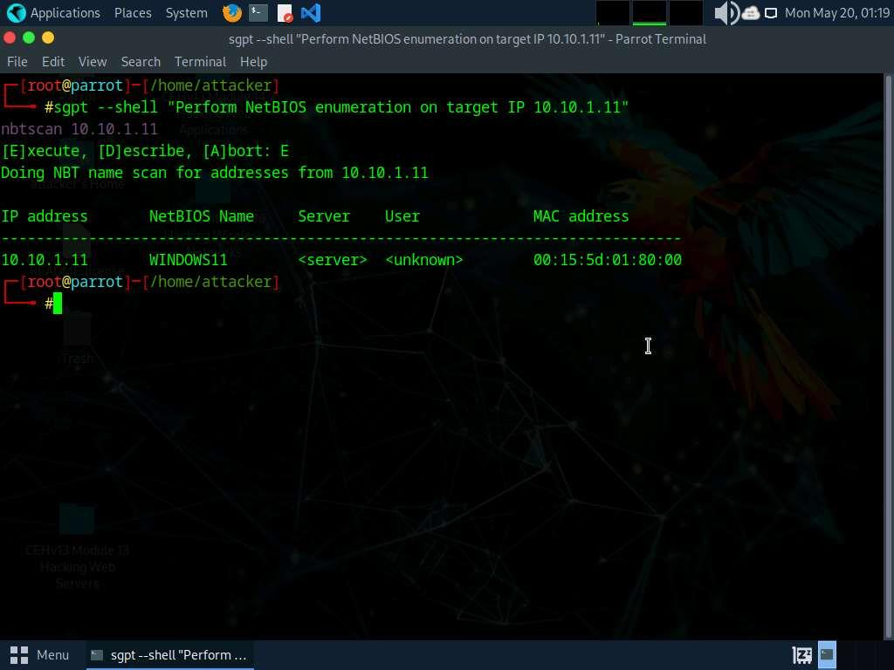

**Figure 8.1:** ShellGPT generated and executed commands to perform NetBIOS enumeration on the target system.

---

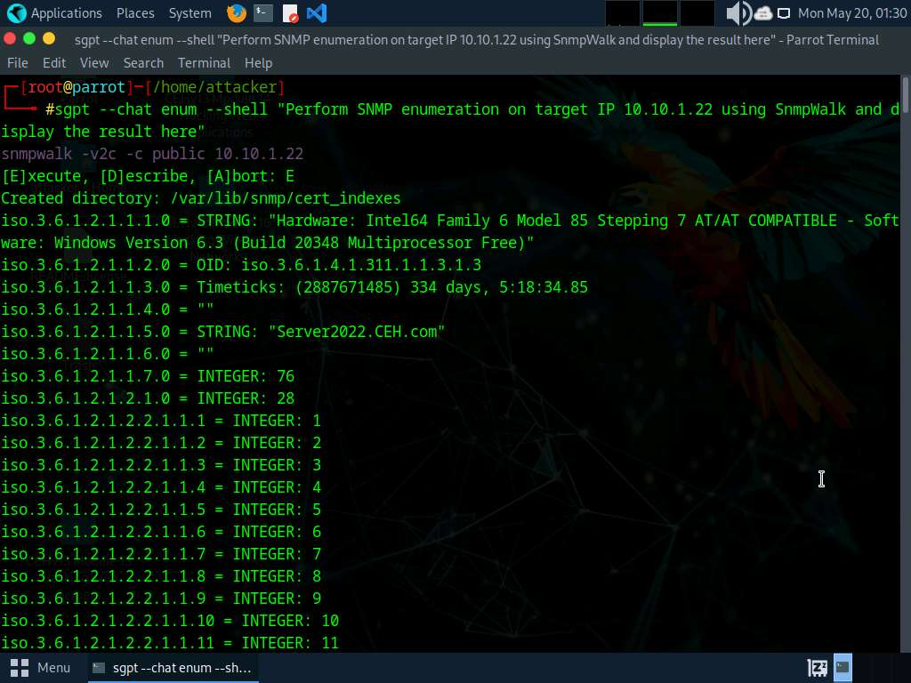

**Figure 8.2:** ShellGPT generated commands for SNMP enumeration using existing security tools.

---

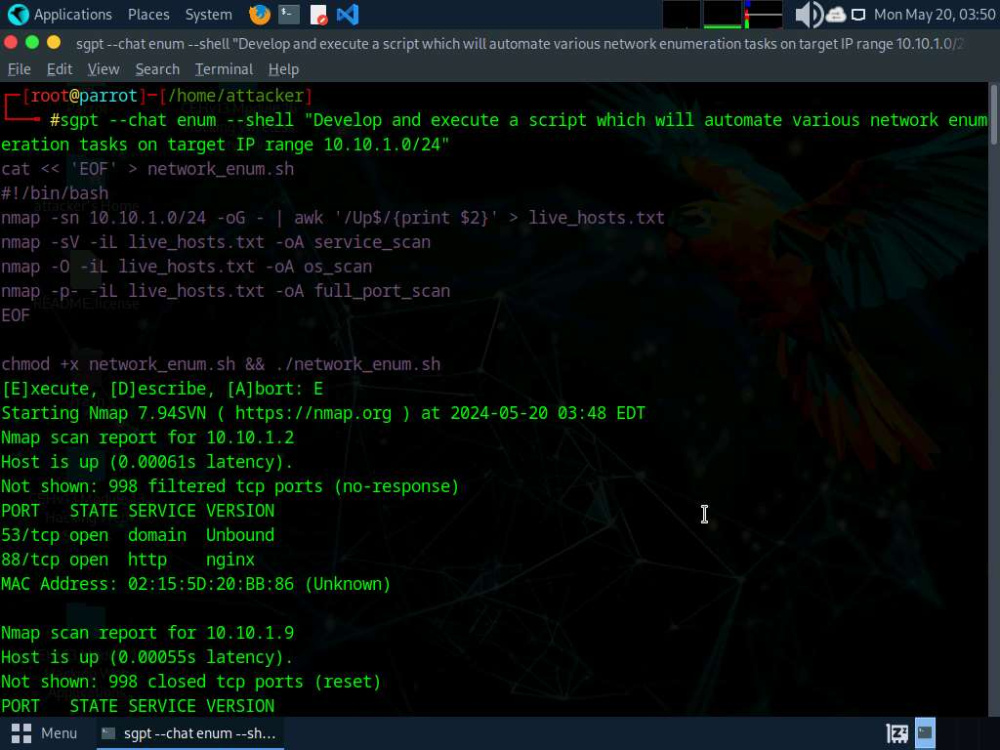

**Figure 8.3:** ShellGPT generated an automation script to perform multiple network enumeration tasks against the target environment.

### Learning Outcome

This task demonstrated how ShellGPT can simplify penetration testing by converting natural language prompts into executable enumeration commands and automation scripts. AI-assisted workflows improve efficiency while still relying on established security tools for the actual enumeration process.

### Attack Flow

```mermaid
flowchart LR
    A[Natural Language Prompt] --> B[ShellGPT]
    B --> C[Generate Security Commands]
    C --> D[Execute Enumeration]
    D --> E[Collect Results]

    style A fill:#1f2937,color:#fff,stroke:#2563eb
    style B fill:#374151,color:#fff,stroke:#2563eb
    style C fill:#4b5563,color:#fff,stroke:#2563eb
    style D fill:#7c3aed,color:#fff,stroke:#8b5cf6
    style E fill:#059669,color:#fff,stroke:#10b981
```

### Overall Learning Outcome

This lab demonstrated how AI-assisted tools such as ShellGPT can streamline network enumeration by generating commands, automating repetitive tasks, and orchestrating established security utilities. While the underlying enumeration is still performed by traditional tools, AI significantly improves efficiency and reduces the complexity of command generation during penetration testing.

## Key Takeaways

- Understood enumeration as the active information-gathering phase that follows network scanning in the penetration testing lifecycle.
- Performed NetBIOS enumeration to discover machine names, shared resources, and network information.
- Used SNMP enumeration to retrieve management information and identify system details through community strings.
- Explored Active Directory using LDAP enumeration to obtain domain objects, users, and directory information.
- Enumerated NFS services to identify exported shares and remotely accessible resources.
- Conducted DNS enumeration using zone transfer techniques to assess DNS server configurations and information disclosure.
- Performed SMTP enumeration to identify valid mail users, evaluate SMTP relay configurations, and inspect supported SMTP capabilities.
- Utilized Global Network Inventory to perform comprehensive host inventory and asset enumeration.
- Leveraged ShellGPT to automate and simplify enumeration tasks using AI-generated commands.
- Recognized how detailed enumeration results can reveal potential attack vectors and support subsequent vulnerability analysis and exploitation phases.

---

## Defensive Perspective

Enumeration can expose valuable information that attackers may leverage to compromise an organization's infrastructure. Organizations should minimize information disclosure by disabling unnecessary services, restricting anonymous access, securing SNMP with strong community strings or SNMPv3, preventing unauthorized DNS zone transfers, disabling SMTP user enumeration and open relay configurations, limiting access to shared resources, and enforcing the principle of least privilege. Regular security audits, service hardening, network segmentation, and continuous monitoring help reduce the attack surface exposed during the enumeration phase.

---

## Interview Questions

1. What is enumeration, and how does it differ from network scanning?
2. Why is NetBIOS enumeration useful during penetration testing?
3. What information can be obtained through SNMP enumeration?
4. How does LDAP enumeration assist in Active Directory security assessments?
5. What is the purpose of NFS enumeration?
6. Explain DNS zone transfer and its security implications.
7. What information can be gathered through SMTP enumeration?
8. What advantages do inventory tools such as Global Network Inventory provide during security assessments?
9. How can AI tools like ShellGPT improve network enumeration workflows?
10. What defensive measures can organizations implement to prevent unauthorized enumeration?

---

## My Reflection

This module strengthened my understanding of enumeration as the bridge between reconnaissance and exploitation. Rather than simply identifying live hosts and open ports, enumeration revealed detailed information about users, services, operating systems, network resources, and configurations that could later be leveraged during vulnerability assessments or exploitation. Working with both traditional enumeration tools and AI-assisted workflows demonstrated how automation can improve efficiency while reinforcing the importance of securing exposed services, restricting unnecessary information disclosure, and implementing proper security controls to reduce an organization's attack surface.