# Module 05: Vulnerability Analysis

> **Status:** ✅ Completed
>
> **Difficulty:** ⭐⭐⭐☆☆
>
> **Labs Completed:** 3
>
> **Tools Covered:** CWE, OpenVAS, ShellGPT

---

# Module Summary

This module introduces vulnerability analysis, where ethical hackers identify, assess, and prioritize security weaknesses in target systems using vulnerability databases, automated vulnerability assessment tools, and AI-assisted techniques before exploitation.

---

# Overview

Vulnerability analysis is the process of identifying, evaluating, and prioritizing security weaknesses within a target system or network. Following reconnaissance, scanning, and enumeration, ethical hackers perform vulnerability assessments to identify known vulnerabilities, configuration weaknesses, missing security patches, weak authentication mechanisms, and other security flaws that could be exploited by attackers.

This module explores vulnerability research using Common Weakness Enumeration (CWE), automated vulnerability assessment using OpenVAS, and AI-assisted vulnerability analysis using ShellGPT. These techniques enable security professionals to proactively discover vulnerabilities, evaluate their severity, and recommend effective remediation measures before they can be exploited.

---

# Learning Objectives

After completing this module, I was able to:

- Understand the purpose and importance of vulnerability analysis.
- Perform vulnerability research using Common Weakness Enumeration (CWE).
- Conduct automated vulnerability assessments using OpenVAS.
- Interpret vulnerability scan results and assess security risks.
- Understand vulnerability scoring and classification concepts.
- Perform AI-assisted vulnerability analysis using ShellGPT.
- Recommend appropriate mitigation strategies for identified vulnerabilities.

---

# Key Concepts

- Vulnerability Analysis
- Vulnerability Assessment
- Common Weakness Enumeration (CWE)
- Common Vulnerabilities and Exposures (CVE)
- Common Vulnerability Scoring System (CVSS)
- OpenVAS
- Greenbone Vulnerability Management (GVM)
- Security Misconfiguration
- Risk Assessment
- Vulnerability Research
- AI-Assisted Vulnerability Analysis

---

# Tools Used

- [CWE](../../Tools/CWE.md)
- [OpenVAS](../../Tools/OpenVAS.md)
- [ShellGPT](../../Tools/ShellGPT.md)

---

# Labs Covered

| Lab | Description |
|------|-------------|
| Lab 1 | Perform Vulnerability Research in Common Weakness Enumeration (CWE) |
| Lab 2 | Perform Vulnerability Assessment using OpenVAS |
| Lab 3 | Perform Vulnerability Analysis using ShellGPT |

---

## Lab 1: Perform Vulnerability Research with Vulnerability Scoring Systems and Databases

### Objective

Perform vulnerability research using the Common Weakness Enumeration (CWE) database to identify software weaknesses and understand their impact on system security.

---

### Background

Common Weakness Enumeration (CWE) is a community-developed classification system that categorizes common software weaknesses and security flaws. It serves as a standardized reference for identifying, understanding, and mitigating vulnerabilities during secure software development and penetration testing.

During vulnerability assessments, ethical hackers use CWE alongside vulnerability databases to research weaknesses affecting discovered services, applications, and operating systems. Understanding these weaknesses helps assess potential attack vectors and prioritize remediation efforts.

---

### Task 1: Perform Vulnerability Research in Common Weakness Enumeration (CWE)

#### Tools Used

- [CWE](../../Tools/CWE.md)

---

#### Activity Performed

- Opened the **Common Weakness Enumeration (CWE)** website using a web browser.
- Searched for **SMB** using the Google Custom Search feature to identify security weaknesses related to the SMB service discovered during the Enumeration phase.
- Reviewed the search results and explored **CWE-284 (Improper Access Control)** to understand the weakness description, potential impact, and mitigation guidance.
- Navigated to the **CWE Top 25 (2023)** list to review the most dangerous software weaknesses and understand commonly exploited security issues.

---

#### Observations

- The CWE database provides standardized information about software weaknesses and their classifications.
- Searching for SMB returned multiple relevant weaknesses affecting access control and network services.
- CWE-284 highlighted issues related to improper access control that could lead to unauthorized access.
- The CWE Top 25 list identifies the most critical software weaknesses frequently exploited by attackers.

---

#### SMB Vulnerability Search

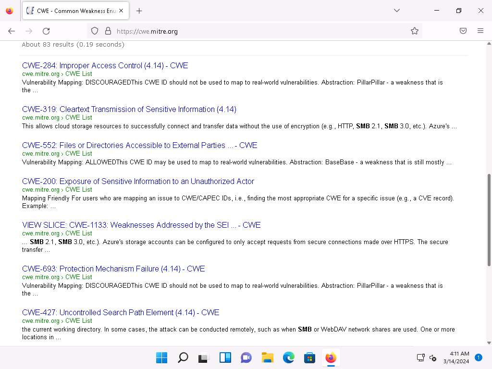

*Figure 1.1 – Searching the Common Weakness Enumeration (CWE) database for SMB-related weaknesses to identify potential security issues associated with the SMB service.*

---

#### CWE-284 Analysis

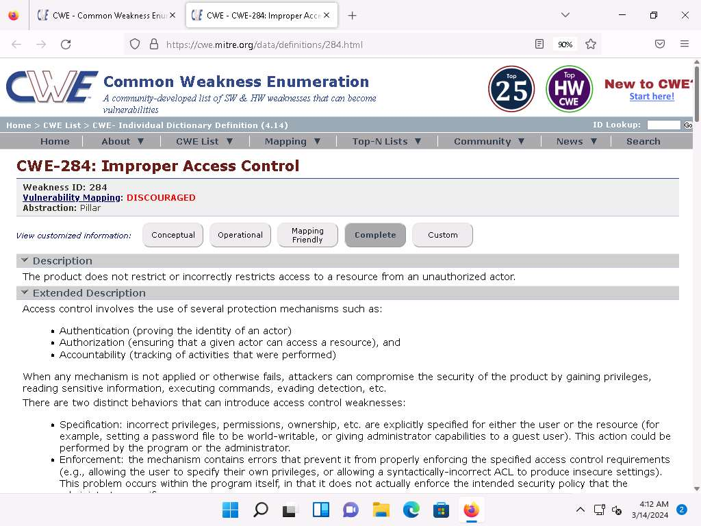

*Figure 1.2 – Detailed information for CWE-284 (Improper Access Control), describing the weakness, its impact, and recommended mitigation strategies.*

---

#### CWE Top 25 Most Dangerous Software Weaknesses

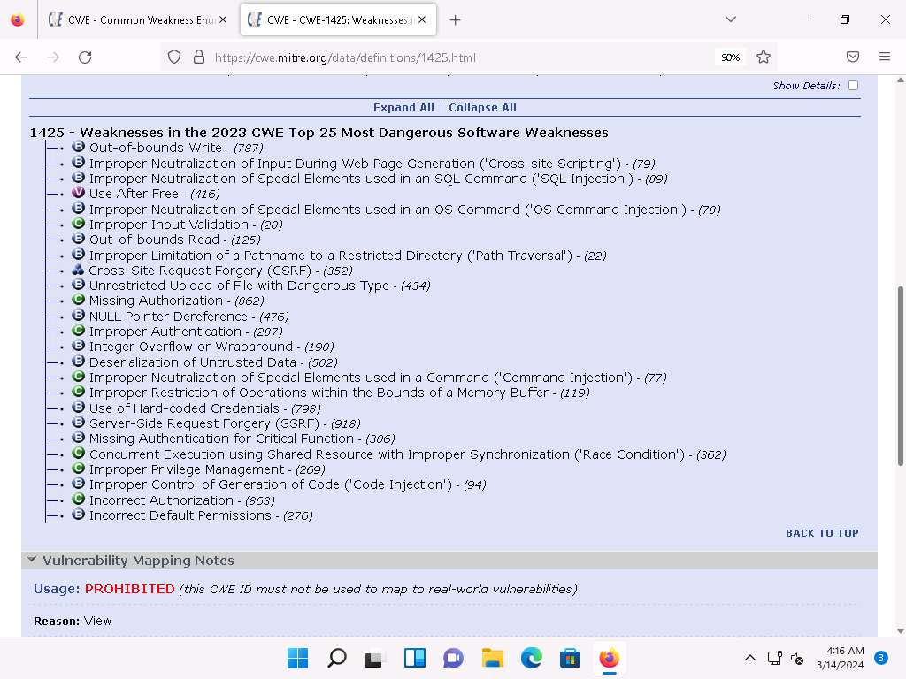

*Figure 1.3 – Viewing the CWE Top 25 Most Dangerous Software Weaknesses to understand the most critical and frequently exploited software security issues.*

---

#### Learning Outcome

Learned how to use the Common Weakness Enumeration (CWE) database to research software weaknesses, analyze vulnerability information, and identify commonly exploited security issues that can assist during vulnerability assessments.

---

#### Attack Flow

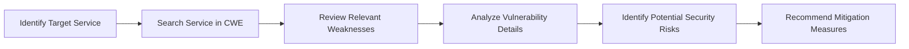

---

### Overall Learning Outcome

Successfully performed vulnerability research using the Common Weakness Enumeration (CWE) database, explored software weaknesses related to SMB services, and understood how vulnerability databases assist ethical hackers in identifying security flaws and supporting effective vulnerability assessments.

---

## Lab 2: Perform Vulnerability Assessment using Various Vulnerability Assessment Tools

### Objective

Perform vulnerability assessment on a target system using OpenVAS to identify security vulnerabilities, evaluate their severity, and analyze the impact of enabling Windows Firewall on scan results.

---

### Background

OpenVAS (Open Vulnerability Assessment System) is an open-source vulnerability scanning and management framework used to identify known security vulnerabilities, configuration weaknesses, missing patches, and exposed services within a target system. It utilizes an extensive database of Network Vulnerability Tests (NVTs) to perform authenticated and unauthenticated security assessments, helping security professionals proactively identify and remediate vulnerabilities before they can be exploited.

---

### Task 1: Perform Vulnerability Analysis using OpenVAS

#### Tools Used

- [OpenVAS](../../Tools/OpenVAS.md)

---

#### Activity Performed

- Launched the OpenVAS Docker container on the Parrot Security machine.
- Accessed the OpenVAS web interface through Firefox and authenticated using the default administrator credentials.
- Created a new scan task using the Task Wizard by specifying the Windows Server 2022 target IP address.
- Executed a vulnerability scan against the target system and reviewed the generated report containing discovered vulnerabilities, affected ports, and severity levels.
- Examined detailed information for individual vulnerabilities to understand their potential impact.
- Enabled Windows Defender Firewall on the target machine and repeated the vulnerability assessment.
- Compared the scan results before and after enabling the firewall to evaluate its impact on vulnerability detection.

---

#### Observations

- OpenVAS successfully identified multiple vulnerabilities, open services, and associated severity levels on the target system.
- Detailed reports included vulnerability descriptions, affected ports, risk ratings, and remediation information.
- Enabling Windows Defender Firewall did not significantly alter the discovered vulnerabilities, indicating that existing vulnerabilities remained detectable.
- Vulnerability assessment provides valuable insight into system security posture and supports remediation planning.

---

#### Vulnerability Scan Configuration

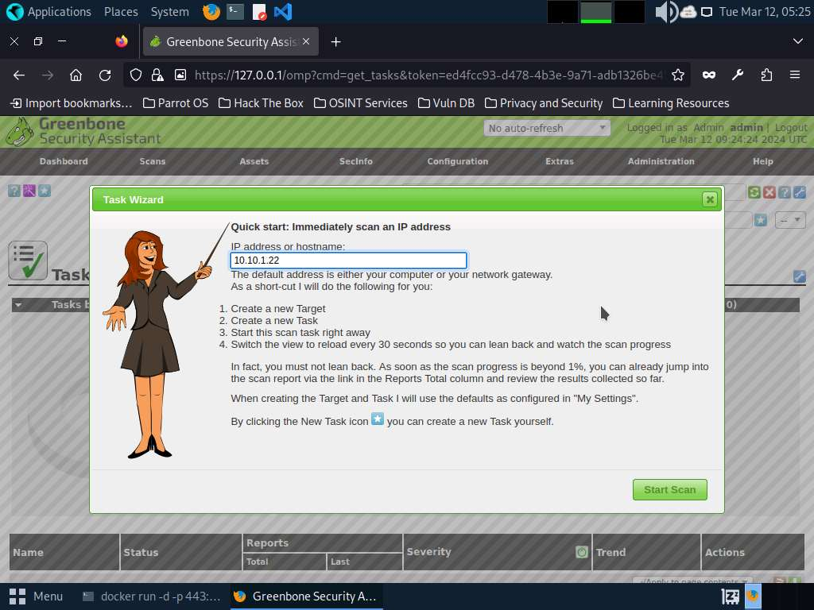

*Figure 2.1 – Configuring a new vulnerability assessment task in OpenVAS by specifying the target system's IP address before initiating the scan.*

---

#### Vulnerability Assessment Report

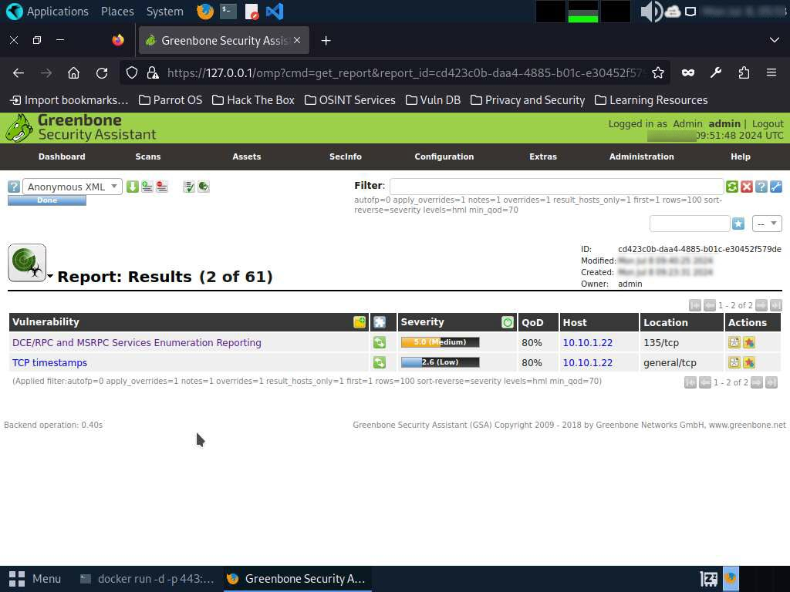

*Figure 2.2 – OpenVAS vulnerability assessment report displaying the discovered vulnerabilities, associated severity levels, affected ports, and security findings for the target system.*

---

#### Firewall Scan Comparison

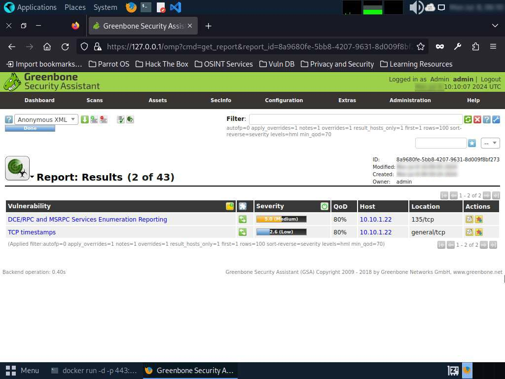

*Figure 2.3 – Comparing the vulnerability assessment results after enabling Windows Defender Firewall to observe its impact on the identified security vulnerabilities.*

---

#### Learning Outcome

Learned how to perform vulnerability assessments using OpenVAS, analyze identified vulnerabilities based on severity, interpret detailed scan reports, and evaluate the effectiveness of Windows Defender Firewall during security assessments.

---

#### Attack Flow

---

### Overall Learning Outcome

Successfully performed vulnerability assessment using OpenVAS, identified security weaknesses within the target system, analyzed vulnerability reports, and evaluated the effect of Windows Defender Firewall on vulnerability detection to better understand system security posture.

---

## Lab 3: Perform Vulnerability Analysis using AI

### Objective

Perform AI-assisted vulnerability analysis using ShellGPT to identify potential security weaknesses, generate vulnerability scanning commands, and analyze scan reports.

---

### Background

Artificial Intelligence is increasingly being integrated into cybersecurity to improve the efficiency of vulnerability assessments. AI-powered tools such as ShellGPT assist ethical hackers by generating security testing commands, interpreting scan results, and recommending appropriate tools for different assessment scenarios. While AI accelerates the testing process, human expertise remains essential to validate findings and make informed security decisions.

---

### Task 1: Perform Vulnerability Analysis using ShellGPT

#### Tools Used

- [ShellGPT](../../Tools/ShellGPT.md)

---

#### Activity Performed

- Configured ShellGPT on the Parrot Security machine using an AI activation key.
- Used ShellGPT to generate and execute a Nikto vulnerability scan against the target website.
- Reviewed the discovered vulnerabilities identified during the Nikto assessment.
- Used ShellGPT to generate and execute a Skipfish vulnerability scan against another target web application.
- Opened and analyzed the generated HTML vulnerability assessment report to review the identified security findings.

---

#### Observations

- ShellGPT successfully generated appropriate vulnerability scanning commands based on natural language prompts.
- Nikto identified potential security weaknesses present on the target website.
- Skipfish performed an automated vulnerability assessment and generated a detailed HTML report.
- AI-assisted command generation improved efficiency while still requiring manual validation of scan results.

---

#### AI-Assisted Vulnerability Assessment

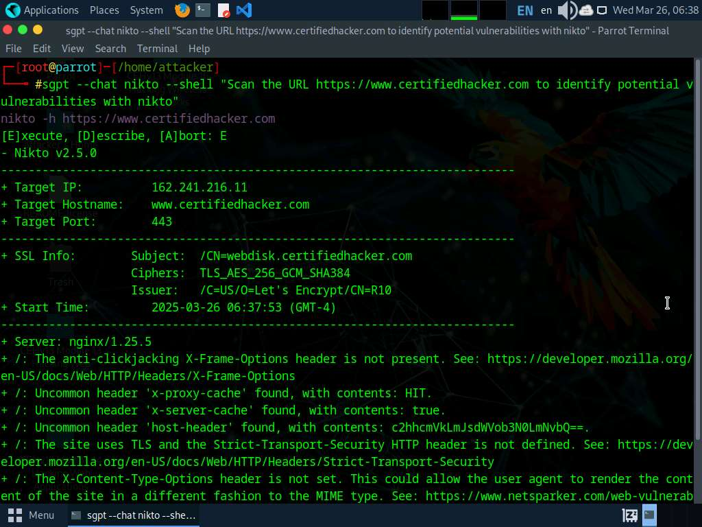

*Figure 3.1 – ShellGPT assisting Nikto in identifying potential security vulnerabilities on the target website.*

---

#### AI-Assisted Skipfish Scan

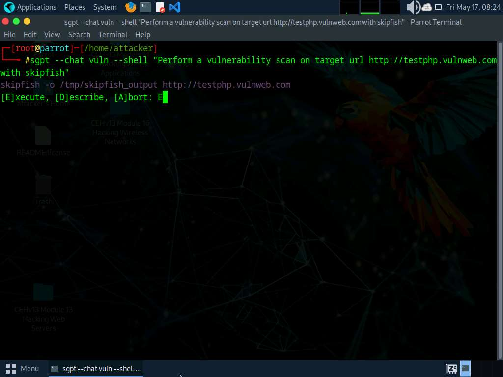

*Figure 3.2 – ShellGPT generating a Skipfish vulnerability scan command for the target web application, demonstrating AI-assisted vulnerability assessment.*

---

#### Skipfish Vulnerability Assessment Report

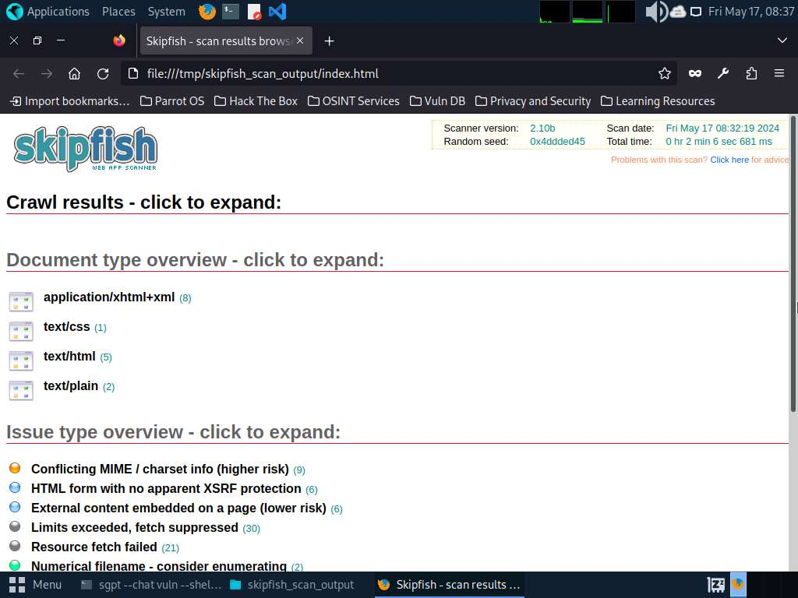

*Figure 3.3 – HTML report generated by Skipfish summarizing the vulnerabilities and security issues identified during the automated assessment.*

---

#### Learning Outcome

Learned how AI-assisted tools such as ShellGPT can streamline vulnerability analysis by generating security testing commands, assisting with automated vulnerability scanning, and supporting the interpretation of vulnerability assessment results.

---

#### Attack Flow

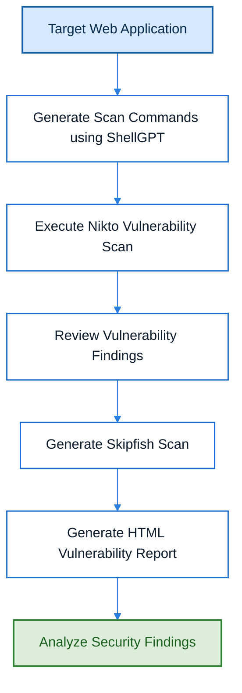

---

### Overall Learning Outcome

Successfully performed AI-assisted vulnerability analysis using ShellGPT to generate vulnerability scanning commands, conduct automated security assessments, and analyze vulnerability reports, demonstrating how AI can improve the efficiency of penetration testing while still requiring human validation of the findings.

---

# Key Takeaways

- Vulnerability analysis helps identify security weaknesses before they can be exploited by attackers.
- Vulnerability databases such as CWE provide valuable information about common software weaknesses and their mitigation.
- OpenVAS automates vulnerability assessments by identifying known vulnerabilities, misconfigurations, and exposed services.
- Vulnerability scan results should always be manually verified to eliminate false positives and accurately assess security risks.
- AI-assisted tools such as ShellGPT can improve the efficiency of vulnerability assessments by generating commands, explaining concepts, and assisting with security analysis.
- Effective vulnerability management requires continuous assessment, prioritization, remediation, and validation.

---

# Defensive Perspective

Vulnerability analysis enables organizations to proactively identify and remediate security weaknesses before they become exploitable. Regular vulnerability assessments, timely patch management, secure system configurations, and continuous monitoring significantly reduce an organization's attack surface. While automated scanners and AI-powered tools accelerate vulnerability discovery, security professionals should always validate findings and implement appropriate remediation measures based on risk and business impact.

---

# Interview Questions

1. What is vulnerability analysis, and why is it important?
2. What is the difference between vulnerability analysis and vulnerability assessment?
3. What is Common Weakness Enumeration (CWE)?
4. How does OpenVAS perform vulnerability assessments?
5. What are the advantages and limitations of automated vulnerability scanners?
6. Why should vulnerability scan results be manually verified?
7. What information can be obtained from a vulnerability assessment report?
8. How does AI assist during vulnerability analysis?
9. What are false positives in vulnerability scanning?
10. Why is vulnerability management considered a continuous process?

---

# My Reflection

This module helped me understand the importance of vulnerability analysis as a critical phase of penetration testing. I learned how vulnerability databases such as CWE provide standardized information about software weaknesses, how OpenVAS identifies security issues through automated assessments, and how AI-powered tools like ShellGPT can assist in performing vulnerability analysis more efficiently.

Beyond learning how to operate the tools, I gained a better understanding of interpreting vulnerability reports, prioritizing security risks, and recognizing that automated findings should always be validated manually. This module reinforced that vulnerability analysis is not only about discovering weaknesses but also about understanding their impact and supporting effective remediation before exploitation occurs.

---