# Module 06: System Hacking

> **Status:** ✅ Completed
>
> **Difficulty:** ⭐⭐⭐⭐⭐
>
> **Labs Completed:** 6
>
> **Tools Covered:** *(To be updated after completing all labs.)*

---

# Module Summary

This module focuses on System Hacking, one of the most critical phases of the ethical hacking methodology, where information collected during footprinting, scanning, enumeration, and vulnerability analysis is used to compromise target systems. Throughout this module, I learned how ethical hackers gain unauthorized access, escalate privileges, maintain persistent access, perform Active Directory attacks, and remove evidence of compromise while understanding the defensive measures used to detect and mitigate these techniques.

The practical labs covered password attacks, reverse shell access, buffer overflow exploitation, privilege escalation, persistence mechanisms, log clearing, Active Directory attacks, and AI-assisted system hacking using various penetration testing tools and Windows administrative features. Rather than focusing solely on individual tools and commands, this documentation explains the methodology, attack lifecycle, security implications, and defensive perspective associated with each phase of system hacking.

---

# Overview

System Hacking is performed after completing the information gathering phases of a penetration test. Information collected during footprinting, scanning, enumeration, and vulnerability analysis is leveraged to gain access to target systems, elevate privileges, establish persistence, and accomplish the objectives of a security assessment.

This module demonstrates how attackers and ethical hackers exploit weaknesses in authentication mechanisms, operating systems, applications, and Active Directory environments to obtain and maintain unauthorized access. It also explores common post-exploitation activities, persistence techniques, and methods used to evade detection by clearing forensic evidence. Additionally, the module introduces AI-assisted system hacking to improve productivity during penetration testing activities.

Throughout the practical labs, I learned not only how various system hacking techniques are performed, but also why each phase is important, how they contribute to the overall attack lifecycle, and what defensive controls can be implemented to detect, prevent, and respond to such attacks.

---

# Learning Objectives

After completing this module, I was able to:

- Understand the complete methodology of system hacking.
- Gain unauthorized access using multiple attack techniques.
- Perform password attacks and exploit authentication weaknesses.
- Establish remote access to compromised systems.
- Perform privilege escalation using operating system weaknesses.
- Understand persistence mechanisms used to maintain access.
- Remove forensic evidence by clearing system logs.
- Perform Active Directory attacks using common penetration testing techniques.
- Understand post-exploitation activities performed after gaining access.
- Utilize AI-assisted tools during system hacking activities.
- Recognize the security risks associated with compromised systems and Active Directory environments.
- Understand defensive measures used to detect and mitigate system hacking attacks.

---

# Key Concepts

- System Hacking
- Gaining Access
- Password Attacks
- Buffer Overflow
- Reverse Shell
- Privilege Escalation
- User Account Control (UAC)
- Persistence
- Registry Run Keys
- Keylogging
- Clearing Logs
- Post-Exploitation
- Active Directory Attacks
- Kerberoasting
- AS-REP Roasting
- Pass-the-Hash
- Credential Access
- Lateral Movement
- Artificial Intelligence in System Hacking

---

# Tools Used

*(To be updated after completing all labs.)*

---

# Labs Covered

| Lab | Description |
|------|-------------|
| Lab 1 | Gain Access to the System |
| Lab 2 | Perform Privilege Escalation to Gain Higher Privileges |
| Lab 3 | Maintain Remote Access and Hide Malicious Activities |
| Lab 4 | Clear Logs to Hide the Evidence of Compromise |
| Lab 5 | Perform Active Directory (AD) Attacks Using Various Tools |
| Lab 6 | Perform System Hacking Using AI |

---

# Lab 1: Gain Access to the System

## Objective

To gain unauthorized access to a target system by exploiting weaknesses in authentication mechanisms using credential interception, password cracking, reverse shell access, and buffer overflow techniques.

---

## Background

Gaining access is the first phase of system hacking, where attackers leverage information collected during reconnaissance, scanning, enumeration, and vulnerability analysis to compromise target systems. Common techniques include password attacks, exploitation of vulnerable services, and authentication attacks that allow attackers to obtain valid user credentials without directly compromising the operating system.

This lab demonstrates several techniques used to gain initial access to a target system, beginning with an active online attack that exploits Windows name resolution protocols to capture authentication hashes and recover user credentials.

---

## Task 1: Perform Active Online Attack to Crack the System's Password Using Responder

### Tools Used

- [Responder](../../Tools/Responder.md)
- [John the Ripper](../../Tools/John-the-Ripper.md)

---

### Activity Performed

An active online password attack was performed using Responder to exploit the Link-Local Multicast Name Resolution (LLMNR) and NetBIOS Name Service (NBT-NS) protocols enabled by default on Windows systems. These protocols provide fallback name resolution when DNS resolution fails, making them susceptible to spoofing attacks within local networks.

Responder was configured to listen on the network interface and poison LLMNR and NBT-NS broadcast requests originating from the target Windows 11 system. When the victim attempted to access a network resource, Responder impersonated the requested server and successfully captured the NTLMv2 authentication challenge-response transmitted by the target.

The captured authentication hash was extracted and supplied to John the Ripper, which performed offline password cracking and successfully recovered the user's plaintext password. This demonstrated how insecure name resolution protocols combined with weak passwords can lead to credential compromise without directly attacking the target system.

---

### Observations

- Successfully poisoned LLMNR/NBT-NS name resolution requests.
- Captured the NTLMv2 authentication hash of the logged-in Windows user.
- Extracted the captured authentication hash for offline analysis.
- Successfully recovered the user's plaintext password using John the Ripper.
- Demonstrated the security risks associated with legacy name resolution protocols in Windows environments.

---

### Responder Listening

**Figure 1.1:** Responder was configured to monitor the network interface and poison LLMNR/NBT-NS requests, allowing authentication attempts from the target system to be intercepted.

---

### Captured NTLM Authentication Hash

**Figure 1.2:** Responder successfully intercepted the NTLMv2 authentication challenge-response of the target user, demonstrating how LLMNR/NBT-NS poisoning can expose credential hashes within an internal network.

---

### Password Successfully Recovered

**Figure 1.3:** John the Ripper successfully recovered the plaintext password from the captured NTLM authentication hash, illustrating the effectiveness of offline password cracking against weak credentials.

---

### Learning Outcome

This task demonstrated how insecure Windows name resolution protocols such as LLMNR and NBT-NS can be exploited to capture NTLM authentication hashes and recover user credentials. It reinforced the importance of disabling unnecessary legacy protocols, enforcing strong password policies, and implementing network protections to mitigate credential interception attacks.

---

### Attack Flow

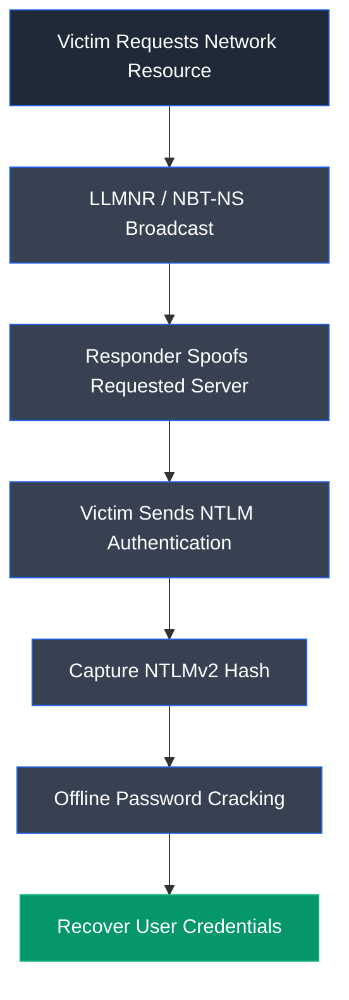
```mermaid
flowchart TD

    A[Victim Requests Network Resource]
    --> B[LLMNR / NBT-NS Broadcast]
    --> C[Responder Spoofs Requested Server]
    --> D[Victim Sends NTLM Authentication]
    --> E[Capture NTLMv2 Hash]
    --> F[Offline Password Cracking]
    --> G[Recover User Credentials]

    classDef start fill:#1f2937,color:#fff,stroke:#2563eb
    classDef process fill:#374151,color:#fff,stroke:#2563eb
    classDef decision fill:#7c3aed,color:#fff,stroke:#8b5cf6
    classDef success fill:#059669,color:#fff,stroke:#10b981

    class A start
    class B,C,D,E,F process
    class G success
```

---

## Task 2: Gain Access to a Remote System Using Reverse Shell Generator

### Tools Used

- [Reverse Shell Generator](../../Tools/Reverse-Shell-Generator.md)
- [Metasploit](../../Tools/Metasploit.md)

---

### Activity Performed

A reverse shell payload was generated using Reverse Shell Generator to automate the creation of reverse shell payloads and listener configurations. Instead of manually constructing payloads and Metasploit listener commands, the tool generated the required MSFVenom payload and corresponding Meterpreter listener based on the specified local IP address and listening port.

The generated payload was transferred to the target Windows system and executed, establishing a Meterpreter reverse shell connection with the attacking machine. The active session was verified using Meterpreter commands, confirming successful remote access to the compromised host.

In addition to Meterpreter, Reverse Shell Generator was used to create a HoaxShell PowerShell payload. After configuring the HoaxShell listener and executing the generated PowerShell script on the target system, a second reverse shell session was successfully established. The active session was verified by identifying the logged-on user through remote command execution.

This task demonstrated how automated payload generation simplifies reverse shell deployment while illustrating multiple methods of establishing remote command execution on a compromised Windows system.

---

### Observations

- Successfully generated a Windows Meterpreter reverse shell payload.
- Established a Meterpreter session with the target Windows system.
- Verified successful remote access using Meterpreter commands.
- Generated a HoaxShell PowerShell reverse shell payload.
- Successfully established a PowerShell-based reverse shell session.
- Verified remote command execution by identifying the logged-on user.

---

### MSFVenom Payload Generated

**Figure 1.4:** Reverse Shell Generator automatically generated the MSFVenom payload command based on the configured listener IP address and port, simplifying reverse shell payload creation.

---

### Meterpreter Session Established

**Figure 1.5:** Execution of the generated payload established a Meterpreter session with the target Windows system, providing interactive remote access to the compromised host.

---

### HoaxShell Payload Generated

**Figure 1.6:** Reverse Shell Generator produced a PowerShell-based HoaxShell payload, enabling remote access using native Windows PowerShell capabilities.

---

### HoaxShell Session Established

**Figure 1.7:** The generated PowerShell payload successfully established a HoaxShell session, allowing remote command execution and verification of the active user on the compromised system.

---

### Learning Outcome

This task demonstrated how reverse shell payload generation and automated listener configuration can streamline remote access during penetration testing. It also highlighted the effectiveness of multiple reverse shell techniques, including Meterpreter and PowerShell-based sessions, while emphasizing the importance of endpoint protection, application control, and network monitoring in detecting and preventing unauthorized remote access.

---

### Attack Flow

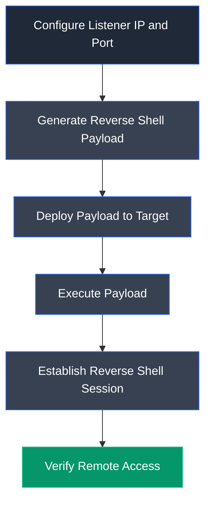
```mermaid
flowchart TD

    A[Configure Listener IP and Port]
    --> B[Generate Reverse Shell Payload]
    --> C[Deploy Payload to Target]
    --> D[Execute Payload]
    --> E[Establish Reverse Shell Session]
    --> F[Verify Remote Access]

    classDef start fill:#1f2937,color:#fff,stroke:#2563eb
    classDef process fill:#374151,color:#fff,stroke:#2563eb
    classDef success fill:#059669,color:#fff,stroke:#10b981

    class A start
    class B,C,D,E process
    class F success
```

---

## Task 3: Perform Buffer Overflow Attack to Gain Access to a Remote System

### Tools Used

- [Immunity Debugger](../../Tools/Immunity-Debugger.md)
- [Netcat](../../Tools/Netcat.md)
- [Spike](../../Tools/Spike.md)
- [Mona](../../Tools/Mona.md)
- [Metasploit](../../Tools/Metasploit.md)

---

### Activity Performed

A buffer overflow attack was performed against a vulnerable server application to gain remote access by manipulating the application's execution flow. The exploitation process followed a structured methodology consisting of vulnerability identification, exploit development, instruction pointer control, shellcode generation, and payload execution.

**Vulnerability Identification:**  
The vulnerable server was attached to Immunity Debugger, allowing its execution to be monitored throughout the attack. Initial interaction with the service using Netcat identified the available functions, after which Spike templates were used to perform spiking against individual commands. The TRUN function caused the application to crash and overwrite stack registers, confirming the presence of a buffer overflow vulnerability.

**Fuzzing and Offset Identification:**  
Python fuzzing scripts were executed to determine the approximate number of bytes required to crash the application. Pattern generation and offset calculation utilities from the Metasploit Framework were then used to determine the exact offset at which the Extended Instruction Pointer (EIP) register could be overwritten.

**Instruction Pointer Control:**  
Custom Python scripts verified that the EIP register could be reliably overwritten with controlled values. Additional testing identified the absence of problematic characters within the payload, ensuring that the generated shellcode would execute correctly without corruption during transmission.

**Exploit Development:**  
Mona was used within Immunity Debugger to enumerate loaded modules and identify a module lacking modern memory protection mechanisms. The appropriate `JMP ESP` return address was located and incorporated into the exploit to redirect program execution toward the injected shellcode.

**Shellcode Generation and Exploitation:**  
A Windows reverse TCP shell payload was generated using MSFVenom and embedded into the exploit script. After configuring Netcat to listen for incoming connections, the completed exploit was executed against the vulnerable server. Successful execution redirected program control to the injected shellcode, resulting in a reverse shell connection from the target system and providing remote command execution.

This task demonstrated the complete exploit development lifecycle, from identifying a vulnerable function to achieving remote code execution through a successfully crafted buffer overflow exploit.

---

### Observations

- Identified the TRUN function as vulnerable to buffer overflow attacks.
- Determined the approximate crash size through fuzzing.
- Successfully calculated the precise offset required to overwrite the EIP register.
- Verified complete control over the EIP register using controlled input values.
- Confirmed that the payload contained no bad characters affecting shellcode execution.
- Identified a suitable module without memory protection using Mona.
- Located a valid `JMP ESP` return address for exploit redirection.
- Successfully generated reverse shell payload using MSFVenom.
- Established a reverse shell connection to the target vulnerable system.
- Verified successful remote command execution after exploitation.

---

### Vulnerable Server Attached to Immunity Debugger

**Figure 1.8:** The vulnerable server was attached to Immunity Debugger and executed under controlled conditions, enabling runtime analysis and exploit development throughout the buffer overflow assessment.

---

### Buffer Overflow Triggered through the TRUN Function

**Figure 1.9:** Executing the vulnerable `TRUN` function caused the application to pause within Immunity Debugger and overwrite critical processor registers, confirming the presence of a controllable buffer overflow vulnerability.

---

### Fuzzing Identified the Crash Point

**Figure 1.10:** Fuzzing progressively increased the input size until the vulnerable application crashed, allowing the approximate buffer size required for exploitation to be identified.

---

### EIP Register Successfully Controlled

**Figure 1.11:** The EIP register was successfully overwritten with a controlled value, confirming that execution flow could be redirected to attacker-controlled shellcode.

---

### Bad Character Analysis

**Figure 1.12:** Examination of the injected payload confirmed the absence of problematic characters that could interfere with shellcode execution during exploitation.

---

### Vulnerable Module Identified Using Mona

**Figure 1.13:** Mona identified a module without modern memory protection mechanisms, providing a suitable target for reliable exploitation.

---

### JMP ESP Return Address Identified

**Figure 1.14:** Mona located a valid `JMP ESP` instruction within the vulnerable module, enabling execution to be redirected toward the injected shellcode.

---

### Reverse Shell Successfully Established

**Figure 1.15:** Successful execution of the exploit established a reverse shell connection, providing remote command execution on the compromised target system.

---

### Learning Outcome

This task demonstrated the complete methodology of buffer overflow exploitation, including vulnerability discovery, fuzzing, offset calculation, instruction pointer control, shellcode generation, and payload execution. It reinforced how insecure memory handling can lead to arbitrary code execution and highlighted the importance of modern exploit mitigation techniques such as DEP, ASLR, and secure software development practices.

---

### Attack Flow

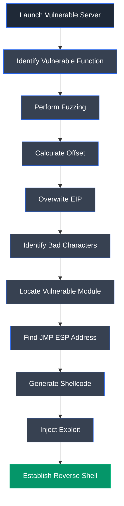
```mermaid
flowchart TD

    A[Launch Vulnerable Server]
    --> B[Identify Vulnerable Function]
    --> C[Perform Fuzzing]
    --> D[Calculate Offset]
    --> E[Overwrite EIP]
    --> F[Identify Bad Characters]
    --> G[Locate Vulnerable Module]
    --> H[Find JMP ESP Address]
    --> I[Generate Shellcode]
    --> J[Inject Exploit]
    --> K[Establish Reverse Shell]

    classDef start fill:#1f2937,color:#fff,stroke:#2563eb
    classDef process fill:#374151,color:#fff,stroke:#2563eb
    classDef exploit fill:#7c3aed,color:#fff,stroke:#8b5cf6
    classDef success fill:#059669,color:#fff,stroke:#10b981

    class A start
    class B,C,D,E,F,G,H,I,J process
    class K success
```

---

## Overall Learning Outcome

This lab demonstrated multiple techniques used to gain initial access to target systems through credential interception, reverse shell deployment, and memory corruption exploitation. It provided practical experience in capturing and cracking authentication credentials, establishing remote access using automated reverse shell payloads, and developing a complete buffer overflow exploit to achieve remote code execution. Overall, the lab reinforced the importance of secure authentication mechanisms, robust memory protection techniques, secure software development practices, and continuous monitoring to defend against common system hacking attacks.

---

# Lab 2: Perform Privilege Escalation to Gain Higher Privileges

## Objective

To obtain higher privileges on a compromised Windows system by bypassing User Account Control (UAC) mechanisms and exploiting built-in accessibility features to gain persistent SYSTEM-level access.

---

## Background

Privilege escalation is the second phase of system hacking, performed after successfully gaining initial access to a target system. Attackers attempt to elevate their privileges from a standard user account to administrative or SYSTEM-level access in order to execute privileged operations, disable security controls, access restricted resources, and establish long-term persistence.

Windows provides several security mechanisms, such as User Account Control (UAC), to restrict unauthorized privilege elevation. However, attackers can exploit operating system misconfigurations, trusted applications, registry-based bypass techniques, and built-in accessibility features to circumvent these protections. Once elevated privileges are obtained, persistence mechanisms can be implemented to retain privileged access even after system reboots or user logouts.

This lab demonstrates privilege escalation through a UAC bypass using the FodHelper Registry Key technique and persistence through exploitation of the Sticky Keys accessibility feature, illustrating how attackers can obtain and maintain SYSTEM-level access on Windows systems.

---

## Task 1: Escalate Privileges by Bypassing UAC and Exploiting Sticky Keys

### Tools Used

- [Metasploit](../../Tools/Metasploit.md)

---

### Activity Performed

A privilege escalation attack was performed by bypassing Windows User Account Control (UAC) and exploiting the Sticky Keys accessibility feature to obtain persistent SYSTEM-level access to the target machine. Initially, an MSFVenom Meterpreter payload was generated and delivered to the target system, establishing a Meterpreter session with the compromised host.

After verifying the active session, a Metasploit local privilege escalation module exploiting the FodHelper Registry Key was executed to bypass UAC restrictions without prompting the user for administrative approval. Once the bypass succeeded, the Meterpreter session was elevated to the **NT AUTHORITY\SYSTEM** account, granting unrestricted administrative privileges on the target system.

To demonstrate persistence, the Sticky Keys accessibility feature was replaced using the Metasploit Sticky Keys post-exploitation module. After locking the target system, pressing the **Shift** key five times launched a command prompt instead of the normal Sticky Keys dialog, providing SYSTEM-level command execution directly from the Windows logon screen without requiring user authentication.

This task demonstrated how privilege escalation combined with persistence techniques enables attackers to maintain privileged access even after the initial compromise.

---

### Observations

- Successfully generated and deployed a Meterpreter payload.
- Established a Meterpreter session with the target Windows system.
- Bypassed Windows User Account Control (UAC) using the FodHelper Registry Key technique.
- Successfully elevated privileges to the **NT AUTHORITY\SYSTEM** account.
- Configured the Sticky Keys accessibility feature to obtain persistent SYSTEM-level access.
- Verified SYSTEM privileges from the Windows logon screen without authenticating to the operating system.

---

### MSFVenom Payload Generated

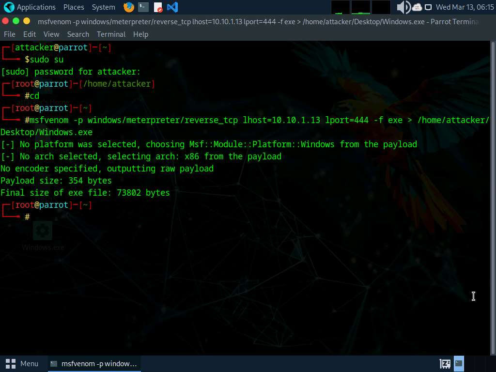

**Figure 2.1:** MSFVenom successfully generated a Windows Meterpreter reverse TCP payload, which was later executed on the target system to establish an initial Meterpreter session.

---

### Meterpreter Session Established

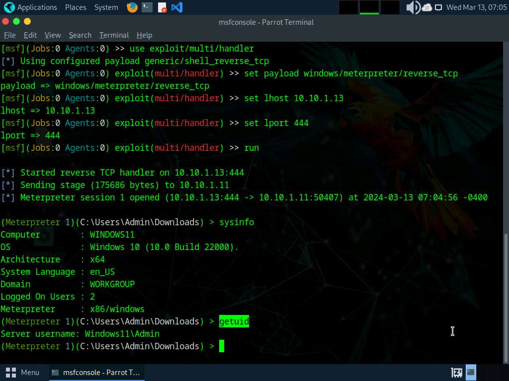

**Figure 2.2:** Execution of the generated payload established a Meterpreter session with the target Windows system, allowing reconnaissance commands such as `sysinfo` to verify the compromised host.

---

### UAC Bypass and SYSTEM Privileges

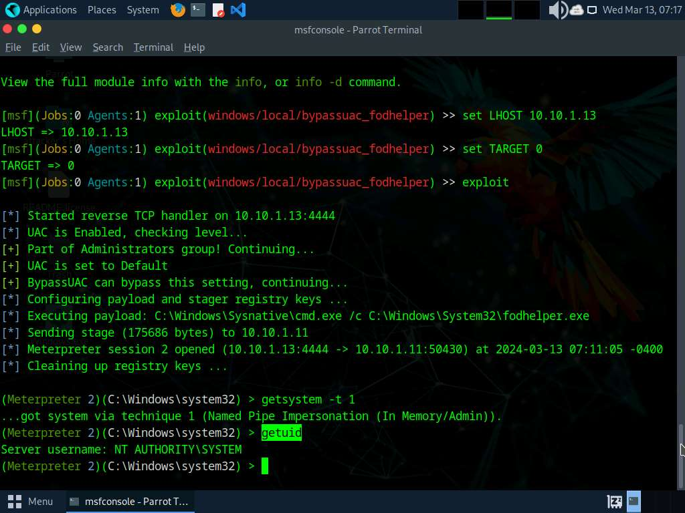

**Figure 2.3:** The Metasploit FodHelper UAC bypass module successfully elevated the Meterpreter session to **NT AUTHORITY\SYSTEM**, providing unrestricted administrative privileges on the compromised system.

---

### Sticky Keys Persistence

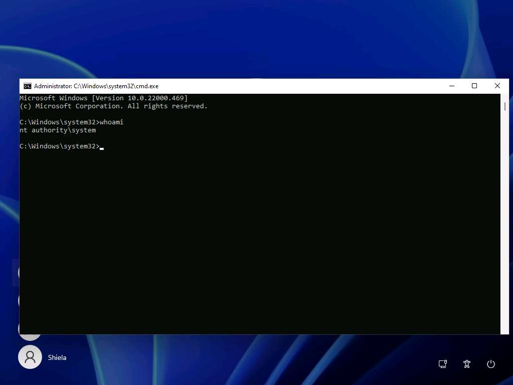

**Figure 2.4:** Exploiting the Sticky Keys accessibility feature opened a command prompt at the Windows logon screen with SYSTEM privileges, demonstrating how persistence can be maintained without user authentication.

---

### Learning Outcome

This task demonstrated how attackers can escalate privileges by bypassing Windows User Account Control and maintain persistent SYSTEM-level access by abusing built-in accessibility features. It reinforced the importance of protecting privileged accounts, restricting unauthorized modifications to operating system components, and monitoring post-exploitation activities that may establish long-term persistence.

---

### Attack Flow

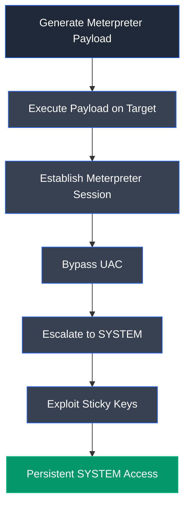
```mermaid
flowchart TD

    A[Generate Meterpreter Payload]
    --> B[Execute Payload on Target]
    --> C[Establish Meterpreter Session]
    --> D[Bypass UAC]
    --> E[Escalate to SYSTEM]
    --> F[Exploit Sticky Keys]
    --> G[Persistent SYSTEM Access]

    classDef start fill:#1f2937,color:#fff,stroke:#2563eb
    classDef process fill:#374151,color:#fff,stroke:#2563eb
    classDef success fill:#059669,color:#fff,stroke:#10b981

    class A start
    class B,C,D,E,F process
    class G success
```

---

## Overall Learning Outcome

This lab demonstrated how attackers can escalate privileges on a compromised Windows system by bypassing User Account Control (UAC) and exploiting built-in accessibility features to obtain persistent SYSTEM-level access. It provided practical experience in elevating privileges using the FodHelper Registry Key technique and maintaining privileged access through the Sticky Keys mechanism. Overall, the lab reinforced the importance of protecting privileged accounts, securing operating system components, monitoring persistence mechanisms, and implementing defense-in-depth strategies to detect and prevent unauthorized privilege escalation.

---

# Lab 3: Maintain Remote Access and Hide Malicious Activities

## Objective

To maintain persistent access to a compromised system and monitor user activities using authorized surveillance software, demonstrating how attackers can observe victim behavior while remaining active on the target machine.

---

## Background

After obtaining administrative or SYSTEM-level privileges, attackers often establish persistence and deploy monitoring mechanisms to retain long-term access to compromised systems. These techniques enable continuous observation of user activities, collection of sensitive information, and maintenance of control even after the initial compromise has occurred.

System monitoring software and spyware can record keystrokes, capture screenshots, track application usage, monitor visited websites, and log file operations without the user's knowledge. Although these capabilities are intended for legitimate administrative and parental control purposes, attackers may misuse them to gather sensitive information and maintain surveillance over compromised systems.

This lab demonstrates how monitoring software can be deployed on a target Windows system to collect user activity data and transmit it to a centralized dashboard. It highlights the risks associated with unauthorized surveillance while emphasizing the importance of endpoint protection, application control, and continuous monitoring to detect persistence mechanisms and spyware.

---

## Task 1: User System Monitoring and Surveillance

### Tools Used

- [Refog Personal Monitor](../../Tools/Refog-Personal-Monitor.md)

---

### Activity Performed

Refog Personal Monitor was deployed on the target Windows system to demonstrate user activity monitoring and surveillance. After establishing remote desktop access to the target machine, the monitoring agent was installed, linked to an online Refog account, and configured to record user activities.

Once deployed, the target system was restarted and used as a legitimate user to perform common activities such as web browsing and application usage. These activities were automatically synchronized with the online Refog dashboard, allowing real-time monitoring of the compromised system.

The dashboard successfully displayed information including visited websites, application usage, and overall computer activity, demonstrating how surveillance software can collect and centralize user activity without requiring continued physical access to the target machine.

This task highlighted how attackers can maintain visibility into a compromised system through monitoring software while reinforcing the importance of detecting unauthorized surveillance tools and persistence mechanisms.

---

### Observations

- Successfully deployed Refog Personal Monitor on the target system.
- Linked the monitoring agent to an online dashboard.
- Established persistent monitoring of the compromised machine.
- Captured user browsing activity through the Refog dashboard.
- Successfully monitored user activity remotely.
- Demonstrated how surveillance software can maintain visibility into a compromised system.

---

### Refog Dashboard Connected

**Figure 3.1:** The target Windows system successfully synchronized with the Refog online dashboard, confirming that the monitoring agent had been deployed and was actively communicating with the management portal.

---

### User Activity Monitoring

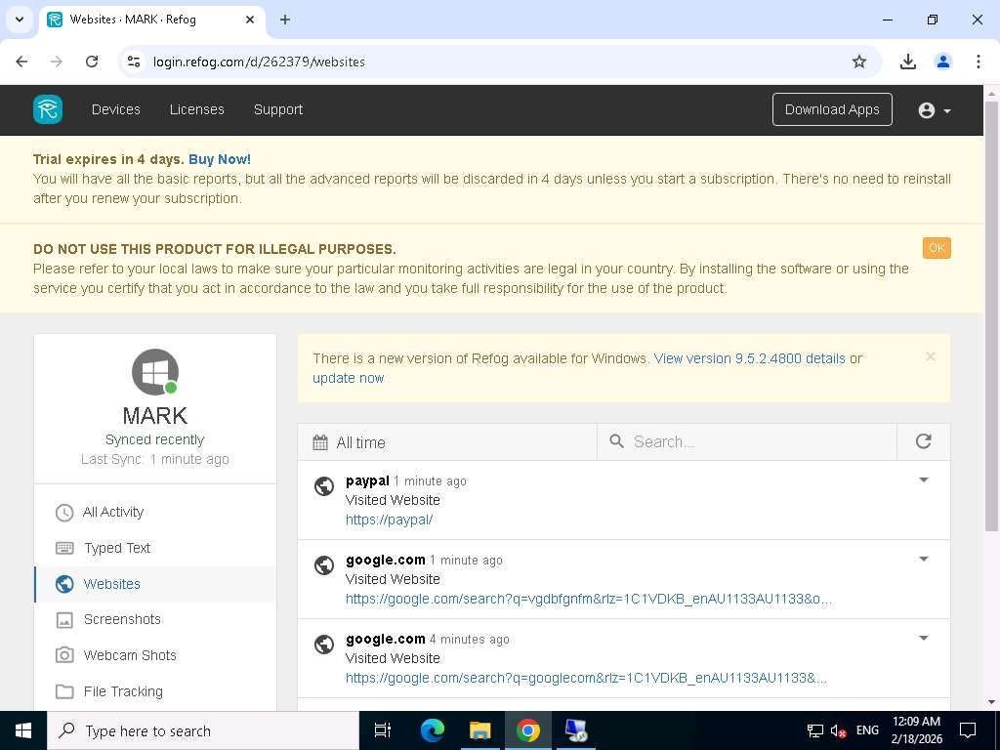

**Figure 3.2:** The Refog dashboard displayed the victim's recorded web activity, demonstrating successful collection and remote monitoring of user behavior through the deployed surveillance software.

---

### Learning Outcome

This task demonstrated how monitoring software can be deployed to maintain visibility into a compromised system by recording user activities and transmitting them to a centralized dashboard. It reinforced the importance of endpoint protection, application control, continuous monitoring, and detecting unauthorized surveillance software to prevent long-term compromise.

---

### Attack Flow

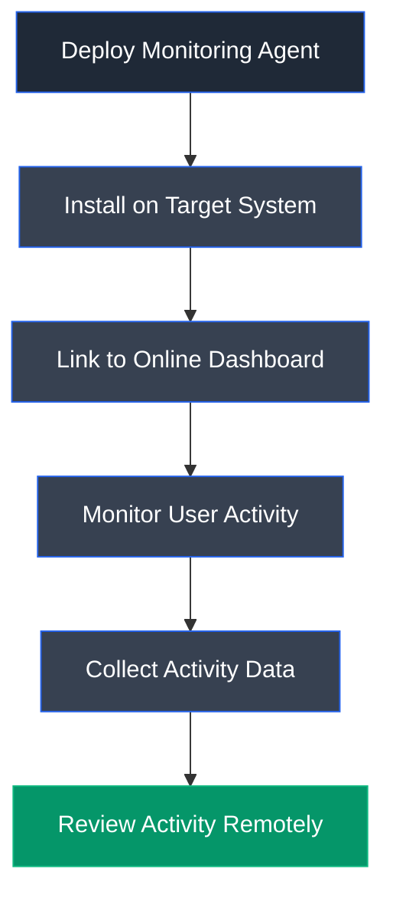
```mermaid
flowchart TD

    A[Deploy Monitoring Agent]
    --> B[Install on Target System]
    --> C[Link to Online Dashboard]
    --> D[Monitor User Activity]
    --> E[Collect Activity Data]
    --> F[Review Activity Remotely]

    classDef start fill:#1f2937,color:#fff,stroke:#2563eb
    classDef process fill:#374151,color:#fff,stroke:#2563eb
    classDef success fill:#059669,color:#fff,stroke:#10b981

    class A start
    class B,C,D,E process
    class F success
```

---

## Task 2: Maintain Persistence by Modifying Registry Run Keys

### Tools Used

- [Metasploit](../../Tools/Metasploit.md)
- [Registry Editor](../../Tools/Registry-Editor.md)

---

### Activity Performed

A Windows persistence mechanism was established by creating a malicious entry within the **Run** registry key. Initially, two Meterpreter payloads were generated using MSFVenom: one to obtain an initial Meterpreter session and another to serve as the persistent payload executed during system startup.

After gaining access to the target system, Windows User Account Control (UAC) was bypassed using the **SilentCleanup** privilege escalation technique available in Metasploit. Once elevated to **NT AUTHORITY\SYSTEM**, a command shell was opened and a new registry value was created under the **HKLM\Software\Microsoft\Windows\CurrentVersion\Run** key, referencing the malicious payload stored on the target system.

A second Meterpreter listener was configured to receive incoming connections from the persistence payload. After restarting the Windows system, the operating system automatically executed the payload configured within the Run registry key, establishing a new Meterpreter session without requiring additional exploitation.

This task demonstrated how attackers can leverage Windows startup registry keys to maintain persistent remote access across system reboots while automatically reconnecting to attacker-controlled infrastructure whenever an authorized user logs into the system.

---

### Observations

- Successfully generated Meterpreter persistence payloads using MSFVenom.
- Established an initial Meterpreter session with the target system.
- Bypassed User Account Control (UAC) using the SilentCleanup technique.
- Elevated privileges to **NT AUTHORITY\SYSTEM**.
- Successfully created a malicious Run registry key entry.
- Verified automatic execution of the persistence payload after system restart.
- Successfully re-established a Meterpreter session through the configured Run registry key.

---

### Registry Persistence Payload Generated

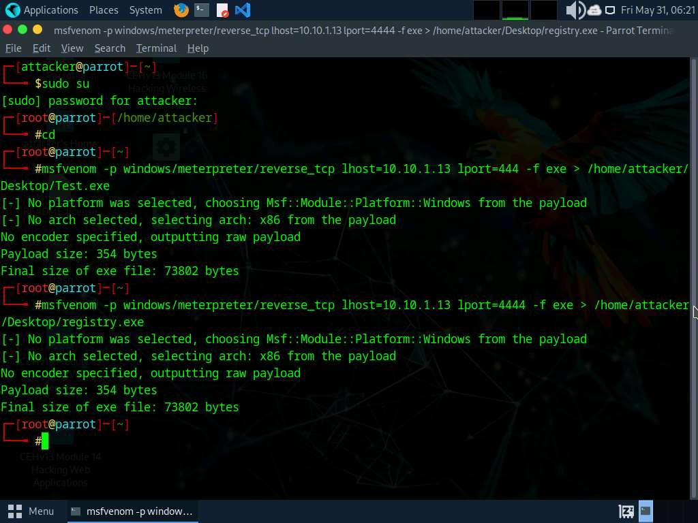

**Figure 3.3:** MSFVenom successfully generated the executable payload that was later configured within the Windows Run registry key to establish persistence.

---

### Run Registry Key Modified

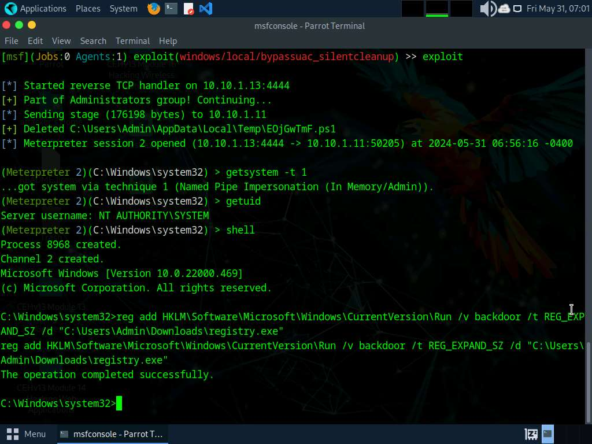

**Figure 3.4:** A new value was successfully added to the Windows Run registry key, configuring the operating system to automatically execute the malicious payload during user logon.

---

### Persistent Meterpreter Session Established

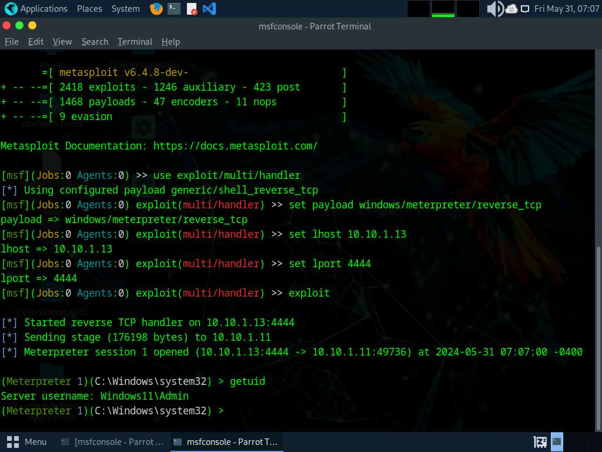

**Figure 3.5:** After restarting the target system, the payload configured within the Run registry key executed automatically and established a new Meterpreter session, demonstrating successful persistence.

---

### Learning Outcome

This task demonstrated how Windows startup registry keys can be abused to maintain persistent remote access after the initial compromise. It reinforced the importance of monitoring registry modifications, restricting unauthorized privilege escalation, implementing endpoint protection, and auditing startup locations commonly targeted by attackers.

---

### Attack Flow

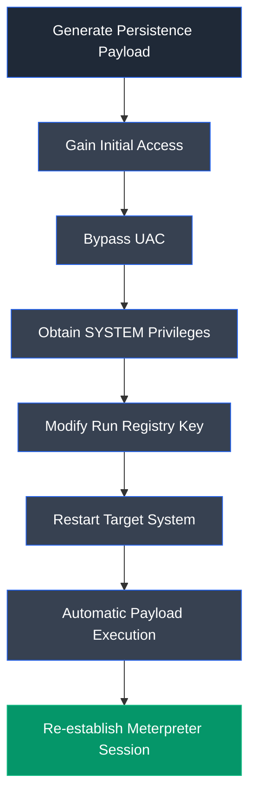
```mermaid
flowchart TD

    A[Generate Persistence Payload]
    --> B[Gain Initial Access]
    --> C[Bypass UAC]
    --> D[Obtain SYSTEM Privileges]
    --> E[Modify Run Registry Key]
    --> F[Restart Target System]
    --> G[Automatic Payload Execution]
    --> H[Re-establish Meterpreter Session]

    classDef start fill:#1f2937,color:#fff,stroke:#2563eb
    classDef process fill:#374151,color:#fff,stroke:#2563eb
    classDef success fill:#059669,color:#fff,stroke:#10b981

    class A start
    class B,C,D,E,F,G process
    class H success
```

---

## Overall Learning Outcome

This lab demonstrated multiple techniques used to maintain long-term access to compromised Windows systems through user activity monitoring and persistence mechanisms. It provided practical experience in deploying surveillance software to observe user behavior remotely and configuring Windows Run registry keys to automatically execute malicious payloads after system startup. Overall, the lab reinforced the importance of monitoring persistence mechanisms, protecting registry startup locations, detecting unauthorized monitoring software, and implementing endpoint security controls to prevent long-term compromise.

---

# Lab 4: Clear Logs to Hide the Evidence of Compromise

## Objective

To remove forensic evidence of malicious activities by clearing Windows event logs and Linux command history, demonstrating how attackers attempt to conceal traces of system compromise and hinder forensic investigations.

---

## Background

After successfully gaining access, escalating privileges, and maintaining persistence, attackers often attempt to remove evidence of their activities to delay detection and complicate forensic investigations. Operating systems continuously record security events, application activities, system changes, and executed commands that investigators can analyze to reconstruct the timeline of an attack.

Windows maintains event logs containing security, application, and system events, while Linux records executed shell commands within history files such as `.bash_history`. Attackers frequently exploit built-in operating system utilities to clear or overwrite these records in an effort to eliminate evidence of compromise. Although these utilities serve legitimate administrative purposes, they can also be abused to conceal malicious actions.

This lab demonstrates how native Windows and Linux utilities can be used to clear logs and securely remove command history, emphasizing the importance of centralized logging, secure log storage, endpoint monitoring, and continuous auditing to detect attempts at covering tracks.

---

## Task 1: Clear Windows Machine Logs using Various Utilities

### Tools Used

- [wevtutil](../../Tools/wevtutil.md)
- [Cipher](../../Tools/Cipher.md)

---

### Activity Performed

Windows event logs were cleared using several native administrative utilities to demonstrate techniques commonly used to hide evidence of compromise. Initially, the **Clear_Event_Viewer_Logs.bat** utility was executed to automatically remove security, system, and application logs from the Windows Event Viewer.

Next, the **wevtutil** command-line utility was used to enumerate available event logs and selectively clear specific logs such as the System log. This demonstrated how individual event logs can be removed without affecting the entire logging subsystem.

Finally, the **Cipher** utility was executed to securely overwrite deleted data on the target drive. By overwriting previously deleted files with multiple data patterns, Cipher reduces the possibility of recovering deleted evidence using forensic recovery tools.

This task demonstrated how attackers can abuse legitimate Windows administrative utilities to remove evidence of malicious activities and complicate forensic investigations.

---

### Observations

- Successfully cleared Windows Event Viewer logs.
- Enumerated available event logs using `wevtutil`.
- Cleared specific Windows event logs using `wevtutil`.
- Securely overwrote deleted data using Cipher.
- Demonstrated how native Windows utilities can be abused to conceal evidence.

---

### Windows Event Logs Cleared

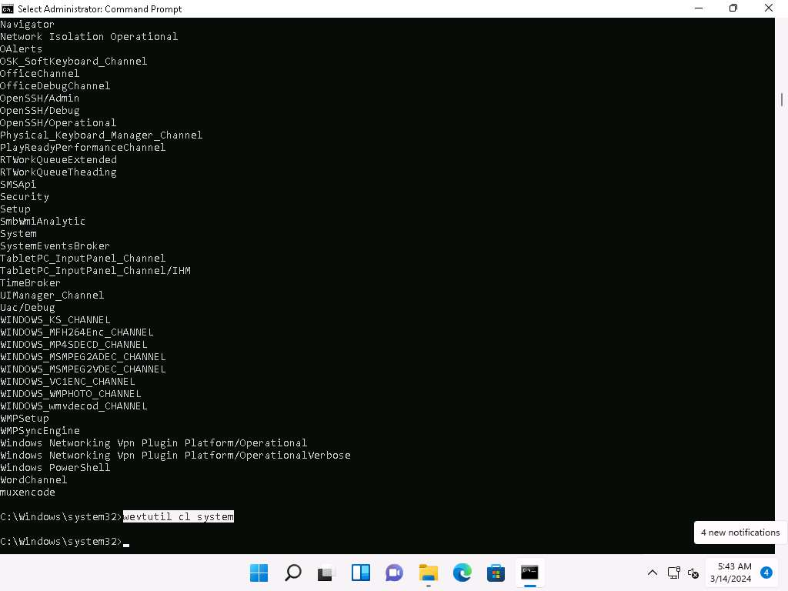

**Figure 4.1:** Windows event logs were successfully cleared using native administrative utilities, removing system records that could otherwise assist forensic investigations.

---

### Cipher Secure Overwrite

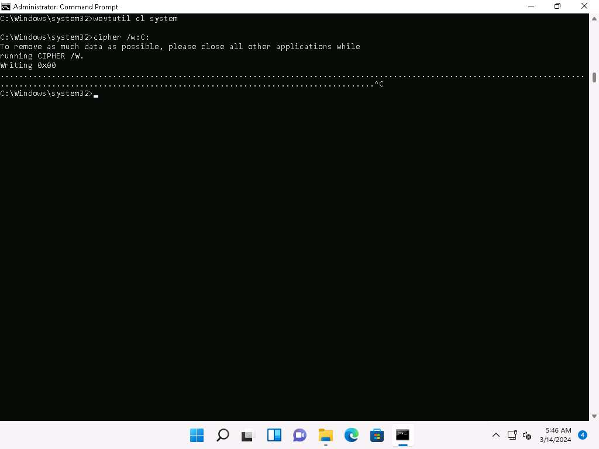

**Figure 4.2:** The Cipher utility securely overwrote deleted data on the target drive, reducing the likelihood of recovering deleted files during forensic analysis.

---

### Learning Outcome

This task demonstrated how native Windows administrative utilities can be misused to remove event logs and securely overwrite deleted data in an attempt to hide evidence of compromise. It reinforced the importance of centralized log collection, secure log storage, and monitoring administrative utilities for suspicious activity.

---

### Attack Flow

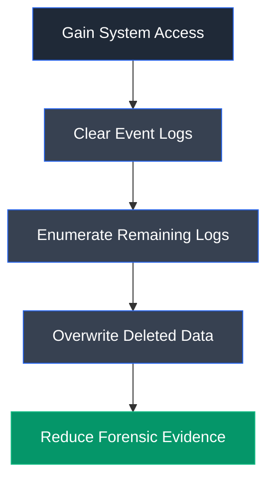
```mermaid
flowchart TD

    A[Gain System Access]
    --> B[Clear Event Logs]
    --> C[Enumerate Remaining Logs]
    --> D[Overwrite Deleted Data]
    --> E[Reduce Forensic Evidence]

    classDef start fill:#1f2937,color:#fff,stroke:#2563eb
    classDef process fill:#374151,color:#fff,stroke:#2563eb
    classDef success fill:#059669,color:#fff,stroke:#10b981

    class A start
    class B,C,D process
    class E success
```

---

## Task 2: Clear Linux Machine Logs using the BASH Shell

### Tools Used

- [BASH](../../Tools/BASH.md)

---

### Activity Performed

Linux shell history was manipulated to demonstrate how attackers can remove evidence of executed commands from compromised systems. Initially, the shell history size was set to zero to prevent future commands from being recorded during the active session. The existing command history was then cleared using built-in history management commands.

To further hinder forensic analysis, the `.bash_history` file was shredded, overwriting its contents before deletion. Finally, the history file was inspected to verify that its contents had become unreadable, demonstrating how attackers can make command history difficult to recover even through forensic examination.

This task illustrated how built-in Linux shell features can be abused to conceal attacker activity and remove valuable evidence from compromised systems.

---

### Observations

- Disabled command history recording for the active shell session.
- Cleared previously stored command history.
- Securely shredded the `.bash_history` file.
- Verified that the history file contents were unreadable.
- Demonstrated methods used to conceal Linux command execution history.

---

### BASH History Cleared

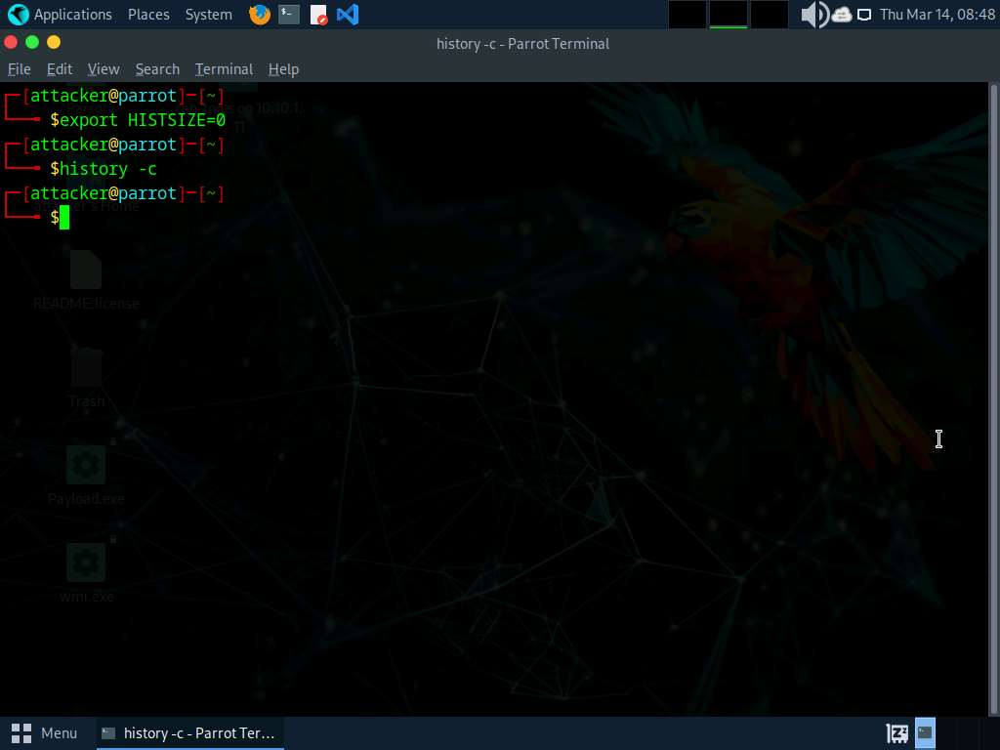

**Figure 4.3:** The active shell history was successfully cleared and history recording was disabled, preventing subsequent commands from being stored within the current session.

---

### BASH History Shredded

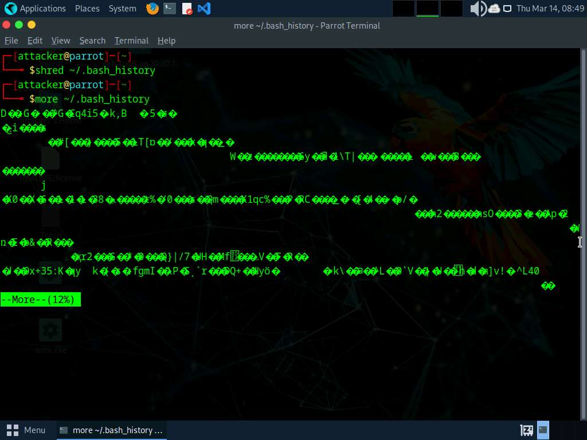

**Figure 4.4:** The `.bash_history` file was securely shredded, rendering its contents unreadable and significantly reducing the possibility of recovering previously executed commands.

---

### Learning Outcome

This task demonstrated how Linux shell history can be cleared and securely overwritten to conceal attacker activity. It reinforced the importance of centralized logging, shell history auditing, file integrity monitoring, and secure log management to detect attempts at removing forensic evidence.

---

### Attack Flow

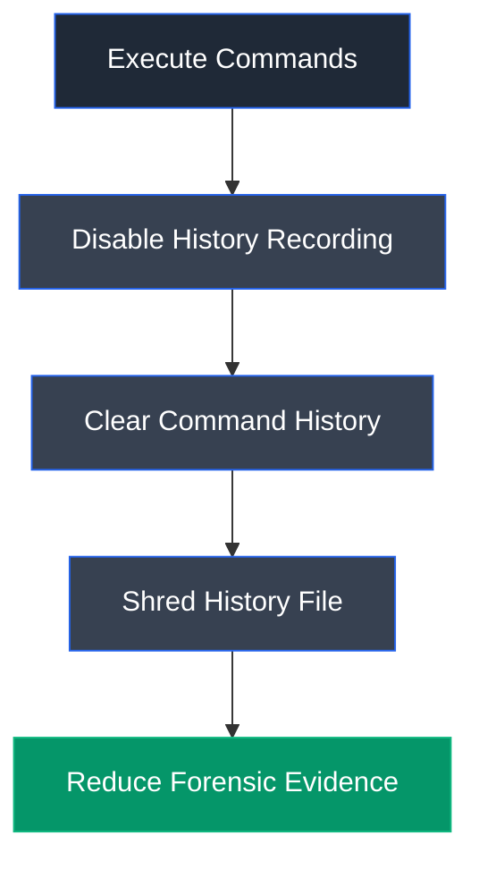
```mermaid
flowchart TD

    A[Execute Commands]
    --> B[Disable History Recording]
    --> C[Clear Command History]
    --> D[Shred History File]
    --> E[Reduce Forensic Evidence]

    classDef start fill:#1f2937,color:#fff,stroke:#2563eb
    classDef process fill:#374151,color:#fff,stroke:#2563eb
    classDef success fill:#059669,color:#fff,stroke:#10b981

    class A start
    class B,C,D process
    class E success
```

---

## Overall Learning Outcome

This lab demonstrated techniques used to remove evidence of compromise from both Windows and Linux systems by clearing event logs, securely overwriting deleted data, and removing shell command history. It provided practical experience with native operating system utilities commonly abused to cover tracks while reinforcing the importance of centralized logging, secure log retention, endpoint monitoring, and continuous auditing to detect attempts at destroying forensic evidence.

---

# Lab 5: Perform Active Directory (AD) Attacks Using Various Tools

## Objective

To perform a sequence of Active Directory attack techniques against a Windows domain environment, demonstrating how attackers progressively compromise domain infrastructure through reconnaissance, credential attacks, password spraying, remote access, post-enumeration, privilege escalation, and Kerberos-based attacks to obtain highly privileged domain credentials.

---

## Background

Active Directory (AD) is Microsoft's centralized directory service responsible for authentication, authorization, and resource management within Windows enterprise environments. It manages users, computers, groups, and security policies, making it one of the most valuable targets during penetration testing and real-world cyber attacks.

Rather than relying on a single vulnerability, attackers typically compromise Active Directory by chaining together multiple attack techniques. They begin with network reconnaissance to identify domain controllers and critical services, perform credential attacks to obtain valid user passwords, enumerate the domain to discover privileged accounts and vulnerable services, exploit misconfigurations for privilege escalation, and ultimately target highly privileged accounts through Kerberos-based attacks.

This lab demonstrates an end-to-end Active Directory attack methodology using industry-standard offensive security tools to perform reconnaissance, AS-REP Roasting, password spraying, remote access, post-enumeration, SQL Server exploitation, privilege escalation, and Kerberoasting. Together, these techniques illustrate how multiple weaknesses can be combined to progressively compromise an Active Directory environment while emphasizing the importance of strong authentication policies, least-privilege administration, service hardening, continuous monitoring, and defense-in-depth security.

---

## Task 1: Perform Initial Scans to Obtain Domain Controller IP and Domain Name

### Tools Used

- [Nmap](../../Tools/Nmap.md)

---

### Activity Performed

Initial reconnaissance was performed against the target subnet using Nmap to identify Active Directory infrastructure and discover the Domain Controller (DC). A network scan of the entire subnet was conducted to enumerate active hosts and identify systems exposing services commonly associated with Active Directory.

The scan revealed that the host **10.10.1.22** was running Kerberos (TCP 88) and LDAP (TCP 389), indicating that it was functioning as the Domain Controller. A more comprehensive Nmap scan was then performed against the identified host using service detection, default NSE scripts, and operating system fingerprinting to gather additional information about the domain environment.

The detailed scan successfully identified the Active Directory domain name as **CEH.com**, providing essential information required for subsequent authentication and Kerberos-based attacks.

---

### Observations

- Successfully discovered active hosts within the target subnet.
- Identified the Domain Controller through Kerberos and LDAP services.
- Confirmed the Domain Controller IP address as **10.10.1.22**.
- Enumerated Active Directory services running on the Domain Controller.
- Successfully identified the target domain name as **CEH.com**.
- Gathered reconnaissance data required for subsequent Active Directory attacks.

----

### Network Subnet Scan

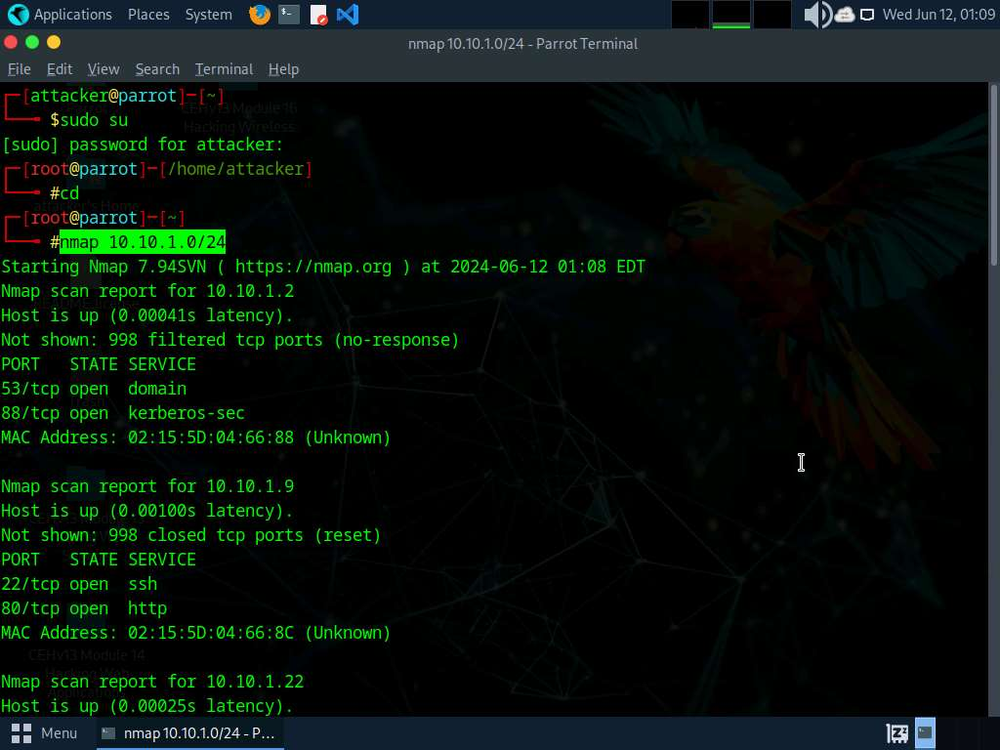

**Figure 5.1:** Nmap identified active hosts within the target subnet and revealed that host **10.10.1.22** exposed Kerberos and LDAP services, indicating that it was the Active Directory Domain Controller.

---

### Domain Controller Service Enumeration

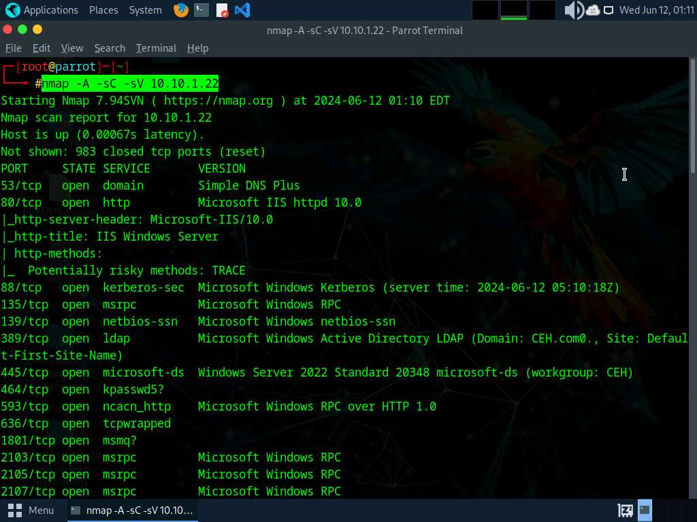

**Figure 5.2:** A detailed Nmap scan enumerated services, operating system information, and Active Directory configuration details, successfully identifying the target domain as **CEH.com**.

---

### Learning Outcome

This task demonstrated how network reconnaissance can identify critical Active Directory infrastructure before attempting credential attacks. It reinforced the importance of service enumeration for locating Domain Controllers, identifying authentication services, and collecting information required for subsequent attacks against an Active Directory environment.

---

### Attack Flow

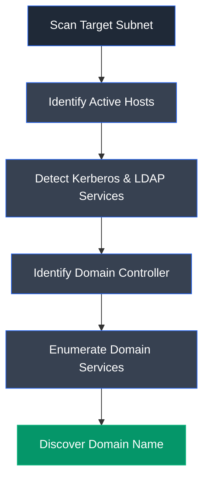
```mermaid
flowchart TD

    A[Scan Target Subnet]
    --> B[Identify Active Hosts]
    --> C[Detect Kerberos & LDAP Services]
    --> D[Identify Domain Controller]
    --> E[Enumerate Domain Services]
    --> F[Discover Domain Name]

    classDef start fill:#1f2937,color:#fff,stroke:#2563eb
    classDef process fill:#374151,color:#fff,stroke:#2563eb
    classDef success fill:#059669,color:#fff,stroke:#10b981

    class A start
    class B,C,D,E process
    class F success
```

---

## Task 2: Perform AS-REP Roasting Attack

### Tools Used

- [Impacket](../../Tools/Impacket.md)
- [John the Ripper](../../Tools/John-the-Ripper.md)

---

### Activity Performed

An AS-REP Roasting attack was performed against the Active Directory domain to identify user accounts that did not require Kerberos pre-authentication. Using the **GetNPUsers.py** utility from the Impacket toolkit, the Domain Controller was queried to enumerate user accounts vulnerable to the **DONT_REQ_PREAUTH** configuration.

The enumeration identified the user account **Joshua** as vulnerable, allowing the encrypted AS-REP response to be requested without prior authentication. The returned Kerberos authentication hash was extracted and saved locally for offline password cracking.

The captured hash was subsequently processed using **John the Ripper** with the **rockyou.txt** wordlist. The password was successfully recovered in plaintext, demonstrating how improperly configured Kerberos authentication settings can expose user credentials without requiring direct interaction with the target account.

---

### Observations

- Successfully identified a user account configured without Kerberos pre-authentication.
- Retrieved the AS-REP hash for the user **Joshua**.
- Saved the captured hash for offline password cracking.
- Successfully cracked the password hash using John the Ripper.
- Recovered the plaintext password **cupcake**.
- Obtained valid domain credentials for use in subsequent Active Directory attacks.

---

### AS-REP Hash Extraction

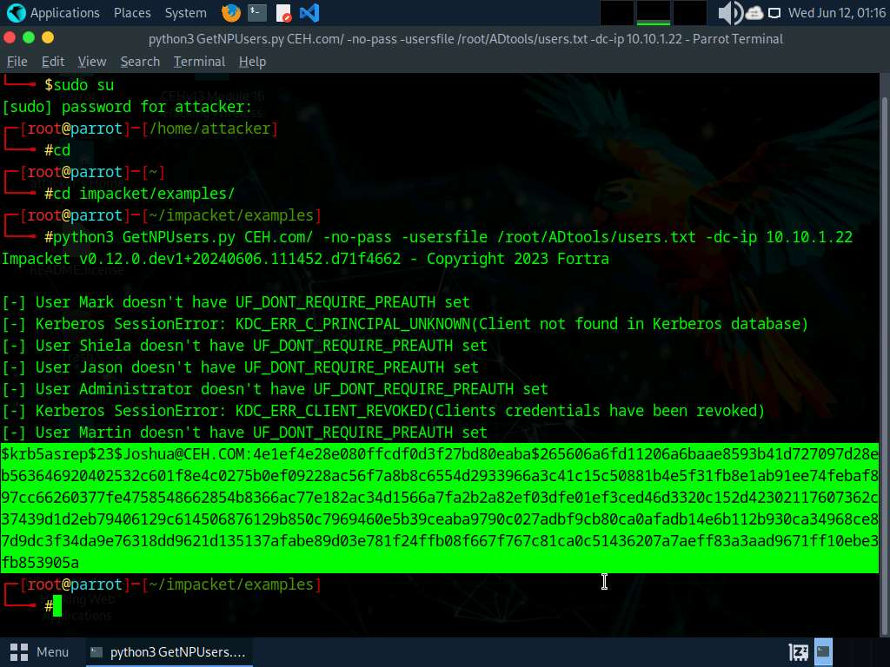

**Figure 5.3:** Impacket's **GetNPUsers.py** successfully identified a user account configured without Kerberos pre-authentication and retrieved the corresponding AS-REP hash from the Domain Controller.

---

### Password Successfully Cracked

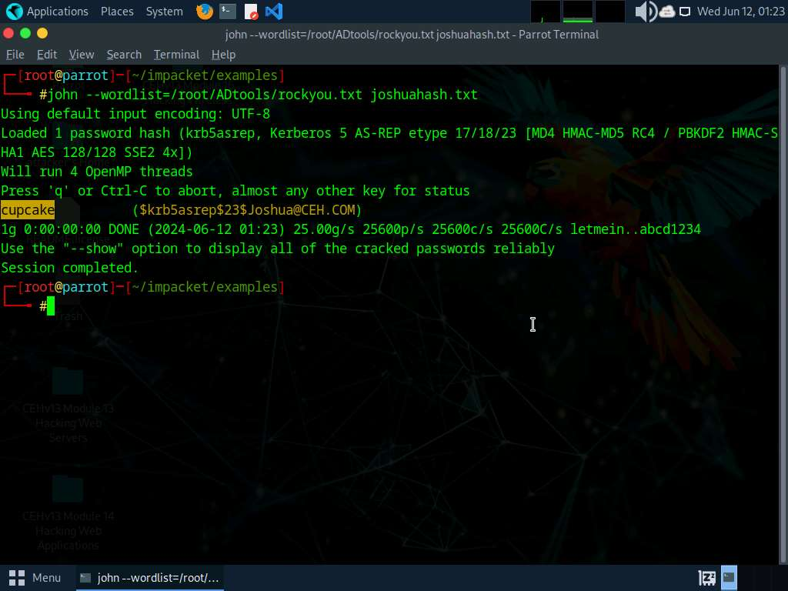

**Figure 5.4:** John the Ripper successfully performed an offline dictionary attack against the captured AS-REP hash, recovering the plaintext password for the vulnerable domain account.

---

### Learning Outcome

This task demonstrated how improperly configured Kerberos pre-authentication settings can expose user credentials through AS-REP Roasting. It reinforced the importance of enforcing Kerberos pre-authentication, implementing strong password policies, and monitoring authentication requests to detect attempts at offline credential attacks.

---

### Attack Flow

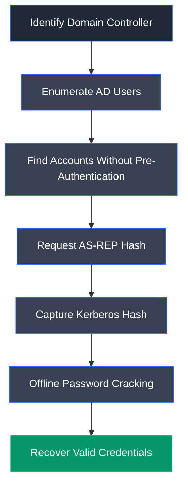
```mermaid
flowchart TD

    A[Identify Domain Controller]
    --> B[Enumerate AD Users]
    --> C[Find Accounts Without Pre-Authentication]
    --> D[Request AS-REP Hash]
    --> E[Capture Kerberos Hash]
    --> F[Offline Password Cracking]
    --> G[Recover Valid Credentials]

    classDef start fill:#1f2937,color:#fff,stroke:#2563eb
    classDef process fill:#374151,color:#fff,stroke:#2563eb
    classDef success fill:#059669,color:#fff,stroke:#10b981

    class A start
    class B,C,D,E,F process
    class G success
```

---

## Task 3: Spray Cracked Password into Network using CrackMapExec

### Tools Used

- [CrackMapExec](../../Tools/CrackMapExec.md)
- [Remmina](../../Tools/Remmina.md)

---

### Activity Performed

The plaintext password recovered during the AS-REP Roasting attack was used to perform a password spraying attack against Remote Desktop Protocol (RDP) services within the target subnet. Using **CrackMapExec (CME)**, the previously cracked password was tested against multiple Active Directory user accounts to identify additional systems that reused the same credentials.

The password spraying attack successfully authenticated the user account **Mark** on the Windows 11 (AD) host **10.10.1.40**, demonstrating password reuse across domain accounts. The recovered credentials were then used to establish a Remote Desktop connection through **Remmina**, providing interactive access to the target system as a legitimate domain user.

This task demonstrated how a single compromised password can facilitate lateral movement within an Active Directory environment when password reuse exists across multiple accounts.

---

### Observations

- Successfully performed password spraying against RDP services.
- Identified valid credentials for the user **Mark**.
- Confirmed password reuse within the Active Directory environment.
- Successfully authenticated to the Windows 11 (AD) system.
- Established an interactive Remote Desktop session.
- Obtained authenticated access for subsequent post-enumeration activities.

---

### Password Spraying using CrackMapExec

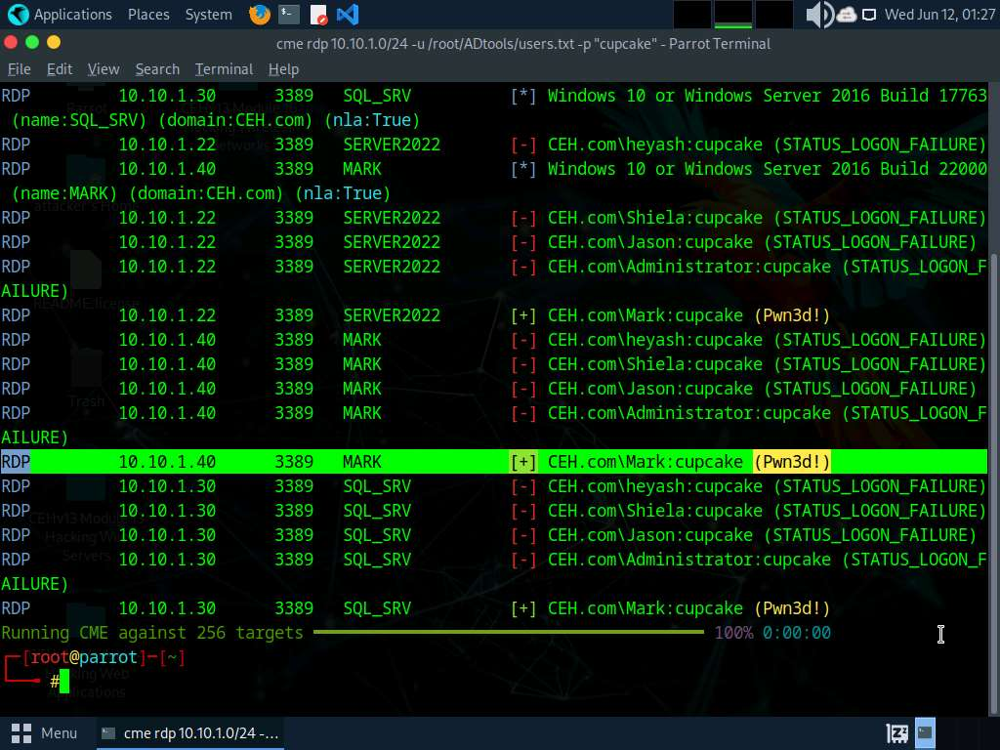

**Figure 5.5:** CrackMapExec successfully performed password spraying across the target subnet and identified a valid RDP login for the user **Mark** on the Windows 11 (AD) system.

---

### Remmina Authentication

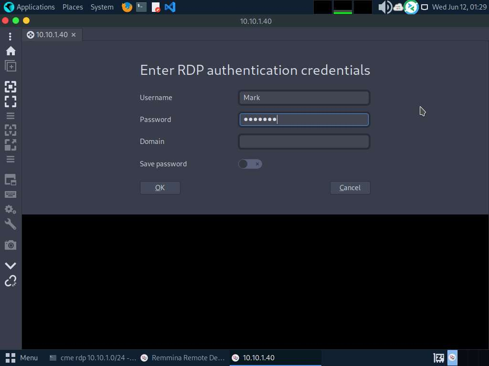

**Figure 5.6:** Remmina was configured with the discovered credentials to authenticate to the target Windows 11 (AD) machine through the Remote Desktop Protocol.

---

### Remote Desktop Session Established

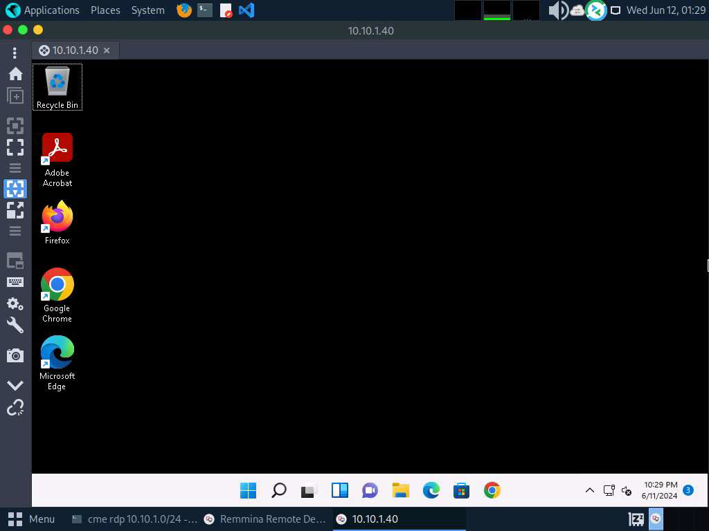

**Figure 5.7:** A successful Remote Desktop session confirmed that the compromised credentials provided legitimate interactive access to the target Active Directory workstation.

---

### Learning Outcome

This task demonstrated how password spraying can leverage previously compromised credentials to identify additional accounts that reuse the same password. It reinforced the importance of strong password policies, unique credentials for each account, account lockout mechanisms, and monitoring authentication events to detect password spraying attacks.

---

### Attack Flow

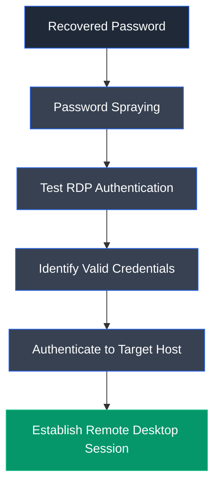
```mermaid
flowchart TD

    A[Recovered Password]
    --> B[Password Spraying]
    --> C[Test RDP Authentication]
    --> D[Identify Valid Credentials]
    --> E[Authenticate to Target Host]
    --> F[Establish Remote Desktop Session]

    classDef start fill:#1f2937,color:#fff,stroke:#2563eb
    classDef process fill:#374151,color:#fff,stroke:#2563eb
    classDef success fill:#059669,color:#fff,stroke:#10b981

    class A start
    class B,C,D,E process
    class F success
```

---

## Task 4: Perform Post-Enumeration using PowerView

### Tools Used

- [PowerView](../../Tools/PowerView.md)

---

### Activity Performed

Following successful authentication to the target workstation, post-enumeration was performed to gather additional information about the Active Directory environment. The **PowerView** PowerShell framework was transferred to the compromised Windows system and loaded into memory after bypassing the PowerShell execution policy.

PowerView reconnaissance commands were then executed to enumerate Active Directory computer objects, security groups, and user accounts. This information provided greater visibility into the domain environment and helped identify valuable targets for subsequent attacks.

During user enumeration, the account **SQL_srv** was discovered. Since this account was associated with the Microsoft SQL Server service, it became the primary target for the next stage of the Active Directory attack.

---

### Observations

- Successfully loaded the PowerView framework.
- Enumerated Active Directory computer objects.
- Retrieved Active Directory group information.
- Enumerated domain user accounts.
- Identified the **SQL_srv** service account.
- Gathered reconnaissance information for subsequent MSSQL exploitation.

---

### PowerView Loaded and Computer Enumeration

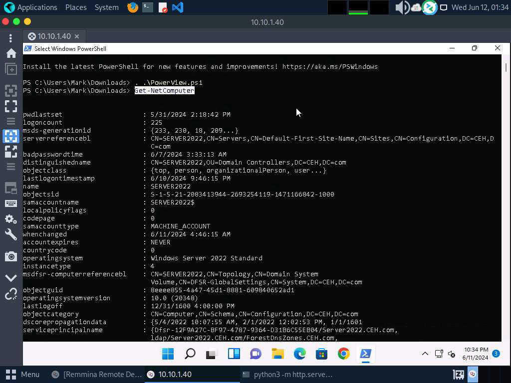

**Figure 5.8:** The PowerView framework was successfully loaded into memory, after which Active Directory computer objects were enumerated to identify systems within the domain.

---

### Active Directory Group Enumeration

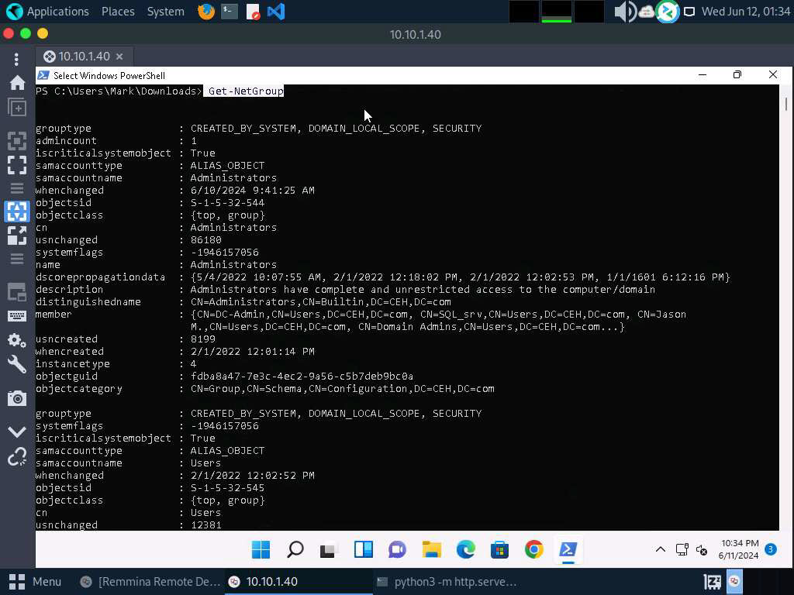

**Figure 5.9:** PowerView enumerated Active Directory security groups, providing additional insight into the domain's organizational and privilege structure.

---

### Active Directory User Enumeration

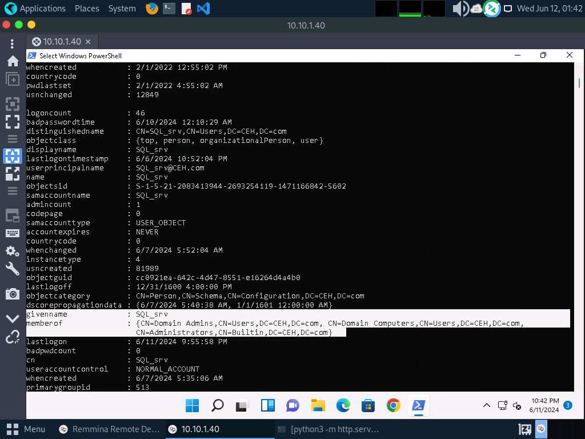

**Figure 5.10:** PowerView enumerated domain user accounts and identified the **SQL_srv** service account, which became the target for the subsequent MSSQL attack.

---

### Learning Outcome

This task demonstrated how authenticated users can leverage PowerView to perform detailed Active Directory reconnaissance. It reinforced the importance of restricting unnecessary PowerShell usage, protecting service accounts, limiting domain enumeration capabilities, and monitoring reconnaissance activities performed after successful authentication.

---

### Attack Flow

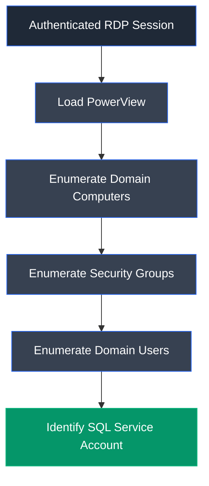
```mermaid
flowchart TD

    A[Authenticated RDP Session]
    --> B[Load PowerView]
    --> C[Enumerate Domain Computers]
    --> D[Enumerate Security Groups]
    --> E[Enumerate Domain Users]
    --> F[Identify SQL Service Account]

    classDef start fill:#1f2937,color:#fff,stroke:#2563eb
    classDef process fill:#374151,color:#fff,stroke:#2563eb
    classDef success fill:#059669,color:#fff,stroke:#10b981

    class A start
    class B,C,D,E process
    class F success
```

---

## Task 5: Perform Attack on MSSQL Service

### Tools Used

- [Hydra](../../Tools/Hydra.md)
- [Impacket](../../Tools/Impacket.md)
- [Metasploit](../../Tools/Metasploit.md)

---

### Activity Performed

After identifying the **SQL_srv** service account during post-enumeration, a password attack was performed against the Microsoft SQL Server service running on the target host. **Hydra** was used to perform a dictionary-based brute-force attack against the MSSQL service, successfully recovering the password **batman** for the **SQL_srv** account.

Using the recovered credentials, the **mssqlclient.py** utility from the Impacket toolkit was used to authenticate to the SQL Server instance. The database configuration was inspected to verify whether the **xp_cmdshell** stored procedure was enabled. The configuration confirmed that command execution through SQL Server was permitted.

Since **xp_cmdshell** was enabled, the **Metasploit** MSSQL payload module was configured with the recovered credentials and used to exploit the SQL Server instance. Successful exploitation established a Meterpreter session on the target host, allowing interactive command execution within the context of the SQL Server service account.

This task demonstrated how weak service account passwords combined with insecure SQL Server configurations can provide attackers with remote code execution and a foothold for further privilege escalation.

---

### Observations

- Successfully brute-forced the MSSQL service account password.
- Authenticated to Microsoft SQL Server using Impacket.
- Verified that **xp_cmdshell** was enabled.
- Successfully exploited the SQL Server instance using Metasploit.
- Established a Meterpreter session.
- Executed commands as the SQL Server service account.

---

### MSSQL Password Successfully Cracked

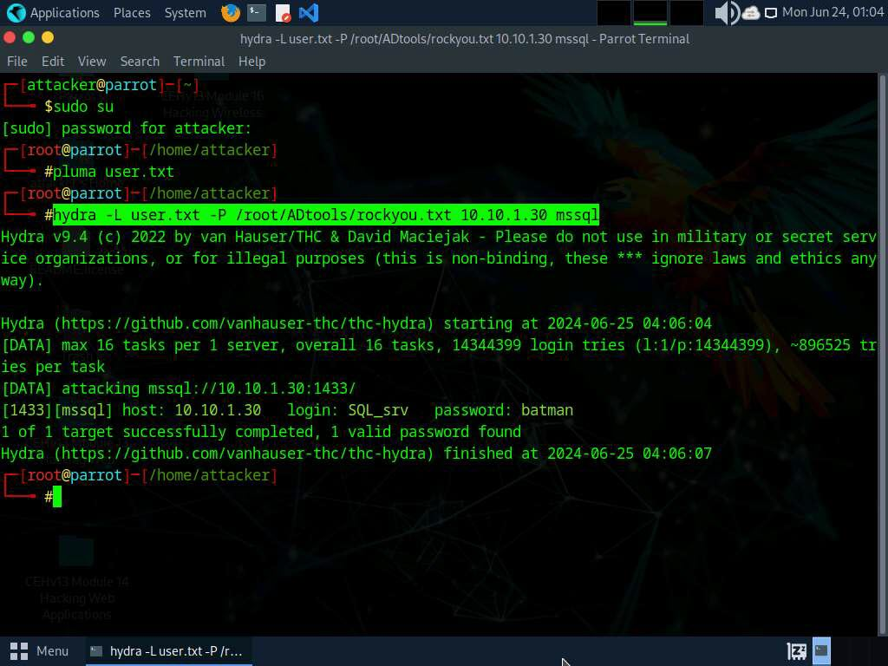

**Figure 5.11:** Hydra successfully performed a dictionary attack against the Microsoft SQL Server service and recovered the password for the **SQL_srv** account.

---

### xp_cmdshell Configuration Verified

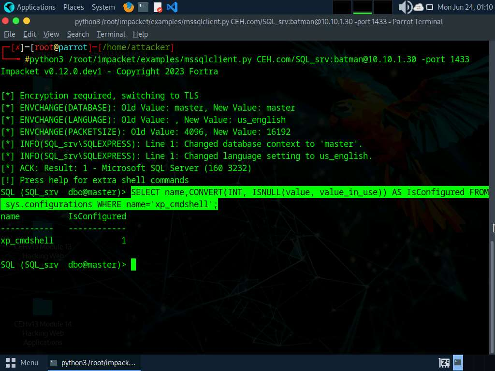

**Figure 5.12:** The SQL Server configuration confirmed that **xp_cmdshell** was enabled, allowing operating system commands to be executed through the database service.

---

### Metasploit MSSQL Payload Configuration

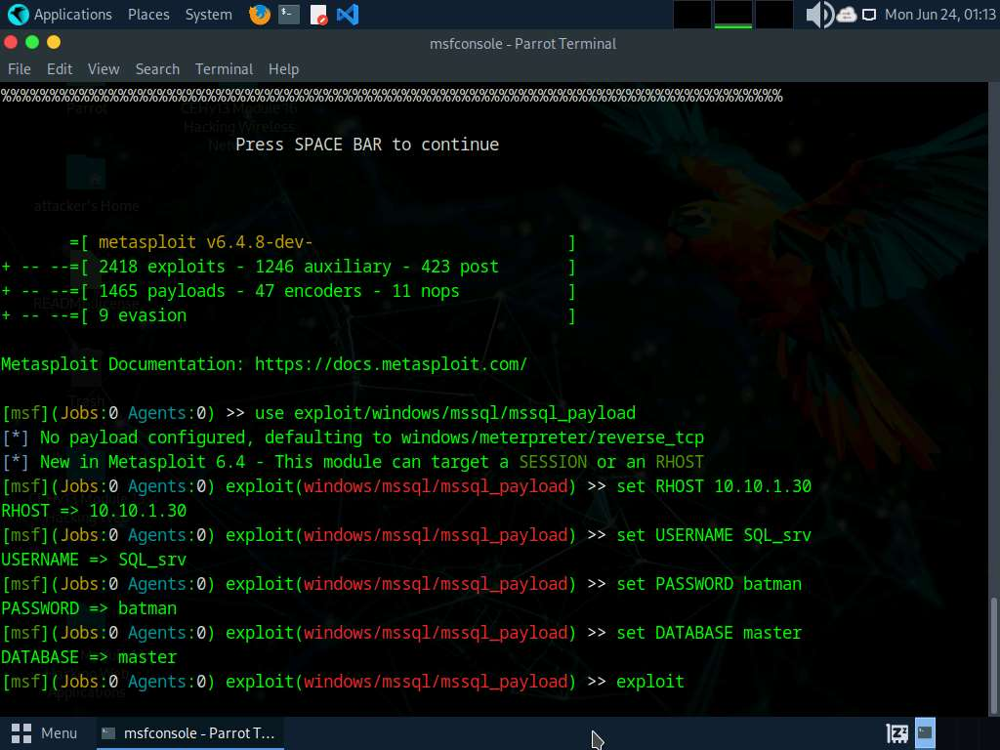

**Figure 5.13:** The Metasploit MSSQL payload module was configured using the recovered SQL Server credentials to prepare for remote exploitation.

---

### Meterpreter Session Established

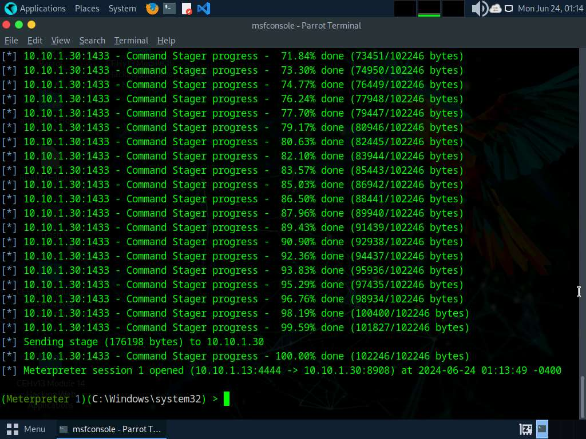

**Figure 5.14:** Successful exploitation of the SQL Server instance established a Meterpreter session, providing remote access to the compromised host.

---

### SQL Server Service Shell

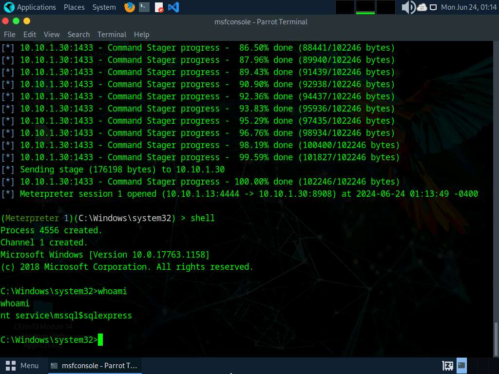

**Figure 5.15:** Commands executed within the Meterpreter session confirmed access under the SQL Server service account, demonstrating successful remote code execution.

---

### Learning Outcome

This task demonstrated how weak service account passwords and insecure SQL Server configurations can be chained together to achieve remote code execution. It reinforced the importance of securing service account credentials, disabling unnecessary features such as **xp_cmdshell**, implementing strong password policies, and monitoring database services for unauthorized authentication and command execution.

---

### Attack Flow

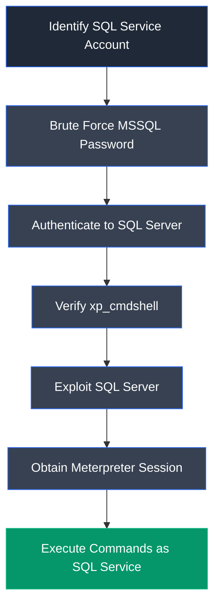
```mermaid
flowchart TD

    A[Identify SQL Service Account]
    --> B[Brute Force MSSQL Password]
    --> C[Authenticate to SQL Server]
    --> D[Verify xp_cmdshell]
    --> E[Exploit SQL Server]
    --> F[Obtain Meterpreter Session]
    --> G[Execute Commands as SQL Service]

    classDef start fill:#1f2937,color:#fff,stroke:#2563eb
    classDef process fill:#374151,color:#fff,stroke:#2563eb
    classDef success fill:#059669,color:#fff,stroke:#10b981

    class A start
    class B,C,D,E,F process
    class G success
```

---

## Task 6: Perform Privilege Escalation

### Tools Used

- [WinPEAS](../../Tools/WinPEAS.md)
- [Netcat](../../Tools/Netcat.md)

---

### Activity Performed

Following successful exploitation of the Microsoft SQL Server service, privilege escalation was performed to obtain higher privileges on the compromised Windows Server. **WinPEAS** was transferred to the target system and executed to enumerate privilege escalation opportunities, security misconfigurations, and vulnerable service configurations.

The enumeration identified an **Unquoted Service Path** vulnerability associated with the **CEH Services** application. Since the service executable path was improperly quoted, it allowed a malicious executable to be substituted and executed with elevated privileges during system startup.

A reverse shell payload was generated using **msfvenom** and hosted on the attacker machine. The legitimate service executable was replaced with the malicious payload, while **Netcat** was configured to listen for incoming reverse shell connections. After the target system was restarted, the vulnerable service executed the malicious payload, establishing a reverse shell with elevated privileges on the attacker machine.

This task demonstrated how service misconfigurations can be exploited to escalate privileges and gain higher levels of access within a compromised Windows environment.

---

### Observations

- Successfully enumerated privilege escalation opportunities using WinPEAS.
- Identified an Unquoted Service Path vulnerability.
- Generated a malicious reverse shell payload.
- Replaced the vulnerable service executable.
- Successfully established a privileged reverse shell.
- Confirmed elevated access after the target system restarted.

---

### WinPEAS Privilege Enumeration

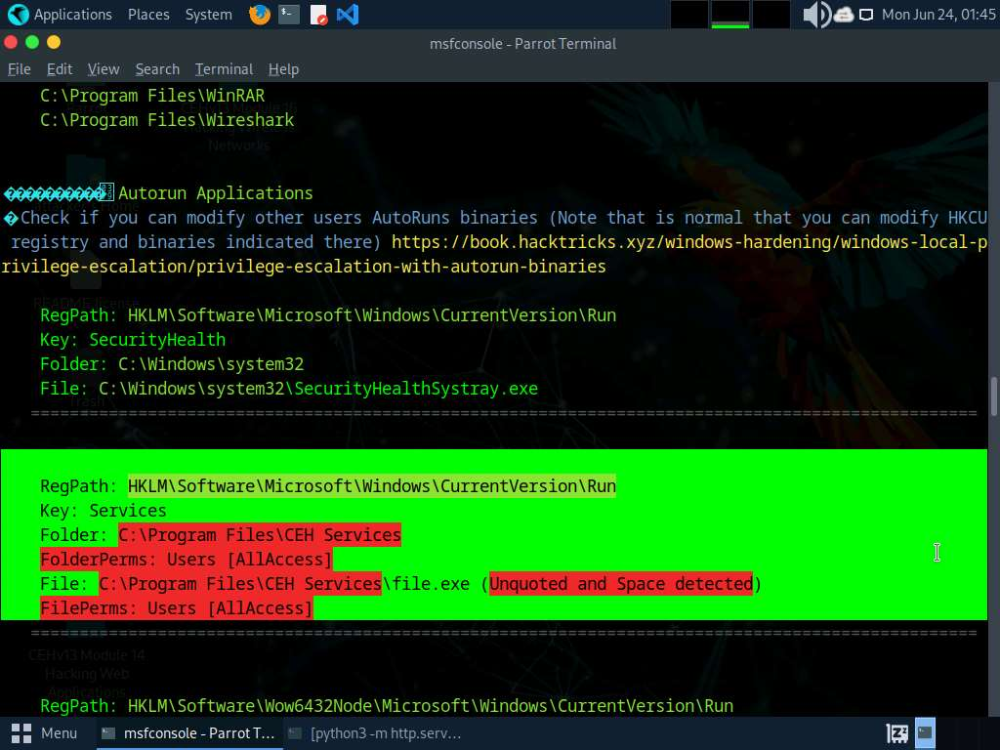

**Figure 5.16:** WinPEAS identified an **Unquoted Service Path** vulnerability within the installed service, revealing an opportunity for privilege escalation.

---

### MSFVenom Payload Generated

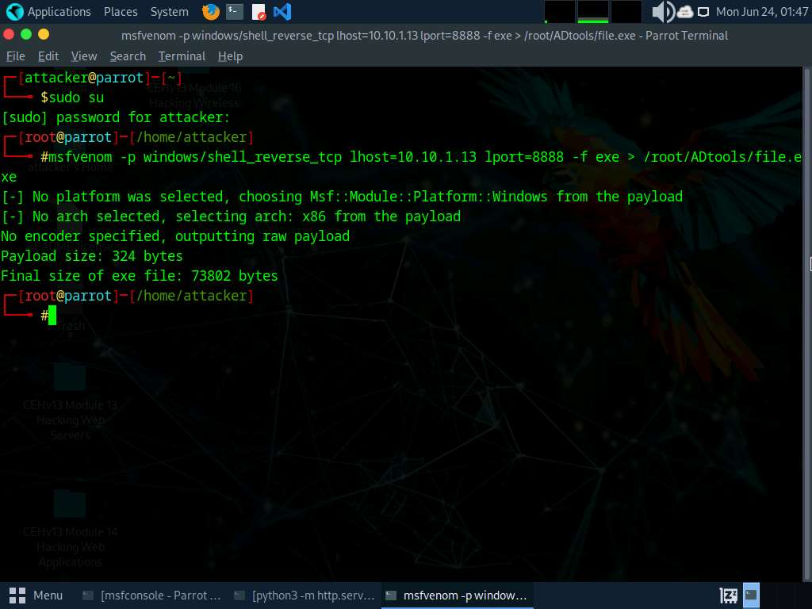

**Figure 5.17:** A malicious Windows reverse shell payload was generated using **msfvenom** for exploitation of the vulnerable service.

---

### Vulnerable Service Executable Replaced

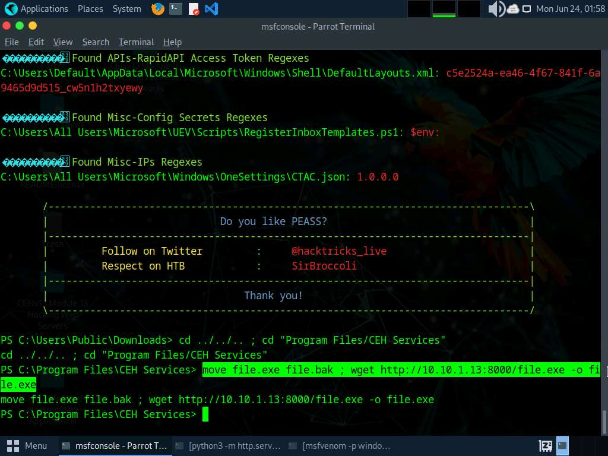

**Figure 5.18:** The legitimate service executable was replaced with a malicious payload, preparing the vulnerable service to execute attacker-controlled code during system startup.

---

### Privileged Reverse Shell

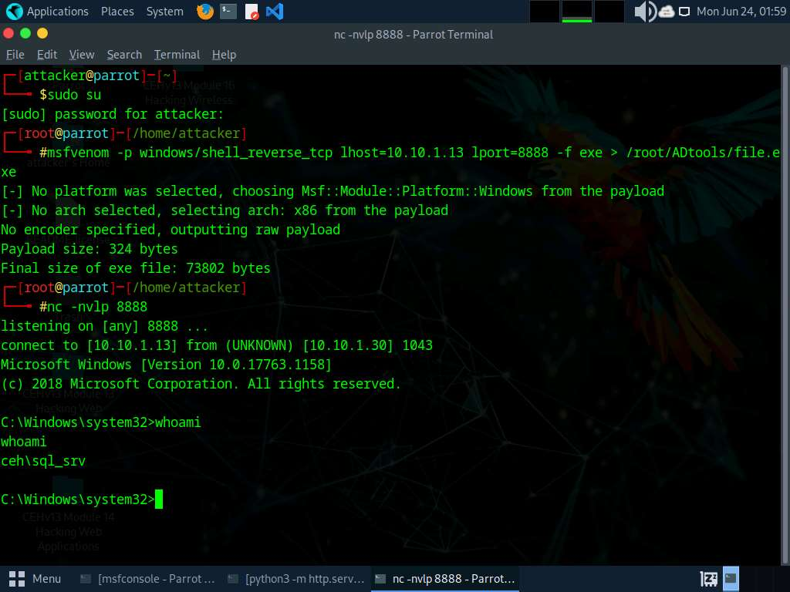

**Figure 5.19:** After the target system restarted, the vulnerable service executed the malicious payload, establishing a reverse shell to the attacker and confirming successful privilege escalation through the `whoami` command.

---

### Learning Outcome

This task demonstrated how Windows service misconfigurations can be abused to achieve privilege escalation. It reinforced the importance of securing service configurations, properly quoting executable paths, restricting service permissions, and continuously auditing systems for privilege escalation vulnerabilities.

---

### Attack Flow

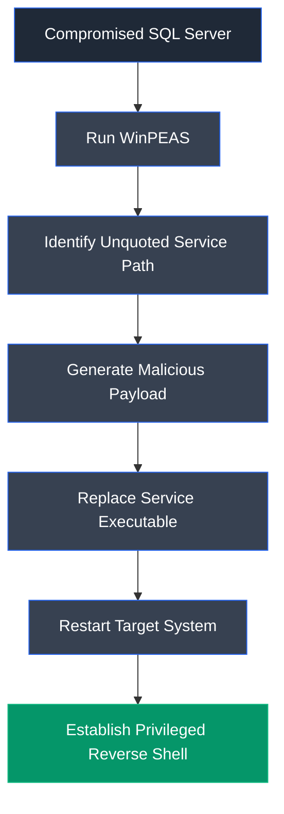
```mermaid
flowchart TD

    A[Compromised SQL Server]
    --> B[Run WinPEAS]
    --> C[Identify Unquoted Service Path]
    --> D[Generate Malicious Payload]
    --> E[Replace Service Executable]
    --> F[Restart Target System]
    --> G[Establish Privileged Reverse Shell]

    classDef start fill:#1f2937,color:#fff,stroke:#2563eb
    classDef process fill:#374151,color:#fff,stroke:#2563eb
    classDef success fill:#059669,color:#fff,stroke:#10b981

    class A start
    class B,C,D,E,F process
    class G success
```

---

## Task 7: Perform Kerberoasting Attack

### Tools Used

- [Rubeus](../../Tools/Rubeus.md)
- [Netcat](../../Tools/Netcat.md)
- [Hashcat](../../Tools/Hashcat.md)

---

### Activity Performed

Following successful privilege escalation, a Kerberoasting attack was performed against the Active Directory environment to obtain credentials belonging to highly privileged service accounts. **Rubeus** was transferred to the compromised Windows Server and executed to request Kerberos service tickets associated with Service Principal Names (SPNs).

The extracted Kerberos ticket hashes were saved locally and securely transferred to the attacker machine using **Netcat**. Once received, the captured Kerberos hash was subjected to an offline dictionary attack using **Hashcat** and the **rockyou.txt** wordlist.

The password associated with the privileged **DC-Admin** account was successfully recovered, demonstrating how weak service account passwords can be exploited through Kerberos authentication without directly interacting with the target account.

This task completed the Active Directory attack chain by compromising highly privileged domain credentials that could be used for further attacks against the enterprise environment.

---

### Observations

- Successfully executed a Kerberoasting attack.
- Extracted Kerberos service ticket hashes.
- Transferred the captured hash to the attacker machine.
- Successfully cracked the Kerberos hash using Hashcat.
- Recovered the password for the **DC-Admin** account.
- Successfully completed the Active Directory attack chain.

---

### Kerberoasting Attack

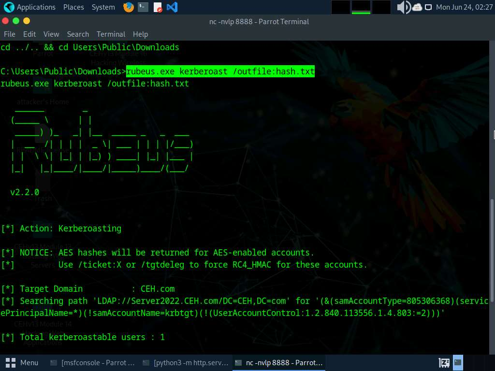

**Figure 5.20:** Rubeus successfully requested Kerberos service tickets from the Domain Controller and extracted service account hashes for offline password cracking.

---

### Kerberos Hash Transfer

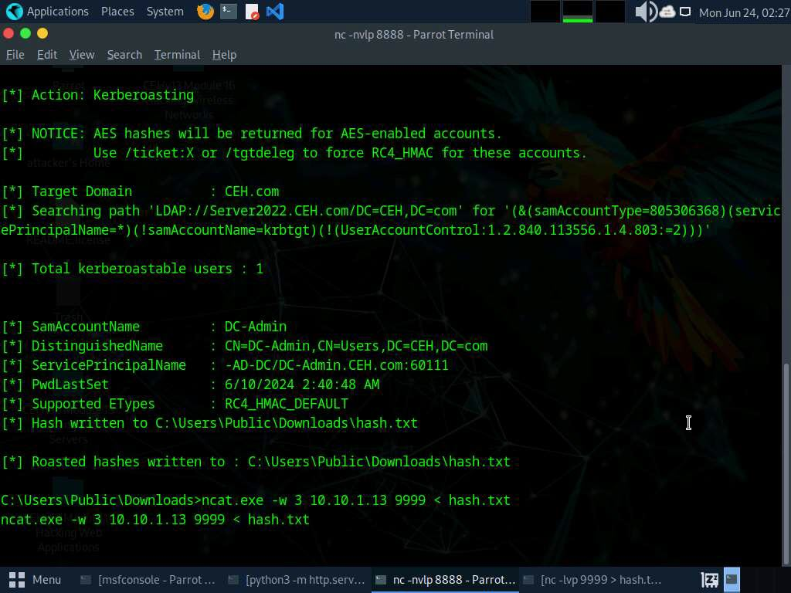

**Figure 5.21:** The extracted Kerberos hash was transferred from the compromised server to the attacker machine using Netcat for offline analysis.

---

### Hashcat Password Cracking

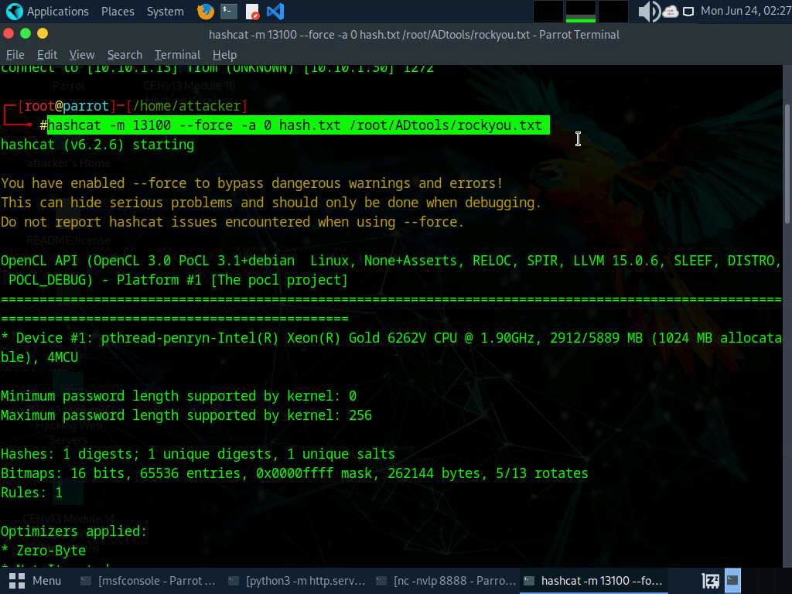

**Figure 5.22:** Hashcat performed an offline dictionary attack against the captured Kerberos hash using the **rockyou.txt** wordlist.

---

### Domain Administrator Credentials Recovered

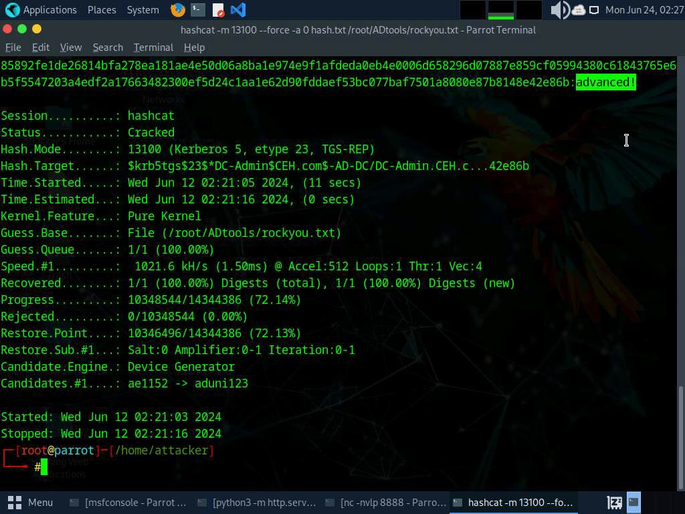

**Figure 5.23:** Hashcat successfully recovered the password for the privileged **DC-Admin** account, completing the Kerberoasting attack and the Active Directory compromise chain.

---

### Learning Outcome

This task demonstrated how Kerberoasting can compromise highly privileged Active Directory service accounts through offline password cracking. It reinforced the importance of strong service account passwords, managed service accounts, Kerberos hardening, continuous monitoring of ticket requests, and detection of abnormal authentication activity within enterprise environments.

---

### Attack Flow

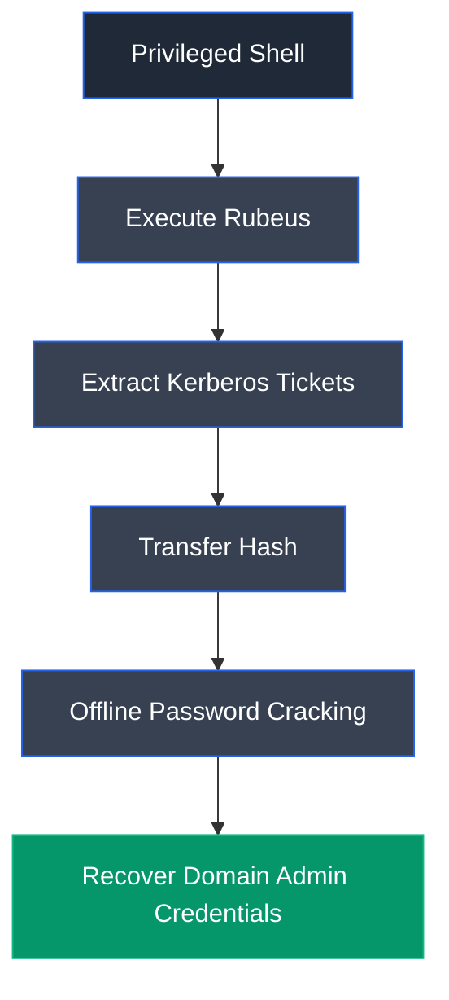
```mermaid
flowchart TD

    A[Privileged Shell]
    --> B[Execute Rubeus]
    --> C[Extract Kerberos Tickets]
    --> D[Transfer Hash]
    --> E[Offline Password Cracking]
    --> F[Recover Domain Admin Credentials]

    classDef start fill:#1f2937,color:#fff,stroke:#2563eb
    classDef process fill:#374151,color:#fff,stroke:#2563eb
    classDef success fill:#059669,color:#fff,stroke:#10b981

    class A start
    class B,C,D,E process
    class F success
```

---

## Complete Active Directory Attack Flow

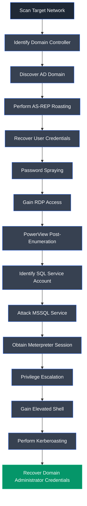
```mermaid
flowchart TD

    A[Scan Target Network]
    --> B[Identify Domain Controller]
    --> C[Discover AD Domain]

    C --> D[Perform AS-REP Roasting]
    D --> E[Recover User Credentials]

    E --> F[Password Spraying]
    F --> G[Gain RDP Access]

    G --> H[PowerView Post-Enumeration]
    H --> I[Identify SQL Service Account]

    I --> J[Attack MSSQL Service]
    J --> K[Obtain Meterpreter Session]

    K --> L[Privilege Escalation]
    L --> M[Gain Elevated Shell]

    M --> N[Perform Kerberoasting]
    N --> O[Recover Domain Administrator Credentials]

    classDef start fill:#1f2937,color:#fff,stroke:#2563eb
    classDef process fill:#374151,color:#fff,stroke:#2563eb
    classDef success fill:#059669,color:#fff,stroke:#10b981

    class A start
    class B,C,D,E,F,G,H,I,J,K,L,M,N process
    class O success
```

---

## Overall Learning Outcome

This lab demonstrated a complete Active Directory attack chain by progressively compromising a Windows domain environment through multiple offensive security techniques. Beginning with network reconnaissance, the assessment identified the Domain Controller and Active Directory domain before exploiting Kerberos pre-authentication weaknesses through AS-REP Roasting to obtain valid user credentials.

The recovered credentials were leveraged in a password spraying attack to gain authenticated Remote Desktop access, enabling post-enumeration with PowerView to discover additional high-value service accounts. Subsequent attacks targeted the Microsoft SQL Server service, resulting in remote code execution and a Meterpreter session. Privilege escalation techniques were then employed to obtain elevated access by exploiting an Unquoted Service Path vulnerability. Finally, a Kerberoasting attack successfully extracted and cracked Kerberos service account credentials, culminating in the compromise of highly privileged domain credentials.

Overall, this lab illustrated how individual weaknesses—including insecure authentication settings, password reuse, exposed services, weak service account passwords, and system misconfigurations—can be chained together to achieve a complete Active Directory compromise. It also reinforced the importance of defense-in-depth strategies such as secure Kerberos configuration, strong password policies, least-privilege administration, service hardening, centralized monitoring, and continuous auditing to protect enterprise Active Directory environments.

---

# Lab 6: Perform System Hacking using AI

## Objective

To utilize ShellGPT for automating system hacking tasks by generating AI-assisted commands for payload creation, listener configuration, password attacks, and steganography, demonstrating how artificial intelligence can enhance the efficiency of ethical hacking and penetration testing.

---

## Background

Artificial Intelligence (AI) is increasingly being integrated into cybersecurity to automate repetitive tasks, improve decision-making, and accelerate security assessments. AI-powered assistants can interpret natural language prompts and generate accurate commands for penetration testing tools, allowing security professionals to perform complex operations more efficiently.

In ethical hacking, AI assistants such as ShellGPT simplify interactions with command-line utilities by converting human-readable instructions into executable commands. Rather than replacing traditional security tools, AI enhances productivity by reducing manual effort, minimizing syntax errors, and assisting with vulnerability assessment, payload generation, password auditing, exploitation workflows, and other penetration testing activities.

This lab demonstrates how ShellGPT can be used to automate common system hacking operations by generating commands for tools such as **MSFVenom**, **Metasploit**, **Hydra**, and **Steghide**, highlighting the growing role of AI in modern cybersecurity assessments.

---

## Task 1: Perform System Hacking using ShellGPT

### Tools Used

- [ShellGPT](../../Tools/ShellGPT.md)

---

### Activity Performed

ShellGPT was configured using an AI activation key and utilized as an AI-powered command-line assistant to automate multiple system hacking tasks through natural language prompts. Instead of manually composing commands, descriptive instructions were provided to ShellGPT, which generated the appropriate commands for various penetration testing tools.

Using AI-generated commands, ShellGPT assisted in creating reverse shell payloads with **MSFVenom**, configuring **Metasploit** listeners, performing password attacks using **Hydra**, and demonstrating image steganography through **Steghide**. The generated commands were reviewed before execution, illustrating how artificial intelligence can improve efficiency while maintaining user control over security operations.

This task demonstrated the integration of AI with traditional penetration testing tools, enabling faster command generation, reducing manual syntax errors, and streamlining ethical hacking workflows without replacing the underlying security tools.

---

### Observations

- Successfully configured ShellGPT.
- Generated penetration testing commands using natural language prompts.
- Automated payload generation and listener configuration.
- Assisted with password auditing and steganography operations.
- Demonstrated AI-assisted penetration testing workflows.
- Reduced manual command creation while maintaining operator control.

---

### ShellGPT Command Generation

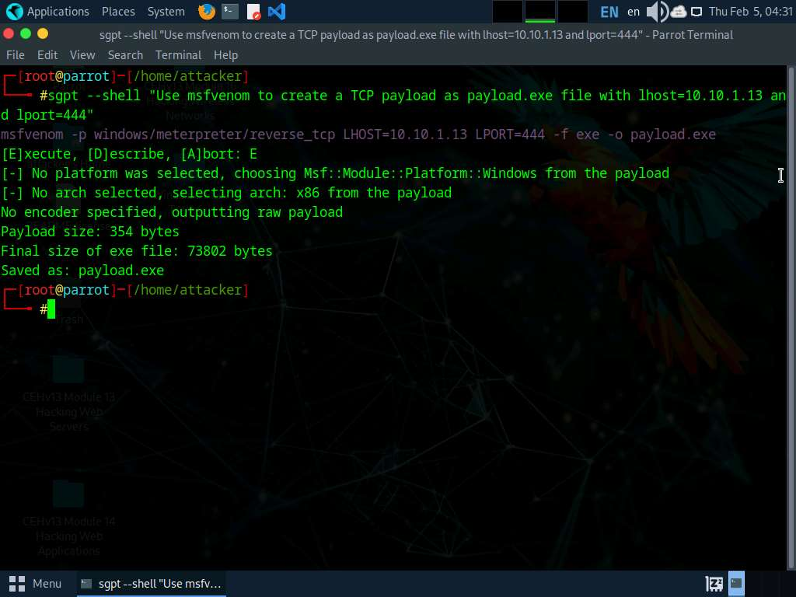

**Figure 6.1:** ShellGPT converted a natural language prompt into executable penetration testing commands, demonstrating AI-assisted automation of system hacking tasks.

---

### Learning Outcome

This task demonstrated how artificial intelligence can enhance penetration testing by translating natural language instructions into executable security commands. It reinforced the role of AI as an assistant that improves efficiency, reduces manual effort, and accelerates security assessments while still requiring human validation and responsible use.

---

### AI-Assisted Workflow

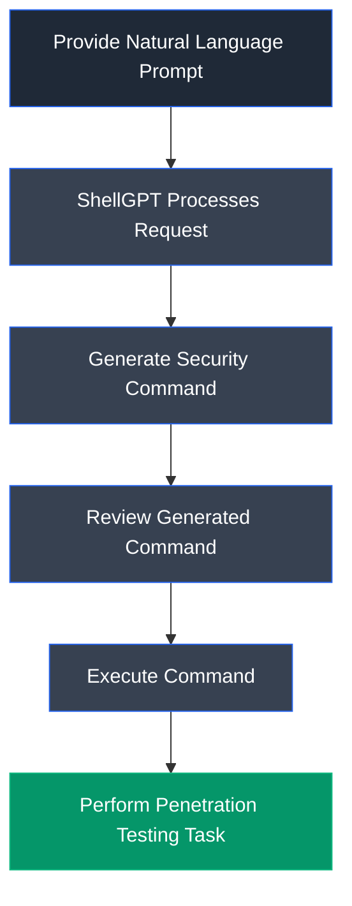
```mermaid
flowchart TD

    A[Provide Natural Language Prompt]
    --> B[ShellGPT Processes Request]
    --> C[Generate Security Command]
    --> D[Review Generated Command]
    --> E[Execute Command]
    --> F[Perform Penetration Testing Task]

    classDef start fill:#1f2937,color:#fff,stroke:#2563eb
    classDef process fill:#374151,color:#fff,stroke:#2563eb
    classDef success fill:#059669,color:#fff,stroke:#10b981

    class A start
    class B,C,D,E process
    class F success
```

---

## Overall Learning Outcome

This lab demonstrated how Artificial Intelligence can enhance penetration testing by automating the generation of security commands through natural language prompts. Using ShellGPT, various system hacking activities—including payload generation, listener configuration, password auditing, and steganography—were performed more efficiently while leveraging established security tools such as MSFVenom, Metasploit, Hydra, and Steghide. The lab reinforced that AI serves as an effective assistant for ethical hackers by reducing manual effort and improving productivity, while emphasizing that generated commands must always be reviewed, validated, and executed responsibly within authorized environments.

---

## Key Takeaways

- Understood the complete Windows system hacking lifecycle, from gaining initial access to maintaining persistence and covering tracks.
- Performed password attacks using Responder, John the Ripper, Hydra, and Active Directory credential attack techniques.
- Generated reverse shell payloads using MSFVenom and established Meterpreter sessions through Metasploit.
- Exploited Windows privilege escalation techniques, including UAC bypass, Sticky Keys abuse, Registry Run Keys, and Unquoted Service Path vulnerabilities.
- Learned persistence techniques through Registry modifications and Sticky Keys replacement.
- Cleared Windows Event Logs and Linux Bash history to understand anti-forensic techniques used to conceal malicious activities.
- Executed a complete Active Directory attack chain involving reconnaissance, AS-REP Roasting, password spraying, PowerView enumeration, MSSQL exploitation, privilege escalation, and Kerberoasting.
- Explored AI-assisted penetration testing using ShellGPT to automate command generation for common system hacking tasks.
- Reinforced the importance of chaining multiple vulnerabilities together to compromise enterprise environments while understanding the corresponding defensive controls.

---

## Defensive Perspective

The techniques demonstrated throughout this module highlight the importance of implementing layered security controls to defend Windows and Active Directory environments. Organizations should enforce strong password policies, enable Kerberos pre-authentication, apply the principle of least privilege, harden Windows services, restrict registry modifications, disable unnecessary features such as **xp_cmdshell**, and continuously patch operating systems and applications. Security teams should also deploy centralized logging, monitor authentication events, detect privilege escalation attempts, audit Active Directory activities, and regularly review persistence mechanisms to identify and respond to malicious behavior before it leads to a full system compromise.

---

## Interview Questions

1. What are the four phases of system hacking?
2. How does Responder exploit LLMNR and NBT-NS to capture credentials?
3. What is the difference between a reverse shell and a bind shell?
4. Explain how Meterpreter assists during post-exploitation.
5. What is User Account Control (UAC), and how can attackers attempt to bypass it?
6. How can Sticky Keys be abused to establish persistence?
7. What are Registry Run Keys, and how can they be exploited?
8. Explain the Unquoted Service Path vulnerability.
9. What is the difference between AS-REP Roasting and Kerberoasting?
10. How does PowerView assist in Active Directory post-enumeration?
11. Why is enabling **xp_cmdshell** considered a security risk?
12. How can organizations detect and prevent persistence and privilege escalation attacks?

---

## My Reflection

This module provided practical experience in the complete system hacking process, from gaining initial access to achieving full system and Active Directory compromise. By combining multiple techniques—including credential attacks, privilege escalation, persistence, anti-forensics, and AI-assisted penetration testing—I developed a deeper understanding of how attackers chain vulnerabilities together during real-world engagements. Equally important, the module emphasized the defensive measures required to secure Windows systems and enterprise Active Directory environments against these attack techniques.

---