# Module 08: Sniffing

> **Status:** ✅ Completed
>
> **Difficulty:** ⭐⭐⭐☆☆
>
> **Labs Completed:** 3
>
> **Tools Covered:** macof, Yersinia, Wireshark, Cain & Abel, Nmap
---

# Module Summary

This module introduces the concepts of network sniffing and packet capture within both hub-based and switch-based networks. It explores passive and active sniffing techniques, demonstrates how attackers manipulate switching behavior to intercept network traffic, and highlights the use of packet analysis tools to capture sensitive information transmitted across a network. The module also covers methods for detecting sniffing attacks and securing enterprise networks against unauthorized packet interception.

---

# Overview

Network sniffing is the process of capturing and analyzing packets transmitted across a network. While modern switched networks reduce the effectiveness of passive sniffing, attackers can still exploit weaknesses through techniques such as MAC flooding and DHCP starvation to intercept traffic. By understanding these attack methods and analyzing captured packets, ethical hackers can evaluate network security, identify vulnerabilities, and recommend appropriate defensive measures.

This module provides hands-on experience with active sniffing attacks, packet capture and analysis, and the detection of malicious sniffing activities using industry-standard network monitoring tools.

---

# Learning Objectives

After completing this module, you will be able to:

- Understand the principles of passive and active network sniffing.
- Perform MAC flooding attacks against switch-based networks.
- Conduct DHCP starvation attacks.
- Capture and analyze network traffic using packet sniffing tools.
- Extract sensitive information from captured packets.
- Detect ARP poisoning and promiscuous mode devices.
- Understand defensive techniques for preventing network sniffing attacks.

---

# Key Concepts

- Network Sniffing
- Packet Capture
- Passive Sniffing
- Active Sniffing
- Hub-Based Networks
- Switch-Based Networks
- Promiscuous Mode
- MAC Flooding
- DHCP Starvation
- ARP Poisoning
- Packet Analysis
- Network Traffic Monitoring
- Indicators of Compromise (IoCs)

---

# Tools Used

- [macof](../../Tools/macof.md)
- [Yersinia](../../Tools/Yersinia.md)
- [Wireshark](../../Tools/Wireshark.md)
- [Cain & Abel](../../Tools/Cain-and-Abel.md)
- [Nmap](../../Tools/Nmap.md)

---

# Labs Covered

| Lab | Title | Status |
|------|-----------------------------------------------|:------:|
| Lab 1 | Perform Active Sniffing | ✅ |
| Lab 2 | Perform Network Sniffing using Various Sniffing Tools | ✅ |
| Lab 3 | Detect Network Sniffing | ✅ |

---

# Lab 1: Perform Active Sniffing

## Objective

Perform active network sniffing attacks against a switched network using MAC flooding and DHCP starvation techniques. This lab demonstrates how attackers manipulate switch behavior and DHCP services to intercept network traffic and evaluate the security of enterprise networks.

## Background

Unlike passive sniffing on hub-based networks, active sniffing targets switched networks by injecting malicious traffic to manipulate normal network operation. Techniques such as MAC flooding overload a switch's CAM table, causing it to broadcast traffic similarly to a hub, while DHCP starvation exhausts available IP addresses by sending numerous DHCP requests. These attacks allow ethical hackers to assess network security, identify vulnerabilities, and recommend appropriate defensive measures to protect network infrastructure.

---

## Task 1: Perform MAC Flooding using macof

### Tools Used

- [macof](../../Tools/macof.md)
- [Wireshark](../../Tools/Wireshark.md)

---

### Activity Performed

The **macof** utility was used to perform a MAC flooding attack against a switched network by generating numerous packets with random MAC and IP addresses. Simultaneously, **Wireshark** captured the resulting network traffic to observe how the switch handled the flooded packets and to inspect the Ethernet frame details generated during the attack.

---

### Observations

- Successfully performed a MAC flooding attack using macof.
- Generated multiple packets with random source MAC and IP addresses.
- Captured the flooded traffic using Wireshark.
- Examined the Ethernet II header to verify the source and destination MAC addresses of the generated packets.

---

### Wireshark Packet Capture

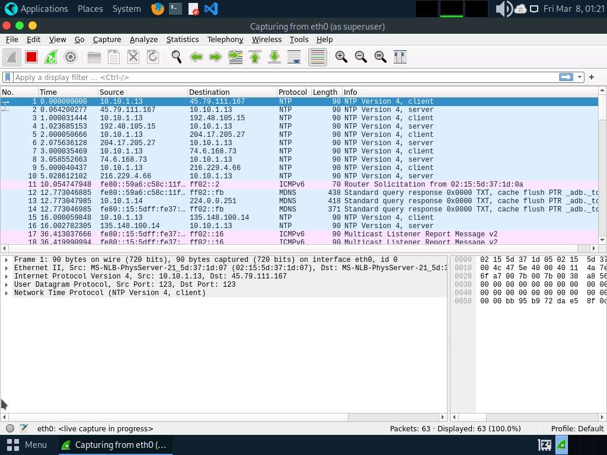

**Figure 1.1:** Wireshark was configured to capture network traffic on the primary network interface before launching the MAC flooding attack.

---

### MAC Flooding using macof

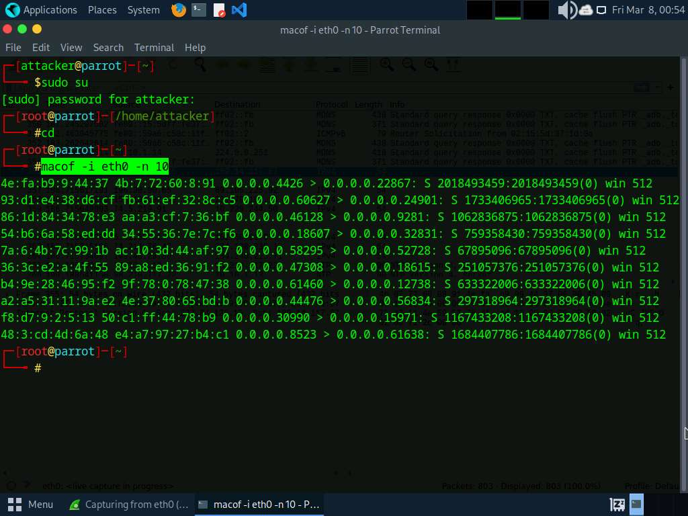

**Figure 1.2:** The macof utility generated numerous packets with random MAC and IP addresses to flood the switch's CAM table.

---

### MAC Flooding Traffic Analysis

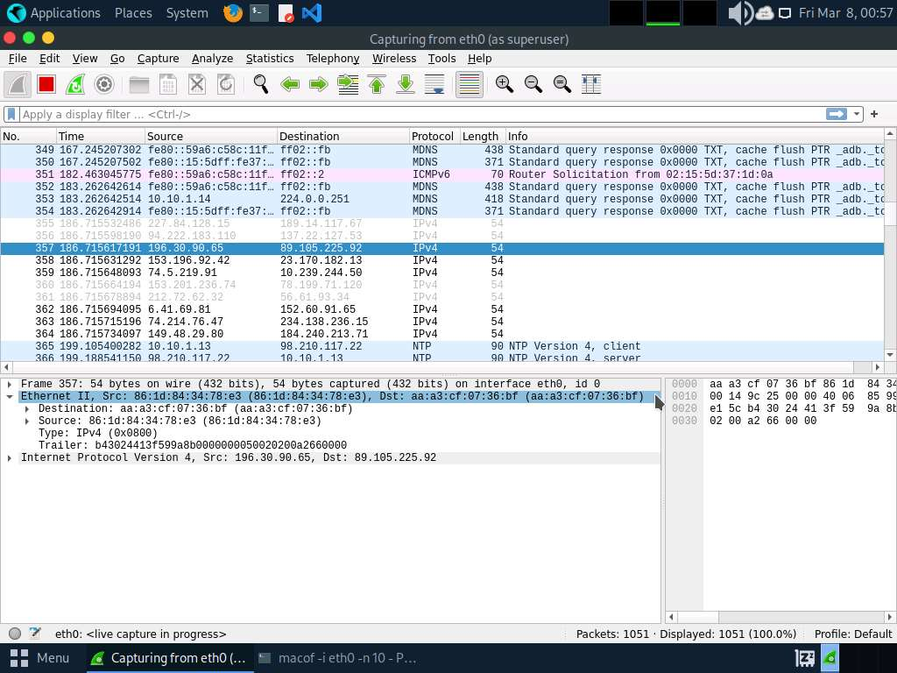

**Figure 1.3:** Wireshark captured the flooded packets, and the Ethernet II header was examined to analyze the generated source and destination MAC addresses.

---

### Learning Outcome

This task demonstrated how MAC flooding can manipulate a switch's CAM table, allowing attackers to observe network traffic that would normally remain isolated within a switched environment.

---

### Attack Flow

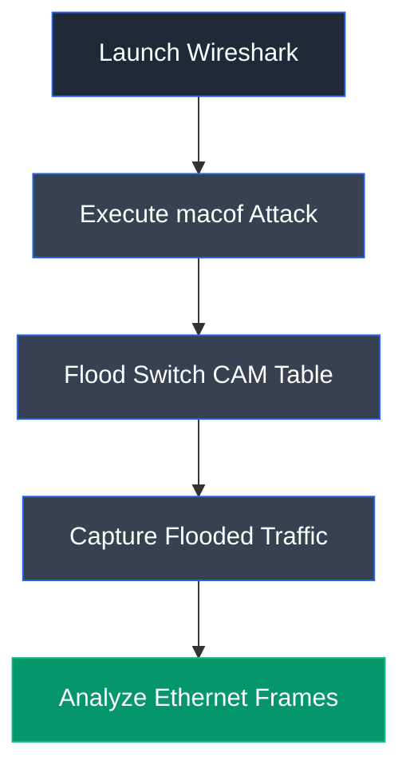
```mermaid
flowchart TD

    A[Launch Wireshark]
    --> B[Execute macof Attack]
    --> C[Flood Switch CAM Table]
    --> D[Capture Flooded Traffic]
    --> E[Analyze Ethernet Frames]

    classDef start fill:#1f2937,color:#fff,stroke:#2563eb
    classDef process fill:#374151,color:#fff,stroke:#2563eb
    classDef decision fill:#7c3aed,color:#fff,stroke:#8b5cf6
    classDef success fill:#059669,color:#fff,stroke:#10b981

    class A start
    class B,C,D process
    class E success
```

---

## Task 2: Perform a DHCP Starvation Attack using Yersinia

### Tools Used

- [Yersinia](../../Tools/Yersinia.md)
- [Wireshark](../../Tools/Wireshark.md)

---

### Activity Performed

A DHCP starvation attack was performed using **Yersinia** by continuously sending DHCP requests to exhaust the available IP address pool of the DHCP server. During the attack, **Wireshark** monitored and captured the generated DHCP traffic to observe the large volume of DHCP packets and inspect the Ethernet frame details.

---

### Observations

- Successfully initiated a DHCP starvation attack using Yersinia.
- Generated a large number of DHCP discovery packets.
- Captured DHCP traffic using Wireshark.
- Examined the Ethernet II header to verify the source and destination MAC addresses of the DHCP packets.

---

### Yersinia Interactive Mode

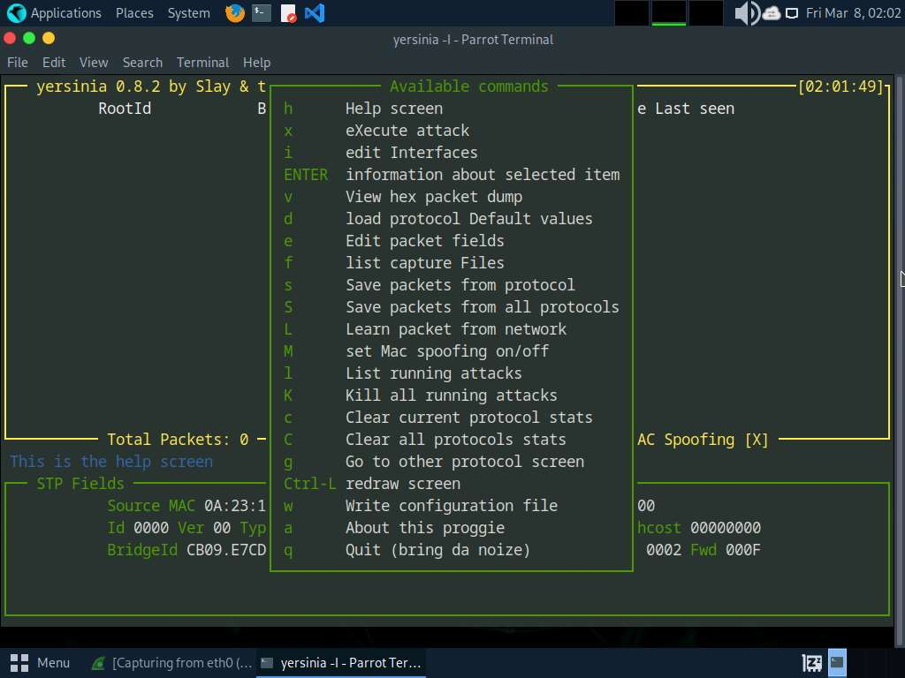

**Figure 1.4:** Yersinia was launched in interactive mode to prepare and configure the DHCP starvation attack.

---

### DHCP Starvation Attack

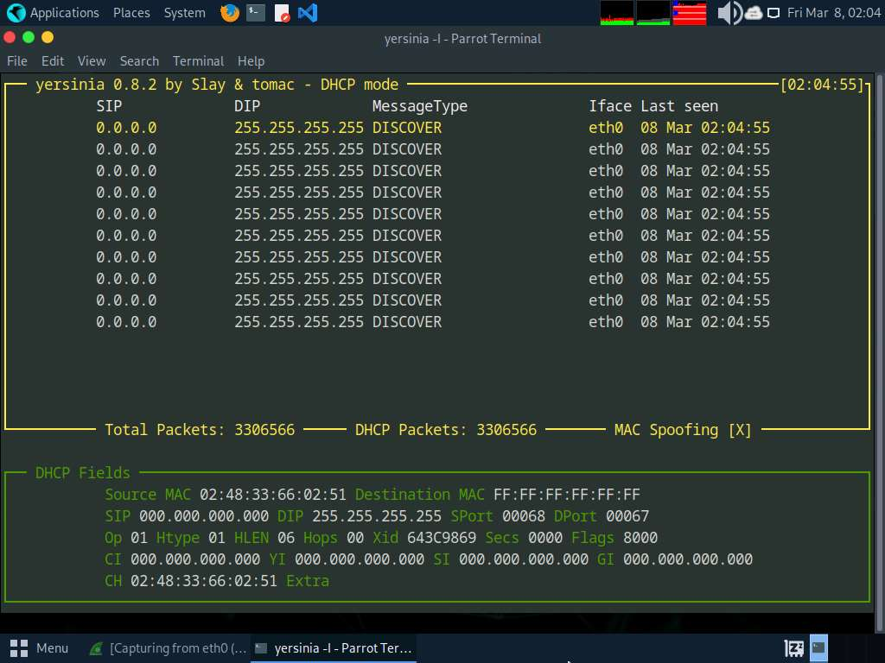

**Figure 1.5:** Yersinia continuously transmitted DHCP requests to exhaust the DHCP server's available address pool.

---

### DHCP Traffic Analysis

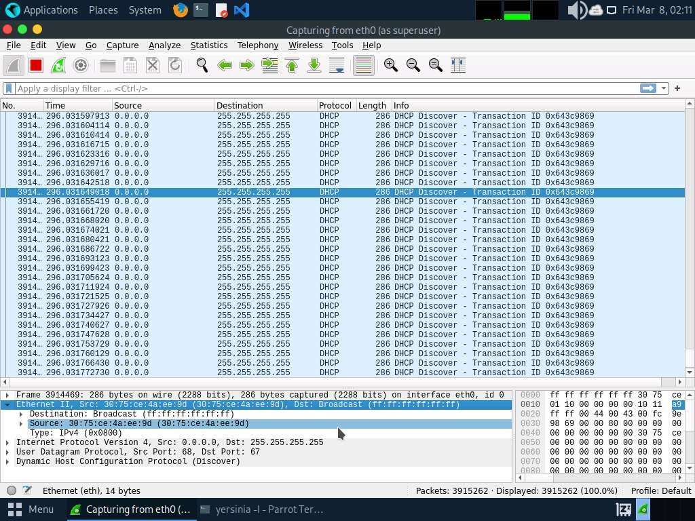

**Figure 1.6:** Wireshark captured the DHCP traffic generated during the attack, and the Ethernet II header was analyzed to inspect the packet source and destination MAC addresses.

---

### Learning Outcome

This task demonstrated how DHCP starvation attacks can exhaust a DHCP server's available address pool, leading to denial of service for legitimate clients while providing insight into the generated network traffic.

---

### Attack Flow

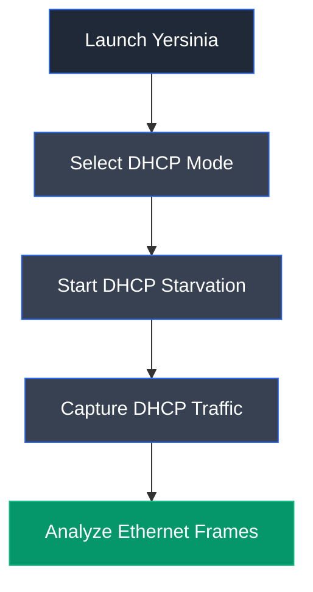
```mermaid
flowchart TD

    A[Launch Yersinia]
    --> B[Select DHCP Mode]
    --> C[Start DHCP Starvation]
    --> D[Capture DHCP Traffic]
    --> E[Analyze Ethernet Frames]

    classDef start fill:#1f2937,color:#fff,stroke:#2563eb
    classDef process fill:#374151,color:#fff,stroke:#2563eb
    classDef decision fill:#7c3aed,color:#fff,stroke:#8b5cf6
    classDef success fill:#059669,color:#fff,stroke:#10b981

    class A start
    class B,C,D process
    class E success
```

---

## Overall Learning Outcome

This lab demonstrated two common active sniffing techniques used against switched networks: **MAC flooding** and **DHCP starvation**. By performing these attacks and analyzing the generated network traffic with Wireshark, it highlighted how attackers can manipulate network infrastructure, observe packet transmission, and identify weaknesses in switching and DHCP services. The exercises also reinforced the importance of implementing secure switch configurations, DHCP protection mechanisms, and continuous network monitoring to defend against active sniffing attacks

---

# Lab 2: Perform Network Sniffing using Various Sniffing Tools

## Objective

Perform password sniffing and remote packet capture using Wireshark. This lab demonstrates how unencrypted network traffic can expose sensitive information such as user credentials and how remote packet capture can be used to monitor traffic from another system on the network.

---

## Background

Many application-layer protocols transmit data in plaintext, making them vulnerable to packet sniffing attacks. By capturing network traffic, attackers can intercept authentication requests, session information, and other sensitive data if secure protocols are not enforced. Network packet analyzers such as Wireshark enable security professionals to inspect captured traffic, identify exposed credentials, troubleshoot network issues, and assess the security posture of network communications.

---

## Task 1: Perform Password Sniffing using Wireshark

### Tools Used

- [Wireshark](../../Tools/Wireshark.md)

---

### Activity Performed

Wireshark was used to capture network traffic generated during an HTTP login session between a client and a web server. The captured packets were filtered to identify HTTP POST requests, allowing inspection of transmitted form data. The lab also demonstrated remote packet capture by enabling the Remote Packet Capture Protocol service on a target machine and monitoring its network traffic from another system.

---

### Observations

- Successfully captured live network traffic using Wireshark.
- Filtered HTTP POST requests from the captured packets.
- Retrieved plaintext login credentials from captured HTTP traffic.
- Enabled the Remote Packet Capture Protocol service on the target machine.
- Configured Wireshark to capture traffic from a remote interface.
- Successfully monitored network traffic generated on the remote system.

---

### Live Packet Capture

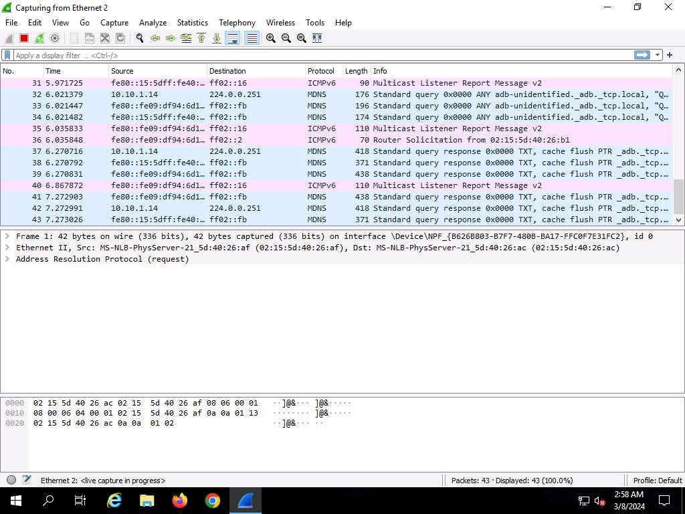

**Figure 2.1:** Wireshark was configured to capture live network traffic on the primary network interface.

---

### Captured HTTP Credentials

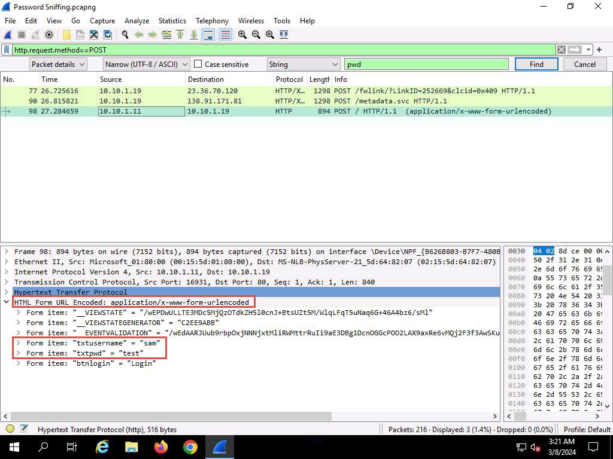

**Figure 2.2:** The captured HTTP POST request revealed the transmitted username and password within the HTML form data.

---

### Remote Packet Capture Service

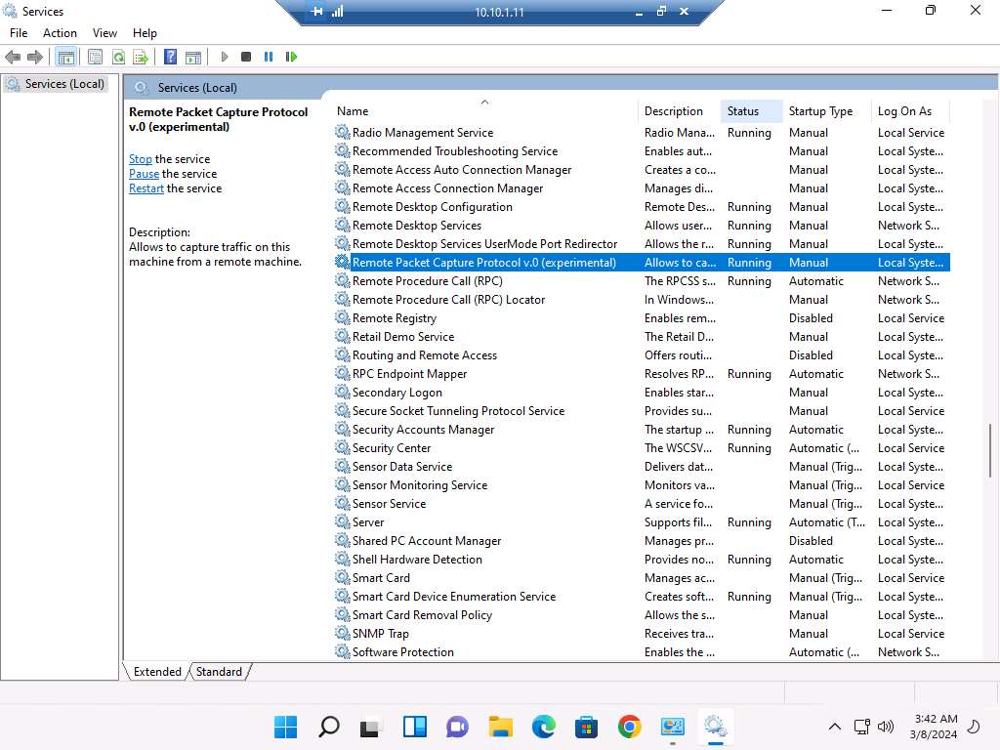

**Figure 2.3:** The Remote Packet Capture Protocol service was started on the target machine to enable remote traffic monitoring.

---

### Remote Interface Configuration

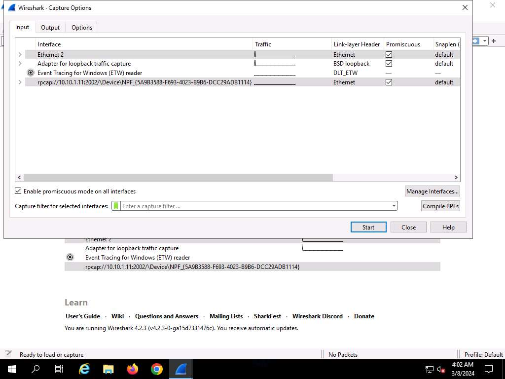

**Figure 2.4:** Wireshark was configured to capture packets from the remote network interface using authenticated remote access.

---

### Remote Packet Capture

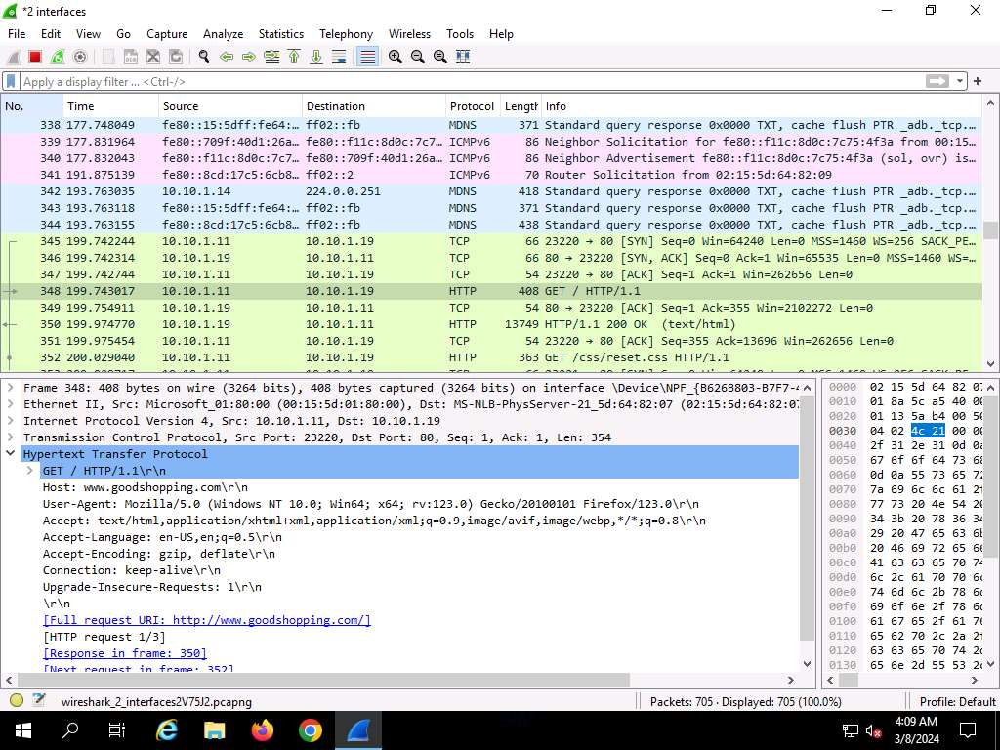

**Figure 2.5:** Wireshark successfully captured network traffic generated by the remote system while browsing the Internet.

---

### Learning Outcome

This task demonstrated how unencrypted HTTP communications expose sensitive credentials during packet capture and how Wireshark can be configured to monitor traffic from remote systems for network analysis and security assessments.

---

### Attack Flow

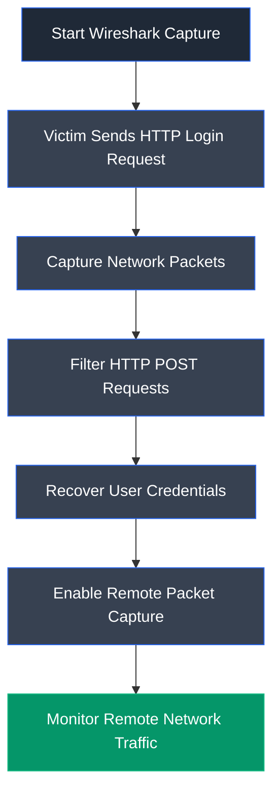
```mermaid
flowchart TD

    A[Start Wireshark Capture]
    --> B[Victim Sends HTTP Login Request]
    --> C[Capture Network Packets]
    --> D[Filter HTTP POST Requests]
    --> E[Recover User Credentials]
    --> F[Enable Remote Packet Capture]
    --> G[Monitor Remote Network Traffic]

    classDef start fill:#1f2937,color:#fff,stroke:#2563eb
    classDef process fill:#374151,color:#fff,stroke:#2563eb
    classDef decision fill:#7c3aed,color:#fff,stroke:#8b5cf6
    classDef success fill:#059669,color:#fff,stroke:#10b981

    class A start
    class B,C,D,E,F process
    class G success
```

---

## Overall Learning Outcome

This lab demonstrated how packet sniffing tools can capture and analyze network traffic to identify sensitive information transmitted over insecure protocols. By recovering HTTP credentials and performing remote packet capture, it highlighted the risks associated with plaintext communication and emphasized the importance of encrypted protocols, secure network configurations, and continuous traffic monitoring to protect enterprise networks from credential theft and unauthorized surveillance.

---

# Lab 3: Detect Network Sniffing

## Objective

Detect ARP poisoning and promiscuous mode in a switched network using network analysis and scanning tools. This lab demonstrates how security professionals can identify indicators of sniffing attacks and verify whether systems are operating in promiscuous mode.

---

## Background

Network sniffing attacks are often difficult to detect because sniffers passively monitor network traffic without generating significant outbound communication. However, techniques such as ARP poisoning leave observable indicators that can be identified through packet analysis. Additionally, systems operating in promiscuous mode can be detected using specialized scanning techniques. By identifying these indicators, ethical hackers can assess network security and recommend countermeasures to prevent unauthorized packet interception.

---

## Task 1: Detect ARP Poisoning and Promiscuous Mode in a Switch-Based Network

### Tools Used

- [Cain & Abel](../../Tools/Cain-and-Abel.md)
- [Wireshark](../../Tools/Wireshark.md)
- [Nmap](../../Tools/Nmap.md)

---

### Activity Performed

Cain & Abel was used to perform ARP poisoning between two target systems while Wireshark monitored the resulting network traffic. Wireshark's Expert Information feature was then used to identify duplicate IP address warnings generated by the attack. Finally, the Nmap Scripting Engine (NSE) was used to determine whether a target machine's network interface was operating in promiscuous mode.

---

### Observations

- Successfully scanned the local network for active hosts.
- Performed ARP poisoning between two target systems.
- Captured the intercepted traffic using Wireshark.
- Detected duplicate IP address warnings indicating ARP poisoning.
- Identified a system operating in promiscuous mode using the Nmap NSE script.

---

### Network Host Discovery

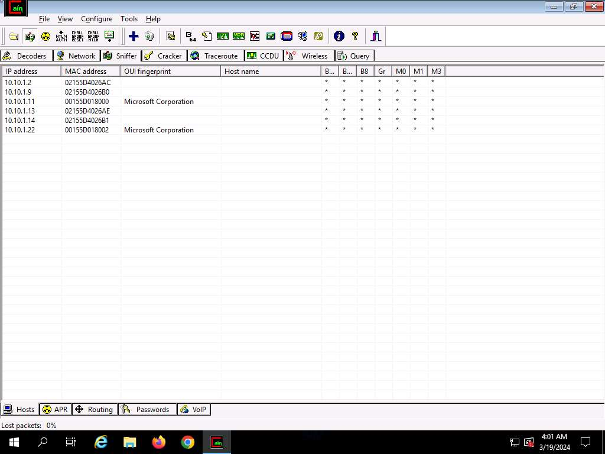

**Figure 3.1:** Cain & Abel scanned the local subnet and identified active hosts along with their associated MAC addresses.

---

### ARP Poisoning Attack

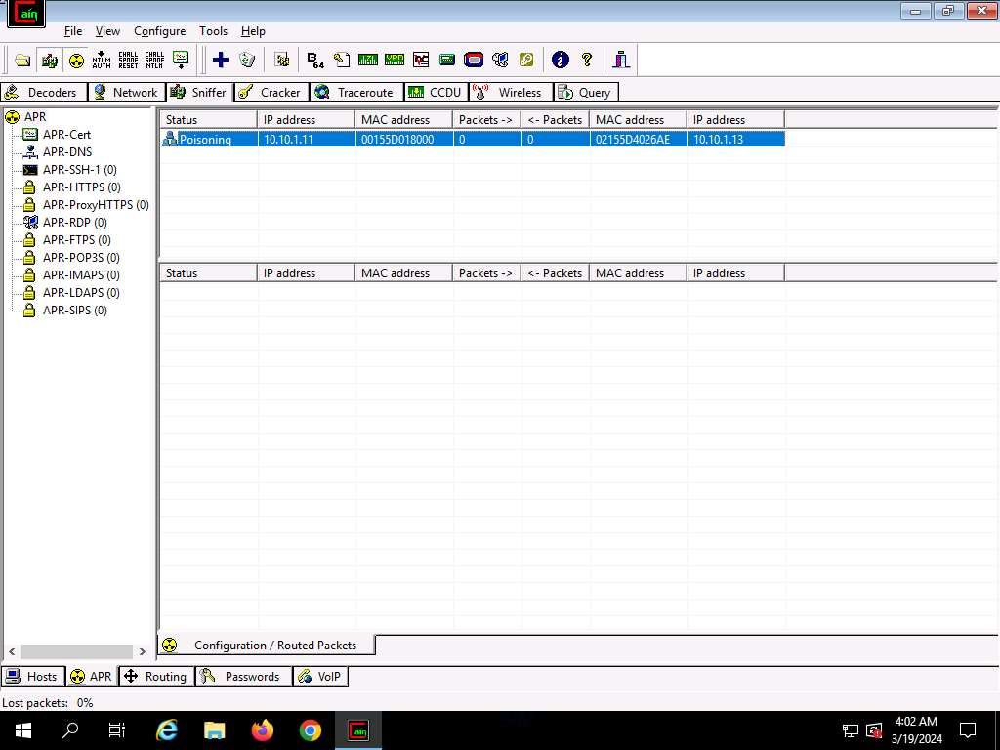

**Figure 3.2:** Cain & Abel initiated ARP poisoning between the selected systems, enabling interception of traffic flowing between them.

---

### ARP Traffic Capture

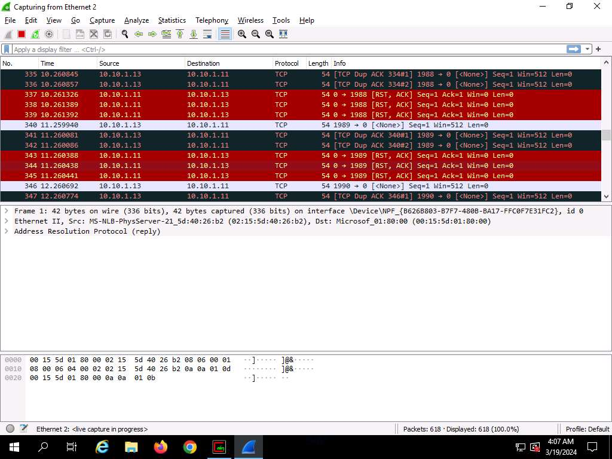

**Figure 3.3:** Wireshark captured the network traffic generated during the ARP poisoning attack for further analysis.

---

### Duplicate IP Address Detection

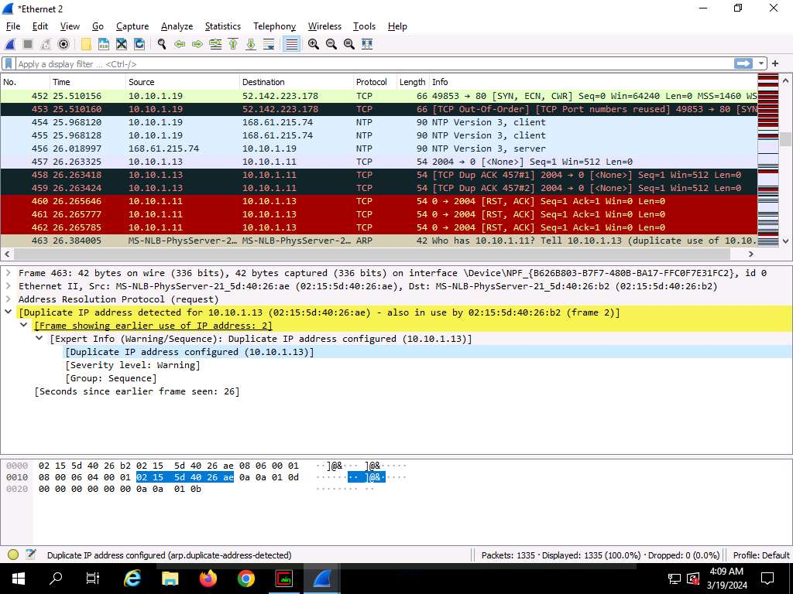

**Figure 3.4:** Wireshark identified duplicate IP address warnings, indicating suspicious ARP activity within the network.

---

### Promiscuous Mode Detection

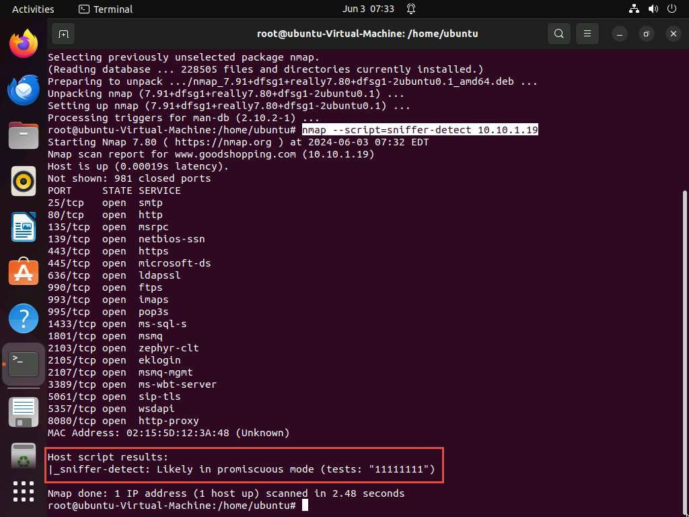

**Figure 3.5:** The Nmap NSE script detected that the target system was likely operating in promiscuous mode.

---

### Learning Outcome

This task demonstrated how ARP poisoning attacks can be detected through packet analysis and how systems operating in promiscuous mode can be identified using network scanning techniques.

---

### Attack Flow

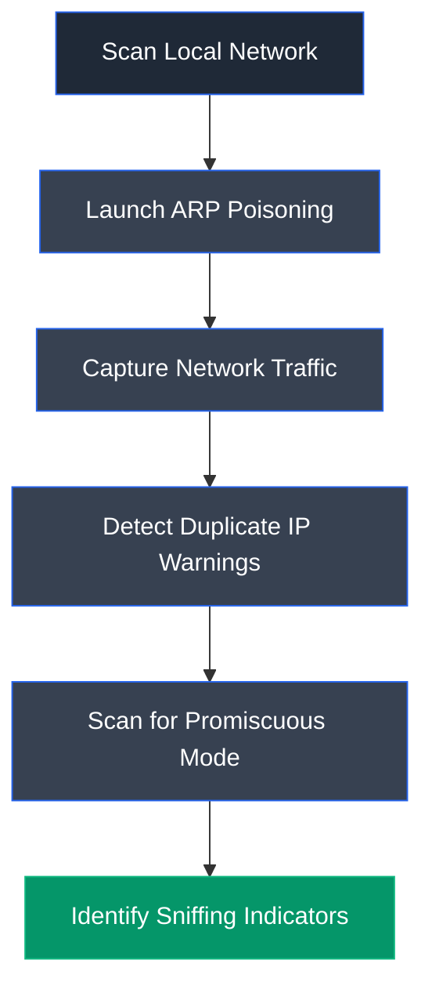
```mermaid
flowchart TD

    A[Scan Local Network]
    --> B[Launch ARP Poisoning]
    --> C[Capture Network Traffic]
    --> D[Detect Duplicate IP Warnings]
    --> E[Scan for Promiscuous Mode]
    --> F[Identify Sniffing Indicators]

    classDef start fill:#1f2937,color:#fff,stroke:#2563eb
    classDef process fill:#374151,color:#fff,stroke:#2563eb
    classDef decision fill:#7c3aed,color:#fff,stroke:#8b5cf6
    classDef success fill:#059669,color:#fff,stroke:#10b981

    class A start
    class B,C,D,E process
    class F success
```

---

## Overall Learning Outcome

This lab demonstrated practical techniques for detecting network sniffing attacks within a switched environment. By identifying ARP poisoning indicators through packet analysis and verifying promiscuous mode using Nmap, it reinforced the importance of continuous network monitoring, anomaly detection, and proactive security assessments to identify and mitigate unauthorized packet interception.

---

# Key Takeaways

- Understood the concepts of passive and active network sniffing in hub-based and switch-based networks.
- Performed MAC flooding attacks using macof to overflow a switch's CAM table and observe network traffic.
- Executed a DHCP starvation attack using Yersinia to exhaust the DHCP server's available IP address pool.
- Captured and analyzed network traffic using Wireshark to identify plaintext HTTP communications and recover transmitted credentials.
- Performed remote packet capture using Wireshark to monitor traffic from another system on the network.
- Detected ARP poisoning attacks by analyzing duplicate IP address warnings and abnormal ARP traffic.
- Identified systems operating in promiscuous mode using the Nmap Scripting Engine (NSE).
- Explored how network sniffing techniques enable attackers to intercept sensitive information transmitted over insecure protocols.
- Reinforced the importance of encrypted communications, secure switch configurations, and continuous network monitoring to defend against sniffing attacks.

---

# Defensive Perspective

The techniques demonstrated throughout this module emphasize the importance of securing network infrastructure against unauthorized packet interception. Organizations should enforce encrypted communication protocols such as HTTPS, SSH, and SFTP instead of plaintext protocols like HTTP, Telnet, and FTP. Network administrators should enable switch security features such as port security, Dynamic ARP Inspection (DAI), DHCP Snooping, and IP Source Guard to mitigate active sniffing attacks. Continuous monitoring of ARP traffic, duplicate IP address warnings, abnormal DHCP activity, and systems operating in promiscuous mode enables security teams to detect and respond to network sniffing attempts before sensitive information is compromised.

---

# Interview Questions

1. What is network sniffing, and why is it performed?
2. Explain the difference between passive and active sniffing.
3. What is MAC flooding, and how does it affect a network switch?
4. What is DHCP starvation, and what is its objective?
5. How does Wireshark assist during network traffic analysis?
6. Why are HTTP login credentials vulnerable to packet sniffing?
7. What is ARP poisoning, and how does it enable man-in-the-middle attacks?
8. How can Wireshark detect ARP poisoning attacks?
9. What is promiscuous mode, and why is it important during packet sniffing?
10. How does the Nmap NSE `sniffer-detect` script identify systems operating in promiscuous mode?
11. What security controls can prevent active sniffing attacks on switched networks?
12. Why should organizations replace plaintext protocols with encrypted alternatives?

---

# My Reflection

This module provided practical experience in understanding how attackers intercept network traffic using both passive and active sniffing techniques. By performing MAC flooding, DHCP starvation, packet capture, remote traffic monitoring, and ARP poisoning detection, I gained a deeper understanding of how sensitive information can be exposed across insecure networks. The module also reinforced the importance of implementing layered network security controls, encrypted communication protocols, and continuous monitoring to effectively detect and mitigate network sniffing attacks.

---