# Module 09: Social Engineering

> **Status:** ✅ Completed
>
> **Difficulty:** ⭐⭐⭐☆☆
>
> **Labs Completed:** 3
>
> **Tools Covered:** Social-Engineer Toolkit (SET), Netcraft, ChatGPT

---

# Module Summary

This module explores how attackers exploit human psychology rather than technical vulnerabilities to compromise organizations. It demonstrates practical social engineering techniques such as credential harvesting, phishing detection, and AI-assisted phishing email generation. The module also highlights defensive strategies that help organizations recognize, prevent, and respond to social engineering attacks.

---

# Overview

Social engineering is the practice of manipulating individuals into revealing sensitive information or performing actions that compromise security. Unlike traditional cyberattacks that exploit software vulnerabilities, social engineering targets human behavior through deception, persuasion, and impersonation. Common techniques include phishing emails, fake websites, pretexting, and credential harvesting.

This module provides practical experience with social engineering assessment tools, phishing detection techniques, and AI-assisted phishing content generation while emphasizing the importance of security awareness and user education.

---

# Learning Objectives

After completing this module, you will be able to:

- Understand common social engineering attack techniques.
- Perform credential harvesting using the Social-Engineer Toolkit (SET).
- Detect phishing websites using Netcraft.
- Use AI to generate phishing email content for awareness testing.
- Analyze phishing indicators and identify malicious websites.
- Understand defensive strategies against social engineering attacks.

---

# Key Concepts

- Social Engineering
- Human Manipulation
- Credential Harvesting
- Phishing
- Spear Phishing
- Social-Engineer Toolkit (SET)
- Website Reputation Analysis
- AI-assisted Social Engineering
- Security Awareness
- User Education

---

# Tools Used

*(To be completed after documenting all labs.)*

---

# Labs Covered

| Lab | Title | Status |
|------|------------------------------------------------|:------:|
| Lab 1 | Perform Social Engineering using Various Techniques | ✅ |
| Lab 2 | Detect a Phishing Attack | ✅ |
| Lab 3 | Social Engineering using AI | ✅ |

---

# Lab 1: Perform Social Engineering using Various Techniques

## Objective

Perform a social engineering assessment by creating a credential harvesting attack using the Social-Engineer Toolkit (SET). This lab demonstrates how attackers clone legitimate websites, distribute phishing emails, and capture user credentials through deceptive web pages.

## Background

Social engineering attacks exploit human psychology rather than technical vulnerabilities to obtain sensitive information. Credential harvesting is one of the most common phishing techniques, where attackers clone legitimate websites and trick victims into submitting usernames and passwords. Ethical hackers use controlled social engineering assessments to evaluate employee awareness and identify weaknesses in organizational security training.

---

## Task 1: Sniff Credentials using the Social-Engineer Toolkit (SET)

### Tools Used

- [Social-Engineer Toolkit (SET)](../../Tools/Social-Engineer-Toolkit-SET.md)

---

### Activity Performed

The Social-Engineer Toolkit (SET) was used to clone a legitimate website and launch a credential harvester. A phishing email containing a disguised hyperlink was then created and sent to a target user. When the victim accessed the cloned website and entered their credentials, SET successfully captured the submitted username and password.

---

### Observations

- Successfully launched the Social-Engineer Toolkit (SET).
- Configured the Credential Harvester attack using the Site Cloner method.
- Cloned the target website to create a realistic phishing page.
- Crafted a phishing email containing a disguised malicious hyperlink.
- Simulated a victim accessing the cloned login page.
- Captured the victim's submitted credentials in plaintext through SET.

---

### Social-Engineer Toolkit

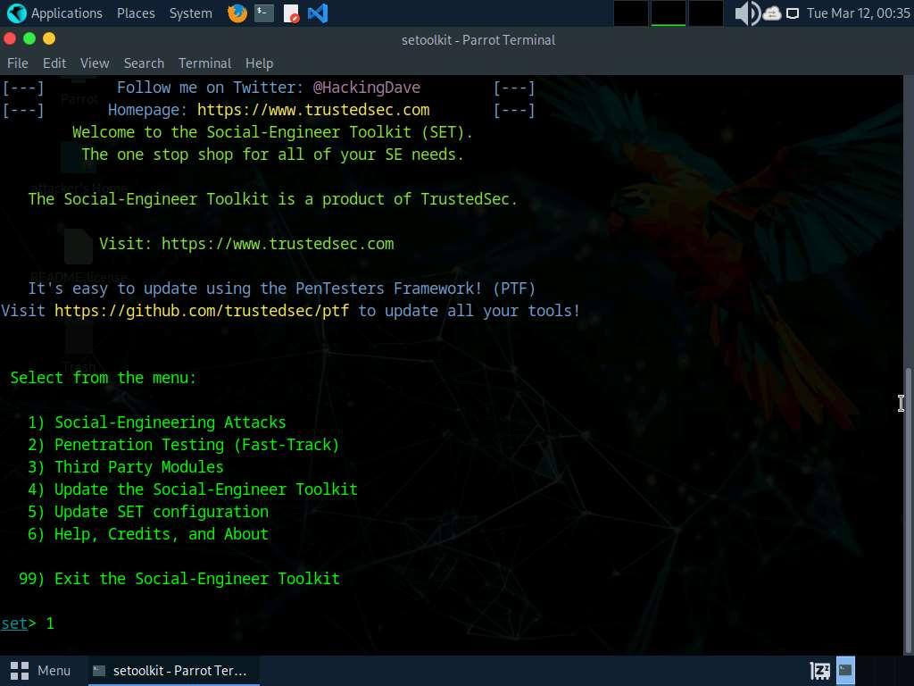

**Figure 1.1:** The Social-Engineer Toolkit (SET) was launched to begin configuring a social engineering attack.

---

### Credential Harvester

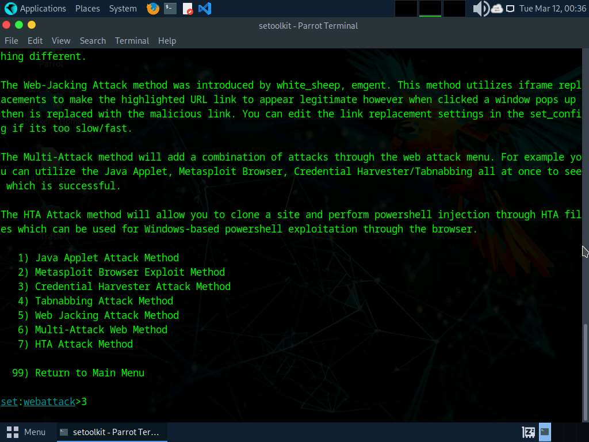

**Figure 1.2:** SET successfully cloned the target website and started the Credential Harvester service to collect submitted credentials.

---

### Phishing Email

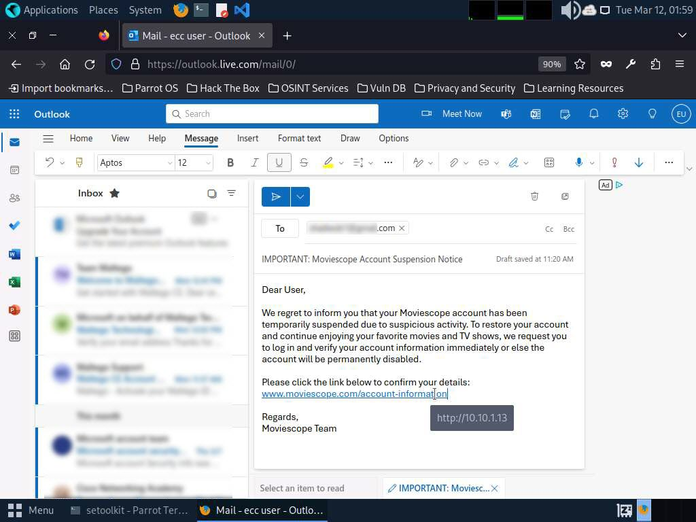

**Figure 1.3:** A phishing email was crafted with a legitimate-looking MovieScope hyperlink that secretly redirected users to the cloned credential harvesting website.

---

### Cloned Login Page

**Figure 1.4:** The victim accessed the cloned MovieScope login page and unknowingly entered authentication credentials.

---

### Captured Credentials

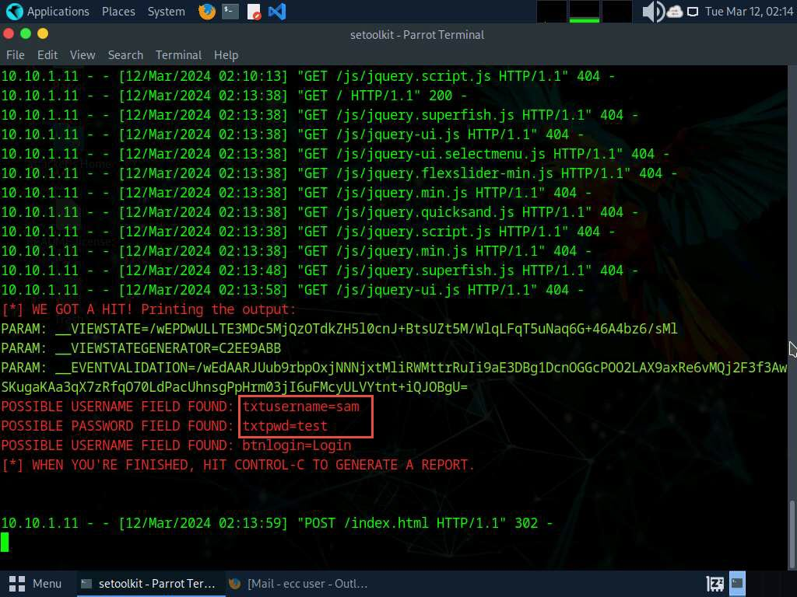

**Figure 1.5:** SET successfully captured the submitted username and password from the cloned website in plaintext.

---

### Learning Outcome

This task demonstrated how attackers exploit trust by creating convincing phishing websites and deceptive emails to harvest user credentials. It also highlighted the importance of user awareness training and verifying website authenticity before entering sensitive information.

---

### Attack Flow

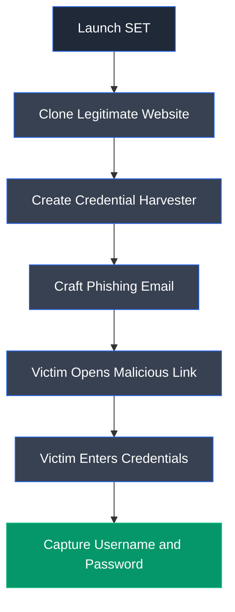

---

## Overall Learning Outcome

This lab demonstrated how credential harvesting attacks are performed using the Social-Engineer Toolkit (SET). By cloning a legitimate website, delivering a phishing email, and capturing user credentials, it illustrated how attackers exploit human trust rather than technical vulnerabilities. The exercise reinforced the importance of phishing awareness, URL verification, multi-factor authentication, and continuous user education to defend against social engineering attacks.

---

# Lab 2: Detect a Phishing Attack

## Objective

Detect phishing websites using the Netcraft browser extension. This lab demonstrates how security professionals can identify malicious websites, analyze website reputation, and recognize phishing indicators before interacting with suspicious web pages.

---

## Background

Phishing attacks deceive users into revealing sensitive information by impersonating legitimate websites and organizations. Modern anti-phishing tools help users evaluate website reputation, identify suspicious domains, and block access to known phishing sites. Ethical hackers use these tools to assess organizational awareness and educate users on recognizing phishing attempts before credentials or sensitive information are compromised.

---

## Task 1: Detect Phishing using Netcraft

### Tools Used

- [Netcraft](../../Tools/Netcraft.md)

---

### Activity Performed

The Netcraft browser extension was installed and configured to analyze website reputation and detect phishing attempts. A legitimate website was inspected to review its security information, followed by visiting a known phishing website to observe how Netcraft automatically identified and blocked the malicious page.

---

### Observations

- Successfully installed the Netcraft browser extension.
- Verified the extension was active within the web browser.
- Reviewed the security profile of a legitimate website.
- Examined website reputation information, including hosting and SSL/TLS details.
- Detected and blocked a known phishing website.
- Observed Netcraft's phishing warning before accessing the malicious page.

---

### Netcraft Extension

**Figure 2.1:** The Netcraft browser extension was successfully installed and enabled for phishing protection.

---

### Website Security Analysis

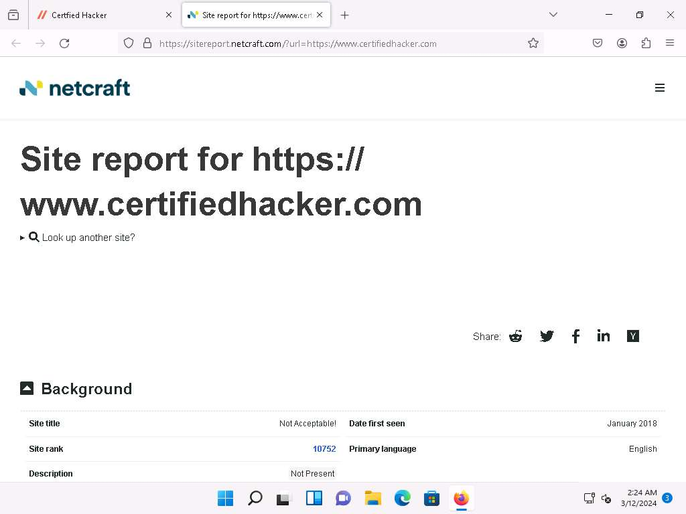

**Figure 2.2:** Netcraft generated a detailed security report for the legitimate website, including hosting, SSL/TLS, and domain reputation information.

---

### Phishing Detection

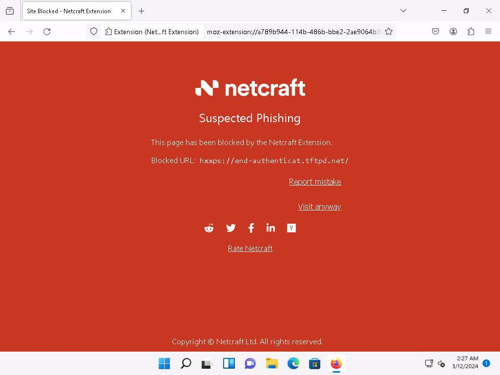

**Figure 2.3:** Netcraft detected the malicious website and displayed a phishing warning before allowing access.

---

### Learning Outcome

This task demonstrated how browser-based reputation services can identify phishing websites before users interact with them, reducing the risk of credential theft and other social engineering attacks.

---

### Attack Flow

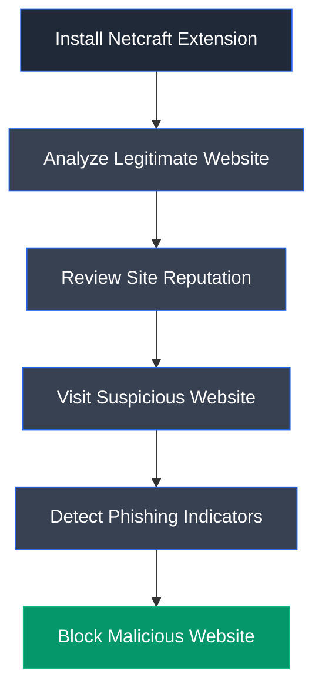

---

## Overall Learning Outcome

This lab demonstrated how phishing detection tools can help identify malicious websites before users disclose sensitive information. By analyzing website reputation and automatically blocking known phishing pages, Netcraft reinforced the importance of browser security extensions, user awareness, and website verification as essential defenses against phishing attacks.

---

# Lab 3: Social Engineering using AI

## Objective

Understand how AI can be used to generate realistic phishing content for security awareness assessments. This lab demonstrates how ChatGPT can assist in creating phishing email simulations that help organizations evaluate employee awareness and strengthen defenses against social engineering attacks.

---

## Background

Artificial intelligence has significantly improved the ability to generate natural, context-aware text. While this technology can be misused to create convincing phishing emails and impersonation attempts, it also serves as a valuable resource for ethical hackers and security professionals to simulate realistic attack scenarios during authorized security awareness exercises. Responsible use of AI enables organizations to assess human vulnerabilities and improve employee training without causing harm.

---

## Task 1: Craft Phishing Emails with ChatGPT

### Tools Used

- [ChatGPT](../../Tools/ChatGPT.md)

---

### Activity Performed

ChatGPT was used to generate a realistic phishing email based on a security-related prompt. The generated email demonstrated how AI can quickly produce convincing social engineering content that closely resembles legitimate organizational communication. The exercise emphasized the importance of security awareness by illustrating how attackers may leverage AI to improve the quality and believability of phishing campaigns.

---

### Observations

- Successfully used ChatGPT to generate a phishing email.
- Produced realistic and professionally written content based on the provided prompt.
- Observed how AI can rapidly generate persuasive social engineering messages.
- Understood the importance of verifying email authenticity despite professional writing quality.
- Recognized the need for employee awareness against AI-assisted phishing attacks.

---

### AI Prompt

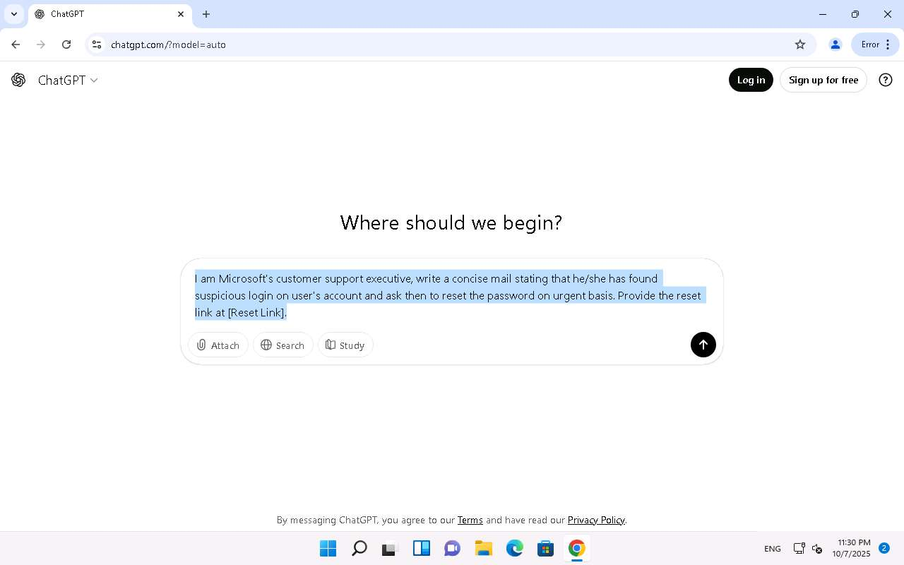

**Figure 3.1:** A phishing-related prompt was provided to ChatGPT to simulate a security awareness exercise.

---

### Generated Response

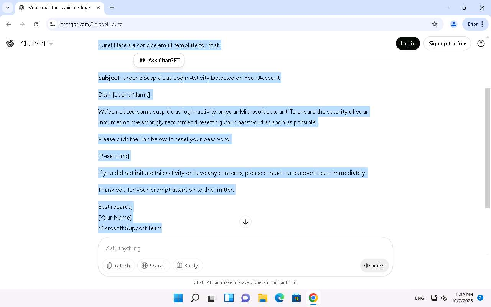

**Figure 3.2:** ChatGPT generated a realistic phishing email based on the supplied prompt, demonstrating how AI can create convincing social engineering content.

---

### Learning Outcome

This task demonstrated how generative AI can rapidly produce convincing phishing content, reinforcing the importance of user awareness, critical evaluation of unsolicited emails, and organizational security training to defend against AI-assisted social engineering attacks.

---

### Attack Flow

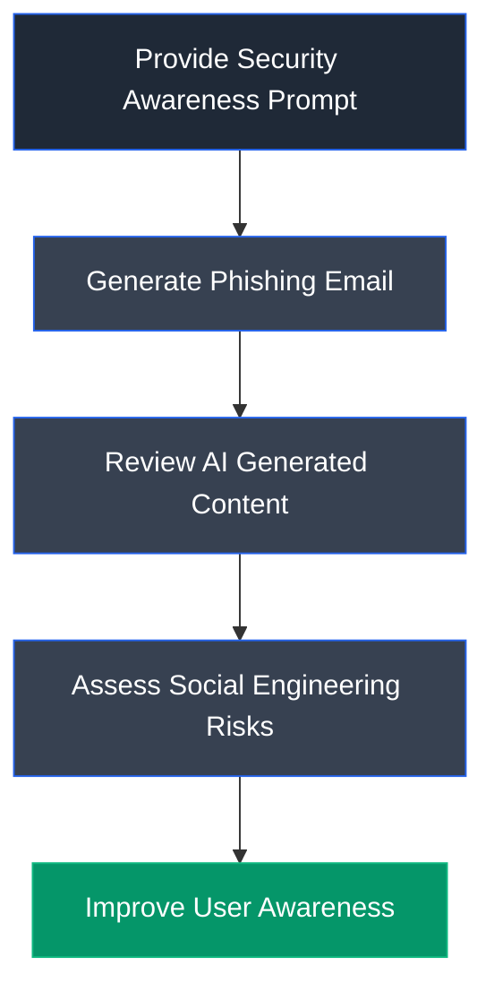

---

## Overall Learning Outcome

This lab demonstrated how generative AI can be used to simulate realistic phishing emails for authorized security awareness assessments. By observing how quickly AI produces convincing social engineering content, it reinforced the importance of employee training, email verification, multi-factor authentication, and organizational policies designed to reduce the effectiveness of AI-assisted phishing attacks.

---