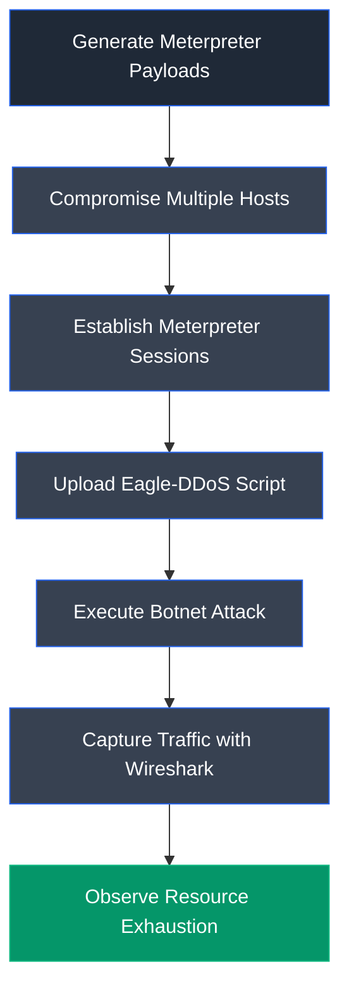
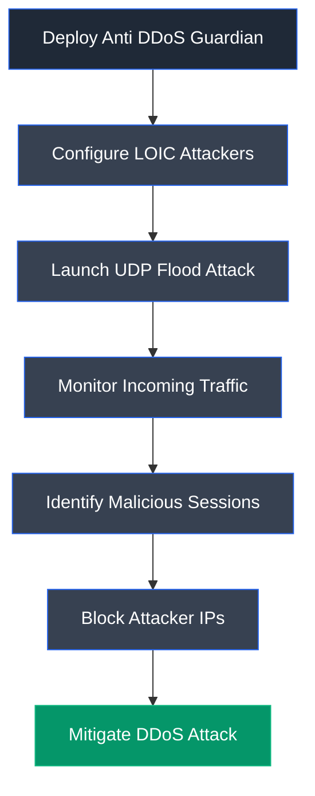

# Module 10: Denial-of-Service

> **Status:** ✅ Completed
>
> **Difficulty:** ⭐⭐⭐⭐☆
>
> **Labs Completed:** 2
>
> **Tools Covered:** Hping3, ISB, UltraDDOS-v2, Low Orbit Ion Cannon (LOIC), Metasploit, Eagle-DDoS, Wireshark, Resource Monitor, System Monitor, Anti DDoS Guardian

---

# Module Summary

This module explores Denial-of-Service (DoS) and Distributed Denial-of-Service (DDoS) attacks, demonstrating how attackers overwhelm systems and network services to make them unavailable to legitimate users. Through practical labs, the module covers multiple flooding techniques, botnet-based attacks, and defensive mechanisms used to detect, analyze, and mitigate DoS and DDoS attacks in enterprise environments.

---

# Overview

Denial-of-Service (DoS) attacks aim to exhaust a target system's resources by flooding it with excessive requests or malformed traffic, preventing legitimate users from accessing services. Distributed Denial-of-Service (DDoS) attacks amplify this impact by coordinating multiple compromised systems to launch large-scale attacks simultaneously.

This module provides hands-on experience in performing controlled DoS and DDoS attacks using various tools, analyzing attack traffic, and implementing defensive measures to detect and mitigate these attacks while maintaining network availability.

---

# Learning Objectives

After completing this module, you will be able to:

- Understand the principles of DoS and DDoS attacks.
- Perform DoS attacks using multiple attack techniques.
- Simulate DDoS attacks using botnet-based methods.
- Analyze attack traffic generated during flooding attacks.
- Detect and mitigate DoS and DDoS attacks.
- Understand defensive strategies for maintaining service availability.

---

# Key Concepts

- Denial-of-Service (DoS)
- Distributed Denial-of-Service (DDoS)
- SYN Flood
- UDP Flood
- Ping of Death (PoD)
- Botnet
- Flooding Attacks
- Resource Exhaustion
- Traffic Analysis
- DoS Mitigation

---

# Tools Used

- [Hping3](../../Tools/Hping3.md)
- [ISB](../../Tools/ISB.md)
- [UltraDDOS-v2](../../Tools/UltraDDOS-v2.md)
- [Low Orbit Ion Cannon (LOIC)](../../Tools/Low-Orbit-Ion-Cannon-LOIC.md)
- [Metasploit](../../Tools/Metasploit.md)
- [Eagle-DDoS](../../Tools/Eagle-DDoS.md)
- [Wireshark](../../Tools/Wireshark.md)
- [Resource Monitor](../../Tools/Resource-Monitor.md)
- [System Monitor](../../Tools/System-Monitor.md)
- [Anti DDoS Guardian](../../Tools/Anti-DDoS-Guardian.md)

---

# Labs Covered

| Lab | Description |
|-----|-------------|
| Lab 1 | Perform DoS and DDoS Attacks using Various Techniques |
| Lab 2 | Detect and Protect against DoS and DDoS Attacks |

---

# Lab 1: Perform DoS and DDoS Attacks using Various Techniques

## Objective

Perform controlled DoS and DDoS attacks using multiple attack techniques to understand how resource exhaustion affects system availability. This lab demonstrates TCP flooding, distributed flooding, botnet-based attacks, and the resulting impact on target system performance.

---

## Background

Denial-of-Service (DoS) attacks exhaust the resources of a target system by flooding it with excessive traffic, making services unavailable to legitimate users. Distributed Denial-of-Service (DDoS) attacks amplify this impact by coordinating multiple compromised systems to simultaneously attack the same target. Ethical hackers perform controlled DoS and DDoS simulations to evaluate the resilience of network infrastructure and verify the effectiveness of defensive controls.

---

## Task 1: Perform a DDoS Attack using ISB and UltraDDOS-v2

### Tools Used

- [ISB](../../Tools/ISB.md)
- [UltraDDOS-v2](../../Tools/UltraDDOS-v2.md)
- [Resource Monitor](../../Tools/Resource-Monitor.md)

---

### Activity Performed

ISB and UltraDDOS-v2 were configured on separate machines to perform TCP flooding against the Windows Server 2019 target. After launching both tools, the Resource Monitor was used to observe the increase in CPU utilization caused by the generated attack traffic.

---

### Observations

- Configured ISB to perform a TCP Flood attack.
- Configured UltraDDOS-v2 to generate a high-volume packet flood.
- Simultaneously launched both DoS attack tools.
- Observed increased CPU utilization on the target system.
- Demonstrated the impact of resource exhaustion on system performance.

---

### ISB TCP Flood Configuration

**Figure 1.1:** ISB was configured to perform a TCP Flood attack against the target Windows Server 2019 machine.

---

### UltraDDOS Configuration

**Figure 1.2:** UltraDDOS-v2 was configured to generate a large-scale packet flood targeting the same server.

---

### Resource Monitor Analysis

**Figure 1.3:** Windows Resource Monitor displayed significantly increased CPU utilization while the DoS attacks were in progress.

---

### Learning Outcome

This task demonstrated how multiple flooding tools can overwhelm system resources, causing high CPU utilization and degraded service availability on the target machine.

---

## Task 2: Perform a DDoS Attack using Botnet

### Tools Used

- [Metasploit Framework](../../Tools/Metasploit.md)
- [Eagle-DDoS](../../Tools/Eagle-DDoS.md)
- [Wireshark](../../Tools/Wireshark.md)
- [System Monitor](../../Tools/System-Monitor.md)

---

### Activity Performed

Meterpreter payloads were generated using MSFVenom and deployed to multiple Windows machines. After establishing Meterpreter sessions through Metasploit, a DDoS attack script was uploaded and executed on each compromised host, creating a simulated botnet. Wireshark and Ubuntu System Monitor were then used to observe the attack traffic and system resource utilization on the victim machine.

---

### Observations

- Generated Meterpreter payloads for multiple target systems.
- Established Meterpreter sessions with compromised hosts.
- Uploaded the Eagle-DDoS attack script.
- Executed the botnet attack from multiple compromised machines.
- Captured DDoS traffic using Wireshark.
- Observed high system resource utilization on the victim machine.

---

### Payload Generation

**Figure 1.4:** MSFVenom generated Meterpreter payloads for deployment to multiple target systems.

---

### Meterpreter Sessions

**Figure 1.5:** Multiple Meterpreter sessions were successfully established with the compromised systems.

---

### Botnet DDoS Script

**Figure 1.6:** The Eagle-DDoS script was executed from a compromised host to launch a coordinated botnet-based DDoS attack against the target system.

---

### Captured Attack Traffic

**Figure 1.7:** Wireshark captured malicious network traffic generated by the compromised botnet hosts during the DDoS attack.

---

### System Resource Utilization

**Figure 1.8:** Ubuntu System Monitor showed extremely high resource utilization as the botnet-based DDoS attack overwhelmed the target system.

---

### Learning Outcome

This task demonstrated how multiple compromised systems can be coordinated to perform a large-scale DDoS attack. It also highlighted the importance of network monitoring and system performance analysis for identifying botnet-generated attack traffic and understanding the operational impact of distributed denial-of-service attacks.

---

### Attack Flow

---

## Overall Learning Outcome

This lab provided practical experience in performing both traditional DoS attacks and distributed botnet-based DDoS attacks within a controlled environment. By using multiple attack tools, generating Meterpreter payloads, coordinating compromised hosts, and monitoring the resulting traffic and system resource consumption, the lab reinforced how denial-of-service attacks disrupt service availability and emphasized the importance of continuous traffic analysis, resource monitoring, and effective mitigation strategies for defending enterprise networks.

---

# Lab 2: Detect and Protect Against DoS and DDoS Attacks

## Objective

Detect and mitigate Distributed Denial-of-Service (DDoS) attacks using Anti DDoS Guardian. This lab demonstrates how security professionals can monitor incoming network traffic, identify malicious hosts, analyze attack sessions, and block attackers to protect network resources.

---

## Background

DoS and DDoS attacks generate excessive malicious traffic that overwhelms system resources and disrupts legitimate services. Effective defense requires continuous traffic monitoring, anomaly detection, and rapid mitigation. Anti DDoS Guardian provides real-time monitoring and protection by analyzing incoming connections, identifying suspicious traffic, and allowing administrators to block malicious IP addresses before they impact service availability.

---

## Task 1: Detect and Protect Against DDoS Attacks using Anti DDoS Guardian

### Tools Used

- [Anti DDoS Guardian](../../Tools/Anti-DDoS-Guardian.md)
- [Low Orbit Ion Cannon (LOIC)](../../Tools/Low-Orbit-Ion-Cannon-LOIC.md)

---

### Activity Performed

Anti DDoS Guardian was installed and configured on the Windows 11 target machine to monitor network traffic in real time. LOIC was then configured on two separate attacker machines to generate a UDP flooding attack against the target. Anti DDoS Guardian detected the abnormal traffic, displayed the malicious sessions, and was used to block the attacking IP addresses.

---

### Observations

- Installed and launched Anti DDoS Guardian.
- Configured LOIC on multiple attacker machines.
- Initiated a coordinated DDoS attack.
- Detected excessive incoming packets from attacker hosts.
- Inspected traffic details for malicious sessions.
- Blocked attacker IP addresses using Anti DDoS Guardian.

---

### Anti DDoS Guardian Monitoring

**Figure 2.1:** Anti DDoS Guardian monitored incoming and outgoing network traffic in real time to identify suspicious activity.

---

### LOIC Attack Configuration

**Figure 2.2:** LOIC was configured to launch a UDP flood attack against the target Windows 11 system.

---

### Attack Detection

**Figure 2.3:** Anti DDoS Guardian detected large volumes of incoming packets from multiple attacker systems during the simulated DDoS attack.

---

### Blocking Malicious IP Address

**Figure 2.4:** The malicious IP address was selected and blocked to mitigate the ongoing DDoS attack.

---

### Blocked Session

**Figure 2.5:** The blocked attacker session was highlighted, confirming that mitigation actions had been successfully applied.

---

### Learning Outcome

This task demonstrated how dedicated DDoS protection software can monitor network traffic, detect abnormal connection patterns, identify malicious hosts, and immediately block attacker IP addresses to maintain service availability during denial-of-service attacks.

---

### Attack Flow

---

## Overall Learning Outcome

This lab demonstrated practical techniques for detecting and mitigating Distributed Denial-of-Service attacks using real-time monitoring tools. By generating attack traffic with LOIC and analyzing it using Anti DDoS Guardian, the exercise illustrated how security administrators can identify abnormal network behavior, inspect malicious sessions, and block attacker IP addresses to reduce the impact of DDoS attacks and maintain network availability.

---

# Key Takeaways

- Understood the principles of Denial-of-Service (DoS) and Distributed Denial-of-Service (DDoS) attacks and their impact on system availability.
- Performed TCP flooding attacks using ISB and UltraDDOS-v2 to simulate resource exhaustion on a target server.
- Simulated a botnet-driven DDoS attack by generating Meterpreter payloads, compromising multiple systems, and coordinating attacks using a custom DDoS script.
- Observed the effects of DDoS attacks through increased CPU and memory utilization on victim systems.
- Captured and analyzed malicious network traffic generated during DDoS attacks using Wireshark.
- Detected malicious network sessions using Anti DDoS Guardian and mitigated attacks by blocking attacker IP addresses.
- Reinforced the importance of traffic monitoring, anomaly detection, and proactive mitigation strategies to defend against DoS and DDoS attacks.

---

# Defensive Perspective

Denial-of-Service attacks primarily target service availability by exhausting system or network resources. Organizations should implement layered DDoS protection using traffic filtering, rate limiting, intrusion detection and prevention systems, Web Application Firewalls (WAFs), and dedicated DDoS mitigation services. Continuous network monitoring, behavioral traffic analysis, IP reputation filtering, and rapid incident response procedures enable security teams to identify abnormal traffic patterns early and minimize the operational impact of DoS and DDoS attacks.

---

# Interview Questions

1. What is the difference between a DoS attack and a DDoS attack?
2. Explain how TCP Flood and UDP Flood attacks affect a target system.
3. What is a botnet, and how is it used in DDoS attacks?
4. What role does MSFVenom play in creating a simulated botnet?
5. How can Wireshark assist in detecting DoS and DDoS attacks?
6. What indicators suggest that a system is under a DDoS attack?
7. How does Anti DDoS Guardian detect and mitigate malicious traffic?
8. Why are volumetric attacks difficult to mitigate?
9. What are the differences between volumetric, protocol, and application-layer DoS attacks?
10. What defensive measures should organizations implement to reduce the impact of DoS and DDoS attacks?

---

# My Reflection

This module provided practical experience in both launching and defending against Denial-of-Service and Distributed Denial-of-Service attacks within a controlled environment. By simulating TCP flooding, botnet-based DDoS attacks, and real-time traffic analysis, I gained a deeper understanding of how attackers disrupt service availability and how security professionals detect, analyze, and mitigate these attacks using monitoring tools, traffic analysis, and dedicated DDoS protection solutions.

---