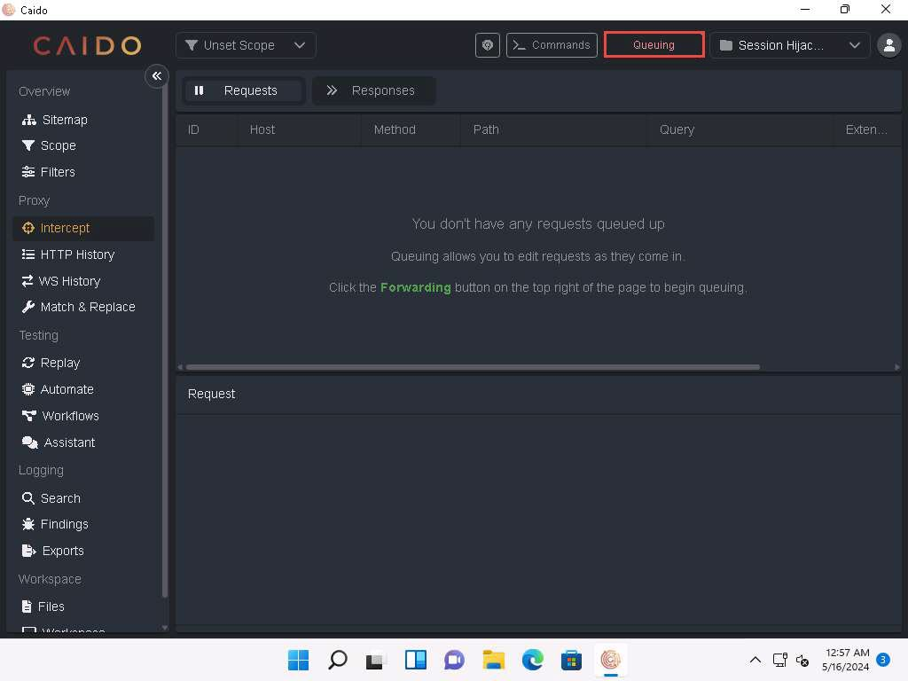
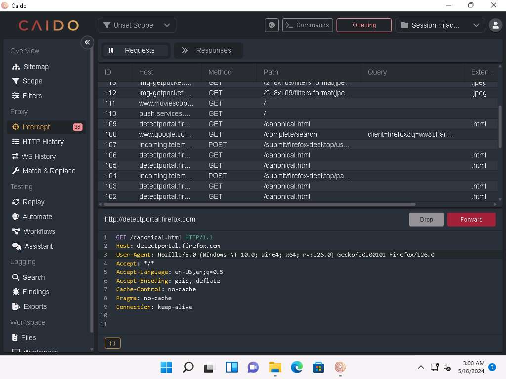
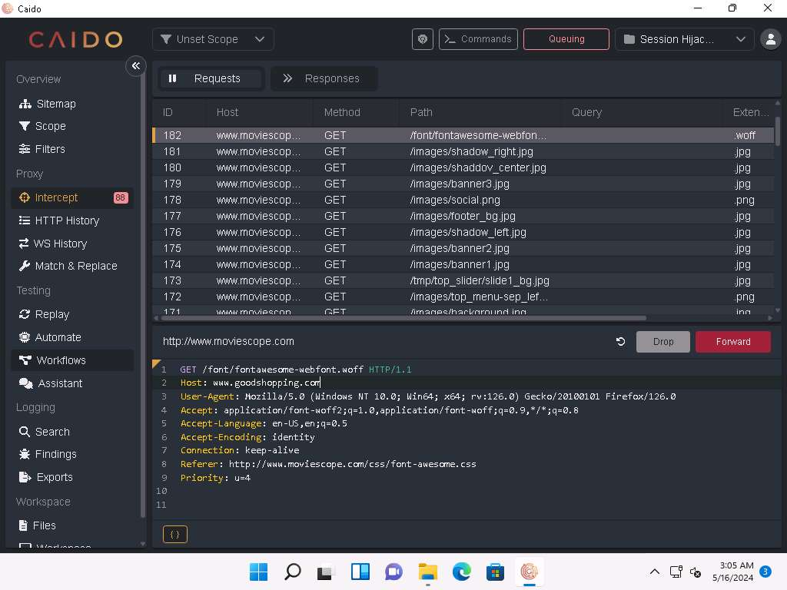
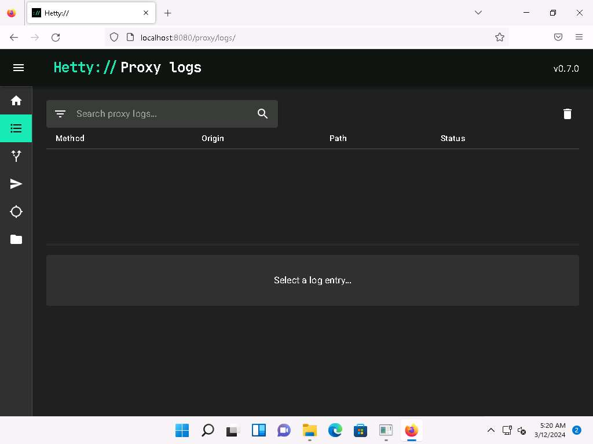
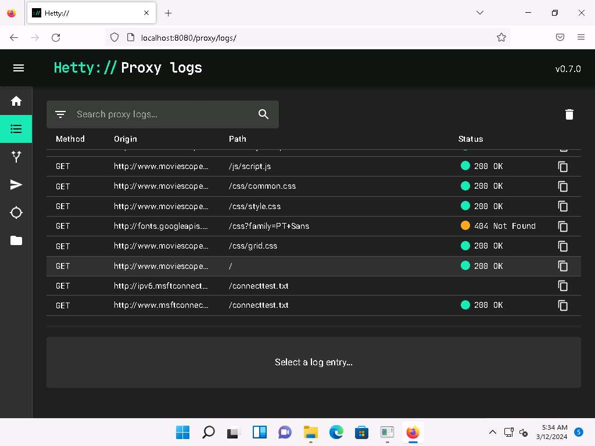
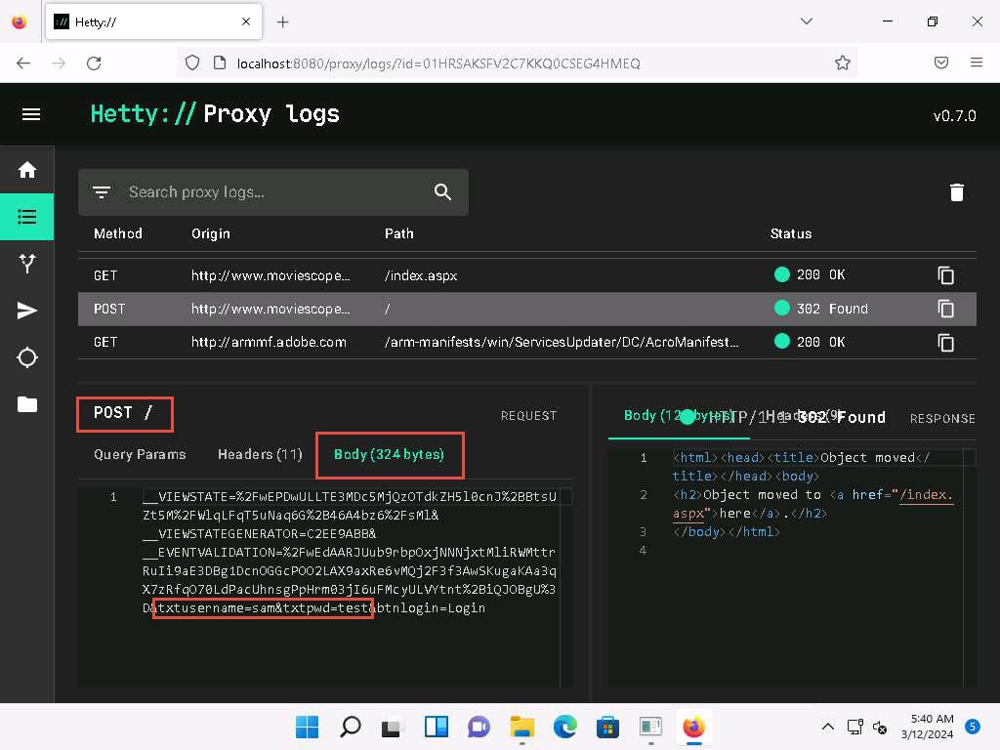
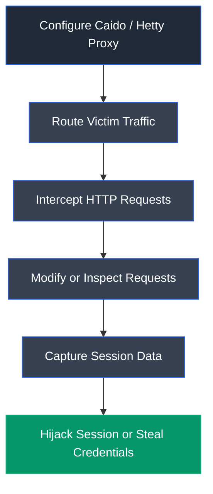
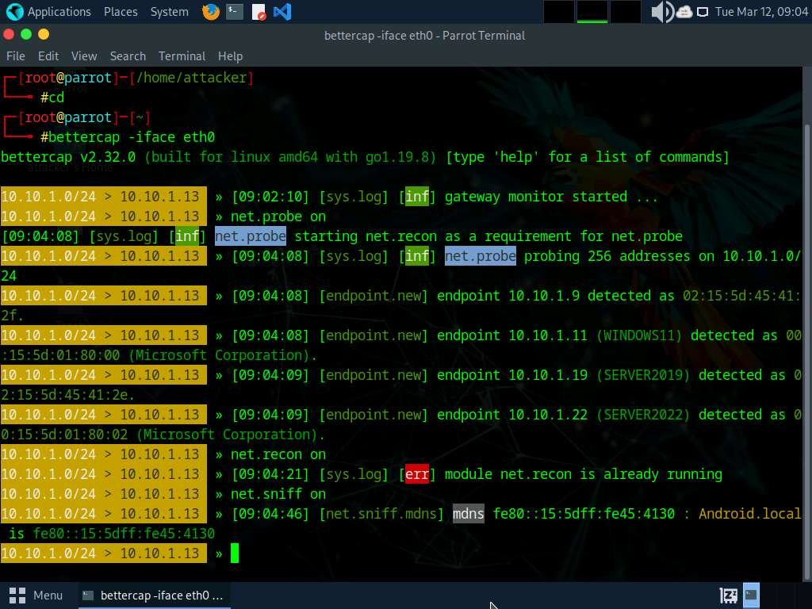
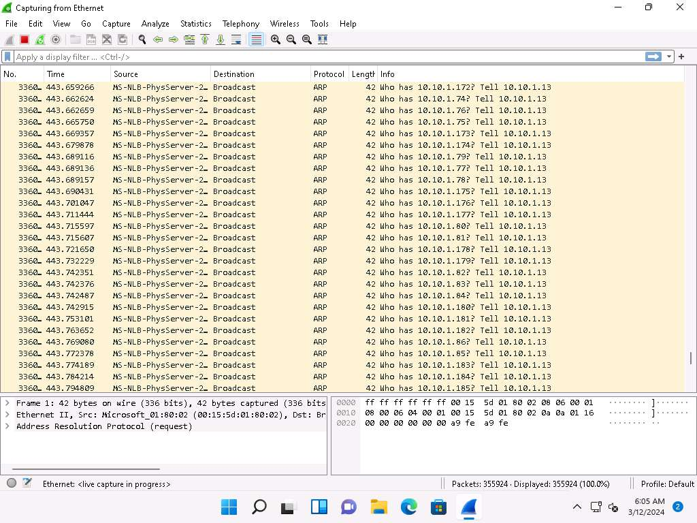
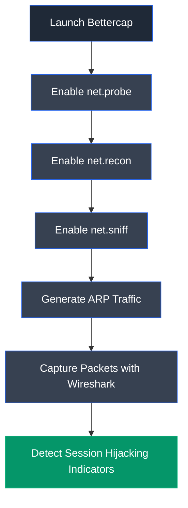

# Module 11: Session Hijacking

> **Status:** ✅ Completed
>
> **Difficulty:** ⭐⭐⭐⭐☆
>
> **Labs Completed:** 2
>
> **Tools Covered:** Caido, Hetty, Bettercap, Wireshark

---

# Module Summary

This module explores session hijacking techniques used to gain unauthorized access to authenticated user sessions by stealing or manipulating session identifiers. Through practical labs, the module demonstrates intercepting HTTP traffic, hijacking web sessions, and detecting session hijacking attempts using network analysis tools. It also emphasizes defensive measures for protecting session integrity and securing authenticated communications.

---

# Overview

Session hijacking is a technique in which an attacker takes control of a valid user session after successful authentication. This can be achieved by stealing session identifiers, intercepting HTTP traffic, or exploiting insecure session management mechanisms. Once a valid session is compromised, attackers can impersonate legitimate users without requiring their credentials.

This module provides hands-on experience in performing session hijacking using modern interception tools, analyzing HTTP traffic, identifying session tokens, and detecting suspicious network activity associated with session hijacking attacks.

---

# Learning Objectives

After completing this module, you will be able to:

- Understand active and passive session hijacking attacks.
- Intercept HTTP traffic between clients and servers.
- Capture and analyze session identifiers.
- Hijack authenticated web sessions.
- Detect session hijacking attempts using network monitoring.
- Apply defensive measures to secure user sessions.

---

# Key Concepts

- Session Hijacking
- Session Tokens
- Session Cookies
- HTTP Interception
- Man-in-the-Middle (MITM)
- Active Session Hijacking
- Passive Session Hijacking
- Cookie Theft
- Session Management
- Traffic Analysis

---

# Tools Used

- [Caido](../../Tools/Caido.md)
- [Hetty](../../Tools/Hetty.md)
- [Bettercap](../../Tools/Bettercap.md)
- [Wireshark](../../Tools/Wireshark.md)

---

# Labs Covered

| Lab | Description |
|-----|-------------|
| Lab 1 | Perform Session Hijacking |
| Lab 2 | Detect Session Hijacking |

---

# Lab 1: Perform Session Hijacking

## Objective

Perform session hijacking by intercepting and modifying HTTP requests between a client and server. This lab demonstrates how attackers manipulate web traffic, hijack active sessions, and capture sensitive credentials using modern interception proxies.

---

## Background

Session hijacking is an attack in which an adversary gains unauthorized access to an authenticated user session by intercepting or manipulating communication between the client and server. By capturing or modifying session-related traffic, attackers can impersonate legitimate users, redirect requests, or steal sensitive credentials. Ethical hackers perform controlled session hijacking to evaluate the security of web applications and verify the effectiveness of session management and traffic protection mechanisms.

---

## Task 1: Hijack a Session using Caido

### Tools Used

- [Caido](../../Tools/Caido.md)

---

### Activity Performed

Caido was configured as an interception proxy on the attacker machine, while the victim's browser was configured to route traffic through the proxy. HTTP requests generated by the victim were intercepted, modified, and forwarded to redirect the victim from **www.moviescope.com** to **www.goodshopping.com**, demonstrating application-level session hijacking.

---

### Observations

- Configured Caido to intercept HTTP traffic.
- Enabled request queuing using the Intercept feature.
- Captured HTTP requests generated by the victim.
- Modified intercepted GET requests before forwarding.
- Successfully redirected the victim to a different website without changing the browser address bar.

---

### Caido Intercept Configuration

**Figure 1.1:** Caido was configured to intercept and queue HTTP requests generated by the victim's browser.

---

### Captured HTTP Requests

**Figure 1.2:** Caido successfully intercepted HTTP requests originating from the victim machine.

---

### Modified Request

**Figure 1.3:** The intercepted GET requests were modified to redirect the victim from **www.moviescope.com** to **www.goodshopping.com** before forwarding.

---

### Session Hijacked

**Figure 1.4:** Although the browser displayed **www.moviescope.com**, the intercepted requests caused the victim to view the **www.goodshopping.com** website.

---

### Learning Outcome

This task demonstrated how interception proxies can manipulate HTTP requests in transit, allowing attackers to hijack web sessions and redirect victims without requiring authentication bypass or credential theft.

---

## Task 2: Intercept HTTP Traffic using Hetty

### Tools Used

- [Hetty](../../Tools/Hetty.md)

---

### Activity Performed

Hetty was configured as a proxy between the victim and the target web application. The victim authenticated to the MovieScope website while Hetty captured all HTTP requests. The intercepted POST request was inspected to reveal the submitted username and password in clear text.

---

### Observations

- Created a new Hetty project.
- Configured the victim browser to use the Hetty proxy.
- Captured HTTP traffic generated during user authentication.
- Identified the HTTP POST request.
- Retrieved user credentials from the intercepted request body.

---

### Hetty Project Setup

**Figure 1.5:** A new Hetty project was created to monitor and intercept HTTP traffic from the victim machine.

---

### Proxy Logs

**Figure 1.6:** Hetty captured HTTP requests and responses exchanged between the victim and the target web application.

---

### Captured Credentials

**Figure 1.7:** The intercepted POST request exposed the victim's submitted username and password within the request body.

---

### Learning Outcome

This task demonstrated how improperly protected HTTP communications expose sensitive credentials during transmission. It reinforced the importance of encrypted communication channels and secure session management to prevent credential theft and session hijacking attacks.

---

### Attack Flow

---

## Overall Learning Outcome

This lab provided practical experience in performing application-level session hijacking using modern interception proxies. By intercepting, modifying, and forwarding HTTP requests, as well as capturing authentication traffic, the lab demonstrated how attackers manipulate active sessions and obtain sensitive credentials. It also emphasized the importance of HTTPS, secure session management, encrypted communications, and proxy detection mechanisms for defending web applications against session hijacking attacks.

---

# Lab 2: Detect Session Hijacking

## Objective

Detect a session hijacking attack by monitoring network traffic using Wireshark. This lab demonstrates how abnormal ARP activity generated during a session hijacking attack can be identified through packet analysis.

---

## Background

Session hijacking attacks often involve manipulating network traffic between a victim and a target server. During network-level attacks, attackers commonly perform ARP-based interception to position themselves between communicating hosts. Security professionals can detect such attacks by monitoring network traffic for unusual ARP activity and other suspicious communication patterns using packet analysis tools such as Wireshark.

---

## Task 1: Detect Session Hijacking using Wireshark

### Tools Used

- [Bettercap](../../Tools/Bettercap.md)
- [Wireshark](../../Tools/Wireshark.md)

---

### Activity Performed

Wireshark was used on the Windows 11 machine to capture live network traffic while Bettercap was executed from the Parrot Security machine to perform a session hijacking attack. Bettercap generated ARP probe and reconnaissance traffic while sniffing the network. The captured packets were analyzed in Wireshark to identify abnormal ARP activity associated with the attack.

---

### Observations

- Started Bettercap on the attacker machine.
- Enabled network probing and reconnaissance modules.
- Activated network packet sniffing.
- Observed Bettercap discovering active hosts on the network.
- Detected a large number of ARP packets in Wireshark.
- Identified abnormal ARP activity indicating a possible session hijacking attack.

---

### Bettercap Network Sniffing

**Figure 2.1:** Bettercap performed network reconnaissance and packet sniffing by enabling the **net.probe**, **net.recon**, and **net.sniff** modules.

---

### Wireshark ARP Traffic

**Figure 2.2:** Wireshark captured a large volume of ARP packets generated during the session hijacking attack, indicating abnormal network activity.

---

### Learning Outcome

This task demonstrated how packet analysis tools can detect session hijacking attempts by identifying abnormal ARP traffic generated during network reconnaissance and interception. Continuous traffic monitoring enables security professionals to recognize suspicious communication patterns and respond before attackers successfully compromise active sessions.

---

### Attack Flow

---

## Overall Learning Outcome

This lab provided practical experience in detecting network-level session hijacking attacks using Wireshark and Bettercap. By analyzing ARP traffic generated during packet sniffing and network reconnaissance, the lab demonstrated how security professionals can identify suspicious network behavior associated with session hijacking attempts and implement appropriate defensive measures to protect user sessions.

---

# Key Takeaways

- Understood the concepts of active and passive session hijacking and how attackers exploit authenticated user sessions.
- Performed application-level session hijacking by intercepting and modifying HTTP requests using Caido.
- Redirected a victim's web traffic by manipulating intercepted requests without altering the browser's displayed URL.
- Intercepted HTTP traffic using Hetty and extracted user credentials from captured POST requests.
- Explored how insecure HTTP communications expose session identifiers and sensitive authentication data.
- Detected network-level session hijacking attempts by analyzing abnormal ARP traffic generated by Bettercap using Wireshark.
- Reinforced the importance of encrypted communications, secure session management, and continuous network monitoring to defend against session hijacking attacks.

---

# Defensive Perspective

Session hijacking attacks exploit weaknesses in session management and unencrypted network communications to impersonate legitimate users. Organizations should enforce HTTPS across all web applications, implement secure cookie attributes (Secure, HttpOnly, and SameSite), use strong session token generation, enable HTTP Strict Transport Security (HSTS), and regenerate session identifiers after authentication. Network administrators should also deploy intrusion detection systems, monitor abnormal ARP activity, implement Dynamic ARP Inspection (DAI), and continuously analyze network traffic to detect and mitigate session hijacking attempts before user sessions are compromised.

---

# Interview Questions

1. What is session hijacking, and how does it differ from session fixation?
2. Explain the difference between active and passive session hijacking.
3. How can an attacker hijack an HTTP session without knowing the user's password?
4. What role do session cookies play in web authentication?
5. How does Caido assist in application-level session hijacking?
6. How can Hetty be used to intercept HTTP requests and capture credentials?
7. What network behavior indicates a possible ARP-based session hijacking attack?
8. How does Bettercap perform network reconnaissance and packet sniffing?
9. How can Wireshark help detect session hijacking attacks?
10. What security controls should organizations implement to prevent session hijacking?

---

# My Reflection

This module provided practical experience in both performing and detecting session hijacking attacks across web applications and network environments. By intercepting and modifying HTTP requests, capturing authentication traffic, and analyzing abnormal ARP activity during network-level attacks, I developed a deeper understanding of how attackers compromise authenticated sessions and the defensive techniques required to protect user identities, secure web communications, and maintain session integrity.

---