# Module 14: Hacking Web Applications

> **Status:** ✅ Completed  
> **Difficulty:** ⭐⭐⭐⭐☆  
> **Labs Completed:** 4  
> **Tools Covered:** Nmap, Telnet, OWASP ZAP, Burp Suite, WPScan, Wapiti, ShellGPT

---

# Module Summary

This module introduces the methodology used to assess the security of web applications from a penetration tester's perspective. It covers web application reconnaissance, spidering, vulnerability scanning, brute-force attacks, Remote Code Execution (RCE), WordPress security assessment, and AI-assisted web application testing using industry-standard tools.

---

# Overview

Web applications are one of the most common targets for cyberattacks because they are publicly accessible and often process sensitive user information. Assessing their security requires a structured methodology that begins with reconnaissance and progresses through vulnerability discovery, exploitation, and reporting.

This module demonstrates how to perform web application assessments using tools such as **Nmap**, **OWASP ZAP**, **Burp Suite**, **WPScan**, **Wapiti**, and **ShellGPT**. It emphasizes understanding the purpose of each tool, the reasoning behind every step, and how different attack techniques can be used to identify security weaknesses in a controlled environment.

---

# Learning Objectives

After completing this module, I was able to:

- Understand the methodology used to assess the security of web applications.
- Perform web application reconnaissance and information gathering using industry-standard tools.
- Crawl and map a web application through web spidering techniques.
- Identify web application vulnerabilities using automated vulnerability scanners.
- Understand the workflow of authentication brute-force attacks and Remote Code Execution (RCE) in a controlled environment.
- Perform WordPress security assessments using WPScan.
- Explore how AI-powered tools such as ShellGPT can assist during web application penetration testing.

---

# Key Concepts

The following core concepts are covered throughout this module:

- Web Application Security
- Web Infrastructure Footprinting
- Web Application Reconnaissance
- Banner Grabbing
- Web Spidering
- Web Application Vulnerability Assessment
- Authentication and Brute-Force Attacks
- Remote Code Execution (RCE)
- WordPress Security Assessment
- AI-Assisted Penetration Testing

---

# Tools Used

The following tools were used throughout this module to perform reconnaissance, vulnerability assessment, exploitation, and AI-assisted web application testing.

- [Nmap](../../Tools/Nmap.md)
- [Telnet](../../Tools/Telnet.md)
- [OWASP ZAP](../../Tools/OWASP-ZAP.md)
- [SmartScanner](../../Tools/SmartScanner.md)
- [Burp Suite](../../Tools/Burp-Suite.md)
- [WPScan](../../Tools/WPScan.md)
- [Wapiti](../../Tools/Wapiti.md)
- [ShellGPT](../../Tools/ShellGPT.md)

---

# Labs Covered

## Lab 1 - Footprint the Web Infrastructure

### Objective

To understand how web application reconnaissance is performed to identify the target application's infrastructure, technologies, services, directories, and potential attack surface before attempting any exploitation.

---

### Background

Reconnaissance is the first phase of a web application penetration test. Before attempting to exploit a web application, a penetration tester must understand how the application is built, which services are running, what technologies are being used, and whether any potential vulnerabilities exist. Collecting this information helps build an attack strategy and reduces unnecessary guessing during later stages of the assessment.

---

### Task 1 - Perform Web Application Reconnaissance using Nmap and Telnet

#### Tools Used

- [Nmap](../../Tools/Nmap.md)
- [Telnet](../../Tools/Telnet.md)

#### Activity Performed

Performed reconnaissance on the target web application using **Nmap** and **Telnet**. Nmap was used to identify open ports, discover running services, detect service versions, and gather information about the target web server. Telnet was then used to establish a manual connection to the web server over HTTP (port 80) and retrieve HTTP response headers through banner grabbing.

#### Purpose

The objective of this task was to collect information about the target web application's infrastructure before attempting any exploitation. Identifying exposed services, server software, technologies, and version information helps a penetration tester understand the target environment and identify potential attack vectors for subsequent security assessments.

#### Observations

- Identified the target's open ports and the services running on them.
- Detected the web server software and service version using Nmap.
- Retrieved HTTP response headers through Telnet, revealing information about the web server and underlying technologies.
- Gathered reconnaissance data that can be used to identify known vulnerabilities and plan further testing activities.

#### Scan Result

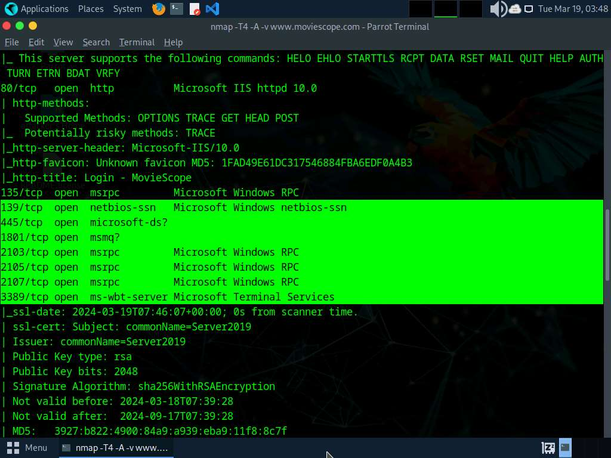

*Figure 1.1 – Nmap scan identifying open ports, running services, HTTP methods, server information, and operating system details during the reconnaissance phase.*

#### Learning Outcome

This task demonstrated that effective penetration testing begins with thorough reconnaissance rather than immediate exploitation. By understanding the target's infrastructure, technologies, and exposed services, a penetration tester can make informed decisions, reduce unnecessary guesswork, and plan a structured approach for identifying and validating security vulnerabilities.

---

### Task 2 - Perform Web Spidering using OWASP ZAP

#### Tools Used

- [OWASP ZAP](../../Tools/OWASP-ZAP.md)

#### Activity Performed

Performed web spidering on the target web application using **OWASP ZAP**. The spider automatically crawled the application by following hyperlinks, forms, and other accessible resources to discover web pages, directories, and application endpoints.

#### Purpose

The purpose of this task was to map the structure of the web application and identify all accessible resources before performing security testing. A complete understanding of the application's content helps ensure that hidden pages, directories, and functionalities are not overlooked during vulnerability assessment.

#### Observations

- Successfully crawled the target web application.
- Identified multiple web pages, directories, and application resources.
- Generated a site map representing the application's structure.
- Discovered endpoints that could be analyzed further during security testing.

#### Spider Results

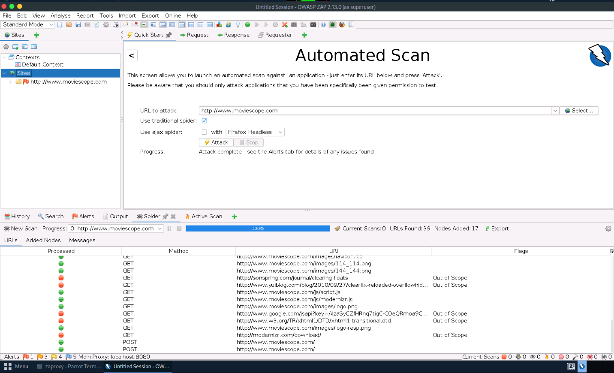

*Figure 1.2 – OWASP ZAP spider discovering the application's pages, directories, and resources to build a complete site structure for further assessment.*

#### Learning Outcome

This task demonstrated that web spidering is an essential reconnaissance technique for understanding a web application's structure. By automatically discovering accessible resources, penetration testers can ensure that security assessments cover a larger attack surface instead of testing only the pages that are immediately visible.

---

### Task 3 - Perform Web Application Vulnerability Scanning using SmartScanner

#### Tools Used

- [SmartScanner](../../Tools/SmartScanner.md)

#### Activity Performed

Performed an automated vulnerability assessment on the target web application using **SmartScanner**. The scanner analyzed the application for common web security weaknesses and generated a report highlighting the identified vulnerabilities.

#### Purpose

The purpose of this task was to proactively identify potential security weaknesses within the web application before attempting manual exploitation. Automated vulnerability scanners help penetration testers quickly detect common misconfigurations, insecure components, and known vulnerabilities, allowing them to prioritize further investigation.

#### Observations

- Successfully scanned the target web application for vulnerabilities.
- Detected potential security issues based on known vulnerability signatures.
- Generated a vulnerability report that can be used for further analysis and validation.
- Observed that automated scanners provide a rapid overview of an application's security posture but require manual verification to eliminate false positives.

#### Vulnerability Scan Report

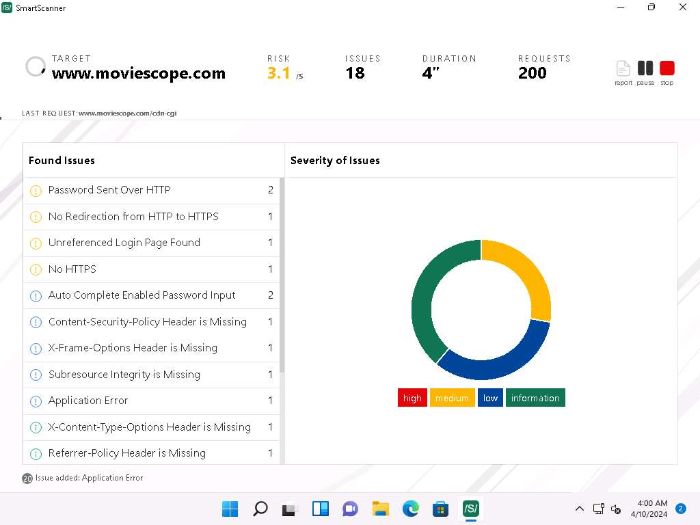

*Figure 1.3 – SmartScanner identifying multiple web application security issues and presenting an overall risk assessment of the target.*

#### Learning Outcome

This task demonstrated the importance of automated vulnerability scanning during web application assessments. While automated scanners efficiently identify common security issues, the reported findings should always be manually validated before concluding that a vulnerability is exploitable.

---

### Attack Flow

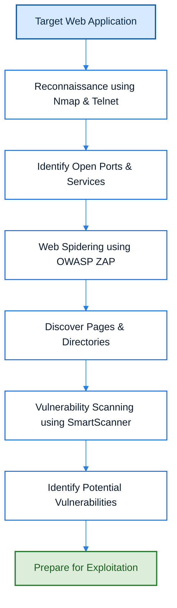

---

### Overall Learning Outcome

This lab demonstrated the importance of web application reconnaissance as the foundation of penetration testing. By identifying the application's infrastructure, mapping its resources, and performing an initial vulnerability assessment, I understood how information gathered during this phase helps penetration testers build an effective strategy before attempting exploitation.

---

### Key Takeaways

- Reconnaissance is the first and one of the most important phases of web application penetration testing.
- Information gathered from open ports, services, and server technologies helps identify potential attack vectors.
- Web spidering enables testers to discover hidden pages, directories, and application endpoints.
- Automated vulnerability scanners provide a quick overview of potential security weaknesses but should always be followed by manual verification.
- Effective reconnaissance reduces guesswork and improves the efficiency of subsequent penetration testing activities.

---

## Lab 2 - Perform Web Application Attacks

### Objective

To understand how authentication attacks and web application exploitation are performed in a controlled environment using industry-standard penetration testing tools.

---

### Background

Once sufficient information about a target web application has been collected, the next phase of penetration testing focuses on validating identified weaknesses through controlled exploitation. This lab demonstrates how authentication mechanisms can be tested, how vulnerable WordPress components can be identified, and how Remote Code Execution (RCE) vulnerabilities can be verified in an authorized testing environment.

---

### Task 1 - Perform a Brute-force Attack using Burp Suite

#### Tools Used

- [Burp Suite](../../Tools/Burp-Suite.md)

#### Activity Performed

Configured Burp Suite as an intercepting proxy and captured the authentication request generated by the target web application. The intercepted request was then sent to Burp Intruder, where multiple username and password combinations were tested using a controlled brute-force attack.

#### Purpose

The purpose of this task was to understand how authentication mechanisms can be evaluated for weak or predictable credentials. Brute-force testing helps identify accounts protected by insecure passwords and demonstrates the importance of strong authentication controls.

#### Observations

- Successfully intercepted the login request before it reached the web server.
- Configured Burp Intruder to automate multiple authentication attempts.
- Compared HTTP response codes and response lengths to identify successful login attempts.
- Identified a valid set of credentials from the provided payload list.

#### Intercepted HTTP Request

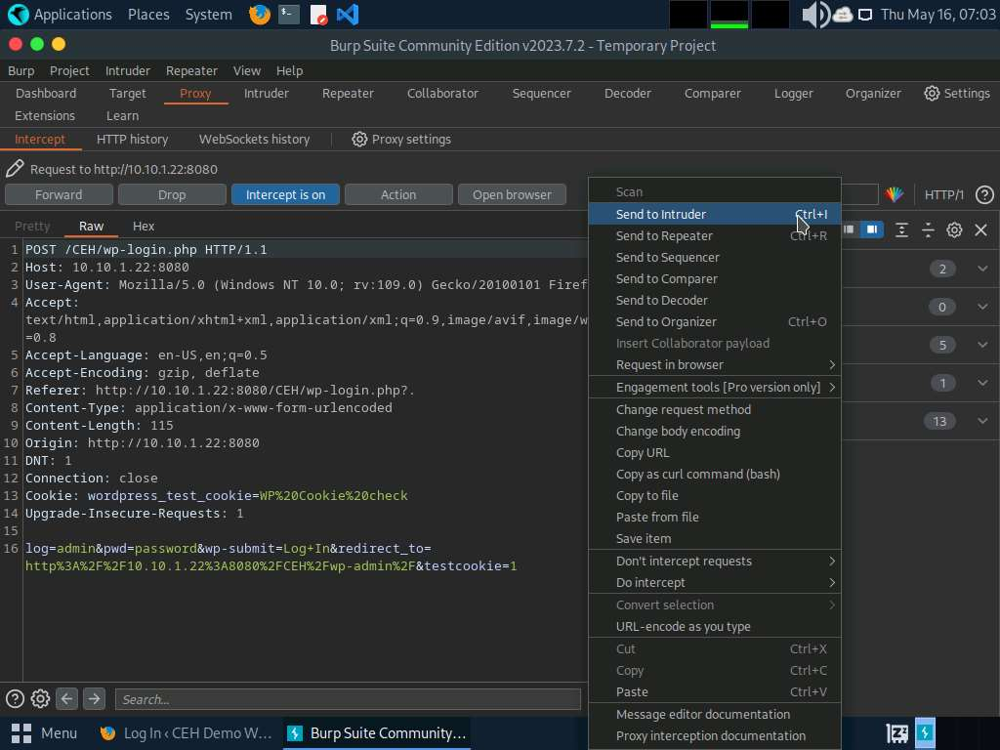

*Figure 2.1 – Burp Suite Proxy intercepting an HTTP request before it reached the web application, allowing inspection and modification.*

#### Brute-Force Results

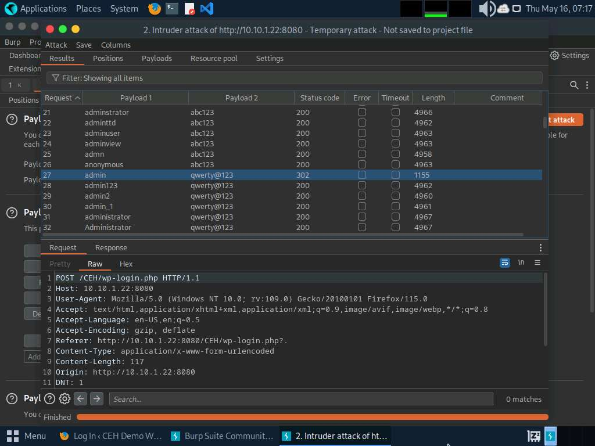

*Figure 2.2 – Burp Intruder performing a controlled brute-force attack and identifying valid credentials by analyzing differences in server responses.*

#### Learning Outcome

This task demonstrated how authentication requests can be intercepted, modified, and replayed during penetration testing. It also reinforced that successful authentication indicates valid credentials but does not necessarily imply administrative access or ownership of the account.

---

### Task 2 - Perform Remote Code Execution (RCE)

#### Tools Used

- [WPScan](../../Tools/WPScan.md)
- [curl](../../Tools/cURL.md)

#### Activity Performed

Performed a WordPress security assessment using WPScan to enumerate installed plugins and identify vulnerable components. After discovering a vulnerable plugin, a crafted HTTP request was sent using curl to exploit a Remote Code Execution (RCE) vulnerability and execute commands on the target server.

#### Purpose

The purpose of this task was to understand how publicly known vulnerabilities in web application components can be identified and validated. Exploiting a vulnerable plugin demonstrates the risks of outdated or insecure software and highlights the importance of regular patch management.

#### Observations

- Enumerated WordPress plugins installed on the target application.
- Identified a plugin vulnerable to Remote Code Execution.
- Successfully executed a controlled command through the vulnerable endpoint.
- Verified that insecure or outdated plugins can expose critical security risks.

#### WordPress Enumeration

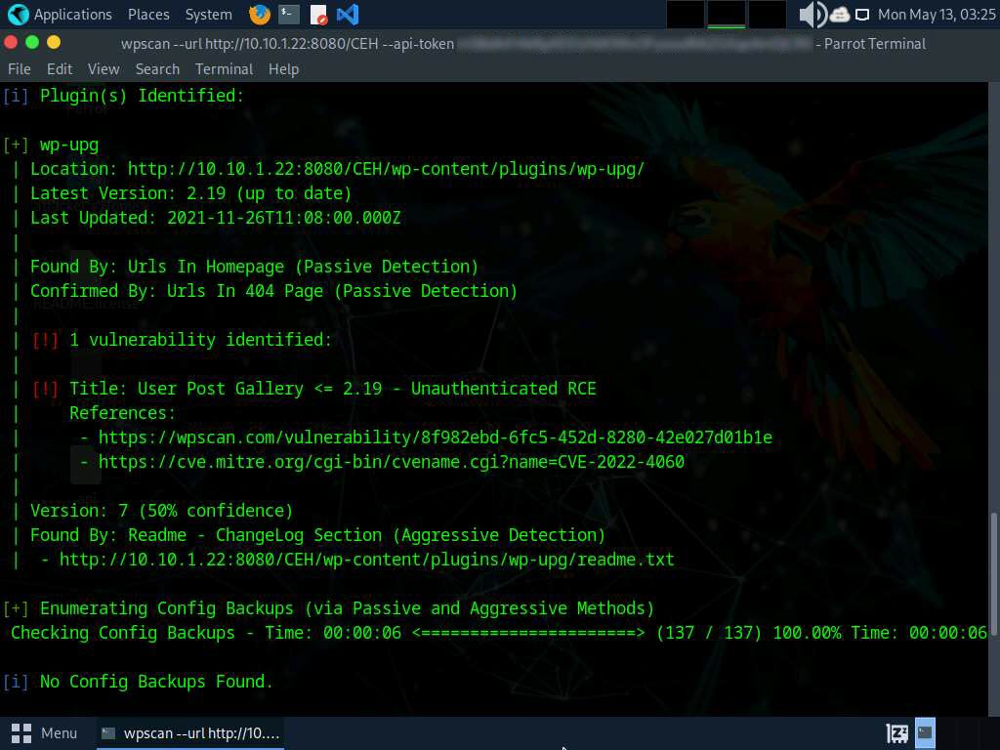

*Figure 2.3 – WPScan enumerating the WordPress installation and identifying vulnerable plugins for further security assessment.*

#### Remote Code Execution

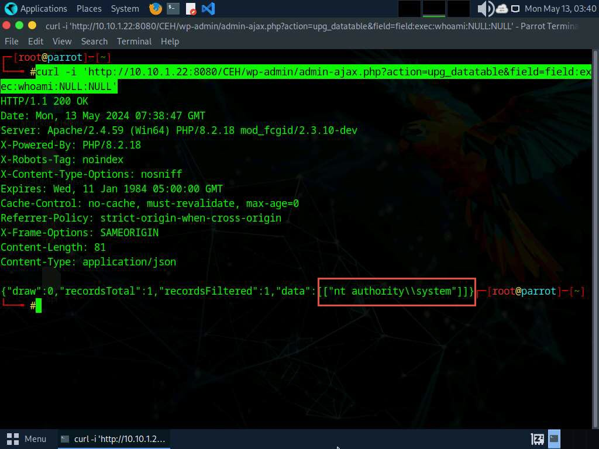

*Figure 2.4 – Successful Remote Code Execution (RCE) demonstrating that arbitrary commands could be executed on the vulnerable server.*

#### Learning Outcome

This task demonstrated how attackers may leverage vulnerable web application components to execute arbitrary commands on a server. It reinforced the importance of vulnerability management, timely software updates, and secure plugin administration to reduce the risk of successful exploitation.

---

### Attack Flow

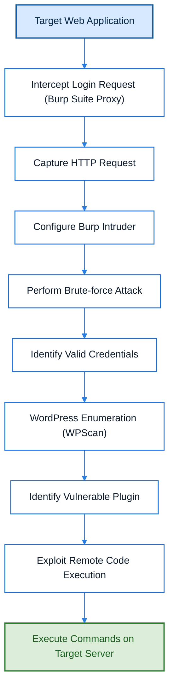

---

### Overall Learning Outcome

This lab demonstrated how web application attacks progress from authentication testing to controlled exploitation. By intercepting HTTP requests, evaluating authentication mechanisms, identifying vulnerable application components, and validating Remote Code Execution vulnerabilities, I gained a practical understanding of how penetration testers verify security weaknesses while maintaining a structured and authorized testing methodology.

---

### Key Takeaways

- Authentication requests can be intercepted and analyzed before reaching the web server.
- Automated brute-force attacks highlight the importance of strong passwords and account protection mechanisms.
- WordPress plugins should be regularly updated and monitored for known vulnerabilities.
- Remote Code Execution is one of the most critical web application vulnerabilities because it enables command execution on the target server.
- Exploitation should always be performed within an authorized and controlled penetration testing environment.

---

## Lab 3 - Detect Web Application Vulnerabilities

### Objective

To understand how automated web application vulnerability scanners can be used to identify potential security weaknesses and generate reports for further analysis.

---

### Background

Modern web applications often contain numerous pages, parameters, and functionalities that make manual testing time-consuming. Automated vulnerability scanners help penetration testers quickly identify common security issues, providing an efficient starting point for manual verification and further security assessment.

---

### Task 1 - Perform Web Application Vulnerability Scanning using Wapiti

#### Tools Used

- [Wapiti](../../Tools/Wapiti.md)

#### Activity Performed

Performed an automated security assessment of the target web application using Wapiti. The scanner crawled the application, analyzed its pages and input parameters, and generated a comprehensive HTML report containing the detected security findings.

#### Purpose

The purpose of this task was to understand how automated web vulnerability scanners identify common security weaknesses within web applications. Such scanners help penetration testers quickly assess an application's security posture before conducting detailed manual testing.

#### Observations

- Successfully scanned the target web application.
- Identified potential web application vulnerabilities through automated analysis.
- Generated a detailed HTML report summarizing the detected findings.
- Observed that vulnerability reports categorize findings based on security testing standards and require manual verification before confirming exploitability.

#### Vulnerability Assessment Report

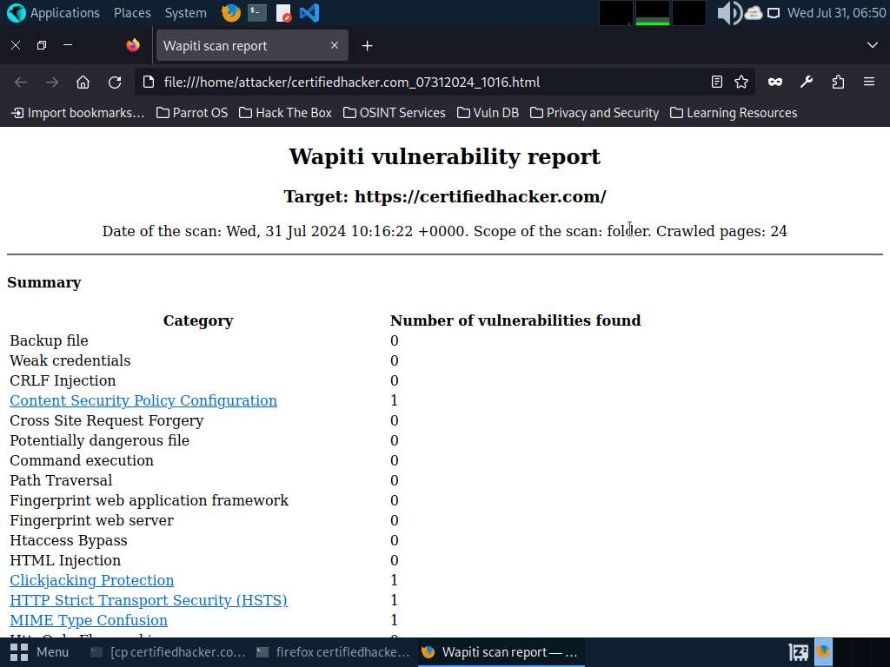

*Figure 3.1 – Wapiti vulnerability assessment report summarizing the security issues identified during automated web application testing.*

#### Learning Outcome

This task demonstrated the effectiveness of automated vulnerability scanners in identifying potential security issues across large web applications. It also reinforced that automated scanning serves as an initial assessment and should always be complemented with manual validation and penetration testing.

---

### Attack Flow
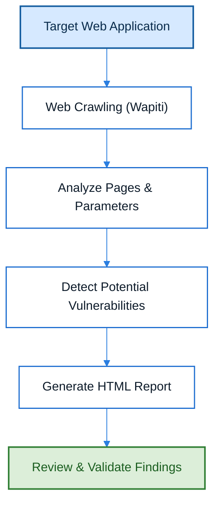

---

### Overall Learning Outcome

This lab demonstrated how automated vulnerability scanners improve the efficiency of web application security assessments by rapidly identifying potential weaknesses and generating structured reports. The findings obtained through automated scanning provide valuable guidance for subsequent manual verification and exploitation activities.

---

### Key Takeaways

- Automated scanners rapidly assess large web applications.
- Vulnerability reports provide a structured overview of potential security weaknesses.
- Automated findings should always be manually validated.
- Security reports help prioritize remediation efforts and further penetration testing.
- Automated scanning complements, but does not replace, manual security testing.

---

## Lab 4 - Perform AI-Assisted Web Application Testing

### Objective

To understand how AI-powered tools can assist penetration testers in performing reconnaissance, vulnerability assessment, and security analysis more efficiently.

---

### Background

Artificial Intelligence is increasingly being integrated into cybersecurity workflows to improve efficiency and reduce repetitive manual effort. AI-assisted penetration testing tools help security professionals generate commands, interpret scan results, explain vulnerabilities, and automate routine tasks while still requiring human validation and decision-making.

---

### Task 1 - Perform AI-Assisted Web Application Testing using ShellGPT

#### Tools Used

- [ShellGPT](../../Tools/ShellGPT.md)

#### Activity Performed

Used ShellGPT to assist with web application security testing by generating penetration testing commands, explaining security concepts, and supporting vulnerability assessment activities during the engagement.

#### Purpose

The purpose of this task was to understand how AI can enhance penetration testing workflows by providing contextual assistance, reducing repetitive tasks, and improving productivity without replacing the expertise and judgment of a penetration tester.

#### Observations

- AI generated penetration testing commands based on user prompts.
- Security concepts and tool usage were explained interactively.
- AI accelerated command generation and learning during the assessment.
- Human verification remained necessary before executing AI-generated commands or drawing security conclusions.

#### AI-Assisted Security Testing

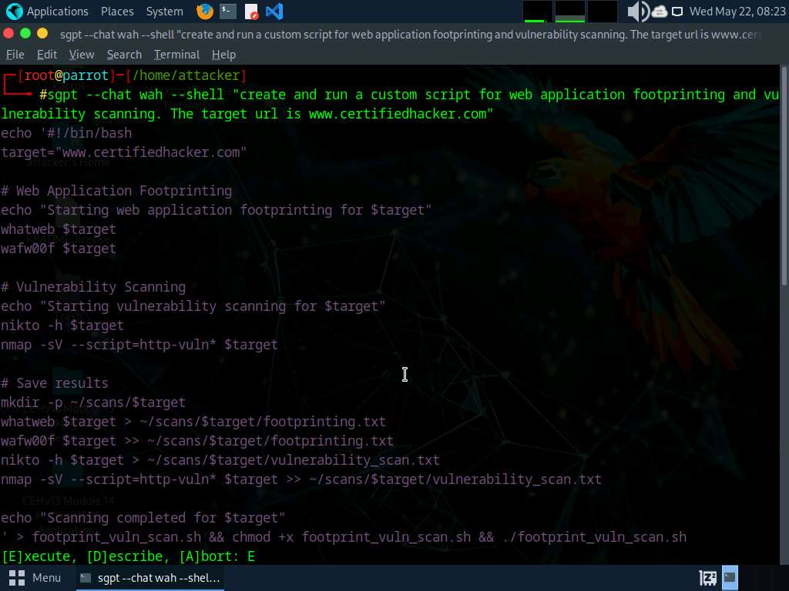

*Figure 4.1 – ShellGPT assisting the penetration testing workflow by generating commands and providing AI-assisted technical guidance.*

#### Learning Outcome

This task demonstrated that AI can serve as an effective assistant during penetration testing by improving efficiency and learning. However, successful security assessments still depend on the knowledge, judgment, and validation performed by the penetration tester.

---

### Attack Flow

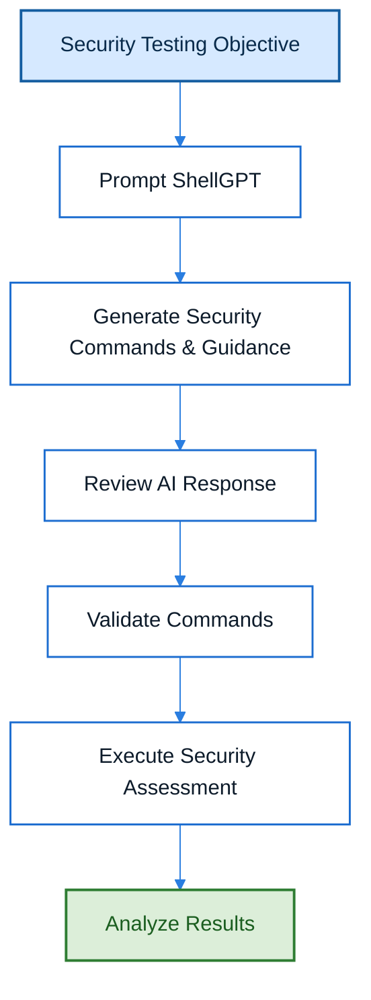

---

### Overall Learning Outcome

This lab demonstrated how Artificial Intelligence can enhance penetration testing workflows by assisting with command generation, concept explanation, and security analysis. Rather than replacing penetration testers, AI serves as a productivity tool that supports informed decision-making while requiring continuous human validation.

---

### Key Takeaways

- AI improves efficiency during penetration testing.
- AI can assist with command generation and security analysis.
- AI-generated output should always be reviewed before execution.
- Human expertise remains essential for validating findings.
- AI is an assistant, not a replacement for penetration testers.

---

# Key Takeaways

- Reconnaissance is the foundation of every web application penetration test.
- Understanding the application's attack surface significantly improves subsequent security assessments.
- Automated tools accelerate vulnerability discovery but should always be complemented by manual verification.
- Authentication mechanisms can be evaluated through controlled brute-force testing to identify weak credentials.
- Vulnerable web application components, such as outdated plugins, can lead to critical issues like Remote Code Execution (RCE).
- AI-powered tools can improve penetration testing efficiency but cannot replace human expertise and validation.
- Effective penetration testing follows a structured methodology: Reconnaissance → Assessment → Exploitation → Analysis.

---

# Defensive Perspective

The concepts covered in this module emphasize the importance of securing web applications throughout their lifecycle. Organizations can reduce their attack surface by implementing the following security practices:

- Regularly perform vulnerability assessments and penetration testing.
- Keep web servers, frameworks, plugins, and third-party components updated.
- Enforce strong password policies and Multi-Factor Authentication (MFA).
- Implement account lockout mechanisms and rate limiting to mitigate brute-force attacks.
- Disable unnecessary services and minimize information disclosure through server banners.
- Continuously monitor web applications for suspicious activity and unauthorized access attempts.
- Validate and remediate vulnerabilities identified by automated scanners before deployment.
- Review AI-generated security recommendations before applying them in production environments.

---

# Interview Questions

1. What is web application reconnaissance, and why is it important?
2. How does Nmap assist in web application penetration testing?
3. What is banner grabbing, and what information can it reveal?
4. What is web spidering, and why is it performed before vulnerability assessment?
5. What are the limitations of automated vulnerability scanners?
6. Explain how Burp Suite intercepts HTTP requests.
7. What is the purpose of Burp Intruder?
8. What is Remote Code Execution (RCE), and why is it considered critical?
9. How does WPScan help during WordPress security assessments?
10. What is the role of AI tools such as ShellGPT in penetration testing?
11. Why should AI-generated commands always be reviewed before execution?
12. What is the difference between vulnerability scanning and penetration testing?

---

# My Reflection

This module significantly improved my understanding of web application penetration testing by connecting theoretical concepts with practical implementation. Rather than focusing solely on executing commands, I learned the reasoning behind each stage of the assessment process—from reconnaissance and vulnerability identification to controlled exploitation and AI-assisted testing.

One of the most valuable lessons from this module was understanding that penetration testing is a structured methodology rather than a collection of tools or commands. Every activity performed during the labs had a specific objective and contributed to building a complete picture of the target application's security posture.

Completing this module also reinforced the importance of documenting findings, validating automated results, and continuously learning the technologies behind the tools used during security assessments.