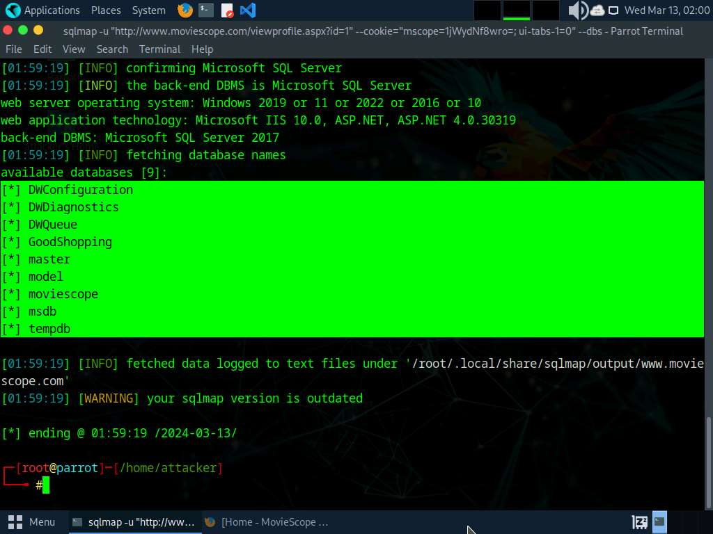
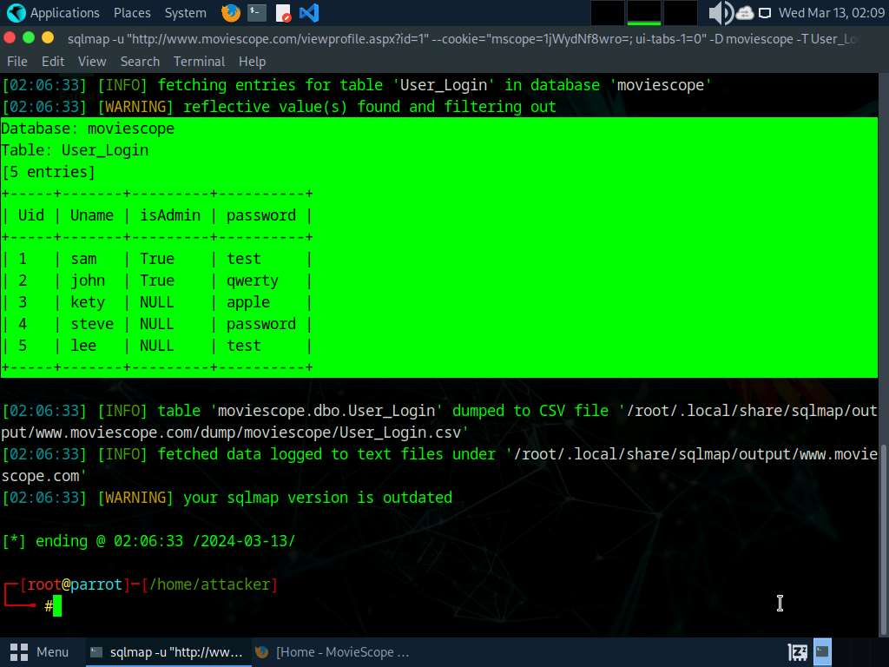
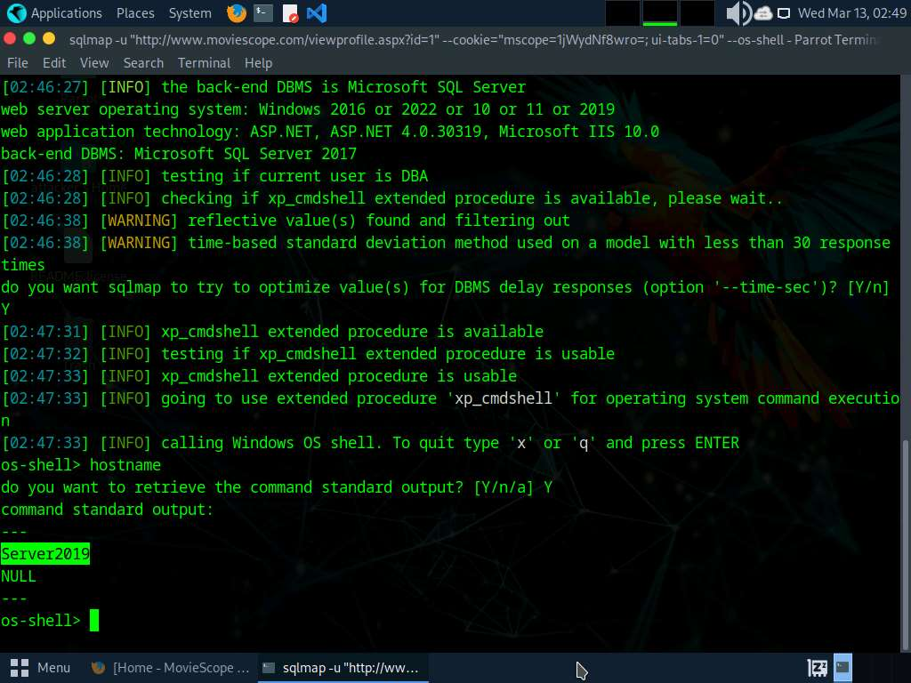
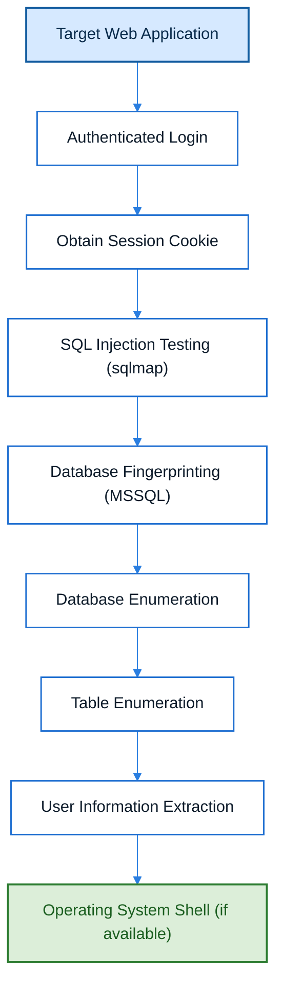
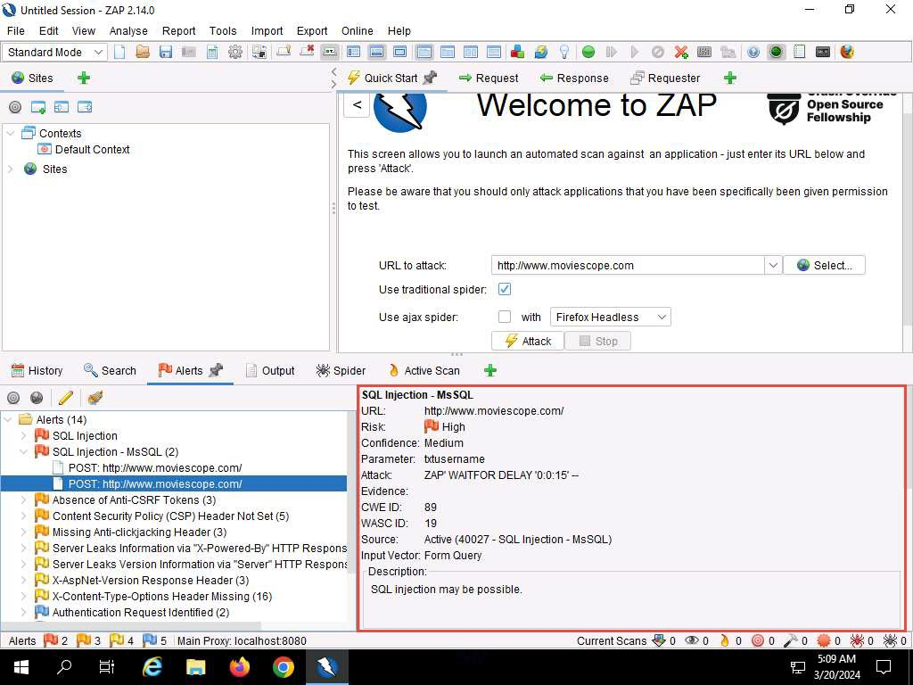
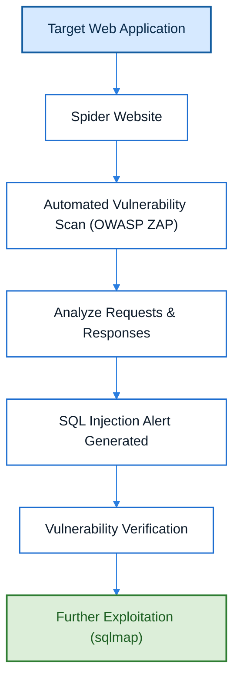
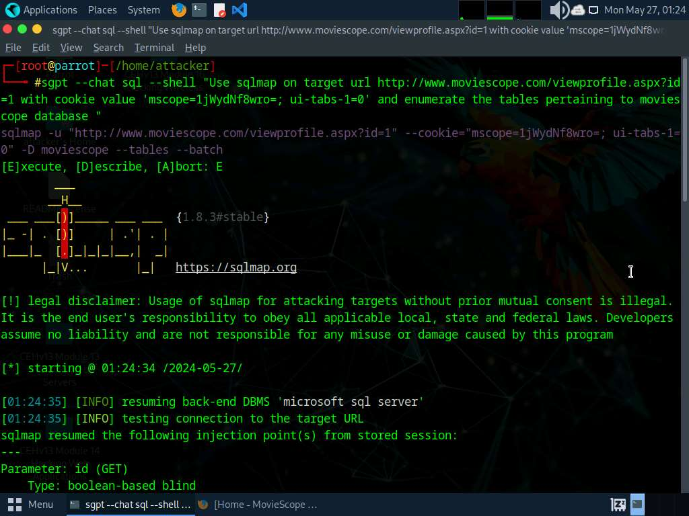
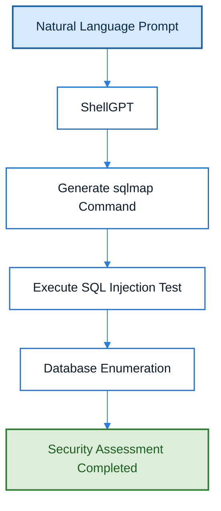

# Module 15: SQL Injection

> **Status:** ✅ Completed
>
> **Difficulty:** ⭐⭐⭐⭐☆
>
> **Labs Completed:** 3
>
> **Tools Covered:** sqlmap, OWASP ZAP, ShellGPT

---

# Module Summary

This module introduces SQL Injection (SQLi), one of the most critical and widely exploited vulnerabilities affecting database-driven web applications. Throughout this module, I learned how attackers exploit insecure SQL queries, how ethical hackers identify and verify SQL Injection vulnerabilities, and how these vulnerabilities can be exploited to enumerate databases, extract sensitive information, and gain deeper access to vulnerable systems.

The practical labs covered authenticated SQL Injection attacks against Microsoft SQL Server using sqlmap, SQL Injection vulnerability detection using OWASP ZAP, and AI-assisted SQL Injection testing using ShellGPT.

Rather than focusing only on executing commands, this documentation explains the concepts, attack methodology, tools used, and the reasoning behind each stage of the penetration testing process.

---

# Overview

SQL Injection is a code injection vulnerability that occurs when user-supplied input is improperly validated and incorporated directly into SQL queries. Successful SQL Injection attacks can allow attackers to bypass authentication, retrieve sensitive information, modify database contents, or execute operating system commands depending on the database configuration.

This module demonstrates how penetration testers identify SQL Injection vulnerabilities, verify their existence, enumerate backend databases, extract sensitive information, and understand the impact of insecure database interactions. It also covers automated vulnerability detection and AI-assisted penetration testing techniques using modern security tools.

Throughout the practical labs, I learned not only how to perform SQL Injection attacks, but also why these vulnerabilities exist and the defensive mechanisms developers should implement to prevent them.

---

# Learning Objectives

After completing this module, I was able to:

- Understand how web applications interact with backend database servers.
- Explain how SQL Injection vulnerabilities occur.
- Differentiate between In-Band, Blind, and Out-of-Band SQL Injection attacks.
- Perform authenticated SQL Injection attacks against Microsoft SQL Server using sqlmap.
- Enumerate databases, tables, and sensitive information from vulnerable applications.
- Obtain operating system shell access through SQL Injection where applicable.
- Detect SQL Injection vulnerabilities using OWASP ZAP.
- Perform AI-assisted SQL Injection testing using ShellGPT.
- Understand defensive techniques used to prevent SQL Injection attacks.

---

# Key Concepts

- SQL Injection (SQLi)
- Structured Query Language (SQL)
- Database-Driven Web Applications
- Microsoft SQL Server (MSSQL)
- Authentication Cookies
- Database Enumeration
- Table Enumeration
- Data Extraction
- Operating System Command Execution
- In-Band SQL Injection
- Blind SQL Injection
- Out-of-Band SQL Injection
- Prepared Statements
- Parameterized Queries
- Input Validation
- Principle of Least Privilege

---

# Tools Used

- [sqlmap](../../Tools/sqlmap.md)
- [OWASP ZAP](../../Tools/OWASP-ZAP.md)
- [ShellGPT](../../Tools/ShellGPT.md)

---

# Labs Covered

| Lab | Description |
|------|-------------|
| Lab 1 | Perform SQL Injection Attacks |
| Lab 2 | Detect SQL Injection Vulnerabilities Using OWASP ZAP |
| Lab 3 | Perform SQL Injection Using ShellGPT |

---

# Lab 1 - Perform SQL Injection Attacks

## Objective

To understand how SQL Injection vulnerabilities can be identified and exploited against a Microsoft SQL Server-backed web application using sqlmap to enumerate databases, extract sensitive information, and obtain operating system command execution.

---

## Background

SQL Injection occurs when an application fails to properly validate user input before incorporating it into SQL queries. Attackers can exploit this weakness to manipulate database queries, retrieve confidential information, bypass authentication mechanisms, or even execute operating system commands depending on the database configuration.

This lab demonstrates the complete SQL Injection attack lifecycle, beginning with an authenticated web session, followed by vulnerability verification, database enumeration, credential extraction, and operating system shell access using sqlmap.

---

## Task 1 - Perform SQL Injection Against MSSQL using sqlmap

### Tools Used

- [sqlmap](../../Tools/sqlmap.md)

---

### Activity Performed

An authenticated session was first established by logging into the vulnerable web application using valid user credentials. The session cookie obtained from the browser was supplied to sqlmap together with the vulnerable profile URL, allowing the tool to perform SQL Injection testing within the authenticated session.

sqlmap automatically identified the SQL Injection vulnerability, fingerprinted the backend Microsoft SQL Server database, enumerated all available databases, selected the target MovieScope database, extracted information from the `user_login` table, and successfully obtained operating system shell access through the vulnerable database server.

---

### Observations

- Successfully authenticated to the vulnerable application.
- Reused the authenticated session cookie during testing.
- SQL Injection vulnerability was automatically detected.
- Backend database identified as Microsoft SQL Server.
- Database enumeration completed successfully.
- Sensitive user information was extracted from the database.
- Operating system shell access was successfully obtained.

---

### Database Enumeration

*Figure 1.1 – sqlmap enumerating the available databases from the vulnerable Microsoft SQL Server.*

---

### User Information Extraction

*Figure 1.2 – sqlmap extracting user information from the vulnerable application's `user_login` table.*

---

### Operating System Shell

*Figure 1.3 – sqlmap obtaining operating system shell access after successfully exploiting the SQL Injection vulnerability.*

---

### Learning Outcome

This task demonstrated how authenticated SQL Injection vulnerabilities can be exploited to identify backend databases, enumerate sensitive information, and gain deeper access to compromised systems. I understood how sqlmap automates SQL Injection detection, database fingerprinting, enumeration, data extraction, and operating system command execution.

---

### Attack Flow

---

## Overall Learning Outcome

This lab demonstrated the complete lifecycle of an authenticated SQL Injection attack. By exploiting insecure SQL queries, I learned how attackers enumerate databases, retrieve sensitive information, and escalate access beyond the database server. I also understood why proper input validation, parameterized queries, and least-privilege database configurations are essential for preventing SQL Injection attacks.

---

# Lab 2 - Detect SQL Injection Vulnerabilities Using OWASP ZAP

## Objective

To understand how OWASP ZAP detects SQL Injection vulnerabilities by analyzing web application requests and responses through automated security scanning.

---

## Background

Before exploiting a vulnerability, penetration testers must first identify and verify its existence. Automated vulnerability scanners such as OWASP ZAP assist security professionals by detecting common web application vulnerabilities, including SQL Injection, Cross-Site Scripting (XSS), insecure HTTP headers, and authentication weaknesses.

This lab demonstrates how OWASP ZAP performs automated security assessments to identify SQL Injection vulnerabilities that may require further manual verification and exploitation.

---

## Task 1 - Detect SQL Injection Vulnerabilities Using OWASP ZAP

### Tools Used

- [OWASP ZAP](../../Tools/OWASP-ZAP.md)

---

### Activity Performed

The target web application was scanned using OWASP ZAP after performing reconnaissance and spidering. Once the scan completed, the generated security alerts were reviewed to identify SQL Injection findings.

The vulnerability details provided by OWASP ZAP were analyzed to understand the affected parameter, associated risk level, confidence level, and potential security impact. The identified SQL Injection vulnerability confirmed that the application was susceptible to database injection attacks and required further assessment.

---

### Observations

- Automated vulnerability scan completed successfully.
- SQL Injection vulnerability was detected.
- Vulnerable request parameter was identified.
- Risk and confidence levels were provided by OWASP ZAP.
- The vulnerability could be further verified using exploitation tools such as sqlmap.

---

### SQL Injection Detection

*Figure 2.1 – OWASP ZAP identifying a SQL Injection vulnerability during automated web application security assessment.*

---

### Learning Outcome

This task demonstrated how automated vulnerability scanners assist penetration testers in identifying SQL Injection vulnerabilities before exploitation. I understood how OWASP ZAP analyzes application behavior, generates security alerts, and provides valuable information for vulnerability verification and risk assessment.

---

### Attack Flow

---

## Overall Learning Outcome

This lab demonstrated the importance of automated vulnerability assessment during web application penetration testing. By identifying SQL Injection vulnerabilities before exploitation, I understood how security scanners help penetration testers prioritize risks, validate findings, and efficiently plan further security assessments.

---

# Lab 3 - Perform SQL Injection Using ShellGPT

## Objective

To understand how AI-assisted tools such as ShellGPT can simplify SQL Injection testing by generating sqlmap commands from natural language prompts and assisting penetration testers during security assessments.

---

## Background

Artificial Intelligence is increasingly being integrated into penetration testing workflows to improve efficiency and reduce manual effort. Rather than manually constructing complex commands, penetration testers can describe their objective in natural language and allow AI assistants to generate appropriate commands based on the testing requirements.

This lab demonstrates how ShellGPT can be used to generate sqlmap commands for SQL Injection testing against an authenticated web application.

---

## Task 1 - Perform SQL Injection Using ShellGPT

### Tools Used

- [ShellGPT](../../Tools/ShellGPT.md)
- [sqlmap](../../Tools/sqlmap.md)

---

### Activity Performed

A natural language prompt describing the SQL Injection objective was provided to ShellGPT. The prompt included the target URL, authentication cookie, and the requirement to enumerate the MovieScope database.

ShellGPT analyzed the request and automatically generated the appropriate sqlmap command. The generated command was then executed to perform SQL Injection testing against the authenticated target application, demonstrating how AI can assist penetration testers by reducing the effort required to construct complex security testing commands.

---

### Observations

- AI successfully interpreted the natural language request.
- ShellGPT generated the appropriate sqlmap command.
- Authentication cookies were included automatically in the generated command.
- SQL Injection testing became faster and more efficient.
- AI-assisted command generation reduced manual command construction.

---

### AI-Assisted SQL Injection

*Figure 3.1 – ShellGPT generating a sqlmap command from a natural language prompt, demonstrating AI-assisted SQL Injection testing.*

---

### Learning Outcome

This task demonstrated how Artificial Intelligence can improve penetration testing workflows by generating accurate security testing commands from natural language instructions. I understood how ShellGPT assists ethical hackers by reducing manual effort while maintaining the flexibility of industry-standard tools such as sqlmap.

---

### Attack Flow

---

## Overall Learning Outcome

This lab demonstrated how AI-powered assistants can enhance penetration testing by simplifying command generation and reducing repetitive manual tasks. I learned that AI complements traditional penetration testing tools by improving productivity while still requiring human expertise to validate results and make security decisions.

---

# Key Takeaways

- Understood how SQL Injection vulnerabilities occur due to improper input validation.
- Learned how authenticated SQL Injection attacks are performed using sqlmap.
- Explored database fingerprinting, enumeration, and data extraction techniques.
- Understood how SQL Injection can lead to operating system command execution.
- Learned how OWASP ZAP detects SQL Injection vulnerabilities during automated security assessments.
- Explored how ShellGPT assists penetration testers by generating sqlmap commands from natural language prompts.
- Recognized the importance of secure coding practices such as parameterized queries and prepared statements to prevent SQL Injection attacks.

---

# Defensive Perspective

SQL Injection remains one of the most critical web application vulnerabilities because it directly targets backend databases containing sensitive information. Developers should implement parameterized queries, prepared statements, strict input validation, and least-privilege database accounts to prevent SQL Injection attacks. Regular vulnerability assessments using automated scanners, secure coding practices, and continuous security testing significantly reduce the risk of database compromise.

---

# Interview Questions

1. What is SQL Injection, and how does it occur?
2. Explain the difference between In-Band, Blind, and Out-of-Band SQL Injection.
3. How does sqlmap detect SQL Injection vulnerabilities?
4. Why are authentication cookies sometimes required during SQL Injection testing?
5. What is database fingerprinting?
6. How does OWASP ZAP identify SQL Injection vulnerabilities?
7. What are prepared statements, and why are they effective against SQL Injection?
8. What is the Principle of Least Privilege, and how does it reduce the impact of SQL Injection?
9. How can Artificial Intelligence assist penetration testing?
10. What are the advantages and limitations of automated SQL Injection tools?

---

# My Reflection

This module provided a comprehensive understanding of SQL Injection attacks from both offensive and defensive perspectives. I learned how authenticated SQL Injection vulnerabilities can be exploited to enumerate databases, retrieve sensitive information, and even obtain operating system command execution using sqlmap. I also understood the importance of automated vulnerability detection using OWASP ZAP and experienced how AI-assisted tools such as ShellGPT can simplify penetration testing workflows. Most importantly, this module reinforced the significance of secure coding practices, parameterized queries, and proper input validation in protecting database-driven web applications against SQL Injection attacks.

---