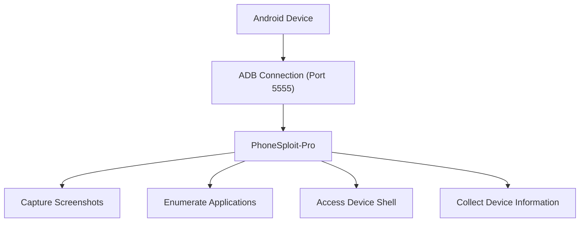
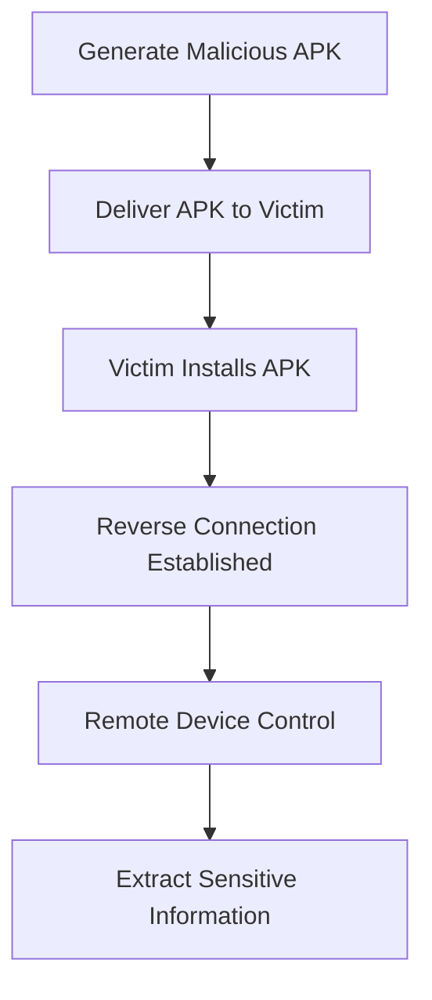
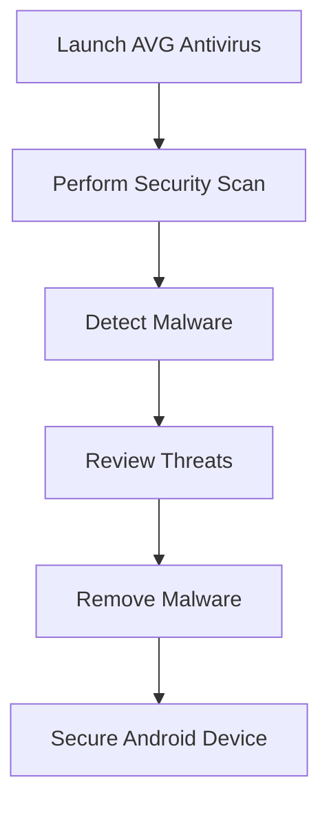

# Module 17: Hacking Mobile Platforms

> **Status:** ✅ Completed
>
> **Difficulty:** ⭐⭐⭐☆☆
>
> **Labs Completed:** 2
>
> **Tools Covered:** PhoneSploit-Pro, AndroRAT, AVG Antivirus

---

# Module Summary

This module focuses on assessing the security of Android mobile devices through exploitation, malware deployment, remote device management, and defensive security practices. The practical exercises demonstrate how ethical hackers leverage Android Debug Bridge (ADB) to interact with Android devices, generate malicious Android applications using AndroRAT, and secure mobile devices using Android antivirus solutions.

Through the practical labs, I learned how to establish communication with Android devices using ADB, perform various administrative and reconnaissance tasks with PhoneSploit-Pro, create a malicious APK using AndroRAT to simulate remote access attacks, and use AVG Antivirus to detect malware and perform security assessments on Android devices.

---

# Overview

Mobile devices have become an essential part of modern computing, storing personal information, business data, financial records, authentication credentials, and communication history. As smartphones continue to replace traditional computers for many daily activities, they have become attractive targets for cybercriminals seeking unauthorized access to sensitive information.

This module demonstrates how attackers exploit Android devices through exposed debugging interfaces, malicious applications, and social engineering techniques. It also highlights the importance of mobile endpoint protection, secure application installation, restricted debugging access, and antivirus solutions in defending Android devices against modern mobile threats.

---

# Learning Objectives

After completing this module, I was able to:

- Understand common security threats targeting Android devices.
- Exploit Android devices through Android Debug Bridge (ADB).
- Interact with Android devices using PhoneSploit-Pro.
- Generate malicious Android APKs using AndroRAT.
- Understand how Remote Access Trojans (RATs) target mobile devices.
- Perform mobile device security assessments.
- Detect malicious applications using AVG Antivirus.
- Recommend best practices for securing Android devices.

---

# Key Concepts

- Mobile Platform Security
- Android Debug Bridge (ADB)
- ADB over TCP/IP
- Port 5555
- PhoneSploit-Pro
- Android Package (APK)
- Remote Access Trojan (RAT)
- AndroRAT
- Mobile Malware
- Mobile Device Security
- Antivirus Protection

---

# Tools Used

- [PhoneSploit-Pro](../../Tools/PhoneSploit-Pro.md)
- [AndroRAT](../../Tools/AndroRAT.md)
- [AVG Antivirus](../../Tools/AVG-Antivirus.md)

---

# Labs Covered

| Lab | Description |
|------|-------------|
| Lab 1 | Hack Android Devices |
| Lab 2 | Secure Android Devices using Various Android Security Tools |

---

# Lab 1 - Hack Android Devices

## Objective

To exploit Android devices through Android Debug Bridge (ADB) using PhoneSploit-Pro and simulate a mobile malware attack by creating a malicious APK using AndroRAT.

---

## Background

Android is the world's most widely used mobile operating system, making it a common target for attackers seeking to compromise sensitive personal and organizational data. Ethical hackers assess Android device security by identifying exposed debugging interfaces, exploiting remote management capabilities, and evaluating the impact of malicious applications. This lab demonstrates how attackers interact with Android devices using ADB and how Remote Access Trojans (RATs) can compromise mobile platforms through malicious APK files.

---

## Task 1 - Exploit the Android Platform through ADB using PhoneSploit-Pro

### Tools Used

- [PhoneSploit-Pro](../../Tools/PhoneSploit-Pro.md)

---

### Activity Performed

PhoneSploit-Pro was used to establish a connection with the target Android device through Android Debug Bridge (ADB) over TCP port 5555. After successfully connecting, various administrative functions were performed, including capturing screenshots, enumerating installed applications, accessing the device shell, and collecting device information. These activities demonstrated how exposed ADB services can provide attackers with extensive control over Android devices.

---

### Observations

- Successfully established an ADB connection to the Android device.
- Captured screenshots remotely.
- Enumerated installed applications.
- Accessed the Android device shell.
- Retrieved device information.
- Understood the security risks associated with exposed ADB services.

---

### PhoneSploit-Pro Main Menu

*Figure 1.1 – PhoneSploit-Pro displaying available options for interacting with the target Android device.*

---

### ADB Connection Established

*Figure 1.2 – Successfully connecting to the Android device through ADB over TCP port 5555.*

---

### Remote Screenshot Capture

*Figure 1.3 – Capturing the Android device screen remotely using PhoneSploit-Pro.*

---

### Installed Applications Enumeration

*Figure 1.4 – Enumerating installed applications available on the target Android device.*

---

### Android Device Shell

*Figure 1.5 – Accessing the Android device shell through PhoneSploit-Pro.*

---

### Device Information

*Figure 1.6 – Collecting system and hardware information from the Android device.*

---

### Learning Outcome

This task demonstrated how Android Debug Bridge (ADB) can be abused when exposed over the network. I learned how PhoneSploit-Pro leverages ADB to automate device management functions, highlighting the importance of disabling unnecessary debugging services and restricting ADB access.

---

### Attack Flow

---

## Task 2 - Hack an Android Device by Creating APK File using AndroRAT

### Tools Used

- [AndroRAT](../../Tools/AndroRAT.md)

---

### Activity Performed

AndroRAT was used to generate a malicious Android APK configured to establish a reverse connection with the attacker's system. After generating the APK, it was delivered to the target Android device and installed. Once executed, the malicious application established a remote session with the attacker's machine, allowing device information to be collected and sensitive data, including SMS messages, to be extracted from the compromised device.

---

### Observations

- Generated a malicious Android APK.
- Started the AndroRAT listener.
- Installed the malicious application on the target device.
- Established a remote session successfully.
- Retrieved Android device information.
- Extracted SMS messages from the compromised device.

---

### APK Generation

*Figure 1.7 – Generating a malicious Android APK using AndroRAT.*

---

### AndroRAT Listener

*Figure 1.8 – AndroRAT waiting for a reverse connection from the target Android device.*

---

### Malicious APK Installed

*Figure 1.9 – Installing and executing the malicious Android application.*

---

### Remote Session Established

*Figure 1.10 – Successfully establishing a remote interpreter session with the compromised Android device.*

---

### Device Information Retrieval

*Figure 1.11 – Retrieving detailed information from the compromised Android device.*

---

### SMS Extraction

*Figure 1.12 – Extracting SMS messages from the compromised Android device.*

---

### Learning Outcome

This task demonstrated how malicious Android applications can provide persistent remote access to compromised devices. I learned how Remote Access Trojans (RATs) establish reverse connections, collect sensitive device information, and extract user data, emphasizing the importance of verifying application sources before installation.

---

### Attack Flow

---

## Overall Learning Outcome

This lab demonstrated two common attack techniques targeting Android devices: exploiting exposed ADB services and compromising devices through malicious applications. Using PhoneSploit-Pro and AndroRAT, I gained practical experience in remote Android device management, malware deployment, reverse connections, and data extraction, while reinforcing the importance of securing mobile devices against unauthorized access and malicious software.

---

# Lab 2 - Secure Android Devices using Various Android Security Tools

## Objective

To perform a security assessment on an Android device using AVG Antivirus to detect and remove malicious applications.

---

## Background

Mobile devices frequently store sensitive personal and organizational information, making them attractive targets for malware, spyware, and other malicious applications. Regular security assessments help identify infected applications, insecure configurations, and potential vulnerabilities before they can be exploited. Mobile antivirus solutions play an important role in protecting Android devices by scanning applications, detecting threats, and assisting users in removing malicious software.

---

## Task 1 - Secure Android Devices from Malicious Apps using AVG

### Tools Used

- [AVG Antivirus](../../Tools/AVG-Antivirus.md)

---

### Activity Performed

AVG Antivirus was used to perform a comprehensive security assessment of the Android device. A full system scan was initiated to identify malicious applications and security threats. After the scan completed, the detected malware was reviewed and removed, demonstrating how mobile security software helps protect Android devices from malicious applications.

---

### Observations

- Successfully launched AVG Antivirus.
- Performed a full security scan on the Android device.
- Detected malicious applications.
- Removed identified malware successfully.
- Improved the overall security posture of the Android device.

---

### AVG Dashboard

*Figure 2.1 – AVG Antivirus dashboard displaying the option to initiate a security scan.*

---

### Security Scan

*Figure 2.2 – AVG Antivirus performing a comprehensive scan of the Android device.*

---

### Threat Detection

*Figure 2.3 – AVG identifying malicious applications and security threats on the Android device.*

---

### Malware Removal

*Figure 2.4 – Successfully removing detected malware to secure the Android device.*

---

### Learning Outcome

This task demonstrated how mobile antivirus solutions protect Android devices by detecting and removing malicious applications. I learned how security assessment tools help identify mobile threats, improve device security, and reduce the risk of malware compromising sensitive user data.

---

### Defense Workflow

---

## Overall Learning Outcome

This lab demonstrated the importance of securing Android devices through regular security assessments and malware detection. Using AVG Antivirus, I gained practical experience in scanning mobile devices, identifying malicious applications, and removing detected threats to strengthen Android platform security.

---

# Key Takeaways

- Understood the common security threats targeting Android mobile platforms.
- Exploited Android devices through Android Debug Bridge (ADB) using PhoneSploit-Pro.
- Learned how ADB over TCP/IP (port 5555) can expose Android devices to unauthorized access.
- Performed remote device management tasks such as capturing screenshots, accessing the device shell, and enumerating installed applications.
- Created a malicious Android APK using AndroRAT to simulate a Remote Access Trojan (RAT) attack.
- Established a reverse connection to remotely access and collect information from a compromised Android device.
- Performed a security assessment using AVG Antivirus to detect and remove malicious applications.
- Reinforced the importance of securing Android devices by disabling unnecessary debugging services, installing applications only from trusted sources, and using mobile security solutions.

---

# Defensive Perspective

Android devices should be protected by disabling ADB debugging when not required, restricting ADB over network connections, installing applications only from trusted sources, and keeping the operating system and applications up to date. Organizations should deploy mobile security solutions, perform regular malware scans, enforce mobile device management (MDM) policies, and educate users about the risks of installing untrusted APK files. These practices significantly reduce the risk of malware infections and unauthorized device access.

---

# Interview Questions

1. What is Android Debug Bridge (ADB) and why is it used?
2. Why is exposing ADB over TCP/IP considered a security risk?
3. What is the default TCP port commonly used by ADB over the network?
4. How does PhoneSploit-Pro interact with Android devices?
5. What is a Remote Access Trojan (RAT)?
6. How does AndroRAT compromise an Android device?
7. What is an APK file?
8. Why are malicious APK files dangerous?
9. What role does mobile antivirus software play in Android security?
10. What best practices should organizations follow to secure Android devices?

---

# My Reflection

This module provided practical experience in both attacking and securing Android devices. I learned how exposed ADB services can provide attackers with extensive control over mobile devices and how malicious APK files can establish persistent remote access. The defensive exercises reinforced the importance of mobile security tools, secure application installation, and proper Android device configuration to protect against mobile threats.

---