# Module 18: IoT and OT Hacking

> **Status:** ✅ Completed
>
> **Difficulty:** ⭐⭐⭐☆☆
>
> **Labs Completed:** 3
>
> **Tools Covered:** Shodan, Censys, Wireshark, can-utils

---

# Module Summary

This module focuses on assessing the security of Internet of Things (IoT) and Operational Technology (OT) platforms through reconnaissance, network traffic analysis, and protocol-based attacks. The practical exercises demonstrate how ethical hackers gather information about Internet-connected devices, analyze IoT communication using Wireshark, and simulate attacks on the Controller Area Network (CAN) protocol.

Through the practical labs, I learned how to discover Internet-connected IoT devices using online footprinting tools, inspect IoT communication using Wireshark and the MQTT protocol, and perform replay attacks on the CAN protocol to understand common weaknesses in automotive and industrial communication systems.

---

# Overview

The rapid adoption of Internet of Things (IoT) devices and Operational Technology (OT) systems has introduced new security challenges across consumer, enterprise, and industrial environments. Smart devices often communicate continuously over lightweight protocols and frequently operate with limited security controls, making them attractive targets for attackers. Similarly, OT environments prioritize availability and reliability, which can leave critical industrial systems vulnerable to cyber threats.

This module demonstrates how attackers gather intelligence about IoT devices, analyze network communications, and exploit weaknesses in embedded communication protocols. It also highlights the importance of securing connected devices, monitoring network traffic, and protecting industrial communication systems against unauthorized access and replay attacks.

---

# Learning Objectives

After completing this module, I was able to:

- Perform footprinting against Internet-connected IoT devices.
- Gather IoT device information using online search engines.
- Capture and analyze IoT traffic using Wireshark.
- Understand MQTT communication within IoT environments.
- Perform replay attacks on the CAN protocol.
- Identify common security weaknesses affecting IoT and OT devices.
- Recommend defensive measures for securing IoT and OT environments.

---

# Key Concepts

- Internet of Things (IoT)
- Operational Technology (OT)
- IoT Footprinting
- MQTT Protocol
- MQTT Broker
- Publish/Subscribe Communication
- Packet Analysis
- CAN Bus
- Replay Attack
- Embedded Device Security

---

# Tools Used

- [Shodan](../../Tools/Shodan.md)
- [Censys](../../Tools/Censys.md)
- [Wireshark](../../Tools/Wireshark.md)
- [can-utils](../../Tools/can-utils.md)

---

# Labs Covered

| Lab | Description |
|------|-------------|
| Lab 1 | Perform Footprinting using Various Footprinting Techniques |
| Lab 2 | Capture and Analyze IoT Device Traffic |
| Lab 3 | Perform IoT Attacks |

---

# Lab 1 - Perform Footprinting using Various Footprinting Techniques

## Objective

To gather information about IoT and OT platforms using online footprinting techniques such as WHOIS lookup, Google Dorking, and Shodan.

---

## Background

Footprinting is the first phase of an IoT penetration test, where publicly available information is collected to understand the target environment before attempting any attack. Information such as domain details, exposed services, device types, protocols, IP addresses, and publicly accessible management interfaces helps identify potential attack surfaces and security weaknesses. This reconnaissance enables ethical hackers to plan further assessment activities efficiently.

---

## Task 1 - Gather Information using Online Footprinting Tools

### Tools Used

- [Shodan](../../Tools/Shodan.md)
- [Censys](../../Tools/Censys.md)

---

### Activity Performed

Various online footprinting techniques were used to collect publicly available information about IoT and OT platforms. WHOIS lookup was performed to gather domain registration details related to the MQTT protocol. Google Hacking Database (Google Dorks) was used to identify exposed SCADA systems, while Shodan was utilized to discover Internet-connected IoT devices exposing MQTT services over the default port 1883. The collected information demonstrated how attackers can enumerate exposed devices and services before launching further attacks.

---

### Observations

- Retrieved domain registration information using WHOIS.
- Identified Google Dorks related to SCADA systems.
- Discovered publicly accessible SCADA login portals.
- Enumerated Internet-connected MQTT devices using Shodan.
- Collected device information including open ports, services, and host details.

---

### WHOIS Domain Lookup

*Figure 1.1 – Performing a WHOIS lookup to gather domain registration and ownership information related to the MQTT standard organization.*

---

### Google Hacking Database

*Figure 1.2 – Searching the Google Hacking Database to identify Google Dorks related to SCADA systems.*

---

### SCADA Google Dork Results

*Figure 1.3 – Using Google Dorks to discover publicly accessible SCADA systems.*

---

### Exposed SCADA Login Portal

*Figure 1.4 – Accessing a publicly exposed SCADA login interface identified through Google Dorking.*

---

### MQTT Device Search using Shodan

*Figure 1.5 – Discovering Internet-connected MQTT devices using Shodan by searching for the default MQTT port (1883).*

---

### Device Information using Shodan

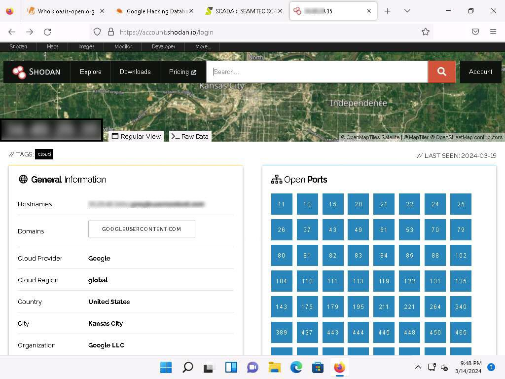

*Figure 1.6 – Viewing detailed information about a discovered IoT device, including open ports, services, hostnames, and network information.*

---

### Learning Outcome

This task demonstrated how publicly available information can reveal valuable details about Internet-connected IoT and OT devices. I learned how WHOIS lookup, Google Dorking, and Shodan assist in identifying exposed systems, services, and potential attack surfaces during the reconnaissance phase of a penetration test.

---

### Footprinting Workflow

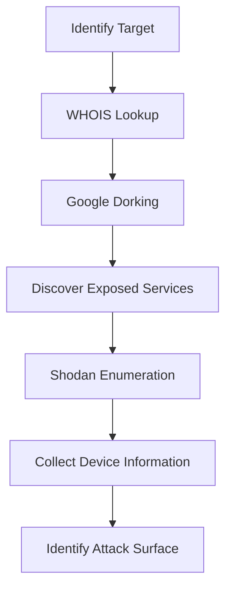

---

## Overall Learning Outcome

This lab demonstrated the importance of reconnaissance during IoT and OT security assessments. By combining WHOIS lookup, Google Dorking, and Shodan, I gained practical experience in gathering publicly available information that can be used to identify exposed IoT devices, services, and potential attack vectors before performing further security testing.

---

# Lab 2 - Capture and Analyze IoT Device Traffic

## Objective

To capture and analyze communication between IoT devices using Wireshark and understand the MQTT publish/subscribe messaging protocol.

---

## Background

IoT devices continuously exchange data using lightweight communication protocols such as MQTT. Monitoring this traffic helps security professionals understand how devices communicate, identify exposed information, detect insecure configurations, and investigate potential attacks. Packet analysis is an essential skill for assessing the security of IoT environments and verifying secure communication between devices and servers.

---

## Task 1 - Capture and Analyze IoT Traffic using Wireshark

### Tools Used

- [Wireshark](../../Tools/Wireshark.md)

---

### Activity Performed

A virtual IoT network was created using the Bevywise IoT Simulator and connected to an MQTT Broker. A virtual temperature sensor subscribed to an MQTT topic, and a test message was published through the broker. Wireshark was then used to capture the network traffic and analyze MQTT packets, allowing the communication between the IoT device and the broker to be examined.

---

### Observations

- Successfully created a virtual IoT network.
- Connected the IoT device to the MQTT Broker.
- Published a message to the subscribed MQTT topic.
- Verified successful message delivery to the IoT device.
- Captured and analyzed MQTT packets using Wireshark.

---

### Virtual IoT Network

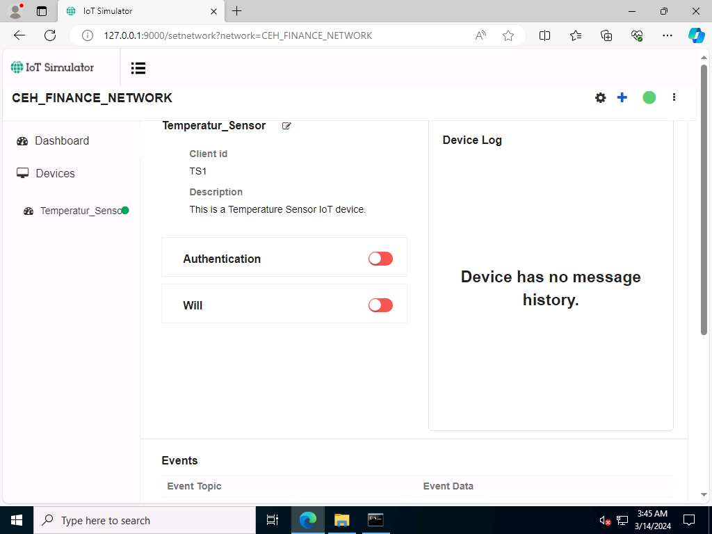

*Figure 2.1 – Virtual IoT network with the connected temperature sensor created using the Bevywise IoT Simulator.*

---

### MQTT Broker Connection

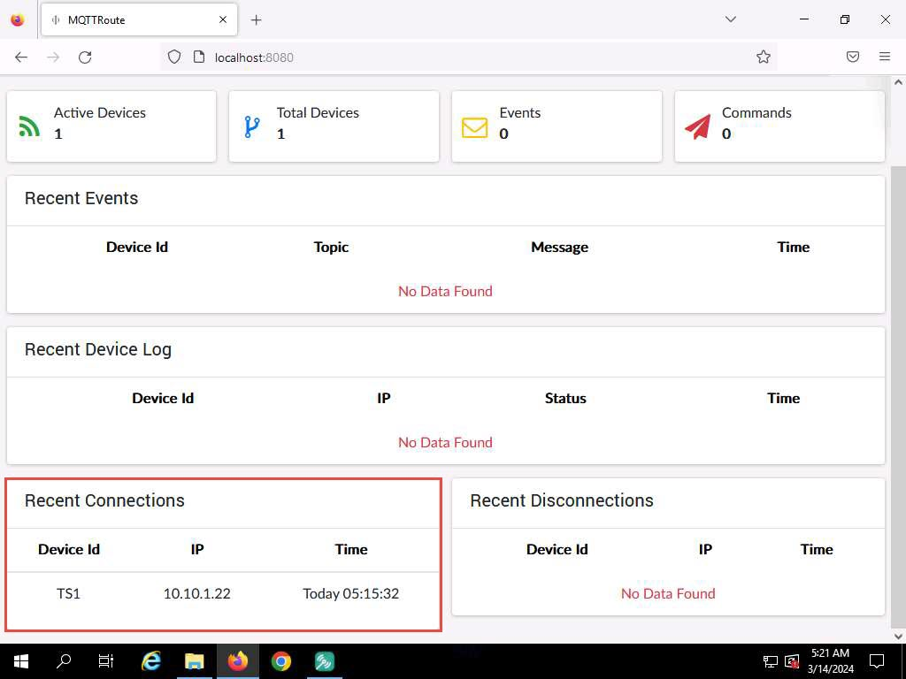

*Figure 2.2 – MQTT Broker displaying the successful connection of the IoT device.*

---

### MQTT Message Published

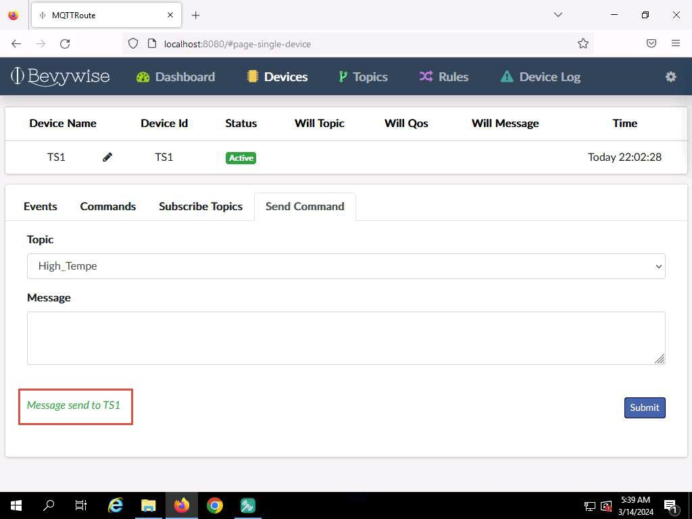

*Figure 2.3 – Publishing an alert message from the MQTT Broker to the subscribed IoT device.*

---

### Device Received Message

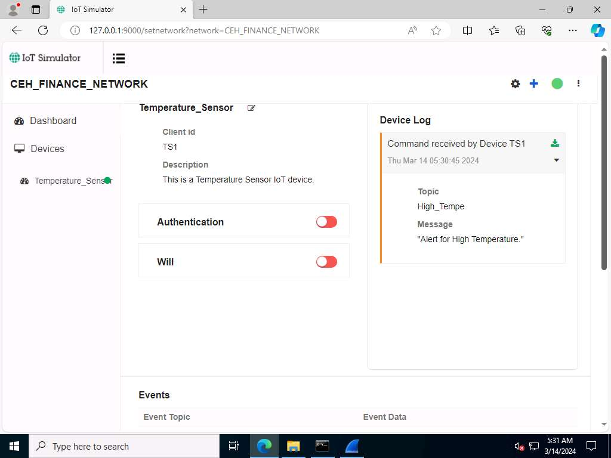

*Figure 2.4 – The virtual IoT device successfully receiving the published MQTT message.*

---

### MQTT Traffic Analysis

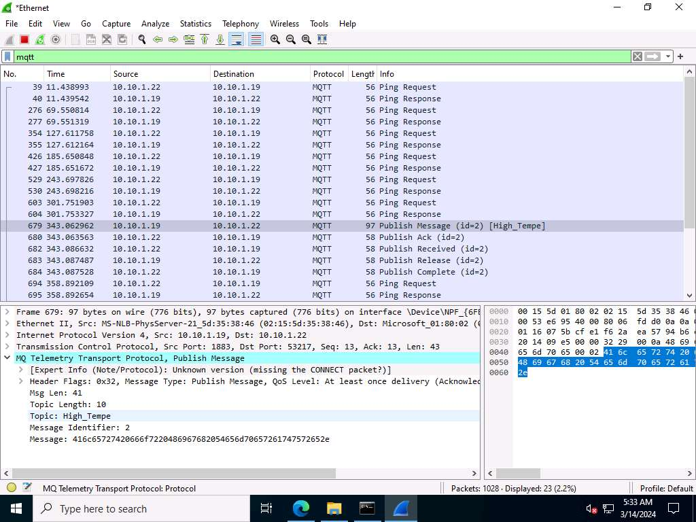

*Figure 2.5 – Analyzing MQTT Publish packets and protocol details using Wireshark.*

---

### Learning Outcome

This task demonstrated how MQTT enables lightweight communication between IoT devices through the publish/subscribe model. I learned how to monitor MQTT traffic using Wireshark, verify successful message exchange between devices and the broker, and analyze protocol details that assist in troubleshooting and IoT security assessments.

---

### Communication Workflow

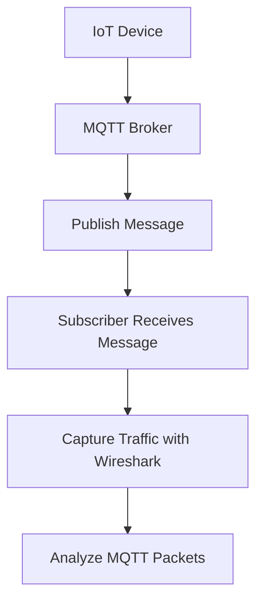

---

## Overall Learning Outcome

This lab provided practical experience in monitoring IoT communications by capturing MQTT traffic between virtual devices and an MQTT Broker. Using Wireshark, I learned how packet analysis helps identify communication patterns, verify message delivery, and support security assessments of IoT environments.

---

# Lab 3 - Perform IoT Attacks

## Objective

To demonstrate a replay attack on the Controller Area Network (CAN) protocol by capturing and replaying CAN messages in a simulated automotive environment.

---

## Background

The Controller Area Network (CAN) protocol is widely used in modern vehicles and industrial control systems to enable communication between embedded devices without requiring a central controller. Although CAN provides reliable and efficient communication, it lacks built-in authentication and encryption, making it susceptible to attacks such as message replay. Replay attacks allow attackers to capture legitimate CAN messages and retransmit them to reproduce vehicle actions without modifying the original communication.

---

## Task 1 - Perform Replay Attack on CAN Protocol

### Tools Used

- [can-utils](../../Tools/can-utils.md)

---

### Activity Performed

A virtual CAN interface was configured to simulate an automotive communication network. The ICSim simulator and CANBus Control Panel were launched to generate CAN traffic by performing vehicle operations such as acceleration, steering, and door control. The transmitted CAN packets were captured using CAN sniffing tools, stored in a log file, and replayed using the CAN replay utility to reproduce the recorded vehicle actions.

---

### Observations

- Successfully configured the virtual CAN interface.
- Simulated vehicle communication using ICSim.
- Captured CAN traffic from the virtual network.
- Generated CAN log files.
- Successfully replayed captured CAN messages.
- Demonstrated the impact of replay attacks on CAN-based systems.

---

### Virtual CAN Interface

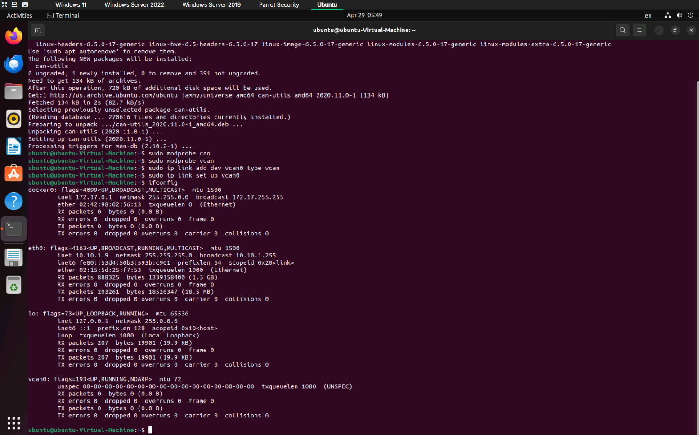

*Figure 3.1 – Verifying the successful configuration of the virtual CAN interface (vcan0).*

---

### ICSim and CANBus Control Panel

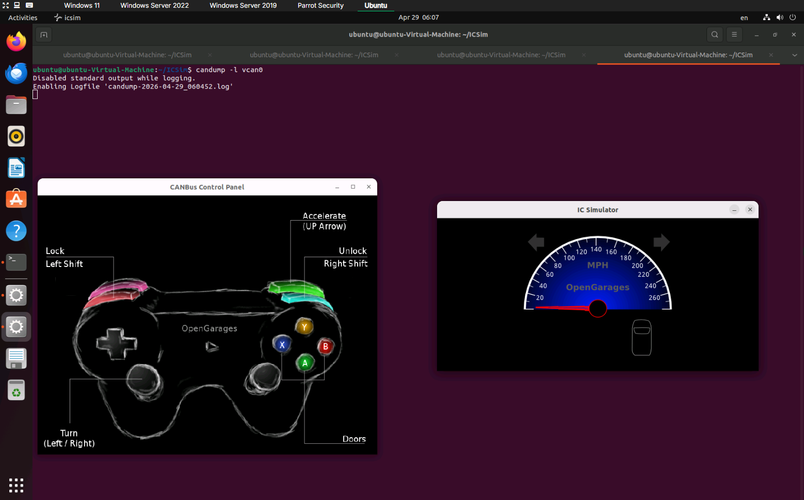

*Figure 3.2 – Simulating vehicle components using ICSim and the CANBus Control Panel.*

---

### CAN Traffic Sniffing

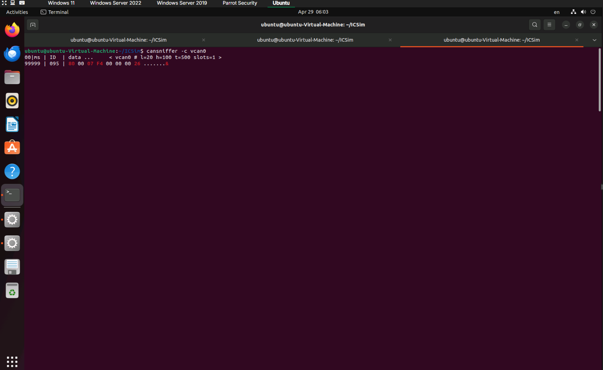

*Figure 3.3 – Capturing CAN messages transmitted between the simulated vehicle components.*

---

### CAN Log Captured

*Figure 3.4 – Verifying the successful generation of the captured CAN traffic log.*

---

### Replay Attack

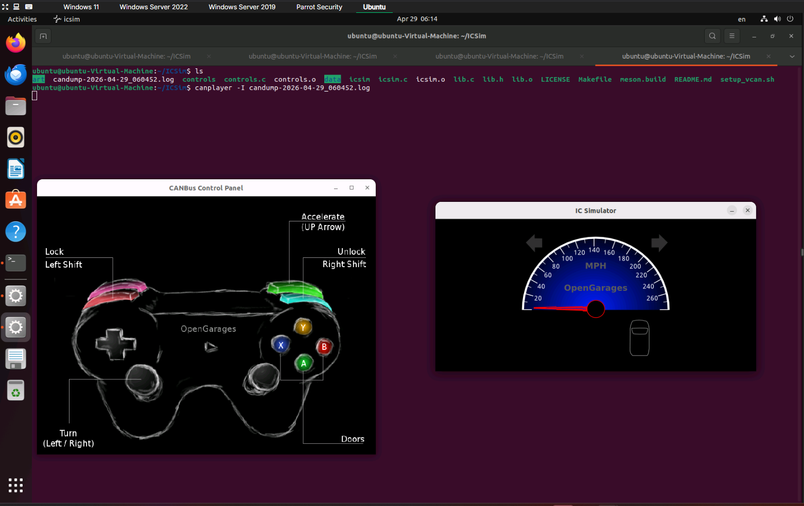

*Figure 3.5 – Replaying captured CAN messages to reproduce previously recorded vehicle actions.*

---

### Learning Outcome

This task demonstrated how attackers can exploit the lack of authentication in the CAN protocol by capturing legitimate communication and replaying it to manipulate vehicle behavior. I learned how CAN traffic is generated, monitored, recorded, and replayed to understand the security risks affecting automotive and industrial control systems.

---

### Attack Workflow

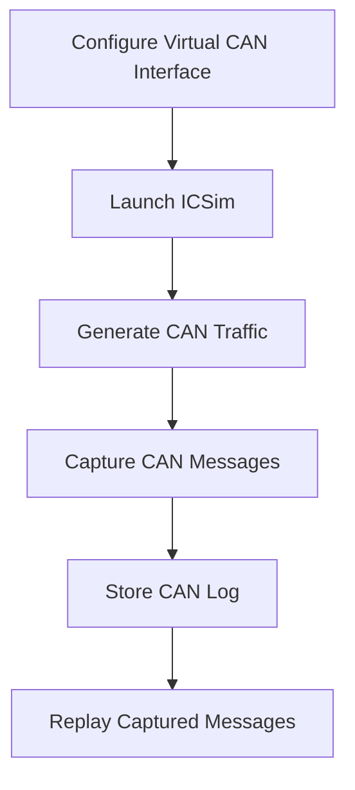

---

## Overall Learning Outcome

This lab provided practical experience in analyzing and exploiting CAN-based communication within a simulated automotive environment. Using can-utils and ICSim, I learned how replay attacks leverage previously captured CAN messages to reproduce legitimate actions, highlighting the importance of authentication and message integrity in IoT and OT communication systems.

---

# Key Takeaways

- Understood the architecture and security challenges of IoT and OT environments.
- Performed footprinting against Internet-connected IoT devices using online reconnaissance techniques.
- Gathered publicly available information using WHOIS, Google Dorking, and Shodan.
- Captured and analyzed MQTT communication between virtual IoT devices using Wireshark.
- Understood the MQTT publish/subscribe communication model and the role of the MQTT Broker.
- Simulated CAN Bus communication using ICSim.
- Captured CAN traffic and performed a replay attack using can-utils.
- Learned how replay attacks exploit the lack of authentication in the CAN protocol.
- Reinforced the importance of securing IoT devices, communication protocols, and industrial control systems against cyber threats.

---

# Defensive Perspective

IoT and OT environments should be secured by eliminating default credentials, keeping firmware up to date, disabling unnecessary services, encrypting communications, and implementing strong authentication mechanisms. Organizations should continuously monitor IoT traffic, segment operational networks from enterprise networks, and deploy intrusion detection systems capable of identifying abnormal device behavior. For CAN-based systems, message authentication and secure gateway mechanisms help mitigate replay attacks and unauthorized message injection.

---

# Interview Questions

1. What is the difference between IoT and OT?
2. Why are IoT devices common targets for attackers?
3. What information can be gathered during IoT footprinting?
4. What is Shodan and how is it used during reconnaissance?
5. What is the purpose of the MQTT protocol?
6. Explain the MQTT publish/subscribe communication model.
7. Why is Wireshark useful for IoT security assessments?
8. What is the CAN protocol and where is it commonly used?
9. How does a replay attack work against the CAN protocol?
10. What security measures can help protect IoT and OT environments?

---

# My Reflection

This module demonstrated that many IoT and OT attacks begin with reconnaissance and traffic analysis before exploitation. I learned how publicly available information can expose Internet-connected devices, how MQTT facilitates communication between IoT devices, and how weaknesses in the CAN protocol can be abused through replay attacks. These exercises reinforced the importance of securing connected devices, protecting communication channels, and implementing proper security controls throughout IoT and OT environments.

---