# Module 20: Cryptography

> **Status:** ✅ Completed
>
> **Difficulty:** ⭐⭐⭐☆☆
>
> **Labs Completed:** 4
>
> **Tools Covered:** CyberChef, CryptoForge, VeraCrypt, ShellGPT

---

# Module Summary

This module focuses on protecting sensitive information using cryptographic techniques for confidentiality, integrity, and authenticity. The practical exercises demonstrate how ethical hackers apply encryption, hashing, digital certificates, disk encryption, and AI-assisted cryptographic analysis to secure data both at rest and in transit.

Through the practical labs, I learned how to generate secure hashes using CyberChef, encrypt files and messages using CryptoForge, create and use self-signed certificates, encrypt storage devices with VeraCrypt, and leverage AI-assisted tools to understand and perform cryptographic operations.

---

# Overview

Cryptography is the science of protecting information by transforming readable data into an unreadable format using mathematical algorithms and cryptographic keys. It plays a critical role in securing digital communications, protecting stored information, verifying data integrity, and authenticating users across modern information systems.

This module demonstrates the practical implementation of cryptographic techniques including hashing, encryption, certificate generation, disk encryption, and AI-assisted cryptographic analysis. It also highlights how organizations use cryptography to safeguard confidential information against unauthorized access, tampering, and interception.

---

# Learning Objectives

After completing this module, I was able to:

- Generate hashes using cryptographic hashing techniques.
- Perform file and text encryption using cryptographic tools.
- Understand symmetric and asymmetric encryption concepts.
- Create and use self-signed digital certificates.
- Encrypt storage devices using VeraCrypt.
- Apply AI-assisted techniques for cryptographic analysis.
- Understand the importance of encryption for protecting sensitive information.

---

# Key Concepts

- Cryptography
- Plaintext
- Ciphertext
- Symmetric Encryption
- Asymmetric Encryption
- Hashing
- Digital Certificates
- Public Key Infrastructure (PKI)
- Disk Encryption
- Data Confidentiality
- Data Integrity
- Authentication

---

# Tools Used

- [CyberChef](../../Tools/CyberChef.md)
- [CryptoForge](../../Tools/CryptoForge.md)
- [VeraCrypt](../../Tools/VeraCrypt.md)
- [ShellGPT](../../Tools/ShellGPT.md)

---

# Labs Covered

| Lab | Description |
|------|-------------|
| Lab 1 | Encrypt the Information using Various Cryptography Tools |
| Lab 2 | Create a Self-Signed Certificate |
| Lab 3 | Perform Disk Encryption |
| Lab 4 | Perform Cryptography using AI |

---

# Lab 1: Encrypt the Information using Various Cryptography Tools

## Objective

Protect sensitive information using cryptographic techniques by performing multi-layer hashing with CyberChef and encrypting files and text messages using CryptoForge.

---

## Background

Cryptography protects sensitive information by converting readable data into an unreadable format using mathematical algorithms and cryptographic keys. Hashing ensures data integrity by generating unique hash values, while encryption protects the confidentiality of files and messages by allowing only authorized users with the correct decryption key or passphrase to access the original information. These techniques are widely used to secure digital communications, personal data, financial transactions, and confidential organizational information.

---

## Task 1: Perform Multi-layer Hashing using CyberChef

### Tools Used

- [CyberChef](../../Tools/CyberChef.md)

---

### Activity Performed

A text file containing sample confidential information was loaded into CyberChef for cryptographic processing. Multiple hashing algorithms were applied sequentially by creating a recipe consisting of MD5, SHA1, and HMAC operations. The resulting multi-layer hash demonstrated how several cryptographic functions can be combined to strengthen data verification and integrity while producing a unique cryptographic output.

---

### Observations

- Loaded the input text into CyberChef.
- Applied MD5 hashing to the input data.
- Performed SHA1 hashing on the generated MD5 hash.
- Applied an HMAC operation using a secret key.
- Successfully generated the final multi-layer cryptographic hash.

---

### Multi-layer Hashing using CyberChef

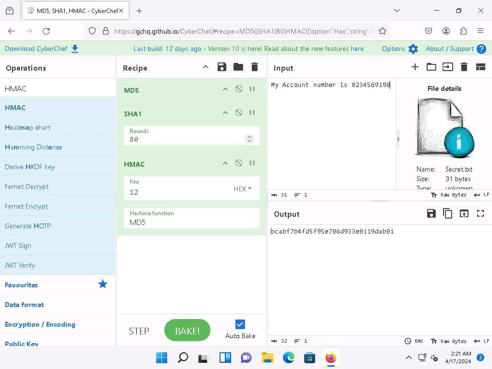

**Figure 1.1:** CyberChef performing multi-layer hashing by applying MD5, SHA1, and HMAC operations to generate the final cryptographic hash.

---

## Task 2: Perform File and Text Message Encryption using CryptoForge

### Tools Used

- [CryptoForge](../../Tools/CryptoForge.md)

---

### Activity Performed

CryptoForge was used to encrypt a confidential text file using a passphrase, ensuring that the file could only be accessed after successful authentication. The encrypted file was then decrypted to verify data integrity. Additionally, CryptoForge Text was used to encrypt a confidential message, save it securely, and later decrypt it using the correct passphrase, demonstrating secure protection of sensitive information during storage and transmission.

---

### Observations

- Successfully encrypted a confidential file.
- Verified that the encrypted file required a passphrase for access.
- Successfully decrypted the protected file.
- Encrypted a confidential text message.
- Successfully decrypted the encrypted message using the correct passphrase.

---

### Encrypted File

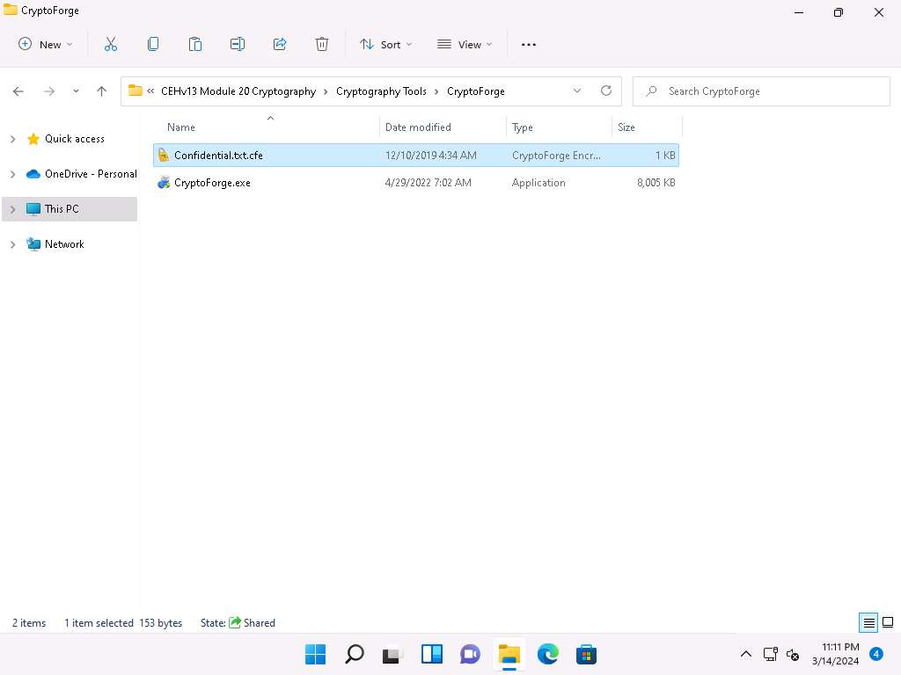

**Figure 1.2:** A confidential file was successfully encrypted using CryptoForge, protecting its contents from unauthorized access.

---

### Decrypted File

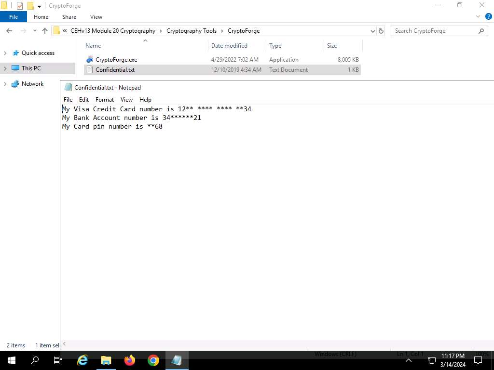

**Figure 1.3:** The encrypted file was successfully decrypted using the correct passphrase, restoring the original content.

---

### Encrypted Text Message

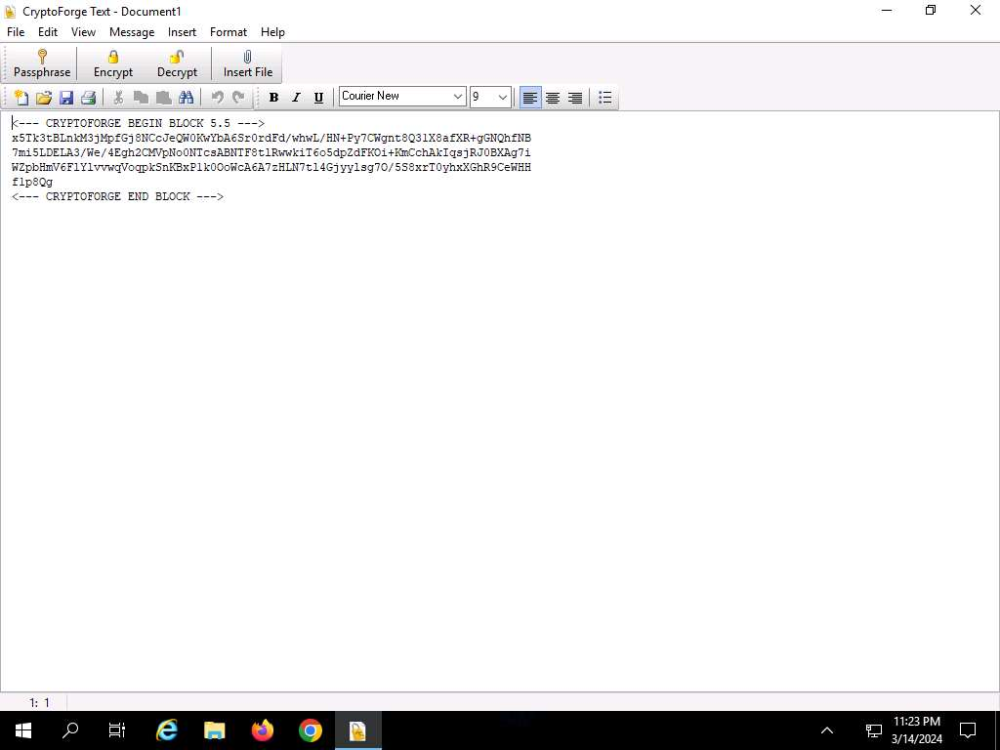

**Figure 1.4:** CryptoForge Text encrypted a confidential message into ciphertext using a secure passphrase.

---

### Decrypted Text Message

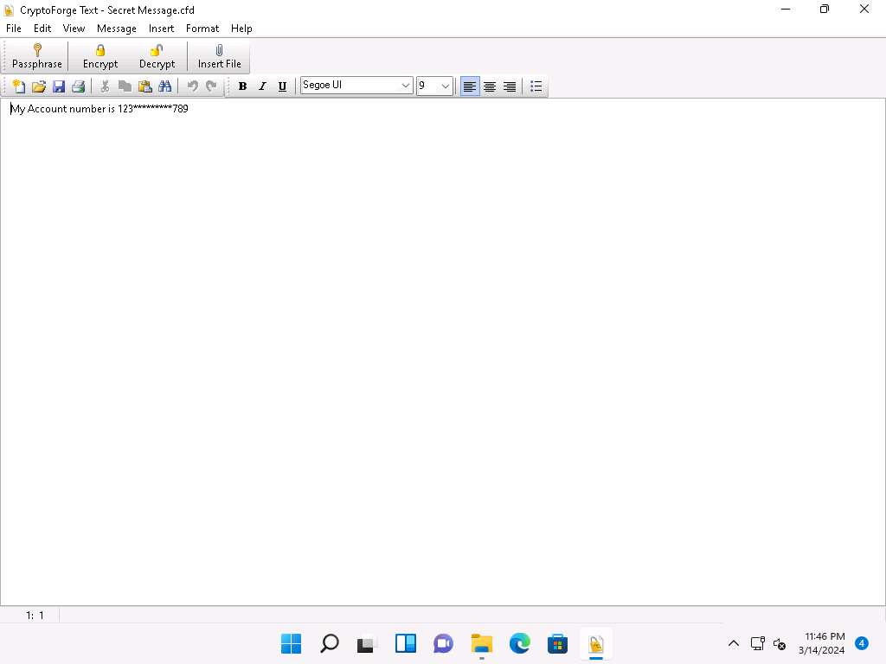

**Figure 1.5:** The encrypted message was successfully decrypted back into readable plaintext using the correct passphrase.

---

### Learning Outcome

This lab demonstrated how cryptographic hashing and encryption protect sensitive information from unauthorized access. I learned how to generate multi-layer hashes for integrity verification using CyberChef and how to secure files and messages using CryptoForge through password-based encryption and decryption.

---

### Encryption Workflow

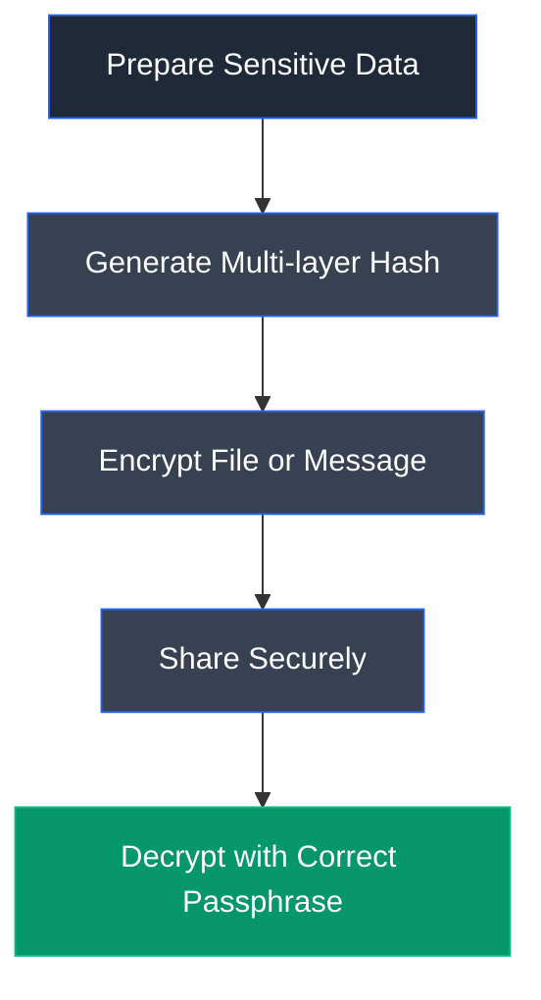
```mermaid
flowchart TD

    A[Prepare Sensitive Data]
    --> B[Generate Multi-layer Hash]
    --> C[Encrypt File or Message]
    --> D[Share Securely]
    --> E[Decrypt with Correct Passphrase]

    classDef start fill:#1f2937,color:#fff,stroke:#2563eb
    classDef process fill:#374151,color:#fff,stroke:#2563eb
    classDef success fill:#059669,color:#fff,stroke:#10b981

    class A start
    class B,C,D process
    class E success
```

---

## Overall Learning Outcome

This lab provided practical experience in protecting sensitive information using cryptographic techniques. By performing multi-layer hashing and encrypting confidential files and messages, I gained a better understanding of how cryptography ensures confidentiality, integrity, and secure communication in modern information systems.

---

# Lab 2: Create a Self-signed Certificate

## Objective

Create and configure a self-signed SSL certificate for a web server to enable HTTPS communication and understand how self-signed certificates secure web traffic within testing and internal environments.

---

## Background

A self-signed certificate is a digital certificate that is signed by the same entity whose identity it verifies instead of a trusted Certificate Authority (CA). These certificates are commonly used in development, testing, and internal organizational environments where secure communication is required without purchasing certificates from a public CA. Although browsers display trust warnings for self-signed certificates, they still provide encryption through the SSL/TLS protocol.

---

## Task 1: Create and Use Self-signed Certificates

### Tools Used

- Internet Information Services (IIS) Manager

---

### Activity Performed

A web application was initially accessed over HTTPS to verify its security configuration, where the connection failed because no SSL certificate had been assigned. A self-signed certificate was then created using Internet Information Services (IIS) Manager and associated with the website through an HTTPS binding. After configuring the certificate, the website was accessed again over HTTPS. The browser displayed a security warning because the certificate was self-signed, and after accepting the warning, the website loaded successfully using an encrypted connection.

---

### Observations

- Verified that HTTPS was unavailable before certificate configuration.
- Successfully created a self-signed SSL certificate.
- Configured HTTPS binding for the target website.
- Observed the browser warning for an untrusted self-signed certificate.
- Successfully accessed the website over an encrypted HTTPS connection.

---

### HTTPS Connection Error

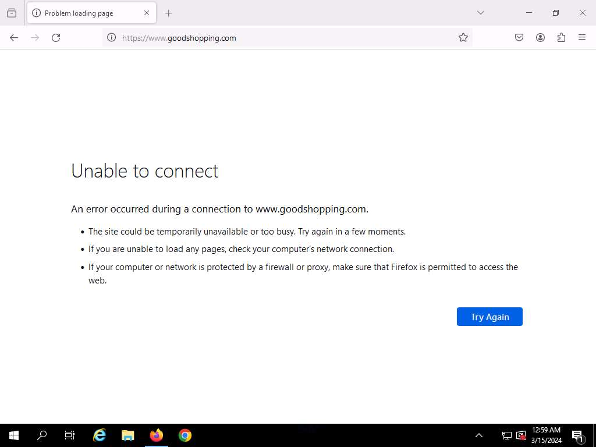

**Figure 2.1:** Attempting to access the website over HTTPS before configuring the SSL certificate resulted in a connection error because no certificate was assigned to the web server.

---

### Self-signed Certificate Created

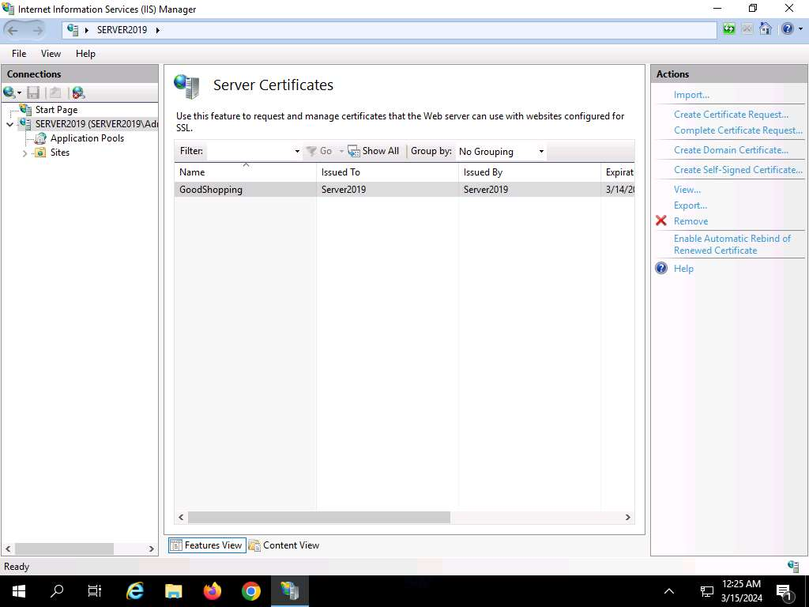

**Figure 2.2:** A self-signed SSL certificate was successfully created using IIS Manager.

---

### HTTPS Binding Configured

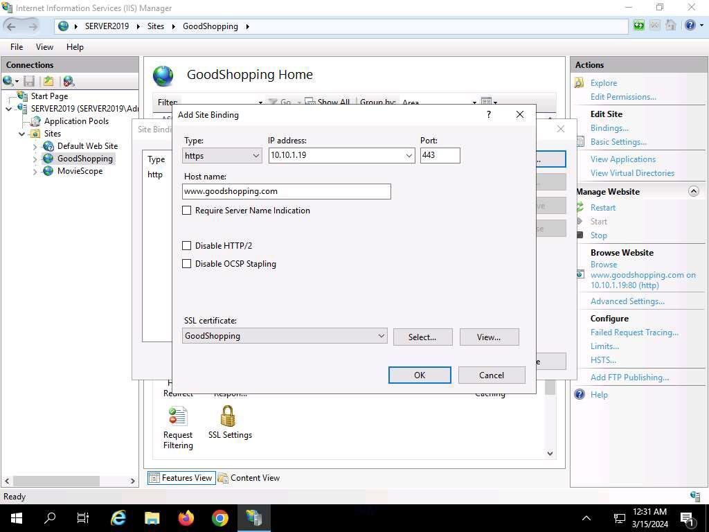

**Figure 2.3:** The newly created self-signed certificate was assigned to the website through an HTTPS binding.

---

### Browser Security Warning

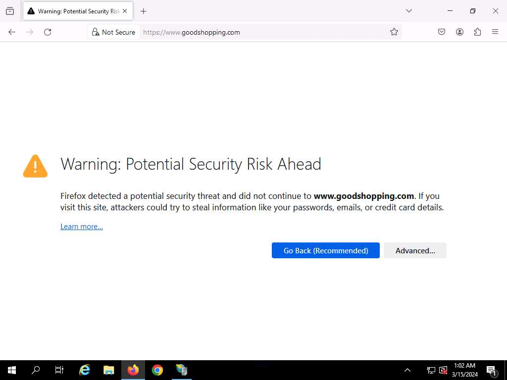

**Figure 2.4:** The browser displayed a security warning because the website was using a self-signed certificate that was not issued by a trusted Certificate Authority.

---

### Website Loaded over HTTPS

**Figure 2.5:** After accepting the certificate, the website was successfully accessed over an encrypted HTTPS connection.

---

### Learning Outcome

This task demonstrated how self-signed certificates can be created and deployed to secure web communications in testing and internal environments. I learned how SSL certificates are associated with websites, how HTTPS bindings enable encrypted communication, and why browsers display trust warnings when certificates are not issued by recognized Certificate Authorities.

---

### Certificate Deployment Workflow

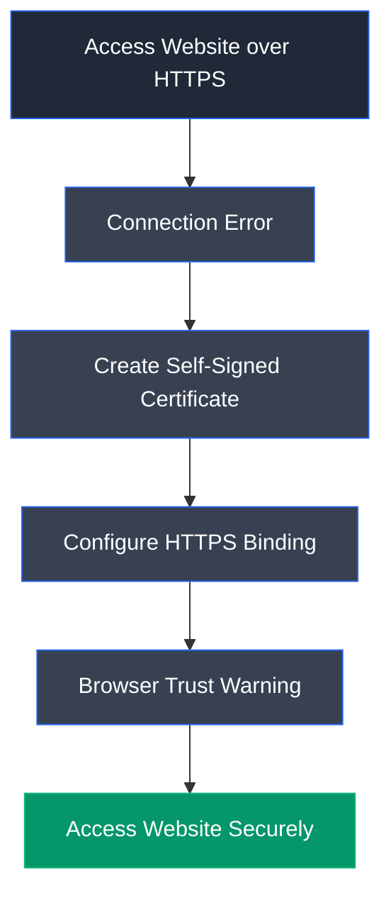
```mermaid
flowchart TD

    A[Access Website over HTTPS]
    --> B[Connection Error]
    --> C[Create Self-Signed Certificate]
    --> D[Configure HTTPS Binding]
    --> E[Browser Trust Warning]
    --> F[Access Website Securely]

    classDef start fill:#1f2937,color:#fff,stroke:#2563eb
    classDef process fill:#374151,color:#fff,stroke:#2563eb
    classDef success fill:#059669,color:#fff,stroke:#10b981

    class A start
    class B,C,D,E process
    class F success
```

---

## Overall Learning Outcome

This lab provided practical experience in creating and deploying self-signed certificates to secure web applications using HTTPS. It reinforced the role of SSL/TLS in protecting data during transmission and demonstrated how self-signed certificates enable encrypted communication within controlled testing and internal environments.

---

# Lab 3: Perform Disk Encryption

## Objective

Protect sensitive information by creating an encrypted virtual disk using VeraCrypt and securely storing confidential files within the encrypted volume.

---

## Background

Disk encryption protects stored information by encrypting the entire file system, including file names, folders, metadata, and free space. Authorized users can access the encrypted volume only after providing the correct password or encryption key. By encrypting data at rest, disk encryption safeguards confidential information even if the storage device is lost, stolen, or accessed without authorization.

---

## Task 1: Perform Disk Encryption using VeraCrypt

### Tools Used

- [VeraCrypt](../../Tools/VeraCrypt.md)

---

### Activity Performed

A new encrypted container was created using VeraCrypt and configured as a virtual encrypted disk. After assigning a strong password, the encrypted volume was mounted as a virtual drive, allowing confidential files to be securely stored within the protected container. A sample text file was copied into the encrypted volume to demonstrate secure storage. Finally, the encrypted volume was dismounted, causing the virtual drive (I:) to disappear from the system and making the protected data inaccessible until it is mounted again with the correct password.

---

### Observations

- Successfully created an encrypted VeraCrypt volume.
- Mounted the encrypted volume as a virtual drive.
- Stored confidential data within the encrypted container.
- Successfully dismounted the encrypted volume.
- Verified that the virtual drive (I:) disappeared after dismounting, preventing unauthorized access to the encrypted data.

---

### Encrypted Volume Created

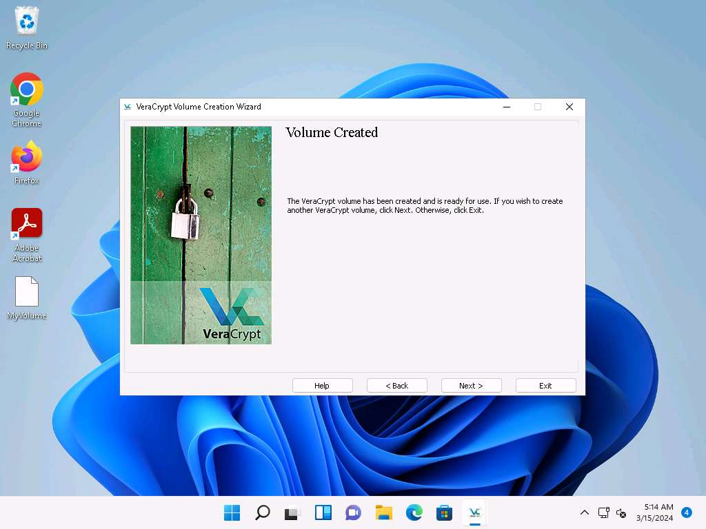

**Figure 3.1:** VeraCrypt successfully created an encrypted virtual disk container for securely storing confidential data.

---

### Encrypted Volume Mounted

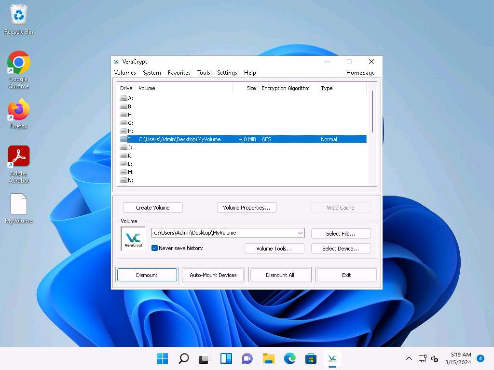

**Figure 3.2:** The encrypted container was successfully mounted as the virtual drive (I:) after password authentication.

---

### File Stored in Encrypted Volume

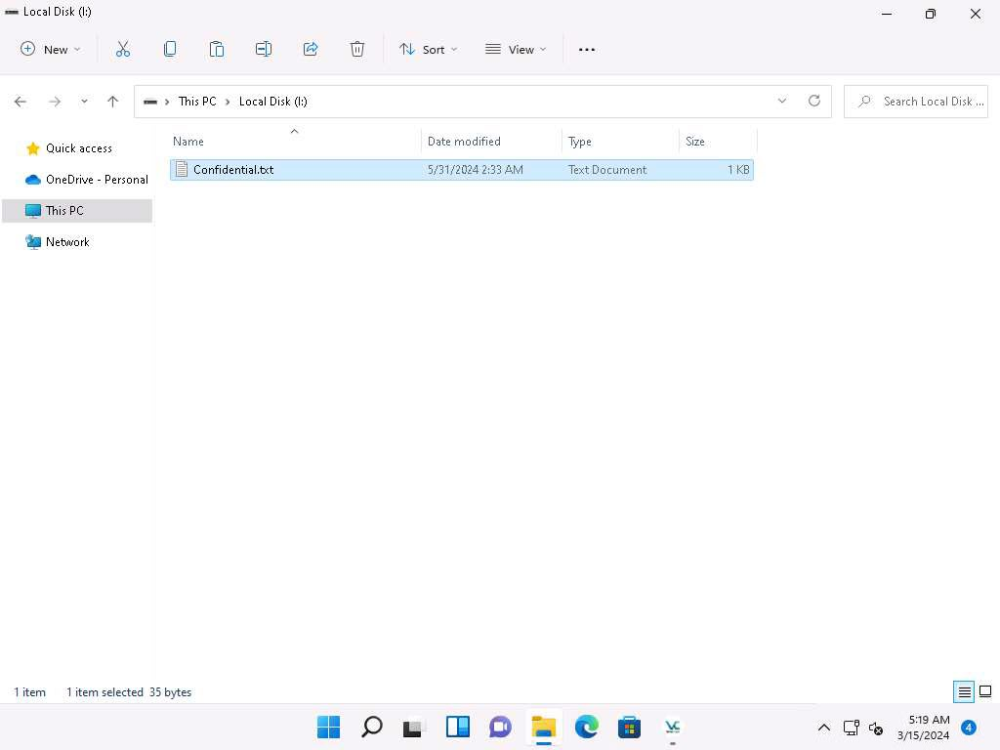

**Figure 3.3:** A confidential text file was copied into the mounted encrypted volume, ensuring that it remained protected by disk encryption.

---

### Encrypted Volume Dismounted

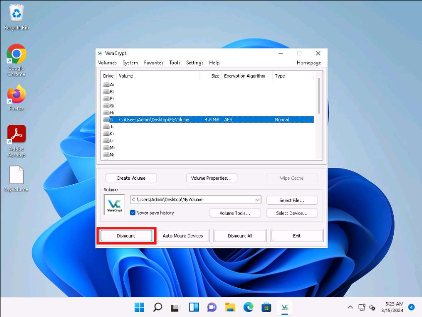

**Figure 3.4:** The encrypted virtual drive was successfully dismounted using VeraCrypt. After dismounting, the mounted drive (I:) disappeared from the system, making the encrypted data inaccessible until the volume is mounted again using the correct password.

---

### Learning Outcome

This task demonstrated how disk encryption protects sensitive information by storing files within an encrypted virtual container. I learned how encrypted volumes are created, mounted, used for secure file storage, and dismounted to prevent unauthorized access. I also observed that the encrypted drive becomes unavailable after dismounting, ensuring that protected data cannot be accessed without proper authentication.

---

### Disk Encryption Workflow

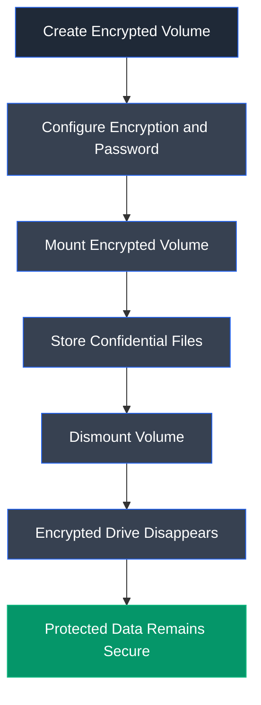
```mermaid
flowchart TD

    A[Create Encrypted Volume]
    --> B[Configure Encryption and Password]
    --> C[Mount Encrypted Volume]
    --> D[Store Confidential Files]
    --> E[Dismount Volume]
    --> F[Encrypted Drive Disappears]
    --> G[Protected Data Remains Secure]

    classDef start fill:#1f2937,color:#fff,stroke:#2563eb
    classDef process fill:#374151,color:#fff,stroke:#2563eb
    classDef success fill:#059669,color:#fff,stroke:#10b981

    class A start
    class B,C,D,E,F process
    class G success
```

---

## Overall Learning Outcome

This lab provided practical experience in protecting sensitive information using disk encryption. By creating, mounting, using, and dismounting an encrypted virtual volume with VeraCrypt, I gained a clear understanding of how disk encryption safeguards confidential data and prevents unauthorized access by making the encrypted drive inaccessible until it is mounted with the correct password.

---

# Lab 4: Perform Cryptography using AI

## Objective

Perform various cryptographic operations using ShellGPT to generate hashes, calculate file checksums, and encode and decode data through AI-assisted command generation.

---

## Background

Artificial Intelligence enhances cryptographic operations by simplifying complex tasks through intelligent command generation and automation. ShellGPT integrates AI with the Linux shell, allowing users to perform cryptographic functions such as hashing, checksum generation, encoding, and decoding using natural language prompts. This improves efficiency while maintaining the security and integrity of sensitive data.

---

## Task 1: Perform Cryptographic Techniques using ShellGPT

### Tools Used

- [ShellGPT](../../Tools/ShellGPT.md)

---

### Activity Performed

ShellGPT was configured and used to generate shell commands for various cryptographic operations. AI-generated commands were executed to calculate MD5 and multi-layer hashes, generate a CRC32 checksum for a file, perform Base64 encoding, and decode the encoded content back to its original form. These tasks demonstrated how AI can automate common cryptographic operations while reducing manual command creation.

---

### Observations

- Successfully generated an MD5 hash using ShellGPT.
- Performed multi-layer hashing using MD5 and SHA1 algorithms.
- Calculated the CRC32 checksum of a file.
- Encoded text using the Base64 algorithm.
- Decoded the Base64-encoded content back to its original plaintext.

---

### Multi-layer Hashing using ShellGPT

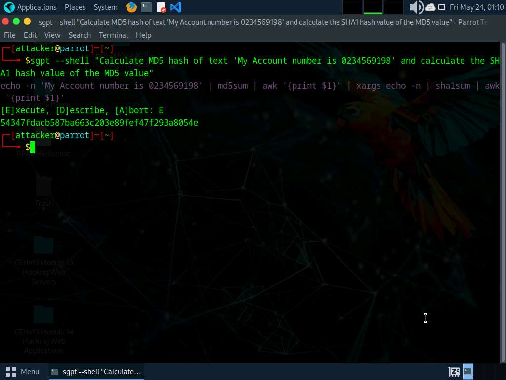

**Figure 4.1:** ShellGPT generated and executed commands to perform MD5 hashing followed by SHA1 hashing, demonstrating AI-assisted multi-layer cryptographic hashing.

---

### CRC32 File Hash

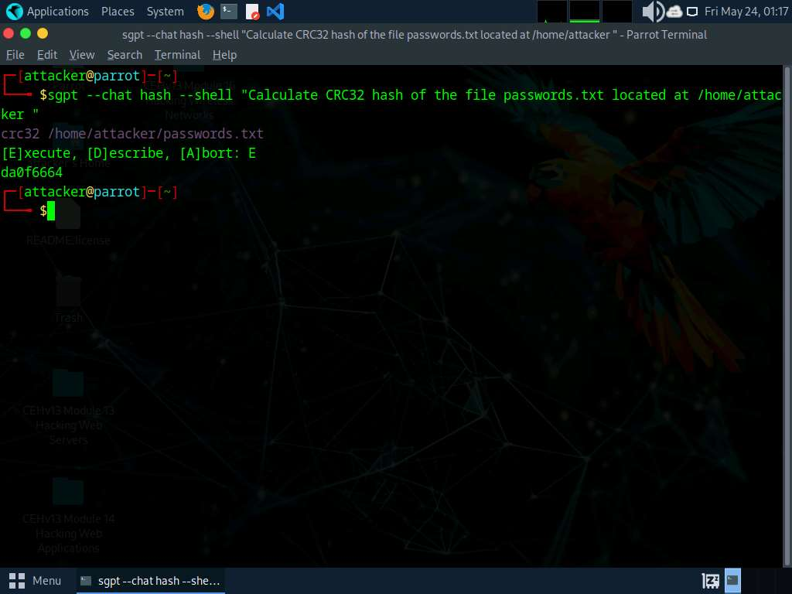

**Figure 4.2:** ShellGPT calculated the CRC32 checksum of a file to verify data integrity.

---

### Base64 Encoding

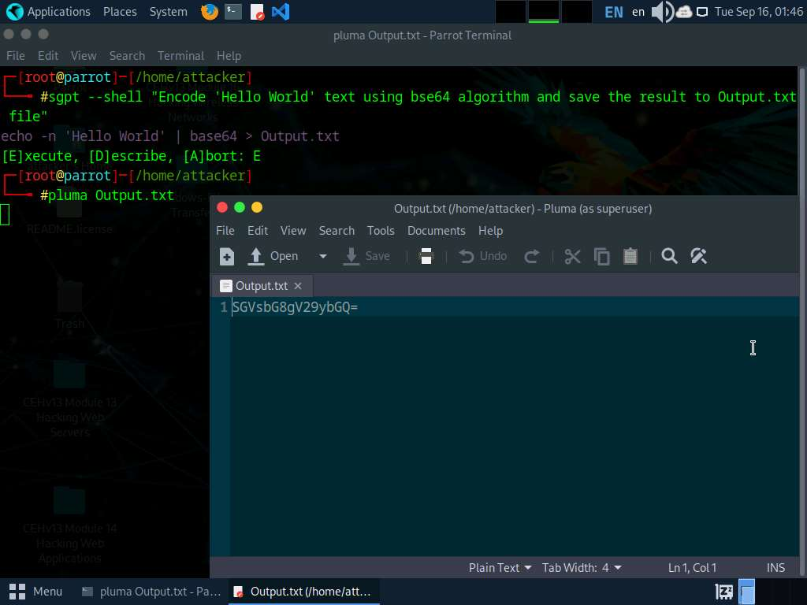

**Figure 4.3:** ShellGPT encoded plaintext into Base64 format and saved the encoded output to a file.

---

### Base64 Decoding

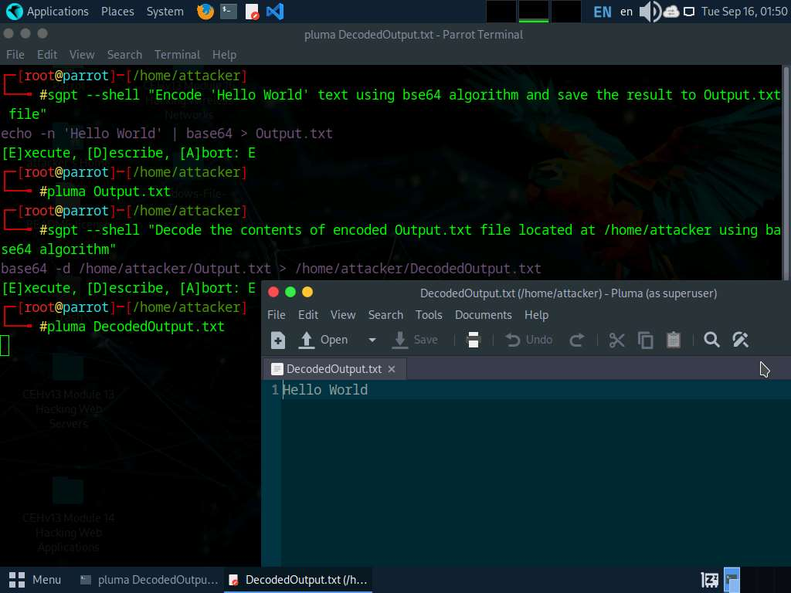

**Figure 4.4:** ShellGPT successfully decoded the Base64-encoded content back into its original plaintext.

---

### Learning Outcome

This task demonstrated how AI can simplify cryptographic operations by generating accurate shell commands through natural language prompts. I learned how ShellGPT can automate hashing, checksum generation, encoding, and decoding tasks, making cryptographic workflows faster, more efficient, and easier to perform.

---

### AI-assisted Cryptography Workflow

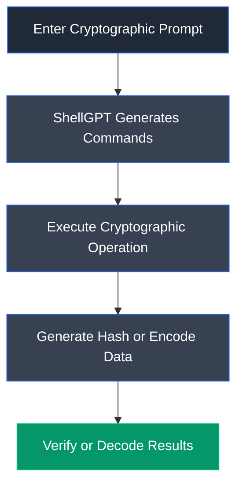
```mermaid
flowchart TD

    A[Enter Cryptographic Prompt]
    --> B[ShellGPT Generates Commands]
    --> C[Execute Cryptographic Operation]
    --> D[Generate Hash or Encode Data]
    --> E[Verify or Decode Results]

    classDef start fill:#1f2937,color:#fff,stroke:#2563eb
    classDef process fill:#374151,color:#fff,stroke:#2563eb
    classDef success fill:#059669,color:#fff,stroke:#10b981

    class A start
    class B,C,D process
    class E success
```

---

## Overall Learning Outcome

This lab provided practical experience in using AI to automate cryptographic operations. By leveraging ShellGPT to generate and execute commands for hashing, file integrity verification, and data encoding and decoding, I gained a better understanding of how AI enhances efficiency and usability in modern cryptographic workflows.

---

# Key Takeaways

- Understood the fundamental principles of cryptography, including confidentiality, integrity, authentication, and non-repudiation.
- Learned the differences between encryption, decryption, hashing, and encoding techniques.
- Performed multi-layer hashing and message encryption using CyberChef and CryptoForge.
- Created and configured self-signed SSL certificates to secure HTTPS communication in a testing environment.
- Implemented disk encryption using VeraCrypt to protect sensitive data stored on a virtual encrypted volume.
- Used ShellGPT to automate cryptographic tasks such as hashing, checksum generation, and Base64 encoding and decoding through AI-generated shell commands.
- Recognized the importance of cryptography in protecting sensitive information during storage and transmission.
- Gained practical experience with modern cryptographic tools used in cybersecurity and penetration testing.

---

# Defensive Perspective

Cryptography is one of the most effective defensive mechanisms for protecting digital assets from unauthorized access and data breaches. Organizations should implement strong encryption standards such as AES and RSA to secure sensitive information both at rest and in transit. SSL/TLS certificates should be issued by trusted Certificate Authorities for production environments, while self-signed certificates should be limited to internal testing. Disk encryption should be enabled on systems containing confidential data to minimize the impact of device theft or unauthorized physical access. Passwords, encryption keys, and certificates should be managed securely and rotated periodically. AI-assisted tools can improve operational efficiency, but administrators should always verify generated commands before execution to maintain security and accuracy.

---

# Interview Questions

1. What is the difference between encryption, hashing, and encoding?
2. Why are self-signed certificates not trusted by web browsers?
3. What are the advantages of using disk encryption?
4. Explain the purpose of SSL/TLS certificates in HTTPS communication.
5. What is the difference between symmetric and asymmetric encryption?
6. Why is hashing commonly used for password storage?
7. How does VeraCrypt protect confidential data?
8. What are the limitations of the MD5 hashing algorithm?
9. How does AI assist in performing cryptographic operations using ShellGPT?
10. What best practices should organizations follow for encryption key management?

---

# My Reflection

This module strengthened my understanding of cryptographic techniques used to protect sensitive information in modern computing environments. Through hands-on experience with CyberChef, CryptoForge, VeraCrypt, self-signed certificates, and ShellGPT, I learned how encryption, hashing, digital certificates, and disk encryption contribute to data confidentiality and integrity. I also explored how AI can simplify cryptographic operations by generating accurate commands while recognizing the importance of validating AI-generated outputs before execution. Overall, this module enhanced both my theoretical knowledge and practical skills in implementing cryptographic security controls.

---