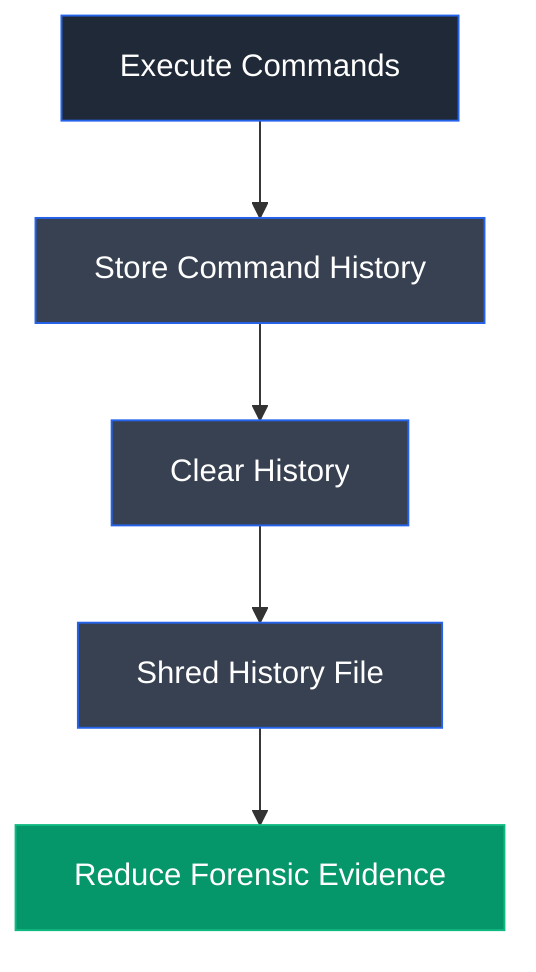

# BASH

## Overview

BASH (Bourne Again SHell) is the default command-line shell for many Linux and Unix-based operating systems. It provides an interactive environment for executing commands, running scripts, managing processes, and administering systems. BASH also records executed commands in a history file, which can become valuable forensic evidence during security investigations.

---

## Purpose

BASH is used to:

- Execute Linux commands.
- Run shell scripts.
- Manage system administration tasks.
- Record command history.
- Configure shell environments.
- Automate repetitive tasks.

---

## Key Features

- Interactive command-line interface.
- Shell scripting support.
- Command history.
- Environment variable management.
- Job and process control.
- Command completion.

---

## Launch

Open a terminal.

Execute:

```bash
bash
```

---

## Basic Syntax

Clear command history:

```bash
history -c
```

Disable history recording:

```bash
export HISTSIZE=0
```

Shred history file:

```bash
shred ~/.bash_history
```

---

## Commonly Used Commands

| Command | Description |
|---------|-------------|
| `history` | Display command history |
| `history -c` | Clear command history |
| `history -w` | Write history to file |
| `export HISTSIZE=0` | Disable history recording |
| `shred ~/.bash_history` | Securely overwrite history file |
| `more ~/.bash_history` | View history file |

---

## Typical Workflow



---

## CEH Practical Example

In **Module 06 – System Hacking**, BASH history management commands were used to disable history recording, clear previously executed commands, and securely shred the `.bash_history` file to demonstrate how attackers may attempt to remove evidence of command execution on Linux systems.

---

## Advantages

- Default shell on many Linux systems.
- Powerful scripting capabilities.
- Flexible command-line environment.
- Extensive automation support.
- Rich command history management.

---

## Limitations

- Command history can reveal attacker activity.
- Improper configuration may expose sensitive information.
- History clearing may itself indicate suspicious activity.
- History files may be backed up or centrally collected.

---

## Best Practices

- Restrict shell access to authorized users.
- Audit command execution.
- Forward shell activity to centralized logging.
- Monitor history file modifications.
- Protect administrative accounts.

---

## Used In

- Module 06 – System Hacking

---

## References

- https://www.gnu.org/software/bash/
- https://www.gnu.org/software/bash/manual/