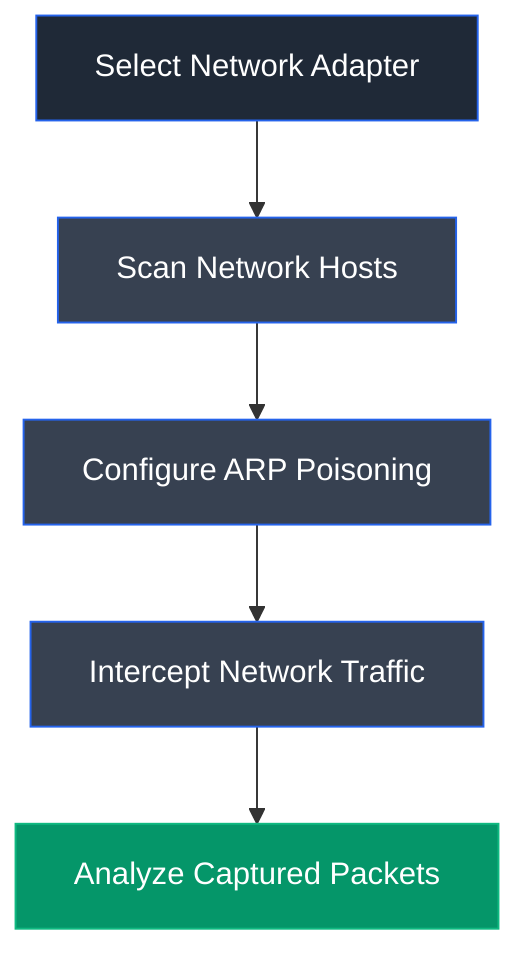

# Cain & Abel

## Overview

Cain & Abel is a Windows password recovery and network security assessment tool capable of performing packet sniffing, ARP poisoning, password recovery, protocol analysis, and network traffic interception. It is commonly used in laboratory environments to demonstrate man-in-the-middle attacks and credential recovery techniques.

---

## Purpose

Cain & Abel is used to evaluate network security by performing ARP poisoning, intercepting traffic between systems, recovering passwords, and analyzing network communications. It enables ethical hackers to demonstrate the risks associated with insecure network configurations.

---

## Key Features

- ARP poisoning
- Password recovery
- Packet sniffing
- Network host discovery
- MAC address scanning
- Routing packet interception
- Credential analysis
- Protocol decoding

---

## Installation

### Windows

Install Cain & Abel and the required packet capture driver before launching the application.

### Verify Installation

Launch **Cain & Abel** and verify that the main interface loads successfully.

---

## Basic Usage

Select the network adapter, scan for active hosts, configure ARP poisoning, and monitor intercepted traffic.

---

## Commonly Used Functions

| Function | Description |
|----------|-------------|
| Scan MAC Addresses | Discover active hosts |
| APR | Configure ARP poisoning |
| Sniffer | Capture network traffic |
| Password Recovery | Recover captured credentials |
| Routing | Monitor intercepted packets |

---

## Typical Workflow

---

## CEH Practical Example

In **Module 08 – Sniffing**, Cain & Abel was used to perform ARP poisoning between two target systems. The intercepted traffic was analyzed using Wireshark to detect duplicate IP address warnings and demonstrate active sniffing within a switched network.

---

## Advantages

- Comprehensive network assessment capabilities
- Simple graphical interface
- Supports ARP poisoning and packet interception
- Useful for demonstrating MITM attacks

---

## Limitations

- Windows only
- No longer actively maintained
- Modern endpoint protections may detect or block its activities

---

## Best Practices

- Use only in isolated lab environments.
- Restore network configuration after testing.
- Combine with packet analyzers for detailed traffic inspection.
- Obtain authorization before performing ARP poisoning.

---

## Used In

- Module 08 – Sniffing

---

## References

- https://www.oxid.it/cain.html