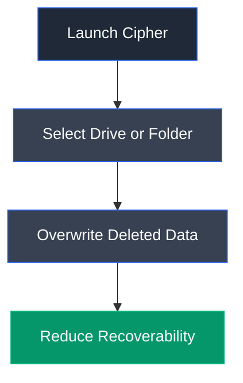

# Cipher

## Overview

Cipher is a built-in Windows command-line utility primarily designed to manage encryption on NTFS file systems. In addition to encryption and decryption, it provides a secure overwrite feature that permanently overwrites deleted data, making forensic recovery significantly more difficult.

---

## Purpose

Cipher is used to:

- Encrypt files and folders.
- Decrypt encrypted files.
- Securely overwrite deleted data.
- Reduce recoverability of deleted files.
- Manage NTFS encryption.

---

## Key Features

- Native Windows utility.
- Encrypt and decrypt NTFS files.
- Secure free-space overwrite.
- Command-line interface.
- No additional installation required.

---

## Launch

Open Command Prompt with administrative privileges.

Execute:

```cmd
cipher
```

---

## Basic Syntax

Securely overwrite free space:

```cmd
cipher /w:<drive_or_folder>
```

Example:

```cmd
cipher /w:C:
```

---

## Commonly Used Commands

| Command | Description |
|---------|-------------|
| `cipher /w:C:` | Securely overwrite free space on C: drive |
| `cipher /e` | Encrypt files |
| `cipher /d` | Decrypt files |
| `cipher /?` | Display command help |

---

## Typical Workflow



---

## CEH Practical Example

In **Module 06 – System Hacking**, Cipher was used to overwrite deleted data on the target drive after clearing Windows Event Logs, demonstrating how attackers may attempt to prevent forensic recovery of deleted evidence.

---

## Advantages

- Built into Windows.
- Secure overwrite capability.
- Simple command-line interface.
- Supports NTFS encryption.
- Useful for secure data removal.

---

## Limitations

- Requires administrative privileges.
- Overwrites only free space.
- Does not erase active files.
- Time required depends on drive size.

---

## Best Practices

- Use only on authorized systems.
- Verify selected drive before execution.
- Maintain centralized log backups.
- Monitor secure deletion activities.
- Audit administrative utility usage.

---

## Used In

- Module 06 – System Hacking

---

## References

- https://learn.microsoft.com/en-us/windows-server/administration/windows-commands/cipher