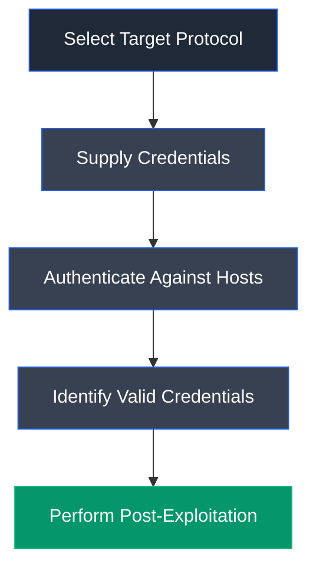

# CrackMapExec

## Overview

CrackMapExec (CME) is an open-source post-exploitation and network assessment tool designed for Active Directory environments. It enables security professionals to automate authentication testing, password spraying, service enumeration, remote command execution, and lateral movement across Windows networks. CrackMapExec integrates multiple protocols into a single framework, making it a powerful tool for penetration testing and red team operations.

---

## Purpose

CrackMapExec is used to:

- Perform password spraying attacks.
- Validate user credentials across network services.
- Enumerate Active Directory environments.
- Execute remote commands on compromised hosts.
- Identify accessible systems and services.
- Support post-exploitation activities.

---

## Key Features

- Multi-protocol support (SMB, RDP, WinRM, MSSQL, SSH, FTP).
- Password spraying and credential validation.
- Remote command execution.
- Active Directory enumeration.
- Automated lateral movement capabilities.
- Modular architecture.

---

## Installation

### Debian / Ubuntu / Parrot OS

```bash
sudo apt update
sudo apt install crackmapexec
```

Launch:

```bash
cme
```

---

## Basic Syntax

```bash
cme <protocol> <target> [options]
```

Example:

```bash
cme rdp 10.10.1.0/24 -u users.txt -p "password"
```

---

## Commonly Used Commands

| Command | Description |
|---------|-------------|
| `cme rdp` | Authenticate against RDP |
| `cme smb` | Authenticate against SMB |
| `cme winrm` | Authenticate against WinRM |
| `cme mssql` | Authenticate against MSSQL |
| `cme ssh` | Authenticate against SSH |
| `cme ftp` | Authenticate against FTP |

---

## Typical Workflow



---

## CEH Practical Example

In **Module 06 – System Hacking**, CrackMapExec was used to perform a password spraying attack against Remote Desktop Protocol (RDP) services using credentials recovered through AS-REP Roasting. The attack identified a valid RDP login for the **Mark** account, enabling authenticated access to the target Active Directory workstation.

---

## Advantages

- Fast credential validation.
- Supports multiple Windows protocols.
- Excellent Active Directory integration.
- Automates repetitive penetration testing tasks.
- Widely used by security professionals.

---

## Limitations

- Requires valid target connectivity.
- Password spraying may trigger account lockout policies.
- Easily detected by security monitoring if misused.
- Requires authorization before execution.

---

## Best Practices

- Perform password spraying responsibly.
- Respect account lockout policies.
- Monitor authentication attempts.
- Validate discovered credentials securely.
- Use only in authorized environments.

---

## Used In

- Module 06 – System Hacking

---

## References

- https://github.com/byt3bl33d3r/CrackMapExec