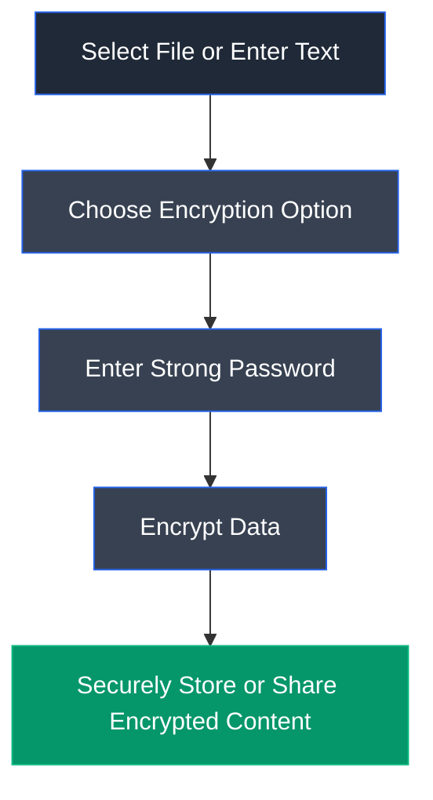

# CryptoForge

## Overview

CryptoForge is a file and text encryption software designed to protect sensitive information using strong encryption algorithms. It enables users to securely encrypt files, folders, and text messages using password-based encryption, ensuring that confidential data remains inaccessible to unauthorized users. CryptoForge is commonly used to secure personal documents, business information, backups, and confidential communications.

---

## Purpose

CryptoForge is designed to provide an easy-to-use solution for encrypting and decrypting files and text using strong cryptographic algorithms. It helps users maintain the confidentiality of sensitive information by preventing unauthorized access through password-protected encryption.

---

## Key Features

- Encrypts individual files and folders.
- Supports secure text encryption and decryption.
- Uses strong password-based encryption algorithms.
- Integrates with Windows Explorer for quick encryption.
- Protects confidential information during storage and sharing.
- Provides secure file decryption using the correct password.
- Simple graphical user interface suitable for both beginners and professionals.

---

## Installation

1. Download CryptoForge from the official website.
2. Run the installer with administrative privileges.
3. Complete the installation wizard.
4. Launch CryptoForge from the Start Menu or Desktop.
5. Begin encrypting files or text using a secure password.

---

## Typical Workflow

---

## CEH Practical Example

During **Module 20 – Cryptography**, CryptoForge was used to encrypt and decrypt confidential files and text messages. A password-protected encrypted file was created and later successfully decrypted using the correct passphrase. Additionally, CryptoForge Text was used to encrypt a confidential message and restore it back to its original plaintext, demonstrating secure protection of sensitive information during storage and transmission.

---

## Advantages

- Simple and user-friendly interface.
- Strong password-based encryption.
- Supports both file and text encryption.
- Quick encryption through Windows Explorer integration.
- Protects confidential information during storage and sharing.
- Suitable for personal and business use.

---

## Limitations

- Available primarily for Windows systems.
- Security depends on the strength of the chosen password.
- Lost passwords cannot be recovered.
- Limited automation compared to command-line encryption tools.

---

## Best Practices

- Use long, unique, and complex passwords.
- Store encryption passwords securely.
- Verify encrypted files after creation.
- Keep backup copies of important encrypted data.
- Never share passwords through insecure communication channels.
- Regularly update the software to the latest version.

---

## Used In

- Module 20 – Cryptography

---

## References

- https://www.cryptoforge.com/
- https://www.cryptoforge.com/products/cryptoforge/

---