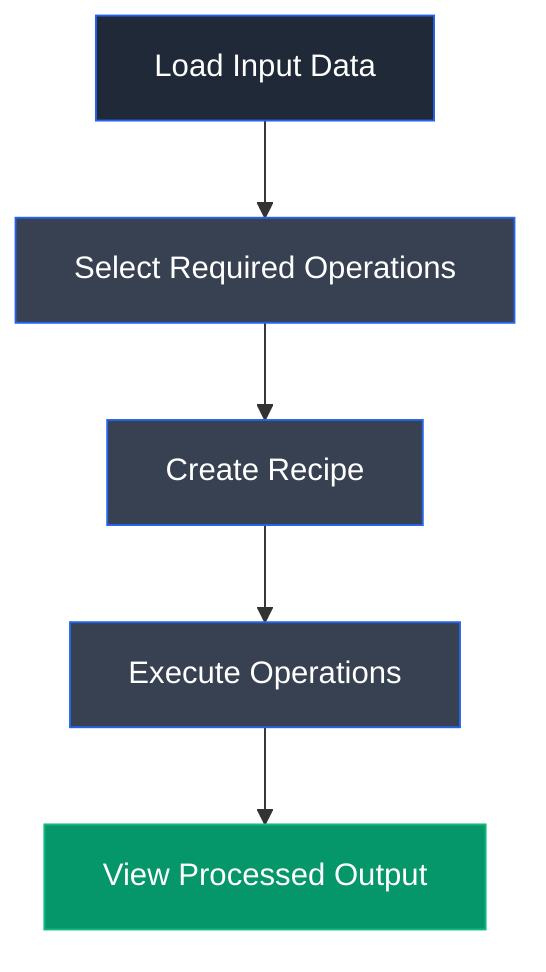

# CyberChef

## Overview

CyberChef is a web-based data transformation and cryptographic toolkit developed by GCHQ (Government Communications Headquarters). It provides a user-friendly interface for performing encryption, decryption, encoding, decoding, hashing, compression, data conversion, and forensic analysis without requiring programming knowledge. CyberChef allows multiple operations to be combined into a single workflow, making it a valuable tool for cybersecurity professionals, penetration testers, digital forensic investigators, and security researchers.

---

## Purpose

CyberChef is designed to simplify complex cryptographic and data manipulation tasks through an interactive graphical interface. It enables users to perform various cryptographic operations, analyze encoded or encrypted data, verify file integrity, and automate multiple transformations without manually writing scripts or commands.

---

## Key Features

- Supports encryption and decryption using multiple algorithms.
- Generates cryptographic hashes such as MD5, SHA-1, SHA-256, and SHA-512.
- Performs encoding and decoding operations including Base64, Hex, URL, and HTML.
- Allows multiple operations to be chained together using recipes.
- Supports HMAC generation and verification.
- Performs compression, decompression, and data conversion.
- Includes regular expression processing and text manipulation utilities.
- Works entirely through a web browser without requiring installation.

---

## Installation

CyberChef is available as a web application and can also be used offline.

**Online Version**

1. Open a web browser.
2. Navigate to the official CyberChef website.
3. Begin using the available recipes and operations.

**Offline Version**

1. Download the latest CyberChef release.
2. Extract the downloaded archive.
3. Open the CyberChef HTML file in a web browser.

---

## Typical Workflow

---

## CEH Practical Example

During **Module 20 – Cryptography**, CyberChef was used to perform multi-layer hashing. A text input was processed through a recipe consisting of **MD5**, **SHA-1**, and **HMAC** operations to generate a final cryptographic hash. This demonstrated how multiple cryptographic algorithms can be combined to verify data integrity and strengthen cryptographic processing.

---

## Advantages

- Simple and intuitive graphical interface.
- Supports hundreds of cryptographic and data transformation operations.
- No programming knowledge required.
- Enables rapid testing and experimentation.
- Works both online and offline.
- Allows multiple operations to be executed within a single workflow.
- Widely used in cybersecurity, malware analysis, and digital forensics.

---

## Limitations

- Browser-based processing may be slower for very large files.
- Some advanced cryptographic operations require proper understanding to avoid misuse.
- Not intended for enterprise-scale encryption management.
- Incorrect recipe configurations may produce unexpected results.

---

## Best Practices

- Verify the selected cryptographic algorithms before execution.
- Prefer modern hashing algorithms such as SHA-256 or SHA-512 for security-sensitive applications.
- Use HMAC when message authentication is required.
- Avoid using deprecated algorithms such as MD5 for password storage.
- Validate output after performing multiple chained operations.
- Keep offline versions updated to the latest release.

---

## Used In

- Module 20 – Cryptography

---

## References

- https://gchq.github.io/CyberChef/
- https://github.com/gchq/CyberChef
- https://github.com/gchq/CyberChef/wiki

---