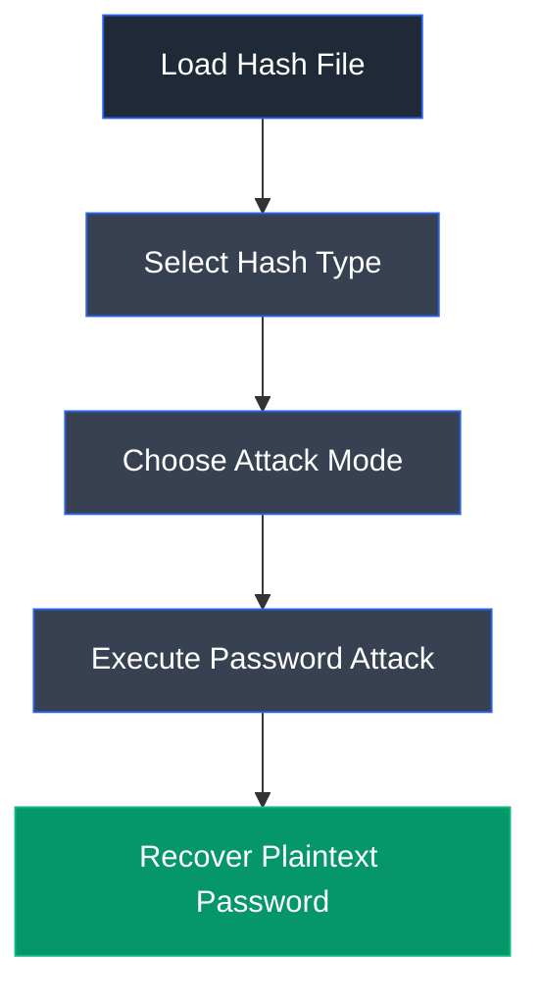

# Hashcat

## Overview

Hashcat is an advanced password recovery and password auditing tool that performs high-speed offline password cracking using CPU and GPU acceleration. It supports numerous hashing algorithms and attack modes, making it one of the most widely used tools for recovering passwords from captured hashes during authorized security assessments.

---

## Purpose

Hashcat is used to:

- Recover passwords from hashes.
- Perform offline password auditing.
- Assess password strength.
- Execute dictionary and brute-force attacks.
- Support digital forensic and penetration testing activities.

---

## Key Features

- GPU acceleration.
- Supports hundreds of hash formats.
- Multiple attack modes.
- Rule-based password mutations.
- High-performance password recovery.

---

## Installation

```bash
sudo apt update
sudo apt install hashcat
```

Launch:

```bash
hashcat
```

---

## Basic Syntax

```bash
hashcat -m <hash_mode> -a <attack_mode> <hash_file> <wordlist>
```

Example:

```bash
hashcat -m 13100 -a 0 hash.txt rockyou.txt
```

---

## Commonly Used Commands

| Command | Description |
|---------|-------------|
| `-m` | Specify hash type |
| `-a 0` | Dictionary attack |
| `-a 3` | Brute-force attack |
| `--show` | Display cracked passwords |
| `--force` | Ignore warnings |

---

## Typical Workflow



---

## CEH Practical Example

In **Module 06 – System Hacking**, Hashcat was used to perform an offline dictionary attack against Kerberos service ticket hashes obtained through a Kerberoasting attack. Using the **rockyou.txt** wordlist, the password for the privileged **DC-Admin** account was successfully recovered.

---

## Advantages

- Extremely fast password recovery.
- GPU acceleration.
- Supports numerous hash algorithms.
- Flexible attack modes.
- Industry-standard password auditing tool.

---

## Limitations

- Requires captured hashes.
- Performance depends on hardware.
- Strong passwords may remain uncracked.
- GPU drivers may require configuration.

---

## Best Practices

- Use appropriate wordlists.
- Select the correct hash mode.
- Protect recovered credentials.
- Perform password auditing responsibly.
- Use only during authorized engagements.

---

## Used In

- Module 06 – System Hacking

---

## References

- https://hashcat.net/hashcat/