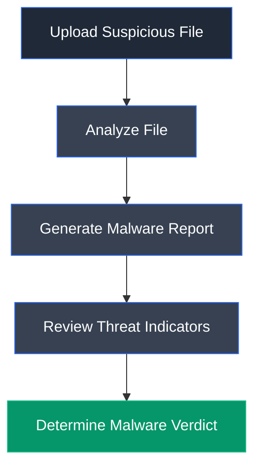

# Hybrid Analysis

## Overview

Hybrid Analysis is a cloud-based malware analysis platform that performs automated static and dynamic analysis of suspicious files and URLs. It combines multiple threat intelligence sources, antivirus engines, and sandbox environments to identify malicious behavior and generate comprehensive malware analysis reports.

## Purpose

Hybrid Analysis is used to determine whether a file or URL is malicious by analyzing its characteristics, behavioral patterns, and threat indicators. Security analysts, ethical hackers, and incident responders use the platform to safely investigate suspicious files without exposing production systems to potential malware infections.

## Key Features

- Online malware scanning
- Static and dynamic malware analysis
- Threat score calculation
- Multi-engine antivirus detection
- File hash generation (MD5, SHA1, SHA256)
- Behavioral analysis reports
- Network activity monitoring
- Sandbox execution environment
- Threat intelligence integration

## Installation

### Web Application

Hybrid Analysis is a cloud-based service and does not require local installation.

### Access

Open a web browser and navigate to:

```text
https://www.hybrid-analysis.com
```

## Basic Usage

Upload a suspicious file or URL to the platform and generate an analysis report.

**Example Workflow**

```text
Upload File → Analyze → Generate Report → Review Threat Indicators
```

## Commonly Used Features

| Feature | Description |
|---------|-------------|
| File Analysis | Upload and analyze suspicious files |
| URL Analysis | Scan potentially malicious websites |
| Threat Score | Displays overall malware risk level |
| Antivirus Results | Shows detections from multiple AV engines |
| Behavioral Analysis | Displays malware execution behavior |
| File Hashes | Generates MD5, SHA1, and SHA256 hashes |
| Sandbox Report | Provides detailed execution analysis |

## Typical Workflow



## CEH Practical Example

In **Module 07 – Malware Threats**, Hybrid Analysis was used to upload a suspicious executable (`tini.exe`) and perform an online malware scan. The generated report identified the file as malicious, provided a threat score, displayed antivirus detection results from multiple security vendors, and presented additional threat intelligence without executing the malware on the local machine.

## Advantages

- No local installation required
- Supports both static and dynamic malware analysis
- Multi-engine antivirus detection
- Generates comprehensive malware reports
- Safe cloud-based sandbox environment
- Easy to use through a web browser

## Limitations

- Requires an internet connection
- File upload size limitations may apply
- Public reports may expose uploaded samples
- Dynamic analysis is limited to supported environments

## Best Practices

- Upload only authorized samples for analysis.
- Verify analysis results using multiple sources.
- Compare file hashes with known threat intelligence.
- Use the generated report alongside local analysis tools.
- Avoid uploading confidential or sensitive files to public analysis services.

## Used In

- Module 07 – Malware Threats

## References

- https://www.hybrid-analysis.com