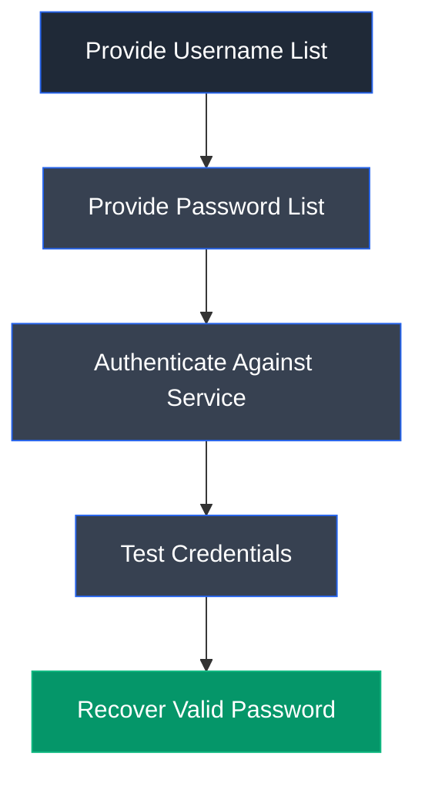

# Hydra

## Overview

Hydra is an open-source network login cracker designed to perform online password attacks against numerous network services. It supports parallel authentication attempts across multiple protocols, enabling security professionals to assess password strength and identify weak credentials during authorized penetration testing.

---

## Purpose

Hydra is used to:

- Perform password auditing.
- Brute-force authentication services.
- Test credential security.
- Validate weak passwords.
- Assess network authentication mechanisms.

---

## Key Features

- Multi-protocol support.
- Parallel authentication.
- Dictionary attacks.
- Username/password lists.
- Fast execution.
- Open-source.

---

## Installation

```bash
sudo apt update
sudo apt install hydra
```

Launch:

```bash
hydra
```

---

## Basic Syntax

```bash
hydra -L users.txt -P passwords.txt <target> <service>
```

---

## Commonly Used Commands

| Command | Description |
|---------|-------------|
| `hydra ssh` | Attack SSH |
| `hydra ftp` | Attack FTP |
| `hydra rdp` | Attack RDP |
| `hydra mssql` | Attack MSSQL |
| `hydra smb` | Attack SMB |

---

## Typical Workflow



---

## CEH Practical Example

In **Module 06 – System Hacking**, Hydra was used to perform a dictionary attack against the Microsoft SQL Server service. The tool successfully recovered the password **batman** for the **SQL_srv** account, enabling authentication and subsequent exploitation of the MSSQL service.

---

## Advantages

- Fast authentication testing.
- Supports numerous protocols.
- Easy to automate.
- Cross-platform.
- Open-source.

---

## Limitations

- Can trigger account lockouts.
- Easily detected by monitoring systems.
- Dependent on network connectivity.
- Requires authorization.

---

## Best Practices

- Respect lockout policies.
- Use appropriate wordlists.
- Limit authentication attempts.
- Document successful findings.
- Test only authorized targets.

---

## Used In

- Module 06 – System Hacking

---

## References

- https://github.com/vanhauser-thc/thc-hydra