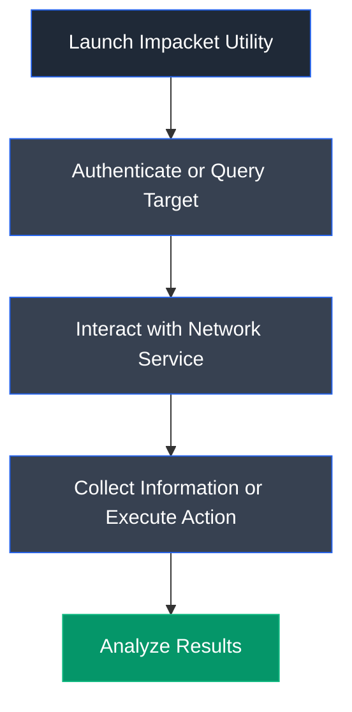

# Impacket

## Overview

Impacket is an open-source collection of Python classes and scripts for working with network protocols. It enables security professionals to interact with Windows networking services, authenticate to Active Directory environments, perform protocol-level attacks, and develop custom network tools. Impacket includes numerous utilities for enumeration, authentication testing, credential attacks, remote command execution, and Active Directory assessments.

---

## Purpose

Impacket is used to:

- Interact with Windows network protocols.
- Perform Active Directory enumeration.
- Execute authentication and credential attacks.
- Access remote services using valid credentials.
- Develop custom protocol-based security tools.
- Support penetration testing and security research.

---

## Key Features

- Collection of Python-based networking tools.
- Supports SMB, Kerberos, LDAP, MSSQL, RPC, and other protocols.
- Active Directory enumeration utilities.
- Credential attack and authentication tools.
- Remote service interaction.
- Cross-platform support.

---

## Installation

### Debian / Ubuntu / Parrot OS

```bash
sudo apt update
sudo apt install python3-impacket
```

Or install using pip:

```bash
pip install impacket
```

---

## Basic Syntax

Execute an Impacket utility:

```bash
python3 <script>.py [options]
```

Example:

```bash
python3 GetNPUsers.py
```

---

## Commonly Used Commands

| Command | Description |
|---------|-------------|
| `python3 GetNPUsers.py` | Perform AS-REP Roasting enumeration |
| `python3 mssqlclient.py` | Connect to Microsoft SQL Server |
| `python3 smbclient.py` | Connect to SMB shares |
| `python3 psexec.py` | Execute commands remotely |
| `python3 secretsdump.py` | Dump password hashes |
| `python3 wmiexec.py` | Execute commands using WMI |

---

## Typical Workflow



---

## CEH Practical Example

In **Module 06 – System Hacking**, Impacket was used during Active Directory attacks to perform **AS-REP Roasting** using **GetNPUsers.py**, identifying user accounts that did not require Kerberos pre-authentication and extracting AS-REP hashes for offline password cracking. It was also used to authenticate to Microsoft SQL Server using **mssqlclient.py**, verify the **xp_cmdshell** configuration, and prepare the target service for subsequent exploitation.

---

## Advantages

- Comprehensive collection of protocol-based security tools.
- Extensive Active Directory support.
- Cross-platform compatibility.
- Widely adopted in penetration testing.
- Open-source and actively maintained.

---

## Limitations

- Requires knowledge of Windows networking protocols.
- Some utilities require valid credentials.
- Aggressive usage may trigger security monitoring.
- Certain attacks depend on target misconfigurations.

---

## Best Practices

- Use only on authorized systems.
- Keep Impacket updated.
- Validate target configuration before execution.
- Protect recovered credentials appropriately.
- Document all assessment activities.

---

## Used In

- Module 06 – System Hacking

---

## References

- https://github.com/fortra/impacket
- https://www.coresecurity.com/core-labs/open-source-tools/impacket