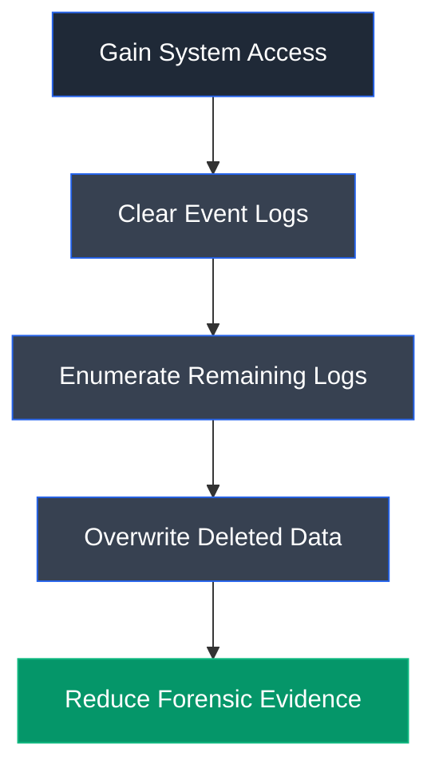
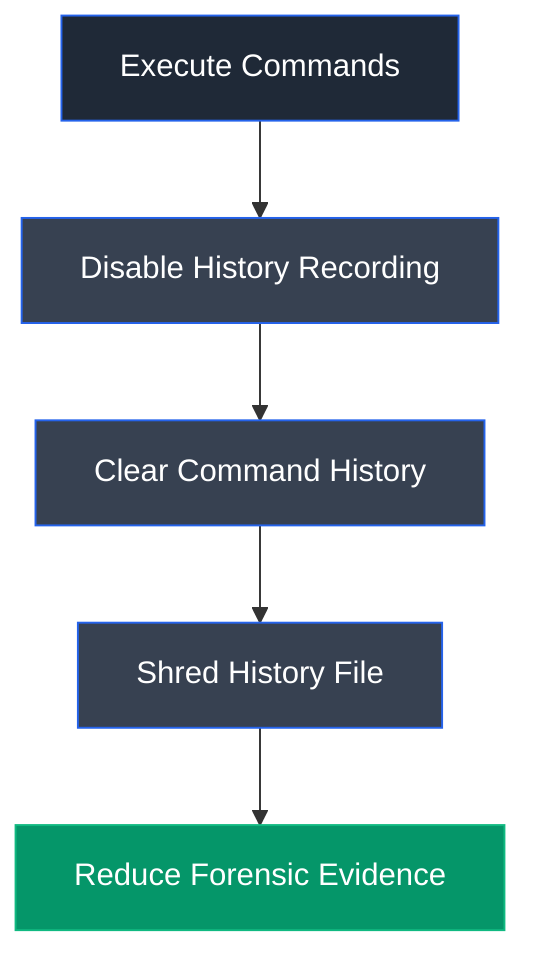

# Metasploit

## Overview

Metasploit is a powerful open-source penetration testing framework developed by Rapid7 that provides a modular platform for vulnerability assessment, exploit development, post-exploitation, and security testing. In addition to exploitation, it includes numerous auxiliary modules for network reconnaissance, port scanning, service enumeration, and information gathering, making it a versatile tool throughout the penetration testing lifecycle.

---

## Purpose

Metasploit is used to:

- Perform network reconnaissance and information gathering.
- Identify active hosts, open ports, and running services.
- Validate and exploit known vulnerabilities.
- Execute post-exploitation activities.
- Develop and test exploits and payloads.
- Support penetration testing and security research.

---

## Key Features

- Modular architecture with exploits, payloads, auxiliary modules, encoders, and post-exploitation modules.
- Integrated database for managing scan results and discovered hosts.
- Auxiliary modules for reconnaissance and network scanning.
- Large collection of publicly available exploits.
- Payload generation and customization.
- Automation through resource scripts.
- Integration with external tools such as Nmap.

---

## Installation

### Debian / Ubuntu / Parrot OS

```bash
sudo apt update
sudo apt install metasploit-framework
```

Launch Metasploit:

```bash
msfconsole
```

---

## Basic Syntax

Start the Metasploit console:

```bash
msfconsole
```

Search for a module:

```bash
search <keyword>
```

Load a module:

```bash
use <module_path>
```

Display module options:

```bash
show options
```

Set module parameters:

```bash
set <parameter> <value>
```

Execute the module:

```bash
run
```

Return to the main console:

```bash
back
```

---

## Commonly Used Commands

| Command | Description |
|---------|-------------|
| `msfconsole` | Launch the Metasploit Framework console |
| `search <keyword>` | Search available modules |
| `use <module>` | Load a module |
| `show options` | Display configurable module options |
| `set <option> <value>` | Configure module parameters |
| `run` | Execute the loaded module |
| `back` | Return to the previous menu |
| `info` | Display detailed information about the selected module |
| `help` | Display available commands |

---

## Typical Workflow


---

## CEH Practical Example

In **Module 03 – Scanning Networks**, Metasploit was used as a reconnaissance platform rather than an exploitation framework. Auxiliary scanning modules were employed to perform SYN port scanning, TCP port scanning, and SMB version discovery against target hosts. These modules helped identify active systems, enumerate open ports, and determine operating system information, complementing the results obtained through Nmap.

In **Module 06 – System Hacking**, Metasploit was extensively used throughout the system hacking lifecycle to establish Meterpreter sessions, generate listeners, bypass User Account Control (UAC), elevate privileges, deploy persistence mechanisms such as Sticky Keys and Run Registry modifications, and maintain remote access to compromised Windows systems.

---

## Advantages

- Comprehensive penetration testing framework.
- Extensive collection of community and commercial modules.
- Supports reconnaissance, exploitation, and post-exploitation.
- Modular and highly extensible architecture.
- Integrates well with other security tools.
- Widely adopted in professional penetration testing.

---

## Limitations

- Requires proper authorization before use on target systems.
- Large framework with a learning curve for beginners.
- Some modules may become outdated as vulnerabilities are patched.
- Aggressive scanning and exploitation activities may trigger IDS/IPS alerts.

---

## Best Practices

- Always obtain proper authorization before scanning or exploiting systems.
- Keep the framework updated to access the latest modules and fixes.
- Validate reconnaissance results before selecting exploits.
- Configure module parameters carefully to avoid unintended network disruption.
- Document findings and preserve scan results for reporting.

---

## Used In

- Module 03 – Scanning Networks
- Module 06 – System Hacking

---

## References

- https://www.metasploit.com/
- https://docs.rapid7.com/metasploit/
- https://github.com/rapid7/metasploit-framework

---

# Lab 4: Clear Logs to Hide the Evidence of Compromise

## Objective

To remove forensic evidence of malicious activities by clearing Windows event logs and Linux command history, demonstrating how attackers attempt to conceal traces of system compromise and hinder forensic investigations.

---

## Background

After successfully gaining access, escalating privileges, and maintaining persistence, attackers often attempt to remove evidence of their activities to delay detection and complicate forensic investigations. Operating systems continuously record security events, application activities, system changes, and executed commands that investigators can analyze to reconstruct the timeline of an attack.

Windows maintains event logs containing security, application, and system events, while Linux records executed shell commands within history files such as `.bash_history`. Attackers frequently exploit built-in operating system utilities to clear or overwrite these records in an effort to eliminate evidence of compromise. Although these utilities serve legitimate administrative purposes, they can also be abused to conceal malicious actions.

This lab demonstrates how native Windows and Linux utilities can be used to clear logs and securely remove command history, emphasizing the importance of centralized logging, secure log storage, endpoint monitoring, and continuous auditing to detect attempts at covering tracks.

---

## Task 1: Clear Windows Machine Logs using Various Utilities

### Tools Used

- [wevtutil](../../Tools/wevtutil.md)
- [Cipher](../../Tools/Cipher.md)

---

### Activity Performed

Windows event logs were cleared using several native administrative utilities to demonstrate techniques commonly used to hide evidence of compromise. Initially, the **Clear_Event_Viewer_Logs.bat** utility was executed to automatically remove security, system, and application logs from the Windows Event Viewer.

Next, the **wevtutil** command-line utility was used to enumerate available event logs and selectively clear specific logs such as the System log. This demonstrated how individual event logs can be removed without affecting the entire logging subsystem.

Finally, the **Cipher** utility was executed to securely overwrite deleted data on the target drive. By overwriting previously deleted files with multiple data patterns, Cipher reduces the possibility of recovering deleted evidence using forensic recovery tools.

This task demonstrated how attackers can abuse legitimate Windows administrative utilities to remove evidence of malicious activities and complicate forensic investigations.

---

### Observations

- Successfully cleared Windows Event Viewer logs.
- Enumerated available event logs using `wevtutil`.
- Cleared specific Windows event logs using `wevtutil`.
- Securely overwrote deleted data using Cipher.
- Demonstrated how native Windows utilities can be abused to conceal evidence.

---

### Windows Event Logs Cleared


**Figure 4.1:** Windows event logs were successfully cleared using native administrative utilities, removing system records that could otherwise assist forensic investigations.

---

### Cipher Secure Overwrite


**Figure 4.2:** The Cipher utility securely overwrote deleted data on the target drive, reducing the likelihood of recovering deleted files during forensic analysis.

---

### Learning Outcome

This task demonstrated how native Windows administrative utilities can be misused to remove event logs and securely overwrite deleted data in an attempt to hide evidence of compromise. It reinforced the importance of centralized log collection, secure log storage, and monitoring administrative utilities for suspicious activity.

---

### Attack Flow



---

## Task 2: Clear Linux Machine Logs using the BASH Shell

### Tools Used

- [BASH](../../Tools/BASH.md)

---

### Activity Performed

Linux shell history was manipulated to demonstrate how attackers can remove evidence of executed commands from compromised systems. Initially, the shell history size was set to zero to prevent future commands from being recorded during the active session. The existing command history was then cleared using built-in history management commands.

To further hinder forensic analysis, the `.bash_history` file was shredded, overwriting its contents before deletion. Finally, the history file was inspected to verify that its contents had become unreadable, demonstrating how attackers can make command history difficult to recover even through forensic examination.

This task illustrated how built-in Linux shell features can be abused to conceal attacker activity and remove valuable evidence from compromised systems.

---

### Observations

- Disabled command history recording for the active shell session.
- Cleared previously stored command history.
- Securely shredded the `.bash_history` file.
- Verified that the history file contents were unreadable.
- Demonstrated methods used to conceal Linux command execution history.

---

### BASH History Cleared


**Figure 4.3:** The active shell history was successfully cleared and history recording was disabled, preventing subsequent commands from being stored within the current session.

---

### BASH History Shredded


**Figure 4.4:** The `.bash_history` file was securely shredded, rendering its contents unreadable and significantly reducing the possibility of recovering previously executed commands.

---

### Learning Outcome

This task demonstrated how Linux shell history can be cleared and securely overwritten to conceal attacker activity. It reinforced the importance of centralized logging, shell history auditing, file integrity monitoring, and secure log management to detect attempts at removing forensic evidence.

---

### Attack Flow



---

## Overall Learning Outcome

This lab demonstrated techniques used to remove evidence of compromise from both Windows and Linux systems by clearing event logs, securely overwriting deleted data, and removing shell command history. It provided practical experience with native operating system utilities commonly abused to cover tracks while reinforcing the importance of centralized logging, secure log retention, endpoint monitoring, and continuous auditing to detect attempts at destroying forensic evidence.