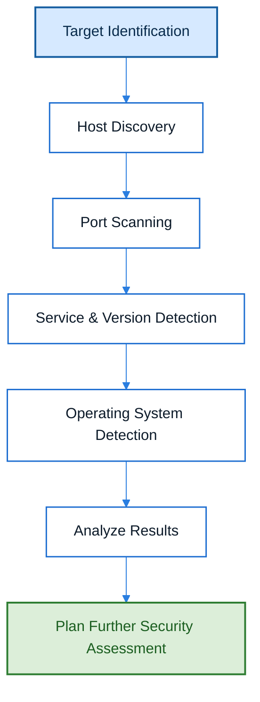

# Nmap

## Overview

Nmap (Network Mapper) is an open-source network scanning and security auditing tool used to discover hosts, identify open ports, detect running services, determine operating systems, and gather information about networked devices. It is one of the most widely used tools in cybersecurity for reconnaissance, vulnerability assessment, and network administration.

---

## Purpose

The primary purpose of Nmap is to identify and analyze systems connected to a network. During penetration testing, it helps security professionals understand the target's attack surface by discovering accessible services, identifying exposed ports, and collecting information that supports further security assessment.

---

## Key Features

- Host discovery
- TCP and UDP port scanning
- Service and version detection
- Operating system detection
- NSE (Nmap Scripting Engine) support
- Firewall analysis
- Network inventory
- Script-based vulnerability detection

---

## Installation

### Linux

```bash
sudo apt install nmap
```

### Windows

Download and install from the official website.

### Verify Installation

```bash
nmap --version
```

---

## Basic Syntax

```bash
nmap [Scan Type] [Options] <Target>
```

Example:

```bash
nmap 192.168.1.10
```

---

## Commonly Used Options


| Option | Description |
|--------|-------------|
| `-sS` | Performs a TCP SYN scan, which is fast and stealthy. |
| `-sT` | Uses a full TCP connection scan, useful when SYN scans are blocked. |
| `-sU` | Scans UDP ports in addition to TCP. |
| `-A` | Enables aggressive scanning with OS detection, version detection, script scanning, and traceroute. |
| `-O` | Attempts to identify the target operating system. |
| `-sV` | Detects service versions running on open ports. |
| `-Pn` | Skips host discovery and treats the target as online. |
| `-p` | Specifies which ports to scan. |
| `-F` | Performs a fast scan by checking only the most common ports. |
| `-T0` to `-T5` | Sets the timing template from very slow to very aggressive. |
| `-oN` | Saves scan results in normal text format. |
| `-oX` | Saves scan results in XML format for further processing. |

---

## Typical Workflow



---

## CEH Practical Example

During **Module 14 – Web Application Hacking**, Nmap was used during the reconnaissance phase to identify open ports, detect running services, gather service version information, and understand the target web server before beginning vulnerability assessment and exploitation.

Example:

```bash
nmap -A <Target-IP>
```

The aggressive scan provided information such as:

- Open ports
- Running services
- Service versions
- Operating system information
- Additional service details useful during reconnaissance

---

## Advantages

- Fast and reliable network scanner.
- Supports multiple scanning techniques.
- Highly customizable through numerous scan options.
- Cross-platform support (Windows, Linux, and macOS).
- Extensive community support and documentation.
- Supports automation through NSE scripts.

---

## Limitations

- Aggressive scans may be detected by firewalls or Intrusion Detection Systems (IDS).
- Certain scan types require administrative privileges.
- Results depend on network conditions and target configurations.
- Automated scan results should always be manually interpreted and validated.

---

## Best Practices

- Obtain proper authorization before scanning any network or system.
- Begin with less intrusive scans before performing aggressive scans.
- Save scan results for documentation and future comparison.
- Combine Nmap findings with manual analysis and additional security tools.
- Keep Nmap updated to benefit from the latest features and NSE scripts.

---

## Used In

- Module 14 – Web Application Hacking

---

## References

- Official Website: https://nmap.org
- Official Documentation: https://nmap.org/docs.html