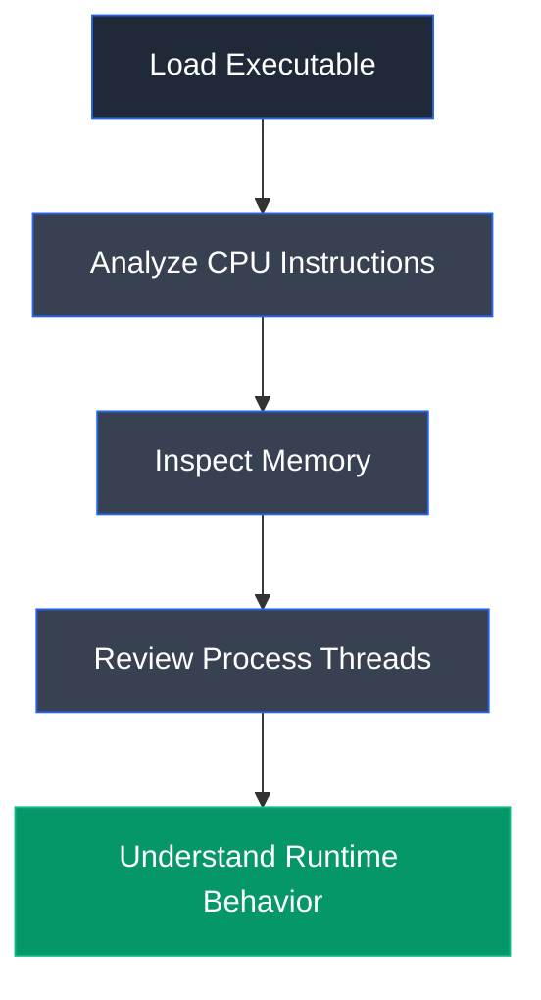

# OllyDbg

## Overview

OllyDbg is a 32-bit assembly-level debugger designed for dynamic binary analysis and reverse engineering. It allows security analysts to inspect executable files during runtime by monitoring CPU instructions, memory mappings, loaded modules, threads, and application behavior without requiring source code.

## Purpose

OllyDbg is used to analyze executable files while they are running, enabling analysts to inspect program execution, identify suspicious instructions, monitor memory usage, and investigate malware behavior through interactive debugging.

## Key Features

- Assembly-level debugging
- CPU instruction analysis
- Memory map inspection
- Thread monitoring
- Executable module analysis
- Register inspection
- Breakpoint support
- Stack analysis
- Real-time debugging

## Installation

### Windows

OllyDbg is distributed as a standalone executable and does not require installation.

### Verify Installation

Launch `OllyDbg.exe` and ensure the main debugger window opens successfully.

## Basic Usage

Load an executable into OllyDbg to inspect its runtime behavior.

**Example Workflow**

```text
Load Executable → Inspect CPU → Analyze Memory → Review Threads
```

## Commonly Used Features

| Feature | Description |
|---------|-------------|
| CPU Window | Displays assembly instructions during execution |
| Memory Map | Shows mapped memory regions |
| Executable Modules | Lists loaded executable modules |
| Threads | Displays active process threads |
| Log Window | Records debugging information |
| Registers | Displays CPU register values |

## Typical Workflow



## CEH Practical Example

In **Module 07 – Malware Threats**, OllyDbg was used to load a suspicious executable (`tini.exe`) and inspect its CPU instructions, memory mappings, executable modules, and thread activity. This enabled runtime analysis of the executable without executing it in a normal operating environment.

## Advantages

- Lightweight debugger
- Excellent runtime analysis capabilities
- Detailed CPU instruction view
- Effective memory inspection
- Widely used for malware analysis

## Limitations

- Primarily supports 32-bit executables
- Requires assembly language knowledge
- Less suitable for modern 64-bit applications
- Advanced malware may detect debugging environments

## Best Practices

- Perform debugging inside isolated virtual machines.
- Combine static and dynamic analysis results.
- Monitor memory and thread activity together.
- Use breakpoints to inspect suspicious execution paths.

## Used In

- Module 07 – Malware Threats

## References

- http://www.ollydbg.de