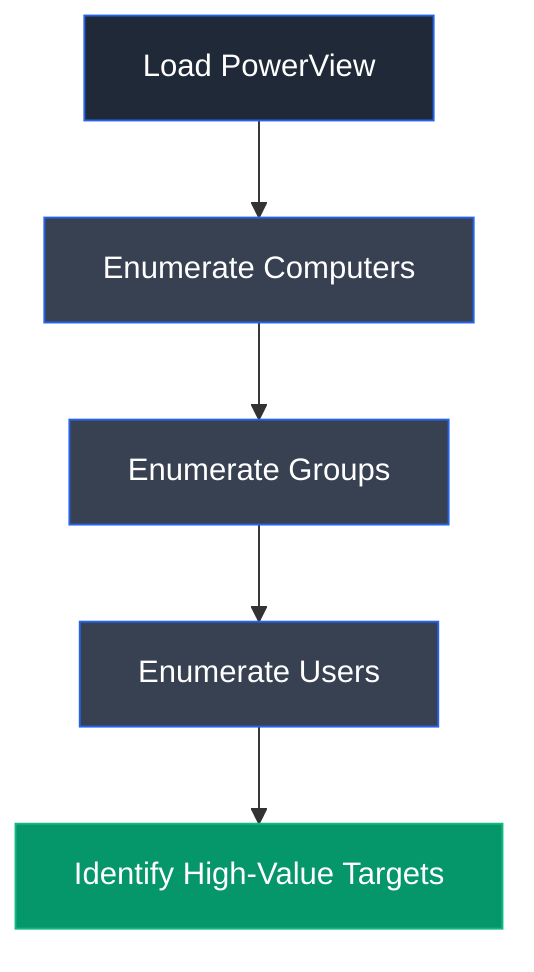

# PowerView

## Overview

PowerView is an open-source PowerShell framework designed for Active Directory reconnaissance and post-exploitation. It enables security professionals to enumerate domain users, groups, computers, organizational units, trusts, sessions, and permissions directly from a Windows system. PowerView is widely used during penetration testing and red team engagements to identify privilege escalation opportunities and high-value Active Directory assets.

---

## Purpose

PowerView is used to:

- Enumerate Active Directory objects.
- Discover users, groups, and computers.
- Identify domain trusts and organizational units.
- Perform post-enumeration after gaining access.
- Discover privilege escalation opportunities.
- Assist Active Directory security assessments.

---

## Key Features

- Active Directory enumeration.
- User and group discovery.
- Computer enumeration.
- Trust relationship enumeration.
- PowerShell-based execution.
- Lightweight and memory-resident.

---

## Installation

PowerView is distributed as a PowerShell script.

Load the script:

```powershell
. .\PowerView.ps1
```

---

## Basic Syntax

```powershell
Get-NetUser
```

---

## Commonly Used Commands

| Command | Description |
|---------|-------------|
| `Get-NetUser` | Enumerate domain users |
| `Get-NetGroup` | Enumerate domain groups |
| `Get-NetComputer` | Enumerate domain computers |
| `Get-NetOU` | List organizational units |
| `Get-NetDomainTrust` | Enumerate trusts |
| `Invoke-ShareFinder` | Find shared folders |

---

## Typical Workflow



---

## CEH Practical Example

In **Module 06 – System Hacking**, PowerView was loaded into PowerShell after establishing an authenticated Remote Desktop session. It was used to enumerate Active Directory computers, groups, and users, leading to the discovery of the **SQL_srv** service account, which became the target for the subsequent MSSQL attack.

---

## Advantages

- Extensive Active Directory enumeration.
- Runs directly in PowerShell.
- Lightweight and efficient.
- Useful for post-exploitation.
- Widely adopted in penetration testing.

---

## Limitations

- Requires authenticated access.
- PowerShell execution may be restricted.
- Detected by modern security solutions.
- Dependent on Active Directory connectivity.

---

## Best Practices

- Execute only in authorized environments.
- Limit unnecessary enumeration.
- Document discovered assets.
- Protect collected domain information.
- Monitor PowerShell activity.

---

## Used In

- Module 06 – System Hacking

---

## References

- https://github.com/PowerShellMafia/PowerSploit