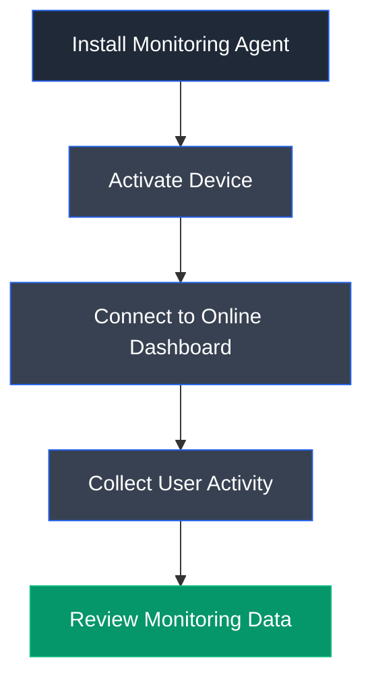

# Refog Personal Monitor

## Overview

Refog Personal Monitor is a commercial monitoring and surveillance application designed to record user activities on Windows systems. It provides centralized monitoring through an online dashboard, allowing administrators to review keystrokes, visited websites, running applications, screenshots, and other user activities. Although intended for legitimate parental control and employee monitoring, it can also demonstrate how spyware and surveillance software operate during authorized security assessments.

---

## Purpose

Refog Personal Monitor is used to:

- Monitor user activities remotely.
- Record visited websites and browsing history.
- Track running applications.
- Capture screenshots of user activity.
- Collect system activity logs.
- Demonstrate spyware and surveillance capabilities during security testing.

---

## Key Features

- Cloud-based monitoring dashboard.
- Website activity tracking.
- Application usage monitoring.
- Computer activity logging.
- Screenshot capture.
- Keystroke recording.
- Remote device management.

---

## Installation

Download the installer from the official website and complete the installation wizard.

Activate the software using a registered Refog account before deploying the monitoring agent.

---

## Basic Workflow

1. Create a Refog account.
2. Install the monitoring agent on the target system.
3. Activate the device.
4. Link it to the online dashboard.
5. Monitor collected activity remotely.

---

## Commonly Monitored Activities

| Activity | Description |
|----------|-------------|
| Websites | Records visited websites |
| App Monitoring | Displays running applications |
| Computer Activity | Records user activity timeline |
| Screenshots | Captures desktop screenshots |
| Keystrokes | Logs keyboard input |

---

## Typical Workflow

---

## CEH Practical Example

In **Module 06 – System Hacking**, Refog Personal Monitor was installed on the target Windows system to demonstrate user monitoring and surveillance. After deployment, the software transmitted user activities—including visited websites and application usage—to an online dashboard, illustrating how attackers can maintain visibility into compromised systems through spyware-like monitoring tools.

---

## Advantages

- Centralized monitoring dashboard.
- Simple deployment and configuration.
- Records multiple types of user activity.
- Useful for demonstrating surveillance techniques.
- Supports remote monitoring.

---

## Limitations

- Commercial software requiring account registration.
- Can be detected by endpoint security products.
- Requires network connectivity for dashboard synchronization.
- Intended only for authorized monitoring.

---

## Best Practices

- Use only with proper authorization.
- Inform users when monitoring is legally required.
- Protect collected monitoring data.
- Regularly audit deployed monitoring agents.
- Remove monitoring software after completing assessments.

---

## Used In

- Module 06 – System Hacking

---

## References

- https://www.refog.com/