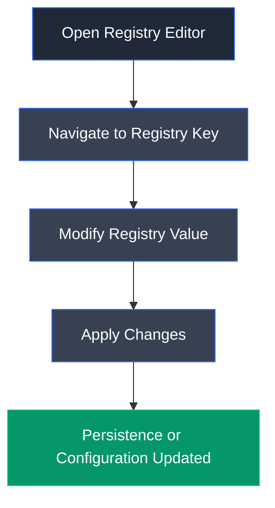

# Registry Editor

## Overview

Registry Editor (Regedit) is the built-in Windows utility used to view, modify, create, and delete entries within the Windows Registry. The registry stores configuration settings for the operating system, installed applications, hardware devices, and user profiles. During penetration testing and malware analysis, Registry Editor is commonly used to examine persistence mechanisms, startup locations, and system configuration settings.

---

## Purpose

Registry Editor is used to:

- View and modify Windows Registry entries.
- Configure operating system settings.
- Manage startup applications.
- Analyze persistence mechanisms.
- Troubleshoot Windows configuration issues.
- Inspect registry-based malware modifications.

---

## Key Features

- Graphical registry management.
- Create, edit, and delete registry keys.
- Export and import registry files.
- Search registry values.
- Manage startup registry locations.
- Supports local and remote registry editing.

---

## Launch

Open the Run dialog:

```text
Win + R
```

Run:

```text
regedit
```

Or use the command line:

```cmd
regedit
```

---

## Common Registry Locations

| Registry Key | Purpose |
|--------------|---------|
| `HKLM\Software\Microsoft\Windows\CurrentVersion\Run` | Starts applications for all users during logon |
| `HKCU\Software\Microsoft\Windows\CurrentVersion\Run` | Starts applications for the current user |
| `HKLM\SYSTEM` | System configuration |
| `HKCU\Software` | User-specific application settings |

---

## Common Commands

| Command | Description |
|---------|-------------|
| `regedit` | Launch Registry Editor |
| `reg add` | Create a registry key or value |
| `reg delete` | Delete a registry key or value |
| `reg query` | Query registry values |
| `reg export` | Export registry data |
| `reg import` | Import registry data |

---

## Typical Workflow



---

## CEH Practical Example

In **Module 06 – System Hacking**, the Windows Run registry key was modified to automatically execute a malicious payload whenever the system started. This demonstrated how attackers can establish persistence by abusing legitimate Windows startup locations.

---

## Advantages

- Built into all Windows operating systems.
- Provides centralized configuration management.
- Enables detailed system customization.
- Useful for troubleshooting and administration.
- Frequently used during forensic and malware analysis.

---

## Limitations

- Incorrect modifications can destabilize the operating system.
- Requires administrative privileges for many changes.
- Registry-based persistence may be detected by security software.
- Changes often require restarting applications or the system.

---

## Best Practices

- Back up the registry before making changes.
- Modify registry values only with proper authorization.
- Monitor startup registry keys for unauthorized entries.
- Restrict administrative access to registry editing.
- Audit registry changes as part of security monitoring.

---

## Used In

- Module 06 – System Hacking

---

## References

- https://learn.microsoft.com/en-us/windows-server/administration/windows-commands/reg
- https://learn.microsoft.com/en-us/windows/win32/sysinfo/registry