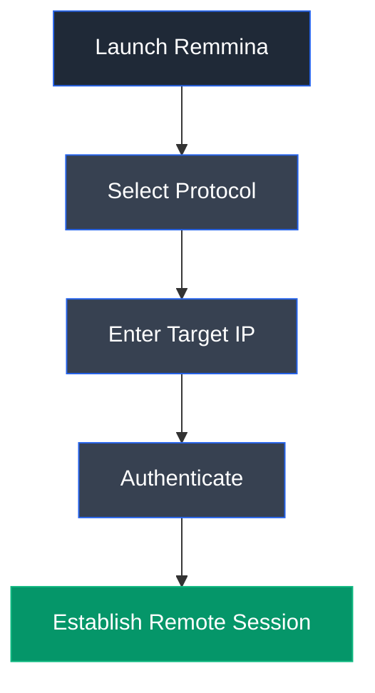

# Remmina

## Overview

Remmina is an open-source remote desktop client for Linux that supports multiple remote access protocols, including Remote Desktop Protocol (RDP), Virtual Network Computing (VNC), Secure Shell (SSH), and SPICE. It provides a graphical interface for securely connecting to remote systems during system administration, penetration testing, and remote support.

---

## Purpose

Remmina is used to:

- Establish Remote Desktop (RDP) connections.
- Access remote Windows and Linux systems.
- Manage multiple remote sessions.
- Support secure remote administration.
- Facilitate penetration testing activities.

---

## Key Features

- Supports RDP, VNC, SSH, SPICE, and NX.
- Multiple session management.
- Secure credential storage.
- Full-screen remote desktop support.
- Cross-platform compatibility.

---

## Installation

### Debian / Ubuntu / Parrot OS

```bash
sudo apt update
sudo apt install remmina
```

Launch:

```bash
remmina
```

---

## Basic Workflow

1. Launch Remmina.
2. Select the desired protocol.
3. Enter the target IP address.
4. Provide valid credentials.
5. Establish the remote connection.

---

## Supported Protocols

| Protocol | Purpose |
|----------|---------|
| RDP | Remote Desktop Protocol |
| VNC | Virtual Network Computing |
| SSH | Secure Shell |
| SPICE | Virtual machine remote access |
| NX | Remote desktop protocol |

---

## Typical Workflow



---

## CEH Practical Example

In **Module 06 – System Hacking**, Remmina was used to establish an authenticated Remote Desktop Protocol (RDP) session using credentials obtained through a password spraying attack. The successful connection provided interactive access to the Windows 11 (AD) workstation, enabling subsequent Active Directory post-enumeration activities.

---

## Advantages

- Simple graphical interface.
- Supports multiple remote protocols.
- Secure authentication.
- Efficient remote administration.
- Open-source and actively maintained.

---

## Limitations

- Requires valid credentials.
- Dependent on network connectivity.
- Remote access may be restricted by firewall policies.
- Unauthorized use may violate security policies.

---

## Best Practices

- Use encrypted remote protocols.
- Protect stored credentials.
- Enable multi-factor authentication where possible.
- Restrict remote access to authorized users.
- Monitor remote login activity.

---

## Used In

- Module 06 – System Hacking

---

## References

- https://remmina.org/
- https://gitlab.com/Remmina/Remmina