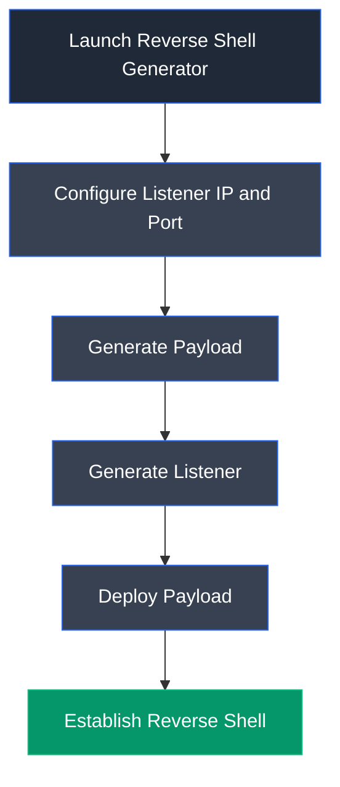

# Reverse Shell Generator

## Overview

Reverse Shell Generator is an open-source web-based utility that automates the creation of reverse shell payloads and listener commands for multiple operating systems and programming languages. It simplifies payload generation by providing preconfigured commands for tools such as MSFVenom, Netcat, PowerShell, Bash, Python, PHP, and other commonly used reverse shell techniques.

---

## Purpose

Reverse Shell Generator is used to:

- Generate reverse shell payloads for multiple platforms.
- Automate listener command generation.
- Simplify payload creation for penetration testing.
- Reduce manual configuration errors during exploit development.
- Support rapid deployment of remote access payloads.

---

## Key Features

- Web-based graphical interface.
- Supports multiple reverse shell types.
- Generates MSFVenom payloads automatically.
- Generates listener commands for various tools.
- Supports PowerShell, Bash, Python, PHP, Netcat, and Meterpreter payloads.
- Customizable listener IP address and port.
- Simplifies reverse shell generation for penetration testing.

---

## Installation

### Docker

Run the application using Docker:

```bash
docker run -d -p 80:80 reverse_shell_generator
```

Access the interface:

```
http://localhost
```

---

## Basic Syntax

Launch Reverse Shell Generator:

```bash
docker run -d -p 80:80 reverse_shell_generator
```

Open the web interface:

```
http://localhost
```

---

## Commonly Used Features

| Feature | Description |
|---------|-------------|
| Listener IP | Configure the callback IP address |
| Listener Port | Configure the callback port |
| MSFVenom | Generate Meterpreter payload commands |
| HoaxShell | Generate PowerShell reverse shell payloads |
| Listener | Generate listener commands automatically |
| Copy | Copy generated payloads and listener commands |

---

## Typical Workflow



---

## CEH Practical Example

In **Module 06 – System Hacking**, Reverse Shell Generator was used to automate the generation of Windows Meterpreter and HoaxShell PowerShell payloads. The generated payloads and listener commands were configured with the attacker's IP address and listening port before being executed on the target Windows system, successfully establishing remote command execution through reverse shell connections.

---

## Advantages

- Eliminates manual payload construction.
- Supports numerous reverse shell techniques.
- Easy-to-use graphical interface.
- Generates listener commands automatically.
- Reduces configuration mistakes.
- Useful for penetration testing demonstrations.

---

## Limitations

- Requires network connectivity between attacker and target.
- Payload execution may be blocked by endpoint security solutions.
- Reverse shells can be detected by network monitoring tools.
- Intended only for authorized security testing.

---

## Best Practices

- Use only during authorized penetration tests.
- Verify listener configuration before payload execution.
- Test payloads in isolated environments.
- Protect generated payloads from unauthorized access.
- Document all generated payloads and listener configurations.

---

## Used In

- Module 06 – System Hacking

---

## References

- https://www.revshells.com/
- https://github.com/0dayCTF/reverse-shell-generator