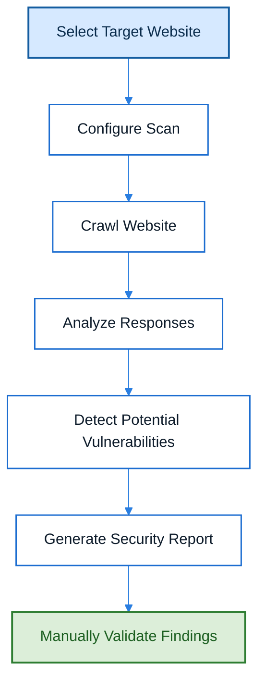

# SmartScanner

## Overview

SmartScanner is a web application vulnerability scanning tool used to automatically identify potential security weaknesses in web applications. It analyzes web pages, application components, and server responses to detect common vulnerabilities and generate security reports for further investigation.

---

## Purpose

The primary purpose of SmartScanner is to automate the initial vulnerability assessment process by identifying common web application security issues. It helps penetration testers quickly understand the security posture of a target application before performing manual validation and exploitation.

---

## Key Features

- Automated web application scanning
- Vulnerability detection
- Website crawling
- Security report generation
- Detection of common web vulnerabilities
- User-friendly scanning interface

---

## Installation

SmartScanner is typically provided as part of a penetration testing environment or security assessment platform. Follow the vendor's installation instructions if installing separately.

---

## Basic Usage

1. Launch SmartScanner.
2. Enter the target web application's URL.
3. Configure scan settings if required.
4. Start the vulnerability scan.
5. Review the generated security report.
6. Validate identified findings manually.

---

## Scan Capabilities
| Capability | Description |
|------------|-------------|
| **Website Crawling** | Automatically discovers pages, links, and parameters to build a site map for scanning. |
| **Vulnerability Detection** | Uses signatures and heuristics to identify common web application vulnerabilities. |
| **Security Report Generation** | Produces structured reports (HTML, PDF, or XML) summarizing findings, severity, and remediation guidance. |
| **Technology Identification** | Detects underlying technologies, frameworks, and server software to aid targeted testing. |
| **Automated Assessment** | Orchestrates scanning workflows with configurable templates to run routine assessments efficiently. |

---

## Typical Workflow

---

## CEH Practical Example

During **Module 14 – Web Application Hacking**, SmartScanner was used to perform an automated vulnerability assessment against the target web application. The tool analyzed the application's attack surface, identified potential security weaknesses, and generated a report that served as the basis for further investigation.

---

## Advantages

- Quick and automated vulnerability assessment.
- Easy to use.
- Generates structured security reports.
- Helps prioritize manual penetration testing efforts.
- Suitable for initial security assessments.

---

## Limitations

- Cannot detect every vulnerability.
- May produce false positives or false negatives.
- Requires manual verification of reported findings.
- Cannot replace a comprehensive penetration test.

---

## Best Practices

- Always validate automated findings manually.
- Scan only authorized targets.
- Keep vulnerability signatures updated.
- Use SmartScanner together with manual testing techniques.
- Review generated reports carefully before drawing conclusions.

---

## Used In

- Module 14 – Web Application Hacking

---

## Related Tools

- OWASP ZAP
- Wapiti
- Burp Suite
- Nessus

---

## References

- No official public documentation is available. This tool is provided as part of the EC-Council CEH Practical Labs.