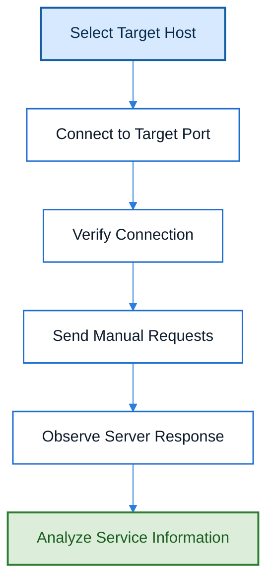

# Telnet

## Overview

Telnet is a network protocol and command-line utility that allows users to establish a remote connection with another system over TCP. Although it was originally designed for remote terminal access, Telnet is commonly used in penetration testing to manually interact with network services, verify connectivity, and inspect application responses.

---

## Purpose

The primary purpose of Telnet in cybersecurity is to establish a direct TCP connection with a target service. During penetration testing, it helps security professionals manually communicate with services such as HTTP, SMTP, FTP, and others to understand how they respond to client requests.

---

## Key Features

- Remote TCP connection establishment
- Manual communication with network services
- Banner grabbing
- Service verification
- Connectivity testing
- Protocol troubleshooting

---

## Installation

### Linux

```bash
sudo apt install telnet
```

### Windows

Enable the **Telnet Client** feature through Windows Features or install it using PowerShell.

### Verify Installation

```bash
telnet
```

---

## Basic Syntax

```bash
telnet <Target-IP/Hostname> <Port>
```

Example:

```bash
telnet www.example.com 80
```

---

## Commonly Used Commands

| Command | Purpose |
|---------|---------|
| `telnet <host> <port>` | Establishes a TCP connection to the specified host and port (e.g., `telnet example.com 80`). |
| `quit` | Exits the Telnet client entirely. |
| `close` | Closes the current Telnet connection but keeps the Telnet client open. |
| `Ctrl + ]` | Enters the Telnet command prompt (escape sequence). From the prompt you can type `close`, `quit`, or `help`. |

---

## Typical Workflow



---

## CEH Practical Example

During **Module 14 – Web Application Hacking**, Telnet was used to establish a manual connection to the target web server over **port 80 (HTTP)**. An HTTP request was manually sent to retrieve the server's response headers, allowing the identification of server information and web technologies through banner grabbing.

Example:

```bash
telnet www.moviescope.com 80
```

After establishing the connection:

```http
GET / HTTP/1.0
```

The server responded with HTTP headers containing information about the web server software and other implementation details.

---

## Advantages

- Simple and lightweight.
- Useful for testing TCP connectivity.
- Enables manual interaction with network services.
- Helpful for banner grabbing and protocol analysis.
- Available on most operating systems.

---

## Limitations

- Transmits data in plaintext without encryption.
- Not suitable for secure remote administration.
- Limited to TCP-based communication.
- Many production systems disable Telnet due to security concerns.

---

## Best Practices

- Use Telnet only in authorized environments.
- Avoid using Telnet for transmitting sensitive information.
- Prefer secure alternatives such as SSH for remote administration.
- Use Telnet primarily for connectivity testing, troubleshooting, and protocol analysis.
- Validate information gathered through Telnet using additional security tools when necessary.

---

## Used In

- Module 14 – Web Application Hacking

---

## Related Tools

- Nmap
- Netcat
- cURL
- Wireshark

---

## References

- Official Documentation: https://learn.microsoft.com/windows-server/administration/windows-commands/telnet