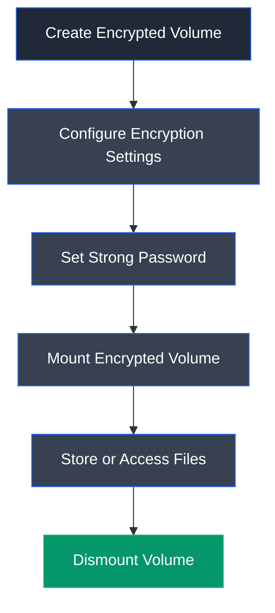

# VeraCrypt

## Overview

VeraCrypt is an open-source disk encryption software used to create and manage encrypted virtual disks, encrypt storage devices, and secure entire operating systems. It provides on-the-fly encryption, meaning data is automatically encrypted before being written to disk and decrypted only when accessed by an authorized user. VeraCrypt is widely used to protect sensitive information from unauthorized access in personal, enterprise, and cybersecurity environments.

---

## Purpose

VeraCrypt is designed to protect confidential data by encrypting storage devices and virtual volumes using strong encryption algorithms. It ensures that sensitive files remain inaccessible without the correct password or authentication key, even if the storage device is lost or stolen.

---

## Key Features

- Creates encrypted virtual disk containers.
- Supports full disk and system partition encryption.
- Provides on-the-fly encryption and decryption.
- Supports hidden volumes for plausible deniability.
- Uses strong encryption algorithms such as AES, Serpent, and Twofish.
- Supports password and keyfile authentication.
- Compatible with Windows, Linux, and macOS.
- Encrypts file names, folders, metadata, and free disk space.

---

## Installation

1. Download VeraCrypt from the official website.
2. Run the installer with administrative privileges.
3. Follow the installation wizard.
4. Launch VeraCrypt after installation.
5. Create or mount encrypted volumes as required.

---

## Typical Workflow

---

## CEH Practical Example

During **Module 20 – Cryptography**, VeraCrypt was used to create an encrypted virtual disk container protected with a strong password. The encrypted volume was mounted as a virtual drive, allowing confidential files to be securely stored within it. After copying the files into the encrypted volume, the drive was dismounted, causing the virtual drive to disappear from the system until it was mounted again with the correct password, thereby preventing unauthorized access.

---

## Advantages

- Free and open-source.
- Strong industry-standard encryption algorithms.
- Supports full disk, partition, and virtual disk encryption.
- Provides hidden volumes for additional privacy.
- Cross-platform compatibility.
- Automatic on-the-fly encryption and decryption.
- Protects all data stored within the encrypted volume.

---

## Limitations

- Forgotten passwords cannot be recovered.
- Initial encryption of large volumes may take considerable time.
- Requires manual mounting and dismounting of encrypted volumes.
- Performance may be slightly reduced during intensive disk operations.

---

## Best Practices

- Use strong and unique passwords for encrypted volumes.
- Store recovery information securely.
- Regularly back up important encrypted data.
- Dismount encrypted volumes when they are no longer needed.
- Keep VeraCrypt updated to the latest stable version.
- Avoid sharing encryption passwords through insecure channels.

---

## Used In

- Module 20 – Cryptography

---

## References

- https://veracrypt.fr/
- https://veracrypt.fr/en/Home.html
- https://github.com/veracrypt/VeraCrypt

---