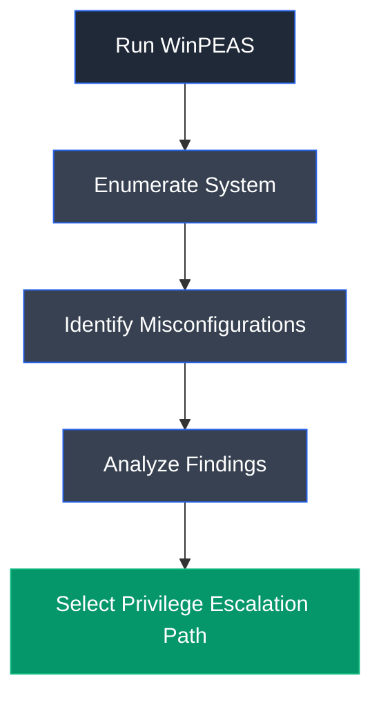

# WinPEAS

## Overview

WinPEAS (Windows Privilege Escalation Awesome Script) is a Windows enumeration tool designed to identify privilege escalation opportunities by detecting insecure configurations, vulnerable services, weak permissions, scheduled tasks, registry issues, and other common Windows misconfigurations.

---

## Purpose

WinPEAS is used to:

- Enumerate Windows security settings.
- Discover privilege escalation opportunities.
- Identify service misconfigurations.
- Audit permissions.
- Support post-exploitation assessments.

---

## Key Features

- Service enumeration.
- Registry inspection.
- Scheduled task analysis.
- Permission auditing.
- Privilege escalation checks.
- Lightweight executable.

---

## Installation

Download the executable from PEASS-ng and execute it on the target Windows system.

Example:

```cmd
winPEASx64.exe
```

---

## Basic Syntax

```cmd
winPEASx64.exe
```

---

## Commonly Identified Issues

| Check | Purpose |
|--------|---------|
| Services | Service misconfigurations |
| Registry | Registry weaknesses |
| Scheduled Tasks | Privilege escalation |
| Permissions | Weak ACLs |
| Credentials | Stored passwords |

---

## Typical Workflow



---

## CEH Practical Example

In **Module 06 – System Hacking**, WinPEAS was executed after compromising the Microsoft SQL Server service. The tool identified an **Unquoted Service Path** vulnerability within the **CEH Services** application, which was subsequently exploited to obtain elevated privileges.

---

## Advantages

- Comprehensive Windows enumeration.
- Fast execution.
- Excellent privilege escalation coverage.
- Easy to interpret.
- Frequently updated.

---

## Limitations

- May trigger antivirus detection.
- Produces extensive output.
- Requires local execution.
- Enumeration only; does not exploit vulnerabilities.

---

## Best Practices

- Execute after obtaining authenticated access.
- Carefully review findings.
- Validate vulnerabilities manually.
- Remove the executable after testing.
- Document identified weaknesses.

---

## Used In

- Module 06 – System Hacking

---

## References

- https://github.com/peass-ng/PEASS-ng