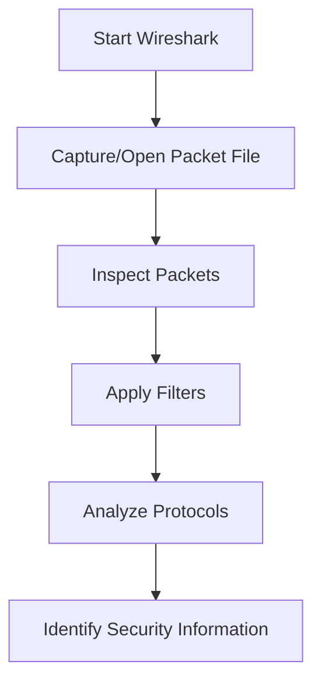

# Wireshark

## Overview

Wireshark is a widely used open-source network protocol analyzer that captures and analyzes network traffic in real time or from previously saved packet capture files. It supports numerous network protocols, including Ethernet and IEEE 802.11 wireless LAN traffic, making it an essential tool for network troubleshooting, protocol analysis, and security assessments.

---

## Purpose

The primary purpose of Wireshark is to capture, inspect, and analyze network packets to understand communication between devices, identify network issues, investigate security incidents, and support penetration testing activities.

---

## Key Features

- Live Packet Capture
- Offline Packet Analysis
- IEEE 802.11 Wireless Packet Analysis
- Protocol Decoding
- Packet Filtering
- Deep Packet Inspection
- Export Packet Captures
- Cross-Platform Support

---

## Installation

### Linux

```bash
sudo apt install wireshark
```

### Verify Installation

```bash
wireshark --version
```

---

## Basic Usage

Launch Wireshark:

```bash
wireshark
```

Open an existing packet capture:

**File → Open → capture.pcap**

---

## Commonly Used Options

| Filter/Feature | Description | Purpose |
|---|---|---|
| `wlan` | Wireless filter | Displays only IEEE 802.11 wireless frames and management packets |
| `http` | HTTP protocol filter | Shows only HTTP traffic and web requests |
| `tcp` | TCP protocol filter | Displays TCP traffic and connection-oriented communication |
| `udp` | UDP protocol filter | Shows UDP traffic and connectionless communication |
| `dns` | DNS protocol filter | Displays DNS queries, responses, and domain name resolution |
| Display Filter | Post-capture filter | Filters packets after capture for detailed analysis and inspection |
| Capture Filter | Real-time filter | Filters packets during live capture to reduce noise and file size |
| Packet Details | Detailed view | Shows layer-by-layer packet structure with protocol information |
| Packet Bytes | Hex view | Displays raw packet data in hexadecimal and ASCII formats |

---

## Typical Workflow



---

## CEH Practical Example

During **Module 16 – Hacking Wireless Networks**, Wireshark was used to analyze a provided IEEE 802.11 wireless packet capture (`WPA2crack-01.cap`). The analysis demonstrated how wireless packets can be inspected to identify wireless communication protocols and understand wireless network activity before performing security assessments.

---

## Advantages

- Free and open-source.
- Supports thousands of network protocols.
- Powerful filtering capabilities.
- Excellent protocol visualization.
- Supports live and offline packet analysis.
- Widely used by network and security professionals.

---

## Limitations

- Requires packet capture privileges.
- Large captures can be difficult to analyze.
- Does not actively exploit vulnerabilities.
- Wireless capture requires compatible hardware for live analysis.

---

## Best Practices

- Capture only authorized network traffic.
- Apply display filters to simplify analysis.
- Secure sensitive packet capture files.
- Combine packet analysis with other security tools.
- Analyze traffic methodically before drawing conclusions.

---

## Used In

- Module 03 – Scanning Networks
- Module 08 – Sniffing
- Module 16 – Hacking Wireless Networks

---

## Related Tools

- Aircrack-ng
- Nmap
- OWASP ZAP

---

## References

- Official: https://www.wireshark.org/
- Documentation: https://www.wireshark.org/docs/