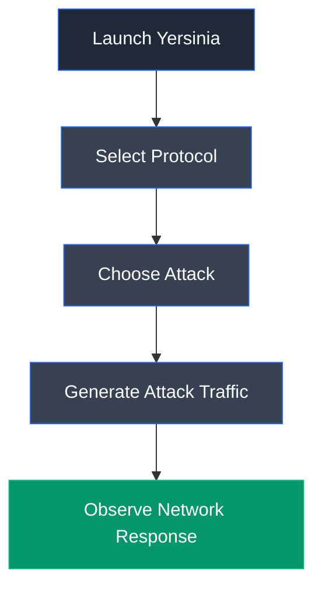

# Yersinia

## Overview

Yersinia is an open-source network attack framework designed to analyze and test weaknesses in Layer 2 network protocols. It supports multiple protocols such as DHCP, STP, CDP, DTP, HSRP, and others, enabling security professionals to evaluate network infrastructure against protocol-based attacks.

---

## Purpose

Yersinia is used to perform security assessments of Layer 2 network protocols by simulating attacks such as DHCP starvation and spanning tree manipulation. It helps ethical hackers identify weaknesses in network configurations and validate defensive controls.

---

## Key Features

- DHCP starvation attacks
- STP testing
- CDP analysis
- DTP attacks
- HSRP testing
- Interactive interface
- Command-line operation
- Protocol packet generation

---

## Installation

### Linux

Yersinia is available through standard Linux package repositories.

### Verify Installation

```bash
yersinia -h
```

---

## Basic Syntax

```bash
yersinia [options]
```

---

## Commonly Used Options

| Option | Description |
|---------|-------------|
| `-I` | Start interactive mode |
| `-G` | Start graphical interface |
| `-h` | Display help information |

---

## Typical Workflow



---

## CEH Practical Example

In **Module 08 – Sniffing**, Yersinia was used to perform a DHCP starvation attack by continuously sending DHCP requests to exhaust the available address pool of the DHCP server while monitoring the generated traffic with Wireshark.

---

## Advantages

- Supports multiple Layer 2 protocols
- Interactive interface
- Effective for protocol security testing
- Open source

---

## Limitations

- Linux focused
- Requires knowledge of network protocols
- Intended only for authorized testing

---

## Best Practices

- Test only authorized environments.
- Monitor network impact during attacks.
- Restore affected services after testing.
- Validate mitigation mechanisms after assessments.

---

## Used In

- Module 08 – Sniffing

---

## References

- https://github.com/tomac/yersinia