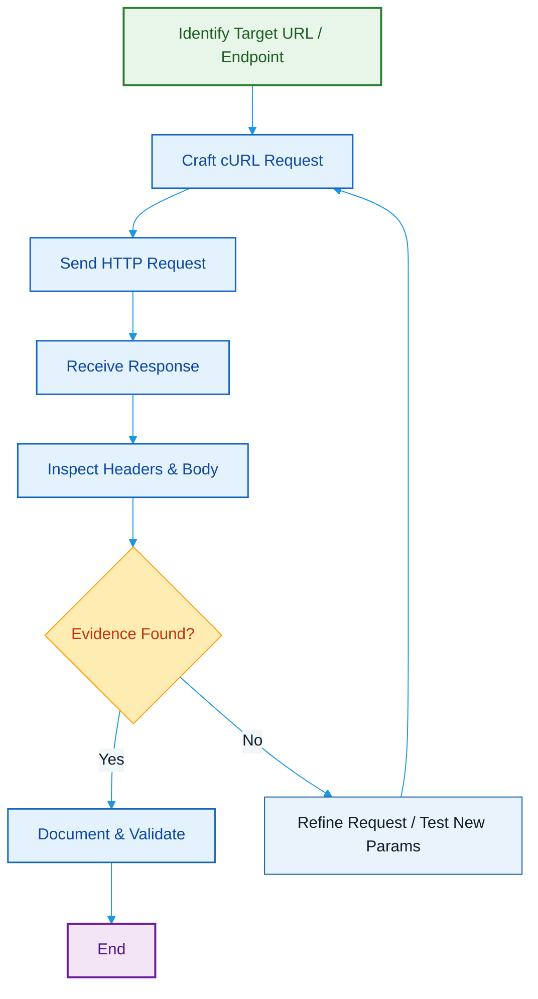

# cURL

## Overview

cURL (Client URL) is an open-source command-line tool used to transfer data between a client and a server using various network protocols. In cybersecurity and penetration testing, cURL is commonly used to send HTTP/HTTPS requests, interact with web applications and APIs, test endpoints, and validate vulnerabilities.

---

## Purpose

The primary purpose of cURL is to communicate directly with web servers by sending customized requests and analyzing the responses. It enables penetration testers to manually verify vulnerabilities, interact with web applications, and automate HTTP-based security testing.

---

## Key Features

- HTTP and HTTPS request handling
- Support for multiple network protocols
- Custom HTTP methods
- Custom request headers
- Cookie handling
- File upload and download
- API interaction

---

## Installation

### Linux

```bash
sudo apt install curl
```

### Windows

Recent versions of Windows include cURL by default.

### Verify Installation

```bash
curl --version
```

---

## Basic Syntax

```bash
curl [Options] <URL>
```

Example:

```bash
curl http://example.com
```

---

## Commonly Used Options

| Option | Description |
|--------|-------------|
| `-X <METHOD>` | Specify HTTP method (GET, POST, PUT, DELETE, etc.). |
| `-H "Header: value"` | Add custom HTTP header(s). |
| `-d "data"` / `--data` | Send POST data in request body (application/x-www-form-urlencoded). |
| `-I` | Fetch only HTTP headers (HEAD request). |
| `-i` | Include HTTP response headers in output. |
| `-o <file>` | Write response body to `<file>` (single file). |
| `-O` | Save response to a file named like the remote file (remote filename). |
| `-L` | Follow redirects (Location headers). |
| `-u user:pass` | Use basic HTTP authentication with provided credentials. |
| `-k` / `--insecure` | Allow insecure server connections when using SSL/TLS (skip cert verification). |
| `--cookie "name=value"` | Send a cookie with the request. |
| `--cookie-jar <file>` | Write cookies to `<file>` after the operation. |
| `-F "name=@file"` | Submit form data / file upload (multipart/form-data). |
| `--max-time <seconds>` | Set maximum execution time for the request. |

---

## Typical Workflow



---

## CEH Practical Example

During **Module 14 – Web Application Hacking**, cURL was used to send a crafted HTTP request to a vulnerable WordPress plugin endpoint. The request demonstrated a controlled **Remote Code Execution (RCE)** vulnerability by interacting directly with the application's vulnerable functionality and observing the server's response.

Example:

```bash
curl -i "http://<Target-IP>/wp-admin/admin-ajax.php?action=..."
```

---

## Advantages

- Lightweight and fast.
- Available on almost every operating system.
- Supports numerous network protocols.
- Excellent for API testing and automation.
- Highly scriptable.
- Provides fine-grained control over HTTP requests.

---

## Limitations

- Requires knowledge of HTTP and related protocols.
- Complex requests can become difficult to construct manually.
- Incorrect usage may unintentionally modify server data.
- Responses must be interpreted correctly by the tester.

---

## Best Practices

- Use cURL only against authorized targets.
- Understand the HTTP request being sent before execution.
- Validate server responses carefully.
- Avoid exposing sensitive credentials in commands.
- Use cURL together with other penetration testing tools for comprehensive assessments.

---

## Used In

- Module 14 – Web Application Hacking

---

## Related Tools

- Burp Suite
- WPScan
- OWASP ZAP
- Telnet

---

## References

- Official Website: https://curl.se/
- Official Documentation: https://curl.se/docs/