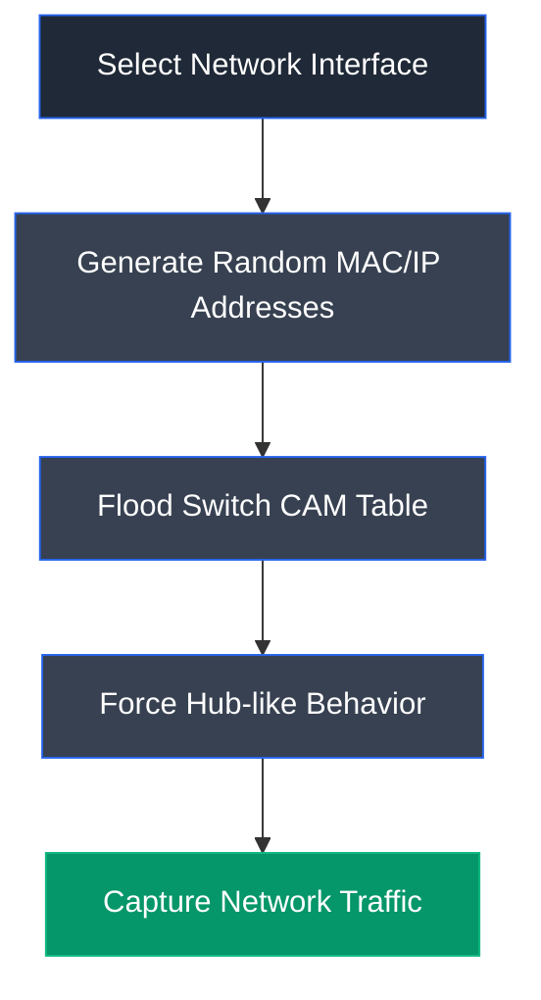

# macof

## Overview

macof is a command-line utility included in the **dsniff** suite that performs MAC flooding attacks against Ethernet switches. It rapidly generates packets with random source MAC and IP addresses, overwhelming a switch's Content Addressable Memory (CAM) table and forcing it to behave like a network hub. This allows an attacker to capture traffic that would normally be isolated within a switched network.

---

## Purpose

macof is used to evaluate the security of switched networks by performing MAC flooding attacks. Ethical hackers and penetration testers use it to assess whether network switches are vulnerable to CAM table overflow attacks and to verify the effectiveness of switch security features.

---

## Key Features

- CAM table flooding
- Random MAC address generation
- Random IP address generation
- Interface selection
- Destination IP targeting
- High-speed packet generation
- Command-line operation

---

## Installation

### Linux

macof is included with the **dsniff** package.

---

### Verify Installation

```bash
macof --help
```

---

## Basic Syntax

```bash
macof [options]
```

---

### Commonly Used Options

| Option | Description |
|---------|-------------|
| `-i <interface>` | Specify the network interface |
| `-n <count>` | Number of packets to send |
| `-d <IP>` | Specify the destination IP address |

---

## Typical Workflow



---

## CEH Practical Example

In **Module 08 – Sniffing**, macof was used to flood a switch's CAM table with random MAC and IP addresses while Wireshark captured the resulting network traffic to demonstrate active sniffing on a switched network.

---

## Advantages

- Lightweight and fast
- Effective for testing switch security
- Simple command-line interface
- Included with the dsniff toolkit

---

## Limitations

- Linux only
- Modern managed switches often mitigate CAM flooding
- Generates significant network traffic

---

## Best Practices

- Perform only in isolated lab environments.
- Monitor switch behavior during testing.
- Combine with packet analyzers such as Wireshark.
- Verify switch security mechanisms after testing.

---

## Used In

- Module 08 – Sniffing

---

## References

- https://www.monkey.org/~dugsong/dsniff/