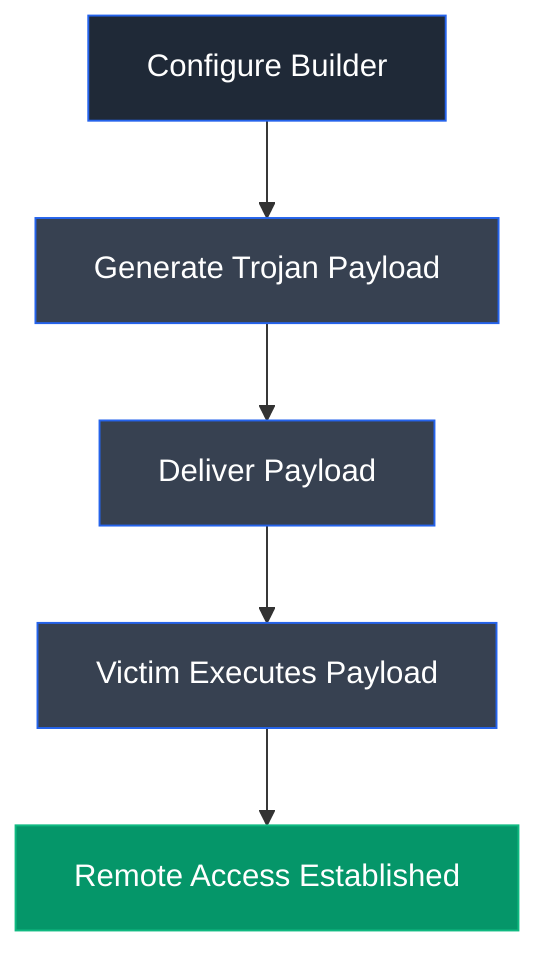

# njRAT

## Overview

njRAT is a Remote Access Trojan (RAT) that enables attackers to remotely control compromised Windows systems. It provides extensive capabilities for system administration, surveillance, credential theft, and command execution through a graphical command-and-control (C2) interface.

## Purpose

njRAT is used to establish persistent remote access to victim machines, allowing attackers to execute commands, manage files, monitor user activity, and perform post-exploitation tasks. In security training, it is used to demonstrate the risks associated with Remote Access Trojans and the importance of endpoint protection.

## Key Features

- Remote command execution
- File management
- Process management
- Registry management
- Remote desktop access
- Keylogging
- Webcam access
- Persistence mechanisms
- Command-and-Control (C2) communication

## Installation

### Windows

njRAT is distributed as a standalone executable and does not require installation.

### Verify Installation

Launch the `njRAT v0.8d.exe` executable to access the command-and-control interface.

## Basic Syntax

Launch the executable and configure the builder with the attacker host information before generating the payload.

**Example**

```text
Configure Builder → Generate Payload → Execute on Target
```

## Commonly Used Commands

| Feature | Description |
|---------|-------------|
| Builder | Generate a Trojan payload |
| File Manager | Browse and manage victim files |
| Process Manager | View and control running processes |
| Registry Manager | Access and modify Windows Registry |
| Remote Shell | Execute command-line instructions |
| Remote Desktop | View and interact with the victim desktop |
| Keylogger | Capture keyboard input |

## Typical Workflow



## CEH Practical Example

In **Module 07 – Malware Threats**, njRAT was used to create a Remote Access Trojan payload and establish a persistent connection with a Windows Server 2022 victim machine. After successful compromise, the tool was used to execute remote commands, monitor the victim's desktop, and demonstrate persistence following a system restart.

## Advantages

- Easy to configure and deploy
- Supports multiple remote administration features
- Demonstrates post-exploitation techniques
- Useful for malware analysis and security awareness training

## Limitations

- Easily detected by modern antivirus solutions
- Windows-focused malware
- Requires successful payload execution on the victim
- Often blocked by endpoint security controls

## Best Practices

- Use only in isolated lab environments.
- Never deploy on production systems.
- Protect endpoints with updated security software.
- Monitor outbound network connections for suspicious activity.

## Used In

- Module 07 – Malware Threats

