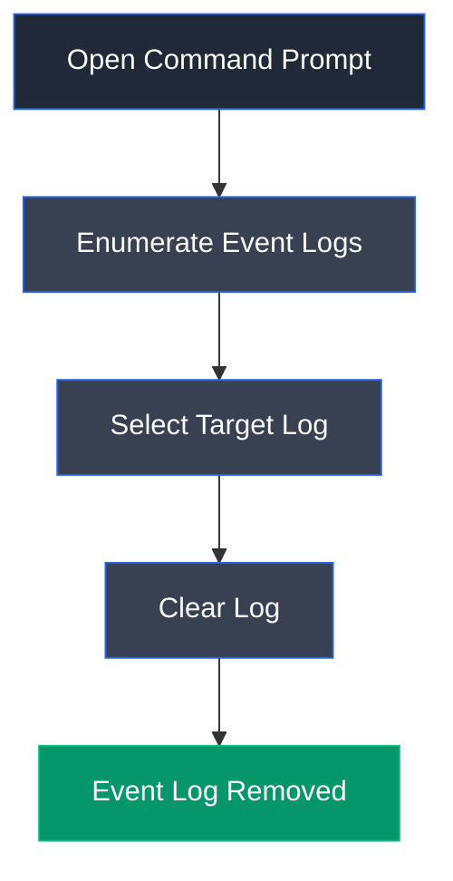

# wevtutil

## Overview

wevtutil is a built-in Windows command-line utility used to manage Windows Event Logs. It enables administrators to enumerate, query, export, archive, and clear event logs without using the graphical Event Viewer. During security assessments, attackers may abuse this utility to remove evidence of malicious activities by deleting system, security, and application logs.

---

## Purpose

wevtutil is used to:

- Enumerate Windows Event Logs.
- Query event log information.
- Export and archive logs.
- Clear specific event logs.
- Manage event publishers and manifests.
- Support Windows log administration.

---

## Key Features

- Native Windows command-line utility.
- Enumerate available event logs.
- Query event log metadata.
- Export and archive logs.
- Clear individual event logs.
- Manage event publishers.

---

## Launch

Open Command Prompt or PowerShell with administrative privileges.

Execute:

```cmd
wevtutil
```

---

## Basic Syntax

List available event logs:

```cmd
wevtutil el
```

Clear a log:

```cmd
wevtutil cl <log_name>
```

Example:

```cmd
wevtutil cl System
```

---

## Commonly Used Commands

| Command | Description |
|---------|-------------|
| `wevtutil el` | List all event logs |
| `wevtutil cl System` | Clear the System log |
| `wevtutil cl Application` | Clear the Application log |
| `wevtutil cl Security` | Clear the Security log |
| `wevtutil qe System` | Query events from the System log |

---

## Typical Workflow



---

## CEH Practical Example

In **Module 06 – System Hacking**, wevtutil was used to enumerate Windows Event Logs and clear selected logs such as the System, Security, and Application logs to demonstrate how attackers may attempt to remove forensic evidence after compromising a Windows system.

---

## Advantages

- Built into Windows.
- Fast command-line administration.
- Supports event log management.
- Useful for automation.
- Does not require Event Viewer.

---

## Limitations

- Requires administrative privileges.
- Log deletion may generate audit events.
- Centralized logging can retain deleted records.
- Excessive log clearing may raise security alerts.

---

## Best Practices

- Restrict administrative access.
- Forward logs to centralized logging servers.
- Monitor for unexpected log clearing events.
- Audit administrative command execution.
- Protect security logs from unauthorized modification.

---

## Used In

- Module 06 – System Hacking

---

## References

- https://learn.microsoft.com/en-us/windows-server/administration/windows-commands/wevtutil